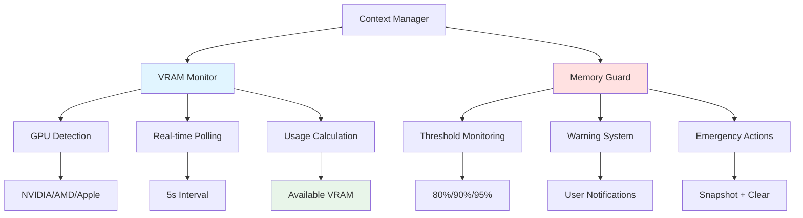

# Context Monitoring Guides

Guides for monitoring context usage, VRAM, and memory safety in OLLM CLI.

## Overview

Context monitoring provides real-time visibility into memory usage, GPU resources, and system health. These guides help you understand and use the monitoring features effectively.

## Guides

### [VRAM Monitoring](./vram-monitoring.md)
Complete guide to GPU memory monitoring:
- Understanding VRAM usage
- GPU detection and platform support
- Real-time monitoring
- Low memory warnings
- Platform-specific details (NVIDIA, AMD, Apple Silicon)

### [Memory Safety](./memory-safety.md)
Understanding the memory guard system:
- Memory safety thresholds
- Warning levels and actions
- Emergency procedures
- Configuration and tuning
- Preventing OOM errors

## Quick Links

**Common Tasks:**
- [Check VRAM usage](./vram-monitoring.md#checking-vram-usage)
- [Monitor memory in real-time](./vram-monitoring.md#real-time-monitoring)
- [Configure memory thresholds](./memory-safety.md#threshold-configuration)
- [Handle memory warnings](./memory-safety.md#responding-to-warnings)
- [Prevent OOM errors](./memory-safety.md#preventing-oom-errors)

**Troubleshooting:**
- [VRAM monitoring not working](./vram-monitoring.md#troubleshooting)
- [Memory warnings persist](./memory-safety.md#troubleshooting)
- [GPU not detected](./vram-monitoring.md#gpu-detection-issues)

## Monitoring Overview



## Key Concepts

### VRAM (Video RAM)
- GPU memory used for model and context
- Limited resource that must be managed
- Monitored in real-time
- Platform-specific detection

### Memory Guard
- Safety system preventing OOM errors
- Three threshold levels (warning, critical, emergency)
- Automatic actions at each level
- Configurable thresholds

### Context Pool
- Dynamic context sizing based on VRAM
- Calculates optimal context size
- Respects safety buffers
- Adapts to memory pressure

## Monitoring Commands

**Check current status:**
```bash
/context
```

**View detailed statistics:**
```bash
/context stats
```

**Monitor during operation:**
- Watch status bar for real-time updates
- Green = normal, Yellow = warning, Red = critical

## Related Documentation

- [Getting Started](../getting-started.md) - Quick start guide
- [Architecture](../Context_architecture.md) - System design
- [Configuration](../Context_configuration.md) - Configuration options
- [User Guide](../management/user-guide.md) - Managing context

---

**Last Updated:** 2026-01-16
