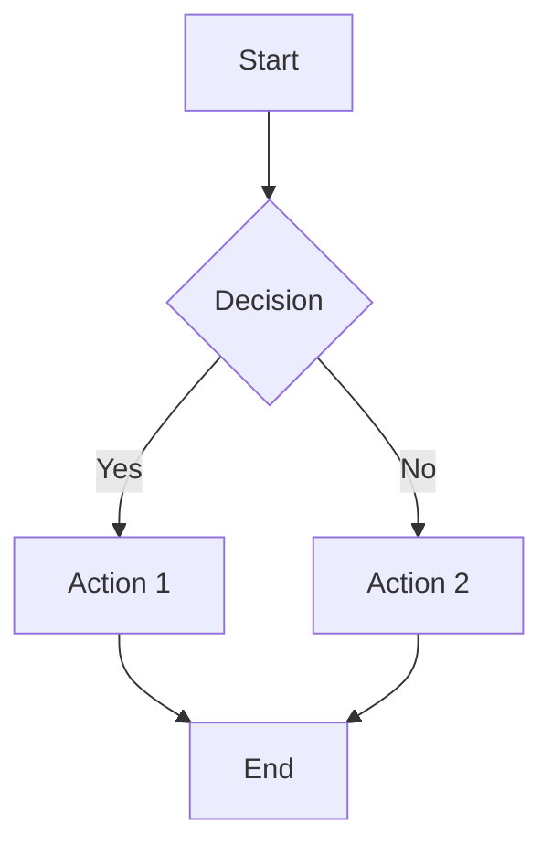
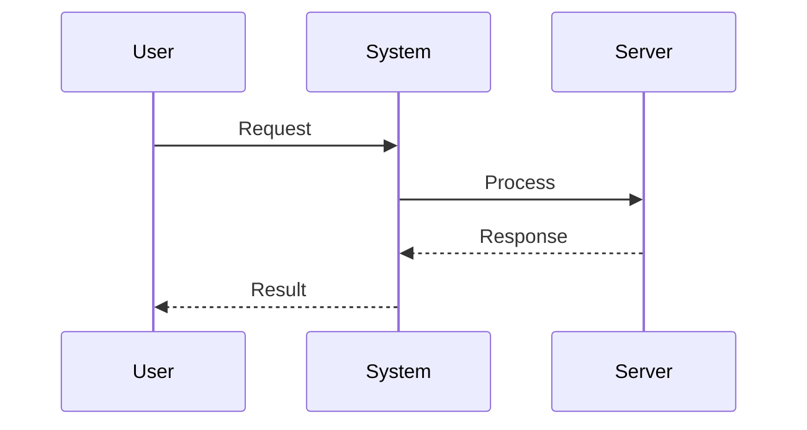
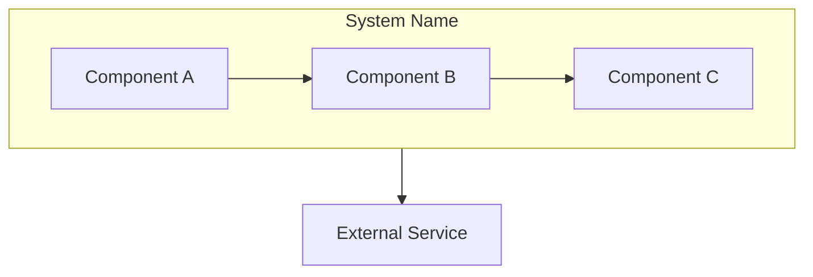
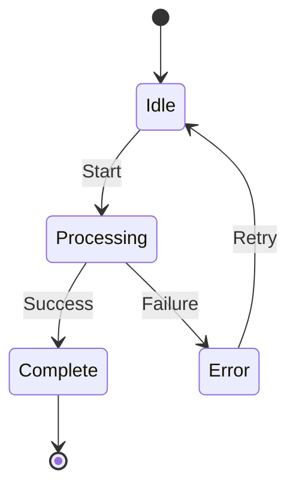
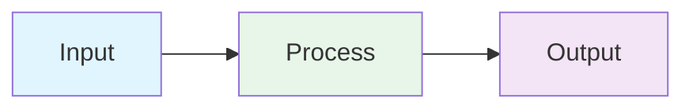

# Documentation Project Template

**Based on MCP Documentation Structure**

This template provides a systematic approach to organizing and creating comprehensive documentation for any major feature or system in OLLM CLI.

---

## Overview

This template guides you through:

1. **Audit** - Analyze existing documentation
2. **Restructure** - Organize into logical structure
3. **Create** - Write comprehensive documentation
4. **Consolidate** - Cross-reference and finalize

**Time Estimate:** 10-14 hours for a major feature

---

## Phase 1: Audit (1-2 hours)

### Step 1: Scan Existing Documentation

**Locations to scan:**

- `.kiro/specs/` - Specification documents (requirements, design, tasks)
- `docs/` - User-facing documentation
- `.dev/` - Development documentation
- `packages/*/src/*/README.md` - Code documentation
- `.dev/draft/` - Draft documents
- `.dev/logs/` - Development logs

**Commands:**

```bash
# Find all markdown files
find .kiro/specs docs .dev packages -name "*.md" | grep -i "FEATURE_NAME"

# Search for feature mentions
grep -r "FEATURE_NAME" .kiro/specs docs .dev --include="*.md"
```

### Step 2: Inventory Documents

Create inventory list:

```markdown
## Existing Documentation

### Specifications (`.kiro/specs/`)

- [ ] requirements.md - Requirements document
- [ ] design.md - Design document
- [ ] tasks.md - Implementation tasks

### User Documentation (`docs/`)

- [ ] feature-guide.md - User guide
- [ ] api-reference.md - API documentation

### Development Documentation (`.dev/`)

- [ ] implementation-notes.md - Implementation details
- [ ] debugging-notes.md - Debugging information

### Code Documentation

- [ ] packages/core/src/feature/README.md - Module overview
```

### Step 3: Identify Gaps

**Check for:**

- ✅ **Documented and Implemented** - Feature exists and is documented
- ⚠️ **Documented but Not Implemented** - Planned but not built
- ⚠️ **Implemented but Not Documented** - Exists but no docs
- ❌ **Missing Entirely** - Neither documented nor implemented

**Create gap analysis:**

```markdown
## Documentation Gaps

### Documented but Not Implemented

- Feature X - Planned in specs but not in code
- Feature Y - Design exists but no implementation

### Implemented but Not Documented

- Feature A - Exists in code but no user docs
- Feature B - Working but no examples

### Missing Entirely

- Feature C - Mentioned in roadmap only
```

### Step 4: Create Tracking Document

Create `.dev/FEATURE/FEATURE_docs.md`:

```markdown
# FEATURE Documentation Project

**Created:** YYYY-MM-DD  
**Status:** 🟡 In Progress  
**Priority:** High  
**Goal:** Organize and create comprehensive FEATURE documentation

## Project Overview

This project aims to:

1. **Audit** all existing FEATURE-related documentation
2. **Reorganize** documentation into logical structure
3. **Create** comprehensive FEATURE documentation in `docs/FEATURE/`
4. **Consolidate** scattered information into authoritative guides

## Current State Analysis

[Document inventory from Step 2]

## Documentation Gaps

[Gap analysis from Step 3]
```

---

## Phase 2: Restructure (2-3 hours)

### Step 1: Create Directory Structure

**Development Documentation (`.dev/FEATURE/`):**

```
.dev/FEATURE/
├── README.md                    # Navigation guide
├── FEATURE_docs.md              # Documentation tracking
├── FEATURE_roadmap.md           # Unfinished work
├── development/                 # Development & planning
│   ├── upgrade-plan.md
│   ├── implementation-progress.md
│   ├── integration-details.md
│   └── architecture-decisions.md
├── debugging/                   # Debugging & fixes
│   ├── bug-fixes.md
│   └── integration-issues.md
└── reference/                   # Reference materials
    ├── external-references.md
    └── api-patterns.md
```

**User-Facing Documentation (`docs/FEATURE/`):**

```
docs/FEATURE/
├── README.md                    # Main navigation
├── FEATURE_index.md             # Comprehensive index
├── getting-started.md           # Quick start guide
├── FEATURE_architecture.md      # System architecture
├── FEATURE_integration.md       # Integration guide
├── FEATURE_commands.md          # CLI commands
├── component-a/                 # Component documentation
│   ├── README.md
│   ├── user-guide.md
│   ├── development-guide.md
│   └── reference.md
├── component-b/
│   └── ...
└── api/                         # API reference
    ├── README.md
    ├── class-a.md
    └── class-b.md
```

### Step 2: Archive Legacy Documents

**Create `.dev/legacy/` folder:**

```bash
mkdir -p .dev/legacy/FEATURE-YYYY-MM-DD
```

**Move original documents:**

```bash
# After extracting information, move originals
mv .dev/old-doc.md .dev/legacy/FEATURE-YYYY-MM-DD/
```

**Important:** Never delete original documents, always archive them.

### Step 3: Organize Documents

**Development Documentation:**

- **Planning** → `.dev/FEATURE/development/`
- **Debugging** → `.dev/FEATURE/debugging/`
- **Reference** → `.dev/FEATURE/reference/`

**User Documentation:**

- **Overview** → `docs/FEATURE/`
- **Components** → `docs/FEATURE/component-name/`
- **API** → `docs/FEATURE/api/`

### Step 4: Create Navigation Guide

Create `.dev/FEATURE/README.md`:

```markdown
# FEATURE Development Documentation

**Development & Planning Documents**

## Directory Structure

[Show structure]

## Document Categories

### Development & Planning

[List documents with descriptions]

### Debugging & Fixes

[List documents with descriptions]

### Reference Materials

[List documents with descriptions]

## Related Documentation

### User-Facing Documentation

- [README.md](../../docs/FEATURE/README.md) - Main navigation
- [getting-started.md](../../docs/FEATURE/getting-started.md) - Quick start
- [FEATURE_architecture.md](../../docs/FEATURE/FEATURE_architecture.md) - Architecture

### Specifications

- `.kiro/specs/stage-XX-FEATURE/requirements.md`
- `.kiro/specs/stage-XX-FEATURE/design.md`

### Code Documentation

- `packages/core/src/FEATURE/README.md`
```

---

## Phase 3: Create Documentation (6-8 hours)

### Step 1: Main Documentation

#### README.md (Main Navigation)

```markdown
# FEATURE Documentation

**OLLM CLI - FEATURE Integration**

## 📚 Documentation Overview

### Quick Access

- **[📑 Complete Documentation Index](FEATURE_index.md)**

### Getting Started

- **[Getting Started Guide](getting-started.md)**

### Core Documentation

- **[FEATURE Architecture](FEATURE_architecture.md)**
- **[FEATURE Integration](FEATURE_integration.md)**
- **[FEATURE Commands](FEATURE_commands.md)**

### Feature Guides

- **[Component A](component-a/)**
- **[Component B](component-b/)**
- **[API Reference](api/)**

## 🎯 What is FEATURE?

[Brief description]

### Key Features

- Feature 1
- Feature 2
- Feature 3

## 📖 Documentation Structure

[Show structure]

## 🎓 Learning Path

### Beginner

1. [Getting Started](getting-started.md)
2. [FEATURE Commands](FEATURE_commands.md)

### Intermediate

1. [FEATURE Architecture](FEATURE_architecture.md)
2. [FEATURE Integration](FEATURE_integration.md)

### Advanced

1. [Component Development](component-a/development-guide.md)
2. [API Reference](api/)
```

#### FEATURE_index.md (Comprehensive Index)

```markdown
# FEATURE Documentation Index

**Complete Index with Summaries**

## 📚 Quick Navigation

- [Getting Started](#getting-started)
- [Core Documentation](#core-documentation)
- [Component A](#component-a)
- [Component B](#component-b)
- [API Reference](#api-reference)

## Getting Started

### [Main README](README.md)

**Overview and Navigation Guide**

[Summary paragraph]

**Topics:** Overview, Navigation, Learning Paths  
**Audience:** All users  
**Length:** XXX lines

### [Getting Started Guide](getting-started.md)

**Quick Start Guide**

[Summary paragraph]

**Topics:** Quick Start, Configuration, Examples  
**Audience:** New users  
**Length:** XXX lines

## Core Documentation

[Continue with all documents...]

## Documentation by Audience

### For New Users

1. [Main README](README.md)
2. [Getting Started](getting-started.md)
3. [FEATURE Commands](FEATURE_commands.md)

### For Developers

1. [FEATURE Architecture](FEATURE_architecture.md)
2. [API Reference](api/)
3. [Development Guides](component-a/development-guide.md)

## Documentation Status

### Completed ✅

[List completed docs]

### In Progress ⏳

[List pending docs]
```

#### getting-started.md (Quick Start)

```markdown
# Getting Started with FEATURE

**Quick Start Guide**

## 📋 Table of Contents

1. [Introduction](#introduction)
2. [Prerequisites](#prerequisites)
3. [Quick Start](#quick-start)
4. [Basic Usage](#basic-usage)
5. [Next Steps](#next-steps)

**See Also:**

- [FEATURE Overview](README.md)
- [FEATURE Commands](FEATURE_commands.md)
- [FEATURE Architecture](FEATURE_architecture.md)

## Introduction

[What is FEATURE and why use it]

## Prerequisites

**Required:**

- Requirement 1
- Requirement 2

**Optional:**

- Optional 1

## Quick Start

[Step-by-step quick start]

## Basic Usage

[Common usage examples]

## Next Steps

[Links to more detailed guides]
```

### Step 2: Component Documentation

For each major component, create:

#### component-a/README.md (Overview)

```markdown
# Component A Documentation

**Component A System**

## 📚 Documentation

### User Documentation

- **[User Guide](user-guide.md)** - Using Component A
- **[Reference](reference.md)** - Complete reference

### Developer Documentation

- **[Development Guide](development-guide.md)** - Creating with Component A

### Related Documentation

- **[Getting Started](../getting-started.md)**
- **[FEATURE Commands](../FEATURE_commands.md)**
- **[API Reference](../api/component-a.md)**

## 🎯 What is Component A?

[Description]

## 🚀 Quick Start

[Quick examples]

## 💡 Common Use Cases

[Use cases]
```

#### component-a/user-guide.md (User Guide)

```markdown
# Component A User Guide

**Complete Guide to Using Component A**

## 📋 Table of Contents

1. [Introduction](#introduction)
2. [Basic Usage](#basic-usage)
3. [Advanced Usage](#advanced-usage)
4. [Troubleshooting](#troubleshooting)

**See Also:**

- [Component A Overview](README.md)
- [Development Guide](development-guide.md)
- [API Reference](../api/component-a.md)

[Detailed user guide content]
```

#### component-a/development-guide.md (Development Guide)

```markdown
# Component A Development Guide

**Creating with Component A**

## 📋 Table of Contents

1. [Introduction](#introduction)
2. [Development Setup](#development-setup)
3. [Creating Components](#creating-components)
4. [Testing](#testing)
5. [Best Practices](#best-practices)

**See Also:**

- [Component A Overview](README.md)
- [User Guide](user-guide.md)
- [API Reference](../api/component-a.md)

[Detailed development guide content]
```

### Step 3: API Documentation

#### api/README.md (API Overview)

```markdown
# FEATURE API Reference

**Developer API Documentation**

## 📚 API Documentation

### Core APIs

- **[Class A API](class-a.md)** - Class A reference
- **[Class B API](class-b.md)** - Class B reference

### Related Documentation

- **[FEATURE Architecture](../FEATURE_architecture.md)**
- **[Component Guides](../component-a/)**

## 🎯 Overview

[API overview]

## 🚀 Quick Start

[Quick API examples]
```

#### api/class-a.md (API Reference)

````markdown
# Class A API Reference

**Class A API Documentation**

## Overview

[Class description]

## Constructor

```typescript
new ClassA(config: ClassAConfig)
```
````

## Methods

### method1()

[Method documentation]

## Events

[Event documentation]

## Example Usage

[Complete examples]

````

---

## Phase 4: Consolidate (1-2 hours)

### Step 1: Add Cross-References

**In each document, add:**

```markdown
**See Also:**
- [Related Doc 1](../path/to/doc1.md)
- [Related Doc 2](../path/to/doc2.md)
- [Related Doc 3](path/to/doc3.md)
````

**Add "Related Documentation" sections:**

```markdown
## Related Documentation

### User Documentation

- [Getting Started](../getting-started.md)
- [User Guide](user-guide.md)

### Developer Documentation

- [Development Guide](development-guide.md)
- [API Reference](../api/)

### Related Features

- [Other Feature](../../OTHER_FEATURE/)
```

### Step 2: Update Index

Update `FEATURE_index.md` with:

- All completed documents
- Document summaries
- Key sections links
- Status tracking

### Step 3: Create Roadmap

Create `.dev/FEATURE/FEATURE_roadmap.md`:

```markdown
# FEATURE Implementation Roadmap

**Unfinished Work & Outstanding Issues**

## Executive Summary

[Summary of implementation status]

### Implementation Status

**Completed:**

- ✅ Feature A
- ✅ Feature B

**Pending:**

- ⏳ Feature C
- ⏳ Feature D

## Critical Issues

### 1. Issue Name ❌

**Status:** Not Implemented  
**Priority:** 🔴 Critical  
**Impact:** [Impact description]

**Issue:** [Detailed description]

**Required Work:**

1. Task 1
2. Task 2

**Files Affected:**

- file1.ts
- file2.ts

**Estimated Effort:** X hours

[Continue for all issues...]

## Documentation Gaps

[List missing documentation]

## Success Criteria

[Define success criteria]
```

### Step 4: Final Review

**Checklist:**

- [ ] All documents have cross-references
- [ ] Index is complete and accurate
- [ ] Navigation is clear
- [ ] Examples are working
- [ ] Links are valid
- [ ] Formatting is consistent
- [ ] Roadmap is complete
- [ ] Legacy files are archived

---

## Documentation Standards

### File Naming

**Use kebab-case:**

- ✅ `getting-started.md`
- ✅ `user-guide.md`
- ✅ `api-reference.md`
- ❌ `GettingStarted.md`
- ❌ `user_guide.md`

### Document Structure

**Every document should have:**

1. Title and subtitle
2. Table of contents (if > 200 lines)
3. "See Also" section
4. Clear sections with headers
5. Examples where appropriate
6. Last updated date

### Cross-References

**Format:**

```markdown
**See Also:**

- [Document Name](path/to/document.md) - Brief description
```

**Related Documentation:**

```markdown
## Related Documentation

### User Documentation

- [Doc 1](path1.md) - Description

### Developer Documentation

- [Doc 2](path2.md) - Description
```

### Code Examples

**Always include:**

- Language identifier
- Comments explaining code
- Complete, working examples
- Expected output

```typescript
// Example: Creating a client
const client = new Client({
  name: 'my-client',
  config: {...}
});

await client.connect();
// Output: Connected successfully
```

### Diagrams

**Use Mermaid format for all diagrams in user-facing documentation:**

**Flowcharts:**



**Sequence Diagrams:**



**Architecture Diagrams:**



**State Diagrams:**



**Tips for Mermaid Diagrams:**

- Use descriptive node labels
- Add colors with `style` for emphasis
- Keep diagrams focused and not too complex
- Use subgraphs for grouping related components
- Add comments in the diagram code for clarity

**Example with styling:**



**Do NOT use ASCII art diagrams** - they don't render well and are hard to maintain.

---

## Tracking Progress

### Update Tracking Document

Update `.dev/FEATURE/FEATURE_docs.md` regularly:

```markdown
## Progress Tracking

### Phase 1: Audit ✅

- [x] Scan existing documentation
- [x] Create inventory
- [x] Identify gaps
- [x] Create tracking document

**Completion:** 100%  
**Time Spent:** 2 hours

### Phase 2: Restructure 🔄

- [x] Create directory structure
- [ ] Archive legacy documents
- [ ] Organize documents
- [ ] Create navigation guide

**Completion:** 50%  
**Estimated Time:** 3 hours

### Phase 3: Create Documentation ⏳

- [ ] Main documentation
- [ ] Component documentation
- [ ] API documentation

**Completion:** 0%  
**Estimated Time:** 8 hours

### Phase 4: Consolidate ⏳

- [ ] Add cross-references
- [ ] Update index
- [ ] Create roadmap
- [ ] Final review

**Completion:** 0%  
**Estimated Time:** 2 hours

## Overall Progress

**Total Phases:** 4  
**Completed Phases:** 1  
**Overall Completion:** 25%  
**Total Estimated Time:** 15 hours  
**Time Spent:** 2 hours  
**Time Remaining:** 13 hours
```

---

## Quick Reference

### Commands

```bash
# Scan for existing documentation
find .kiro/specs docs .dev -name "*.md" | grep -i "FEATURE"

# Search for feature mentions
grep -r "FEATURE" .kiro/specs docs .dev --include="*.md"

# Create directory structure
mkdir -p .dev/FEATURE/{development,debugging,reference}
mkdir -p docs/FEATURE/{component-a,component-b,api}

# Archive legacy documents
mkdir -p .dev/legacy/FEATURE-$(date +%Y-%m-%d)
mv old-doc.md .dev/legacy/FEATURE-$(date +%Y-%m-%d)/
```

### File Templates

**Main README:**

- Overview and navigation
- What is FEATURE
- Documentation structure
- Learning paths

**Index:**

- Complete document list
- Summaries with line counts
- Audience-specific navigation
- Status tracking

**Getting Started:**

- Introduction
- Prerequisites
- Quick start
- Basic usage
- Next steps

**Component README:**

- Overview
- Documentation links
- Quick start
- Common use cases

**User Guide:**

- Complete usage guide
- Examples throughout
- Troubleshooting
- Best practices

**Development Guide:**

- Development setup
- Creating components
- Testing
- Best practices

**API Reference:**

- Class/function documentation
- Parameters and returns
- Examples
- Events

---

## Success Criteria

### Documentation Quality

- ✅ All features documented
- ✅ Clear examples provided
- ✅ Consistent formatting
- ✅ No broken links
- ✅ No duplicate content

### Organization

- ✅ Logical structure
- ✅ Easy navigation
- ✅ Clear hierarchy
- ✅ Proper categorization

### Completeness

- ✅ User guides complete
- ✅ Developer guides complete
- ✅ API reference complete
- ✅ Examples provided
- ✅ Troubleshooting included

---

## Example: MCP Documentation

See the MCP documentation as a reference implementation:

- `.dev/MCP/` - Development documentation
- `docs/MCP/` - User-facing documentation
- 22 files, 20,000+ lines
- Complete cross-referencing
- Comprehensive index

**Study these files:**

- `.dev/MCP/README.md` - Development navigation
- `.dev/MCP/MCP_docs.md` - Documentation tracking
- `.dev/MCP/MCP_roadmap.md` - Implementation roadmap
- `docs/MCP/README.md` - User navigation
- `docs/MCP/MCP_index.md` - Comprehensive index
- `docs/MCP/getting-started.md` - Quick start guide

---

**Template Version:** 1.0  
**Created:** 2026-01-16  
**Based On:** MCP Documentation Project  
**Last Updated:** 2026-01-16
