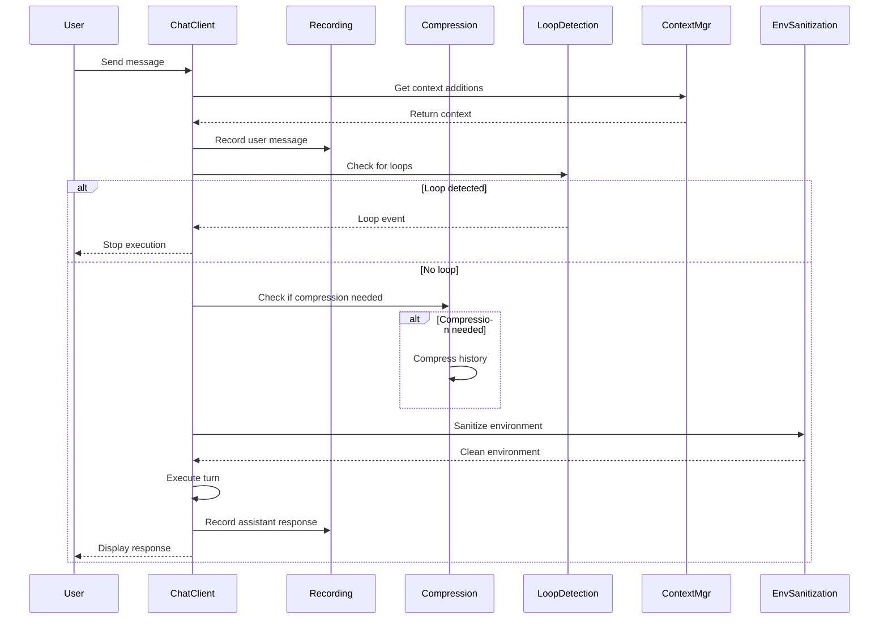

# Design Document: Services and Sessions

## Overview

This design defines six core services that provide session persistence, context management, safety mechanisms, and security features for the OLLM CLI. These services work together to enable reliable conversation history, intelligent context size management, protection against runaway execution, and secure tool execution environments.

The services are designed to be:

- **Independent**: Each service has a single, well-defined responsibility
- **Composable**: Services can be used together or independently
- **Configurable**: Behavior can be customized through configuration
- **Testable**: Clear interfaces enable comprehensive testing

## Architecture

### Service Layer Organization

```
┌─────────────────────────────────────────────────────────────┐
│                     Chat Runtime                             │
│                   (chatClient.ts)                            │
└────────────┬────────────────────────────────────────────────┘
             │
             │ uses
             │
┌────────────▼────────────────────────────────────────────────┐
│                    Services Layer                            │
├──────────────────────────────────────────────────────────────┤
│  ┌─────────────────┐  ┌──────────────────┐                 │
│  │ Chat Recording  │  │ Chat Compression │                 │
│  │    Service      │  │     Service      │                 │
│  └─────────────────┘  └──────────────────┘                 │
│                                                              │
│  ┌─────────────────┐  ┌──────────────────┐                 │
│  │ Loop Detection  │  │     Context      │                 │
│  │    Service      │  │     Manager      │                 │
│  └─────────────────┘  └──────────────────┘                 │
│                                                              │
│  ┌─────────────────┐  ┌──────────────────┐                 │
│  │ File Discovery  │  │   Environment    │                 │
│  │    Service      │  │  Sanitization    │                 │
│  └─────────────────┘  └──────────────────┘                 │
└──────────────────────────────────────────────────────────────┘
             │
             │ persists to / reads from
             │
┌────────────▼────────────────────────────────────────────────┐
│                  File System                                 │
│  ~/.ollm/session-data/                                      │
│  .ollmignore, .gitignore                                    │
└──────────────────────────────────────────────────────────────┘
```

### Service Interaction Flow



## Components and Interfaces

### ChatRecordingService

Responsible for persisting session data to disk and loading sessions for resume.

```typescript
interface SessionMessage {
  role: 'user' | 'assistant' | 'system';
  parts: MessagePart[];
  timestamp: string; // ISO 8601
}

interface SessionToolCall {
  id: string;
  name: string;
  args: Record<string, unknown>;
  result: {
    llmContent: string;
    returnDisplay?: string;
  };
  timestamp: string; // ISO 8601
}

interface SessionMetadata {
  tokenCount: number;
  compressionCount: number;
}

interface Session {
  sessionId: string; // UUID
  startTime: string; // ISO 8601
  lastActivity: string; // ISO 8601
  model: string;
  provider: string;
  messages: SessionMessage[];
  toolCalls: SessionToolCall[];
  metadata: SessionMetadata;
}

interface SessionSummary {
  sessionId: string;
  startTime: string;
  lastActivity: string;
  model: string;
  messageCount: number;
  tokenCount: number;
}

interface ChatRecordingService {
  // Record operations
  recordMessage(sessionId: string, message: SessionMessage): Promise<void>;
  recordToolCall(sessionId: string, toolCall: SessionToolCall): Promise<void>;

  // Session retrieval
  getSession(sessionId: string): Promise<Session | null>;
  listSessions(): Promise<SessionSummary[]>;

  // Session management
  createSession(model: string, provider: string): Promise<string>;
  deleteSession(sessionId: string): Promise<void>;
  deleteOldestSessions(keepCount: number): Promise<void>;

  // Auto-save
  saveSession(sessionId: string): Promise<void>;
}
```

**Implementation Notes:**

- Store sessions as individual JSON files in `~/.ollm/session-data/`
- Use atomic writes (write to temp file, then rename) to prevent corruption
- Maintain an in-memory cache of the current session for performance
- Flush to disk after each turn (configurable)
- Use file system locking to prevent concurrent writes

### ChatCompressionService

Manages message history size by compressing older messages while preserving recent context.

```typescript
type CompressionStrategy = 'summarize' | 'truncate' | 'hybrid';

interface CompressionOptions {
  strategy: CompressionStrategy;
  preserveRecentTokens: number; // Keep this many recent tokens intact
  targetTokens?: number; // Target size after compression
}

interface CompressionResult {
  compressedMessages: SessionMessage[];
  originalTokenCount: number;
  compressedTokenCount: number;
  strategy: CompressionStrategy;
}

interface ChatCompressionService {
  // Check if compression is needed
  shouldCompress(messages: SessionMessage[], tokenLimit: number, threshold: number): boolean;

  // Perform compression
  compress(messages: SessionMessage[], options: CompressionOptions): Promise<CompressionResult>;

  // Strategy-specific methods
  summarize(messages: SessionMessage[], targetTokens: number): Promise<SessionMessage[]>;
  truncate(messages: SessionMessage[], targetTokens: number): SessionMessage[];
  hybrid(messages: SessionMessage[], options: CompressionOptions): Promise<SessionMessage[]>;
}
```

**Implementation Notes:**

- **Summarize strategy**: Use the LLM to create a concise summary of older messages
- **Truncate strategy**: Simply remove oldest messages until under target
- **Hybrid strategy**: Summarize old messages, keep recent N tokens intact
- Always preserve system prompt (first message)
- Count tokens using the same tokenizer as the model
- Trigger compression when usage exceeds threshold (default 80% of context limit)

### LoopDetectionService

Monitors execution patterns and detects infinite loops in tool calling.

```typescript
interface LoopPattern {
  type: 'repeated-tool' | 'repeated-output' | 'turn-limit';
  details: string;
  count: number;
}

interface LoopDetectionConfig {
  maxTurns: number; // Default: 50
  repeatThreshold: number; // Default: 3
  enabled: boolean;
}

interface LoopDetectionService {
  // Configuration
  configure(config: LoopDetectionConfig): void;

  // Tracking
  recordTurn(): void;
  recordToolCall(toolName: string, args: Record<string, unknown>): void;
  recordOutput(output: string): void;

  // Detection
  checkForLoop(): LoopPattern | null;

  // Reset
  reset(): void;
}
```

**Implementation Notes:**

- Track last N tool calls with arguments (use hash for comparison)
- Track last N outputs (use similarity metric, not just exact match)
- Increment turn counter on each user-assistant cycle
- Emit loop event when any threshold is exceeded
- Reset tracking when user sends a new message
- Use sliding window for pattern detection

### ContextManager

Manages dynamic context injection from multiple sources (hooks, extensions, user commands).

```typescript
interface ContextEntry {
  key: string;
  content: string;
  priority: number; // Higher priority appears first
  source: 'hook' | 'extension' | 'user' | 'system';
  timestamp: string; // ISO 8601
}

interface ContextManager {
  // Add/remove context
  addContext(key: string, content: string, options?: { priority?: number; source?: string }): void;
  removeContext(key: string): void;
  clearContext(): void;

  // Retrieve context
  getContext(): ContextEntry[];
  getSystemPromptAdditions(): string;

  // Query
  hasContext(key: string): boolean;
  getContextBySource(source: string): ContextEntry[];
}
```

**Implementation Notes:**

- Store context entries in a Map keyed by unique key
- Sort by priority when generating system prompt additions
- Format context as markdown sections in system prompt
- Support context expiration (optional TTL)
- Provide clear separation between different context sources

### FileDiscoveryService

Fast project file scanning with ignore pattern support.

```typescript
interface FileEntry {
  path: string;
  relativePath: string;
  type: 'file' | 'directory';
  size: number;
  modified: Date;
}

interface DiscoveryOptions {
  root: string;
  maxDepth?: number;
  includePatterns?: string[]; // Glob patterns
  excludePatterns?: string[]; // Glob patterns
  followSymlinks?: boolean;
}

interface FileDiscoveryService {
  // Discovery
  discover(options: DiscoveryOptions): AsyncIterable<FileEntry>;
  discoverAll(options: DiscoveryOptions): Promise<FileEntry[]>;

  // Watching
  watchChanges(
    root: string,
    callback: (event: 'add' | 'change' | 'unlink', path: string) => void
  ): Disposable;

  // Ignore patterns
  loadIgnorePatterns(root: string): Promise<string[]>;
  shouldIgnore(path: string, patterns: string[]): boolean;
}

interface Disposable {
  dispose(): void;
}
```

**Implementation Notes:**

- Use `fdir` library for fast directory traversal
- Read `.ollmignore` and `.gitignore` files
- Built-in ignores: `node_modules`, `.git`, `dist`, `build`, `.next`, `.cache`
- Cache ignore patterns per directory
- Use async iteration for memory efficiency with large projects
- Respect depth limits to prevent excessive scanning

### EnvironmentSanitizationService

Filters sensitive environment variables before tool execution.

```typescript
interface SanitizationConfig {
  allowList: string[]; // Exact variable names
  denyPatterns: string[]; // Glob patterns
}

interface EnvironmentSanitizationService {
  // Configuration
  configure(config: SanitizationConfig): void;

  // Sanitization
  sanitize(env: Record<string, string>): Record<string, string>;

  // Utilities
  isAllowed(varName: string): boolean;
  isDenied(varName: string): boolean;
}
```

**Implementation Notes:**

- Default allow list: `PATH`, `HOME`, `USER`, `SHELL`, `TERM`, `LANG`, `LC_*`
- Default deny patterns: `*_KEY`, `*_SECRET`, `*_TOKEN`, `*_PASSWORD`, `*_CREDENTIAL`, `AWS_*`, `GITHUB_*`
- Use `picomatch` for pattern matching
- Log warnings when sensitive variables are filtered (debug level only)
- Allow configuration override via config file

## Data Models

### Session File Structure

```json
{
  "sessionId": "550e8400-e29b-41d4-a716-446655440000",
  "startTime": "2024-01-15T10:30:00Z",
  "lastActivity": "2024-01-15T11:45:00Z",
  "model": "llama3.1:8b",
  "provider": "ollama",
  "messages": [
    {
      "role": "user",
      "parts": [
        {
          "type": "text",
          "text": "Hello, can you help me?"
        }
      ],
      "timestamp": "2024-01-15T10:30:00Z"
    },
    {
      "role": "assistant",
      "parts": [
        {
          "type": "text",
          "text": "Of course! What do you need help with?"
        }
      ],
      "timestamp": "2024-01-15T10:30:05Z"
    }
  ],
  "toolCalls": [
    {
      "id": "call_123",
      "name": "read_file",
      "args": {
        "path": "README.md"
      },
      "result": {
        "llmContent": "File contents...",
        "returnDisplay": "Read 1234 bytes from README.md"
      },
      "timestamp": "2024-01-15T10:35:00Z"
    }
  ],
  "metadata": {
    "tokenCount": 1234,
    "compressionCount": 0
  }
}
```

### Configuration Schema

```yaml
services:
  session:
    dataDir: ~/.ollm/session-data
    maxSessions: 100
    autoSave: true

  compression:
    enabled: true
    threshold: 0.8
    strategy: hybrid
    preserveRecent: 4096

  loopDetection:
    enabled: true
    maxTurns: 50
    repeatThreshold: 3

  fileDiscovery:
    maxDepth: 10
    followSymlinks: false
    builtinIgnores:
      - node_modules
      - .git
      - dist
      - build

  environment:
    allowList:
      - PATH
      - HOME
      - USER
      - SHELL
      - TERM
      - LANG
    denyPatterns:
      - '*_KEY'
      - '*_SECRET'
      - '*_TOKEN'
      - '*_PASSWORD'
      - '*_CREDENTIAL'
      - 'AWS_*'
      - 'GITHUB_*'
```

## Correctness Properties

_A property is a characteristic or behavior that should hold true across all valid executions of a system—essentially, a formal statement about what the system should do. Properties serve as the bridge between human-readable specifications and machine-verifiable correctness guarantees._

### Session Recording Properties

**Property 1: Session persistence round-trip**
_For any_ session with messages and tool calls, saving the session and then loading it should produce an equivalent session with all data intact.
**Validates: Requirements 1.1, 1.2, 1.3, 1.5**

**Property 2: Session file format completeness**
_For any_ saved session, the JSON file should contain all required fields (sessionId, startTime, lastActivity, model, provider, messages, toolCalls, metadata) and all nested structures should have their required fields (messages have role/parts/timestamp, tool calls have id/name/args/result/timestamp).
**Validates: Requirements 1.7, 1.8, 2.1, 2.2, 2.3**

**Property 3: Timestamp format validity**
_For any_ timestamp field in any session file, it should parse as a valid ISO 8601 formatted string.
**Validates: Requirements 2.4**

**Property 4: Session ID uniqueness and format**
_For any_ created session, the session ID should be a valid UUID format and should be unique across all sessions.
**Validates: Requirements 1.7, 2.5**

**Property 5: Session listing completeness**
_For any_ set of saved sessions, listing sessions should return summaries for all sessions with correct counts and metadata.
**Validates: Requirements 1.4**

**Property 6: Session deletion removes file**
_For any_ session, deleting it should remove the session file from the file system and the session should no longer appear in the session list.
**Validates: Requirements 1.6**

**Property 7: Session auto-save durability**
_For any_ sequence of messages and tool calls recorded to a session, all recorded data should be persisted to disk and recoverable even if the process terminates unexpectedly.
**Validates: Requirements 9.3, 9.6**

**Property 8: Session count limit enforcement**
_For any_ session count exceeding the configured maximum, the oldest sessions should be automatically deleted until the count is at or below the maximum.
**Validates: Requirements 9.4**

**Property 9: Last activity timestamp updates**
_For any_ message or tool call recorded to a session, the lastActivity timestamp should be updated to a value greater than or equal to the previous lastActivity timestamp.
**Validates: Requirements 9.5**

### Compression Properties

**Property 10: Compression trigger threshold**
_For any_ message history where token count exceeds (threshold × token limit), the compression service should indicate that compression is needed.
**Validates: Requirements 3.1, 3.7**

**Property 11: Compression preserves critical messages**
_For any_ compression operation, the system prompt (first message) and the most recent N tokens of messages should remain unchanged in the compressed result.
**Validates: Requirements 3.2, 3.3, 3.6**

**Property 12: Compression reduces token count**
_For any_ compression operation, the compressed message history should have fewer tokens than the original while preserving the system prompt and recent messages.
**Validates: Requirements 3.4**

**Property 13: Compression count increments**
_For any_ compression operation on a session, the compressionCount in metadata should increase by exactly 1.
**Validates: Requirements 3.8**

### Loop Detection Properties

**Property 14: Repeated tool call detection**
_For any_ sequence of N consecutive identical tool calls (same name and arguments), where N equals the repeatThreshold, the loop detection service should detect a loop.
**Validates: Requirements 4.1, 4.4**

**Property 15: Repeated output detection**
_For any_ sequence of N consecutive identical outputs, where N equals the repeatThreshold, the loop detection service should detect a loop.
**Validates: Requirements 4.2, 4.5**

**Property 16: Turn limit detection**
_For any_ turn count that exceeds maxTurns, the loop detection service should detect a loop.
**Validates: Requirements 4.3**

**Property 17: Loop detection stops execution**
_For any_ detected loop, the loop detection service should emit a loop event with pattern details and prevent further execution.
**Validates: Requirements 4.7, 4.8**

### Context Management Properties

**Property 18: Context add-remove round-trip**
_For any_ context entry added with a unique key, removing it by that key should result in the context no longer being present in the active context list.
**Validates: Requirements 5.2**

**Property 19: Context retrieval completeness**
_For any_ set of added context entries, retrieving all active contexts should return all entries with their original content and metadata.
**Validates: Requirements 5.3**

**Property 20: Context inclusion in system prompt**
_For any_ set of active context entries, the generated system prompt additions should contain the content from all entries.
**Validates: Requirements 5.4**

**Property 21: Context priority ordering**
_For any_ set of context entries with different priority values, the generated system prompt additions should include contexts in descending priority order (highest priority first).
**Validates: Requirements 5.5, 5.8**

### File Discovery Properties

**Property 22: Ignore pattern respect**
_For any_ directory structure with files matching patterns in .ollmignore, .gitignore, or built-in ignore patterns (node_modules, .git, dist, build), those files should not be included in discovery results.
**Validates: Requirements 6.2, 6.3, 6.4**

**Property 23: Depth limit enforcement**
_For any_ discovery operation with a maxDepth configuration, files in directories deeper than maxDepth levels from the root should not be included in results.
**Validates: Requirements 6.5**

**Property 24: File change notification**
_For any_ file system change (add, modify, delete) in a watched directory, the registered callback should be invoked with the correct event type and file path.
**Validates: Requirements 6.8**

### Environment Sanitization Properties

**Property 25: Deny pattern filtering**
_For any_ environment containing variables matching deny patterns, sanitization should remove all matching variables from the result.
**Validates: Requirements 7.5**

**Property 26: Allow list preservation**
_For any_ environment containing variables in the allow list, sanitization should preserve all those variables in the result.
**Validates: Requirements 7.6**

**Property 27: Sanitization completeness**
_For any_ environment, after sanitization, the result should contain only variables that are either in the allow list or do not match any deny patterns.
**Validates: Requirements 7.5, 7.6**

**Property 28: Sensitive data exclusion from errors**
_For any_ error message or log output from any service, it should not contain values matching sensitive patterns (_\_KEY, _\_SECRET, _\_TOKEN, _\_PASSWORD, API keys, etc.).
**Validates: Requirements 10.7**

## Error Handling

### Error Recovery Strategies

All services implement graceful degradation:

1. **ChatRecordingService**:
   - Write failures: Log error, continue operation, retry on next turn
   - Read failures: Return error to caller, allow new session creation
   - Corruption: Attempt recovery, fall back to new session

2. **ChatCompressionService**:
   - Compression failures: Log error, continue without compression
   - Model unavailable: Fall back to truncate strategy
   - Invalid token counts: Use conservative estimates

3. **LoopDetectionService**:
   - Configuration errors: Use default values
   - Pattern matching errors: Log warning, continue monitoring

4. **ContextManager**:
   - Invalid context: Log warning, skip invalid entry
   - Priority conflicts: Use insertion order as tiebreaker

5. **FileDiscoveryService**:
   - Permission errors: Skip inaccessible directories, continue
   - Invalid patterns: Log warning, use built-in patterns only
   - Symlink loops: Detect and break cycles

6. **EnvironmentSanitizationService**:
   - Invalid patterns: Log warning, use default patterns
   - Configuration errors: Fall back to secure defaults (deny all except core variables)

### Error Logging

All services use structured logging with levels:

- **ERROR**: Operation failures that affect functionality
- **WARN**: Recoverable issues, degraded functionality
- **INFO**: Normal operations, state changes
- **DEBUG**: Detailed execution information

Error messages include:

- Service name and operation
- Error type and message
- Context (session ID, file path, etc.)
- Suggested user action (when applicable)

## Testing Strategy

### Unit Testing

Unit tests verify specific behaviors and edge cases:

**ChatRecordingService**:

- Session creation with valid metadata
- Message and tool call recording
- Session file format validation
- Error handling for write/read failures
- Session deletion and cleanup

**ChatCompressionService**:

- Threshold calculation
- Each compression strategy (summarize, truncate, hybrid)
- System prompt preservation
- Recent message preservation
- Token counting accuracy

**LoopDetectionService**:

- Each detection condition (repeated tools, outputs, turn limit)
- Configuration handling
- Reset behavior
- Pattern matching accuracy

**ContextManager**:

- Add/remove operations
- Priority ordering
- System prompt generation
- Multiple source handling

**FileDiscoveryService**:

- Directory traversal
- Ignore pattern matching
- Depth limiting
- File watching
- Symlink handling

**EnvironmentSanitizationService**:

- Allow list matching
- Deny pattern matching
- Default configuration
- Custom rules

### Property-Based Testing

Property tests verify universal correctness properties across randomized inputs. Each test should run a minimum of 100 iterations.

**Test Configuration**:

- Use `fast-check` library for TypeScript property-based testing
- Minimum 100 iterations per property test
- Each test tagged with: `Feature: services-sessions, Property N: [property text]`

**Property Test Coverage**:

1. **Session Recording** (Properties 1-9):
   - Generate random sessions with varying message counts, tool calls, and metadata
   - Test round-trip persistence
   - Test format compliance
   - Test timestamp validity
   - Test UUID format and uniqueness
   - Test listing and deletion

2. **Compression** (Properties 10-13):
   - Generate random message histories with varying token counts
   - Test threshold detection
   - Test preservation of system prompt and recent messages
   - Test token count reduction
   - Test metadata updates

3. **Loop Detection** (Properties 14-17):
   - Generate random sequences of tool calls and outputs
   - Test detection of repeated patterns
   - Test turn limit enforcement
   - Test event emission

4. **Context Management** (Properties 18-21):
   - Generate random context entries with varying priorities
   - Test add/remove operations
   - Test retrieval completeness
   - Test priority ordering

5. **File Discovery** (Properties 22-24):
   - Generate random directory structures with various ignore patterns
   - Test pattern matching
   - Test depth limiting
   - Test change notifications

6. **Environment Sanitization** (Properties 25-28):
   - Generate random environment variable sets
   - Test deny pattern filtering
   - Test allow list preservation
   - Test sensitive data exclusion

### Integration Testing

Integration tests verify service interactions:

1. **Session Recording + Compression**:
   - Record long conversation, trigger compression, verify session integrity
   - Resume compressed session, verify context is correct

2. **Loop Detection + Chat Runtime**:
   - Simulate runaway tool calls, verify execution stops
   - Verify user notification

3. **Context Manager + Chat Runtime**:
   - Add context from multiple sources, verify inclusion in prompts
   - Remove context, verify exclusion

4. **File Discovery + Tools**:
   - Use discovery in file-related tools
   - Verify ignore patterns are respected

5. **Environment Sanitization + Shell Tool**:
   - Execute shell commands, verify sensitive variables are filtered
   - Verify core variables are available

### Test Data Generators

For property-based testing, implement generators for:

```typescript
// Session data generators
fc.record({
  sessionId: fc.uuid(),
  startTime: fc.date().map((d) => d.toISOString()),
  model: fc.constantFrom('llama3.1:8b', 'mistral:7b', 'codellama:13b'),
  messages: fc.array(messageGenerator, { minLength: 1, maxLength: 100 }),
  toolCalls: fc.array(toolCallGenerator, { maxLength: 50 }),
});

// Message generators
fc.record({
  role: fc.constantFrom('user', 'assistant', 'system'),
  parts: fc.array(
    fc.record({
      type: fc.constant('text'),
      text: fc.string({ minLength: 1, maxLength: 1000 }),
    })
  ),
  timestamp: fc.date().map((d) => d.toISOString()),
});

// Context entry generators
fc.record({
  key: fc.string({ minLength: 1, maxLength: 50 }),
  content: fc.string({ minLength: 1, maxLength: 5000 }),
  priority: fc.integer({ min: 0, max: 100 }),
  source: fc.constantFrom('hook', 'extension', 'user', 'system'),
});

// Environment variable generators
fc.dictionary(fc.string({ minLength: 1, maxLength: 50 }), fc.string({ maxLength: 200 }));
```

### Performance Testing

While not part of correctness properties, performance should be monitored:

- Session save/load time (target: < 100ms for typical sessions)
- Compression time (target: < 2s for 100 messages)
- File discovery time (target: < 1s for 10,000 files)
- Loop detection overhead (target: < 1ms per turn)

### Test Execution

```bash
# Run all tests
npm test

# Run unit tests only
npm test -- --grep "unit"

# Run property tests only
npm test -- --grep "property"

# Run with coverage
npm test -- --coverage

# Run specific service tests
npm test -- packages/core/src/services/__tests__/chatRecordingService.test.ts
```
