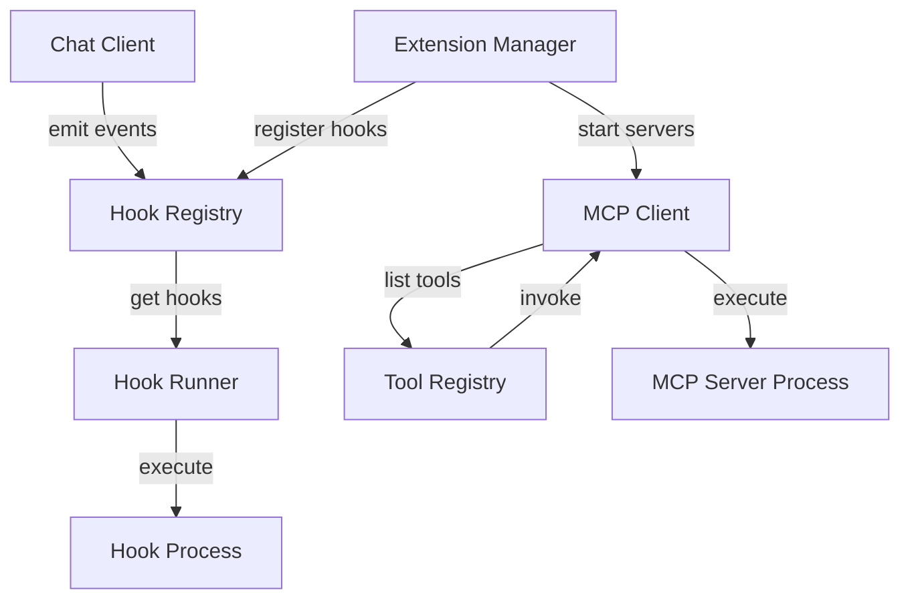

# Design Document

## Overview

This design implements a three-part extensibility system for OLLM CLI:

1. **Hook System**: Event-driven execution of custom scripts at key lifecycle points
2. **Extension System**: Manifest-based packaging of hooks, MCP servers, settings, and skills
3. **MCP Integration**: Client for connecting to Model Context Protocol servers and exposing their tools

The design prioritizes security (trust model for workspace hooks), reliability (timeout and error isolation), and developer experience (simple JSON-based protocols).

## Architecture

### Component Diagram



### Data Flow

1. **Hook Execution Flow**:
   - Event occurs in ChatClient → HookRegistry finds hooks → HookRunner executes each hook → Results aggregated → Control returns to ChatClient

2. **Extension Loading Flow**:
   - ExtensionManager scans directories → Parses manifests → Validates schemas → Registers hooks → Starts MCP servers → Registers tools

3. **MCP Tool Invocation Flow**:
   - Agent selects MCP tool → ToolRegistry routes to MCPClient → MCPClient translates to MCP format → Sends to MCP server → Translates response → Returns to agent

## Components and Interfaces

### Hook System

#### HookRegistry

Manages hook registration and discovery.

```typescript
interface Hook {
  name: string;
  event: HookEvent;
  command: string;
  args?: string[];
  timeout?: number;
  source: 'builtin' | 'user' | 'workspace' | 'extension';
  extensionName?: string;
}

type HookEvent = 
  | 'session_start'
  | 'session_end'
  | 'before_agent'
  | 'after_agent'
  | 'before_model'
  | 'after_model'
  | 'before_tool_selection'
  | 'before_tool'
  | 'after_tool';

class HookRegistry {
  private hooks: Map<HookEvent, Hook[]>;
  
  register(hook: Hook): void;
  unregister(name: string): void;
  getHooksForEvent(event: HookEvent): Hook[];
  clear(): void;
}
```

#### HookRunner

Executes hooks with timeout and error handling.

```typescript
interface HookInput {
  event: HookEvent;
  data: Record<string, unknown>;
}

interface HookOutput {
  continue: boolean;
  systemMessage?: string;
  [key: string]: unknown;
}

interface HookExecutionResult {
  hook: Hook;
  success: boolean;
  output?: HookOutput;
  error?: string;
  timedOut: boolean;
  duration: number;
}

class HookRunner {
  async executeHook(
    hook: Hook,
    input: HookInput,
    timeout: number
  ): Promise<HookExecutionResult>;
  
  async executeHooks(
    hooks: Hook[],
    input: HookInput,
    timeout: number
  ): Promise<HookExecutionResult[]>;
}
```

#### TrustedHooks

Manages hook trust and approval.

```typescript
interface HookApproval {
  source: string;
  hash: string;
  approvedAt: string;
  approvedBy: string;
}

interface TrustedHooksData {
  version: number;
  approvals: HookApproval[];
}

class TrustedHooks {
  private approvals: Map<string, HookApproval>;
  private filePath: string;
  
  async load(): Promise<void>;
  async save(): Promise<void>;
  
  isApproved(source: string, hash: string): boolean;
  async approve(source: string, hash: string): Promise<void>;
  needsApproval(hook: Hook): boolean;
  computeHash(source: string): Promise<string>;
}
```

### Extension System

#### ExtensionManager

Loads and manages extensions.

```typescript
interface Extension {
  name: string;
  version: string;
  description: string;
  path: string;
  manifest: ExtensionManifest;
  enabled: boolean;
}

interface ExtensionManifest {
  name: string;
  version: string;
  description: string;
  mcpServers?: Record<string, MCPServerConfig>;
  hooks?: Record<HookEvent, HookDefinition[]>;
  settings?: SettingDefinition[];
  skills?: SkillDefinition[];
}

interface HookDefinition {
  name: string;
  command: string;
  args?: string[];
  timeout?: number;
}

interface SettingDefinition {
  name: string;
  envVar?: string;
  sensitive?: boolean;
  description: string;
  default?: unknown;
}

interface SkillDefinition {
  name: string;
  description: string;
  prompt: string;
  parameters?: Record<string, unknown>;
}

class ExtensionManager {
  private extensions: Map<string, Extension>;
  private directories: string[];
  
  async loadExtensions(): Promise<Extension[]>;
  getExtension(name: string): Extension | undefined;
  async enableExtension(name: string): Promise<void>;
  async disableExtension(name: string): Promise<void>;
  listExtensions(): Extension[];
}
```

#### ManifestParser

Parses and validates extension manifests.

```typescript
class ManifestParser {
  parse(manifestPath: string): ExtensionManifest;
  validate(manifest: unknown): ExtensionManifest;
}
```

### MCP Integration

#### MCPClient

Manages connections to MCP servers.

```typescript
interface MCPServerConfig {
  command: string;
  args: string[];
  env?: Record<string, string>;
  transport?: 'stdio' | 'sse' | 'http';
}

interface MCPConnection {
  serverName: string;
  config: MCPServerConfig;
  connected: boolean;
  tools: MCPTool[];
  process?: ChildProcess;
}

class MCPClient {
  private connections: Map<string, MCPConnection>;
  private connectionTimeout: number;
  
  async connect(
    serverName: string,
    config: MCPServerConfig
  ): Promise<void>;
  
  async disconnect(serverName: string): Promise<void>;
  
  async listTools(serverName: string): Promise<MCPTool[]>;
  
  async executeTool(
    serverName: string,
    toolName: string,
    args: Record<string, unknown>
  ): Promise<unknown>;
  
  getConnection(serverName: string): MCPConnection | undefined;
  listConnections(): MCPConnection[];
}
```

#### MCPTransport

Handles communication with MCP servers.

```typescript
interface MCPMessage {
  jsonrpc: '2.0';
  id?: string | number;
  method?: string;
  params?: unknown;
  result?: unknown;
  error?: MCPError;
}

interface MCPError {
  code: number;
  message: string;
  data?: unknown;
}

abstract class MCPTransport {
  abstract send(message: MCPMessage): Promise<void>;
  abstract receive(): Promise<MCPMessage>;
  abstract close(): Promise<void>;
}

class StdioTransport extends MCPTransport {
  constructor(private process: ChildProcess) {}
  // Implementation for stdio communication
}

class SSETransport extends MCPTransport {
  constructor(private url: string) {}
  // Implementation for Server-Sent Events
}

class HTTPTransport extends MCPTransport {
  constructor(private url: string) {}
  // Implementation for HTTP requests
}
```

#### MCPSchemaConverter

Converts MCP tool schemas to internal format.

```typescript
interface MCPTool {
  name: string;
  description: string;
  inputSchema: {
    type: 'object';
    properties: Record<string, MCPParameter>;
    required?: string[];
  };
}

interface MCPParameter {
  type: string;
  description?: string;
  enum?: unknown[];
  default?: unknown;
}

class MCPSchemaConverter {
  convertTool(mcpTool: MCPTool, serverName: string): ToolSchema;
  convertParameter(mcpParam: MCPParameter): ParameterSchema;
}
```

#### MCP Tool Wrapper

Wraps MCP tools as internal tools.

```typescript
class MCPToolWrapper {
  constructor(
    private mcpClient: MCPClient,
    private serverName: string,
    private toolSchema: ToolSchema
  ) {}
  
  async execute(args: Record<string, unknown>): Promise<ToolResult>;
}
```

## Data Models

### Hook Protocol

**Input to Hook (stdin)**:
```json
{
  "event": "before_tool",
  "data": {
    "tool_name": "read_file",
    "args": {
      "path": "src/index.ts"
    },
    "session_id": "abc123"
  }
}
```

**Output from Hook (stdout)**:
```json
{
  "continue": true,
  "systemMessage": "File access logged",
  "metadata": {
    "logged_at": "2024-01-15T10:30:00Z"
  }
}
```

### Extension Manifest

```json
{
  "name": "my-extension",
  "version": "1.0.0",
  "description": "Example extension with hooks and MCP",
  "mcpServers": {
    "filesystem": {
      "command": "npx",
      "args": ["-y", "@modelcontextprotocol/server-filesystem", "/workspace"],
      "env": {},
      "transport": "stdio"
    }
  },
  "hooks": {
    "before_tool": [
      {
        "name": "audit-logger",
        "command": "node",
        "args": ["hooks/audit.js"],
        "timeout": 5000
      }
    ],
    "session_start": [
      {
        "name": "init-context",
        "command": "python",
        "args": ["hooks/init.py"]
      }
    ]
  },
  "settings": [
    {
      "name": "apiKey",
      "envVar": "MY_EXT_API_KEY",
      "sensitive": true,
      "description": "API key for external service"
    },
    {
      "name": "logLevel",
      "description": "Logging verbosity",
      "default": "info"
    }
  ],
  "skills": [
    {
      "name": "code-review",
      "description": "Review code for common issues",
      "prompt": "Review the following code for bugs, security issues, and style problems:\n\n{code}"
    }
  ]
}
```

### Trusted Hooks File

`~/.ollm/trusted-hooks.json`:
```json
{
  "version": 1,
  "approvals": [
    {
      "source": "/home/user/project/.ollm/extensions/my-ext/hooks/audit.js",
      "hash": "sha256:a1b2c3d4e5f6...",
      "approvedAt": "2024-01-15T10:30:00Z",
      "approvedBy": "user"
    }
  ]
}
```

### MCP Protocol Messages

**List Tools Request**:
```json
{
  "jsonrpc": "2.0",
  "id": 1,
  "method": "tools/list"
}
```

**List Tools Response**:
```json
{
  "jsonrpc": "2.0",
  "id": 1,
  "result": {
    "tools": [
      {
        "name": "read_file",
        "description": "Read a file from the filesystem",
        "inputSchema": {
          "type": "object",
          "properties": {
            "path": {
              "type": "string",
              "description": "Path to the file"
            }
          },
          "required": ["path"]
        }
      }
    ]
  }
}
```

**Execute Tool Request**:
```json
{
  "jsonrpc": "2.0",
  "id": 2,
  "method": "tools/call",
  "params": {
    "name": "read_file",
    "arguments": {
      "path": "/workspace/src/index.ts"
    }
  }
}
```

**Execute Tool Response**:
```json
{
  "jsonrpc": "2.0",
  "id": 2,
  "result": {
    "content": [
      {
        "type": "text",
        "text": "// File contents here..."
      }
    ]
  }
}
```

## Correctness Properties

*A property is a characteristic or behavior that should hold true across all valid executions of a system—essentially, a formal statement about what the system should do. Properties serve as the bridge between human-readable specifications and machine-verifiable correctness guarantees.*

### Property Reflection

After analyzing the acceptance criteria, I identified several areas where properties can be consolidated:

- **Hook Registry Operations**: Properties 2.2, 2.3, 2.4, and 2.5 all test registry operations and can be combined into comprehensive properties about registration and retrieval
- **Hook Execution Order**: Properties 3.5 and 2.3 both test ordering and can be unified
- **Trust Model**: Properties 4.1, 4.2, and 4.7 all test trust decisions and can be combined
- **Extension Loading**: Properties 5.6 and 5.7 both test registration during loading and can be combined
- **Manifest Validation**: Properties 6.2, 6.3, 6.4, 6.5, and 6.6 all test validation and can be consolidated
- **MCP Tool Translation**: Properties 10.1 and 10.3 both test translation and can be combined into a round-trip property
- **Extension State**: Properties 7.2 and 7.3 test opposite states and can be combined

### Hook System Properties

**Property 1: Hook Registration Preserves Data**
*For any* hook with event type, name, and command, registering it in the Hook_Registry and then retrieving hooks for that event should return a hook with the same event type, name, and command.
**Validates: Requirements 2.2, 2.3**

**Property 2: Hook Registration Order Preserved**
*For any* sequence of hooks registered for the same event, querying the Hook_Registry for that event should return the hooks in the same order they were registered.
**Validates: Requirements 2.3, 3.5**

**Property 3: Hook Unregistration Removes Hook**
*For any* registered hook, unregistering it by name should result in that hook no longer appearing in queries for its event.
**Validates: Requirements 2.5**

**Property 4: Hook Input Serialization Round-Trip**
*For any* hook execution with event data, the data passed to the hook via stdin should be valid JSON that deserializes to the original event data structure.
**Validates: Requirements 3.1**

**Property 5: Hook Timeout Enforcement**
*For any* hook that runs longer than the configured timeout, the Hook_Runner should terminate the hook process within a reasonable grace period (e.g., 1 second after timeout).
**Validates: Requirements 3.3, 14.3**

**Property 6: Hook Error Isolation**
*For any* sequence of hooks where one hook fails, all subsequent hooks in the sequence should still execute.
**Validates: Requirements 3.4**

**Property 7: Hook Cancellation Signal**
*For any* hook that returns `continue: false`, the Hook_Runner should signal that the operation should be cancelled.
**Validates: Requirements 3.7, 13.2**

**Property 8: Hook Trust by Source**
*For any* hook, if its source is 'builtin' or 'user', it should be trusted without requiring approval; if its source is 'workspace' and not previously approved, it should require approval.
**Validates: Requirements 4.1, 4.2, 4.7**

**Property 9: Hook Hash Verification**
*For any* approved hook, if the hook's content changes (resulting in a different SHA-256 hash), it should require re-approval before execution.
**Validates: Requirements 4.4, 4.5**

**Property 10: Hook Output Data Propagation**
*For any* hook that returns additional data fields beyond `continue`, those fields should be available to all subsequent hooks in the same event chain.
**Validates: Requirements 13.3, 13.4**

**Property 11: Malformed Hook Output Handling**
*For any* hook that outputs invalid JSON or JSON missing the `continue` field, the Hook_Runner should treat it as `continue: true` and log an error.
**Validates: Requirements 13.5**

**Property 12: Per-Hook Timeout Override**
*For any* hook with a custom timeout specified in its definition, that timeout should be used instead of the global default timeout.
**Validates: Requirements 14.5**

### Extension System Properties

**Property 13: Extension Manifest Parsing**
*For any* directory containing a valid manifest.json with required fields (name, version, description), the Extension_Manager should successfully parse it and create an Extension object.
**Validates: Requirements 5.3, 6.1**

**Property 14: Invalid Manifest Rejection**
*For any* manifest.json missing required fields or containing invalid data, the Extension_Manager should skip that extension and log an error.
**Validates: Requirements 5.4, 6.6**

**Property 15: Extension Hook Registration**
*For any* extension with hooks defined in its manifest, loading the extension should result in all those hooks being registered in the Hook_Registry with the correct event types.
**Validates: Requirements 5.6**

**Property 16: Extension MCP Server Registration**
*For any* extension with MCP servers defined in its manifest, loading the extension should result in connection attempts to all those servers.
**Validates: Requirements 5.7**

**Property 17: Manifest Field Validation**
*For any* manifest containing mcpServers, hooks, settings, or skills, each item should have its required fields (command/args for servers, name/command/event for hooks, name/description for settings, name/description/prompt for skills) or validation should fail.
**Validates: Requirements 6.2, 6.3, 6.4, 6.5**

**Property 18: Extension Enable/Disable State**
*For any* extension, if it is disabled, its hooks and MCP servers should not be registered; if it is enabled, its hooks and MCP servers should be registered.
**Validates: Requirements 7.2, 7.3**

**Property 19: Extension State Persistence**
*For any* extension whose enabled/disabled state is changed, that state should persist across system restarts.
**Validates: Requirements 7.4**

**Property 20: Extension Settings Merge**
*For any* extension with settings defined in its manifest, those settings should be merged into the system configuration and accessible via the configuration system.
**Validates: Requirements 12.1**

**Property 21: Environment Variable Settings**
*For any* extension setting with an envVar specified, the setting's value should be read from that environment variable.
**Validates: Requirements 12.2**

**Property 22: Sensitive Setting Redaction**
*For any* extension setting marked as sensitive, its value should not appear in log output.
**Validates: Requirements 12.3**

**Property 23: Extension Settings Validation**
*For any* extension with settings, if a required setting is missing, the extension should be disabled and a warning should be logged.
**Validates: Requirements 12.4, 12.5**

**Property 24: Skill Registration**
*For any* extension with skills defined in its manifest, all skills should be registered and available for invocation.
**Validates: Requirements 15.1, 15.2**

**Property 25: Skill Invocation**
*For any* registered skill, invoking it should inject the skill's prompt into the conversation context.
**Validates: Requirements 15.3**

**Property 26: Skill Namespace Collision**
*For any* two extensions that define skills with the same name, both skills should be accessible using namespaced names (extension-name:skill-name).
**Validates: Requirements 15.5**

### MCP Integration Properties

**Property 27: MCP Server Process Spawning**
*For any* MCP server configuration with command and args, connecting to the server should spawn a process with exactly those command and args.
**Validates: Requirements 8.4**

**Property 28: MCP Server Failure Handling**
*For any* MCP server that fails to start or connect, the MCP_Client should mark it as unavailable and log an error.
**Validates: Requirements 8.5**

**Property 29: MCP Server Disconnection Cleanup**
*For any* connected MCP server that disconnects, all tools from that server should be removed from the tool registry.
**Validates: Requirements 8.7**

**Property 30: MCP Tool Schema Conversion**
*For any* MCP tool schema with parameters, converting it to internal format should preserve all parameter names, types, descriptions, and required/optional status.
**Validates: Requirements 9.1, 9.2, 9.3**

**Property 31: MCP Tool Server Metadata**
*For any* tool converted from an MCP server, the tool's metadata should include the MCP server name.
**Validates: Requirements 9.4**

**Property 32: Invalid MCP Tool Schema Handling**
*For any* invalid MCP tool schema, the system should skip that tool and log a warning.
**Validates: Requirements 9.5**

**Property 33: MCP Tool Call Translation Round-Trip**
*For any* MCP tool invocation, translating the call to MCP format and then translating the result back to internal format should preserve the semantic meaning of the operation.
**Validates: Requirements 10.1, 10.2, 10.3**

**Property 34: MCP Tool Error Translation**
*For any* MCP tool call that fails, the Tool_Wrapper should return an error result containing the failure message.
**Validates: Requirements 10.4, 10.5**

**Property 35: Multiple MCP Server Connections**
*For any* set of MCP server configurations, the MCP_Client should maintain concurrent connections to all successfully started servers.
**Validates: Requirements 11.1**

**Property 36: MCP Tool Namespace Collision**
*For any* two MCP servers that provide tools with the same name, both tools should be accessible using namespaced names (server-name:tool-name).
**Validates: Requirements 11.2**

**Property 37: MCP Tool Routing**
*For any* tool call to an MCP tool, the call should be routed to the correct MCP server based on the tool's metadata.
**Validates: Requirements 11.3**

**Property 38: MCP Server Failure Isolation**
*For any* multi-server setup where one server fails or disconnects, the remaining servers should continue to function normally.
**Validates: Requirements 11.4**


## Error Handling

### Hook Execution Errors

**Timeout Errors**:
- Hook exceeds configured timeout → Terminate process, log warning, continue with remaining hooks
- Grace period of 1 second for process termination
- Return `HookExecutionResult` with `timedOut: true`

**Process Errors**:
- Hook process fails to spawn → Log error, skip hook, continue
- Hook process crashes → Log error with exit code, continue with remaining hooks
- Hook writes to stderr → Capture and include in error logs

**Output Parsing Errors**:
- Invalid JSON output → Log error, treat as `continue: true`, continue
- Missing `continue` field → Default to `continue: true`, log warning
- Unexpected output format → Log error, treat as `continue: true`

**Trust Errors**:
- Unapproved workspace hook → Skip execution, prompt user for approval
- Hash mismatch on approved hook → Skip execution, prompt for re-approval
- Unable to compute hash → Log error, skip hook

### Extension Loading Errors

**Manifest Errors**:
- Missing manifest.json → Skip extension, log info message
- Invalid JSON in manifest → Skip extension, log error with parse details
- Missing required fields → Skip extension, log validation errors
- Invalid field types → Skip extension, log validation errors

**Hook Registration Errors**:
- Duplicate hook name → Log warning, use latest registration
- Invalid event type → Skip hook, log error
- Missing command → Skip hook, log error

**Settings Errors**:
- Missing required setting → Disable extension, log warning
- Invalid setting value → Use default if available, otherwise disable extension
- Environment variable not set → Log warning, use default or disable

### MCP Connection Errors

**Connection Failures**:
- Server process fails to spawn → Mark unavailable, log error with command details
- Connection timeout → Mark unavailable, log timeout error
- Invalid transport type → Skip server, log error

**Protocol Errors**:
- Invalid JSON-RPC message → Log error, close connection
- Unsupported MCP version → Log error, close connection
- Missing required methods → Log warning, continue with available methods

**Tool Errors**:
- Invalid tool schema → Skip tool, log warning
- Tool execution timeout → Return error result to agent
- Tool execution failure → Return error result with message
- Server disconnects during tool call → Return error result, remove server tools

### Recovery Strategies

**Hook System**:
- Failed hooks don't block system operation
- Errors are logged but don't propagate to user unless critical
- System continues with remaining hooks after failures

**Extension System**:
- Failed extensions don't prevent other extensions from loading
- Extensions can be disabled/enabled at runtime
- Configuration errors are reported clearly to user

**MCP System**:
- Failed servers don't prevent other servers from connecting
- Server disconnections are handled gracefully
- Tools from failed servers are removed from registry
- Reconnection can be attempted manually or on restart

## Testing Strategy

### Dual Testing Approach

This feature requires both unit tests and property-based tests:

- **Unit tests**: Verify specific examples, edge cases, and integration points
- **Property tests**: Verify universal properties across all inputs

Both types of tests are complementary and necessary for comprehensive coverage. Unit tests catch concrete bugs in specific scenarios, while property tests verify general correctness across many inputs.

### Property-Based Testing

**Library**: Use `fast-check` for TypeScript property-based testing

**Configuration**:
- Minimum 100 iterations per property test
- Each property test must reference its design document property
- Tag format: `Feature: stage-05-hooks-extensions-mcp, Property {number}: {property_text}`

**Property Test Coverage**:

1. **Hook Registry Properties** (Properties 1-3):
   - Generate random hooks with various event types
   - Test registration, retrieval, and unregistration
   - Verify order preservation

2. **Hook Execution Properties** (Properties 4-12):
   - Generate random event data and hook outputs
   - Test timeout enforcement with slow hooks
   - Test error isolation with failing hooks
   - Test data propagation through hook chains

3. **Extension Properties** (Properties 13-26):
   - Generate random manifests with various configurations
   - Test validation with missing/invalid fields
   - Test enable/disable state transitions
   - Test settings merge and validation

4. **MCP Properties** (Properties 27-38):
   - Generate random MCP tool schemas
   - Test schema conversion preserves information
   - Test tool routing with multiple servers
   - Test failure isolation

**Generators**:
- `arbitraryHook()`: Generate valid Hook objects
- `arbitraryHookEvent()`: Generate valid HookEvent types
- `arbitraryManifest()`: Generate valid ExtensionManifest objects
- `arbitraryMCPToolSchema()`: Generate valid MCP tool schemas
- `arbitraryMCPServerConfig()`: Generate valid MCP server configurations

### Unit Testing

**Hook System Tests**:
- Test each hook event type is emitted correctly
- Test hook approval flow with user interaction
- Test trusted-hooks.json file operations
- Test hook timeout with specific durations
- Test hook error messages and logging

**Extension System Tests**:
- Test extension discovery in specific directories
- Test manifest parsing with specific invalid cases
- Test extension enable/disable persistence
- Test settings merge with conflicts
- Test skill registration and invocation

**MCP Integration Tests**:
- Test connection to mock MCP servers (stdio, SSE, HTTP)
- Test tool schema conversion with specific MCP types
- Test tool execution with mock responses
- Test server disconnection handling
- Test multiple server coordination

**Integration Tests**:
- Test full hook lifecycle: register → execute → cleanup
- Test full extension lifecycle: discover → load → enable → use
- Test full MCP lifecycle: connect → list tools → execute → disconnect
- Test interaction between hooks and MCP tools
- Test extension hooks triggering on MCP tool execution

### Test Organization

```
packages/core/src/
├── hooks/
│   └── __tests__/
│       ├── hookRegistry.test.ts
│       ├── hookRunner.test.ts
│       ├── trustedHooks.test.ts
│       └── hook-integration.test.ts
├── extensions/
│   └── __tests__/
│       ├── extensionManager.test.ts
│       ├── manifestParser.test.ts
│       └── extension-integration.test.ts
└── mcp/
    └── __tests__/
        ├── mcpClient.test.ts
        ├── mcpTransport.test.ts
        ├── mcpSchemaConverter.test.ts
        └── mcp-integration.test.ts
```

### Mock Strategies

**Hook Mocks**:
- Mock hook processes that return specific outputs
- Mock hook processes that timeout
- Mock hook processes that fail

**Extension Mocks**:
- Mock file system for extension directories
- Mock manifest.json files with various configurations
- Mock environment variables for settings

**MCP Mocks**:
- Mock MCP server processes
- Mock JSON-RPC communication
- Mock tool schemas and execution results

### Edge Cases to Test

**Hook System**:
- Empty hook output
- Hook output with only whitespace
- Hook that exits immediately
- Hook that never exits (timeout)
- Hook with very large output
- Multiple hooks with same name
- Hook that modifies its own file during execution

**Extension System**:
- Extension directory doesn't exist
- Extension directory is empty
- Manifest with circular dependencies
- Extension with no hooks or servers
- Extension with duplicate skill names
- Extension settings with special characters

**MCP System**:
- Server that never responds to initialization
- Server that disconnects immediately
- Server with no tools
- Server with malformed tool schemas
- Tool with recursive parameter types
- Tool execution that returns very large results

### Performance Considerations

**Hook Execution**:
- Hooks should execute in parallel where possible (future optimization)
- Timeout enforcement should not block other operations
- Hook output should be streamed for large outputs

**Extension Loading**:
- Extension discovery should be lazy (only when needed)
- Manifest parsing should be cached
- Extension enable/disable should be fast (no reload required)

**MCP Connections**:
- Server connections should be established in parallel
- Tool listing should be cached
- Tool execution should have reasonable timeouts
