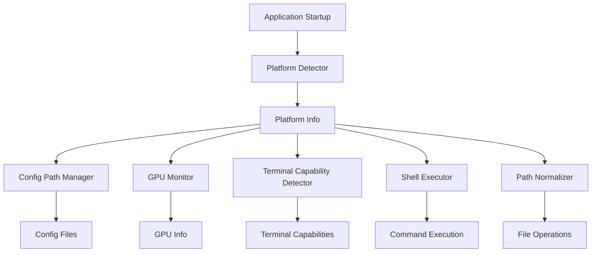

# Design Document: Cross-Platform Support

## Overview

This design implements cross-platform support for OLLM CLI across Windows, macOS, and Linux. The system uses platform detection to adapt behavior for file paths, shell execution, GPU monitoring, and terminal capabilities while maintaining a consistent user experience.

The design follows a detection-then-adaptation pattern: detect platform capabilities at startup, then use that information to configure platform-specific behavior throughout the application lifecycle.

## Architecture

### High-Level Architecture



### Component Interaction

1. **Platform Detector** runs once at startup and provides platform information to all other components
2. **Config Path Manager** uses platform info to resolve standard directories
3. **GPU Monitor** selects appropriate monitoring tool based on platform
4. **Terminal Capability Detector** checks environment and platform for feature support
5. **Shell Executor** uses platform-specific shell and commands
6. **Path Normalizer** handles path conversions for display and file operations

## Components and Interfaces

### Platform Detector

**Location**: `packages/core/src/utils/platform.ts`

**Interface**:
```typescript
export interface PlatformInfo {
  os: 'windows' | 'macos' | 'linux';
  isWindows: boolean;
  isMac: boolean;
  isLinux: boolean;
  shell: string;
  shellFlag: string;
  pythonCommand: string;
  supportsUnicode: boolean;
}

export function getPlatformInfo(): PlatformInfo;
```

**Responsibilities**:
- Detect operating system using `process.platform`
- Determine default shell and shell flags
- Determine Python command name
- Detect basic Unicode support based on platform and environment

**Implementation Notes**:
- Uses Node.js `process.platform` which returns 'win32', 'darwin', or 'linux'
- Caches result since platform doesn't change during execution
- Checks Windows-specific environment variables for Unicode support (WT_SESSION, ConEmuANSI, TERM_PROGRAM)

### Config Path Manager

**Location**: `packages/core/src/config/paths.ts`

**Interface**:
```typescript
export interface ConfigPaths {
  configDir: string;      // User config directory
  dataDir: string;        // User data directory  
  cacheDir: string;       // Cache directory
  configFile: string;     // Main config file
  sessionsDir: string;    // Session storage
  indexDir: string;       // Codebase index
}

export function getConfigPaths(): ConfigPaths;
export function getLegacyConfigPath(): string;
```

**Responsibilities**:
- Resolve platform-appropriate configuration directories
- Support XDG Base Directory specification on Linux
- Support AppData directories on Windows
- Support Library directories on macOS
- Provide backward compatibility with legacy ~/.ollm path

**Platform-Specific Paths**:

| Platform | Config | Data | Cache |
|----------|--------|------|-------|
| Windows | %APPDATA%\ollm | %APPDATA%\ollm | %LOCALAPPDATA%\ollm\cache |
| macOS | ~/Library/Application Support/ollm | ~/Library/Application Support/ollm | ~/Library/Caches/ollm |
| Linux | $XDG_CONFIG_HOME/ollm or ~/.config/ollm | $XDG_DATA_HOME/ollm or ~/.local/share/ollm | $XDG_CACHE_HOME/ollm or ~/.cache/ollm |

**Migration Strategy**:
- Check for legacy ~/.ollm/config.yaml first
- If found, use it but log a deprecation warning
- Provide migration command to move to new location

### Terminal Capability Detector

**Location**: `packages/cli/src/utils/terminal.ts`

**Interface**:
```typescript
export interface TerminalCapabilities {
  supportsColor: boolean;
  supports256Colors: boolean;
  supportsTrueColor: boolean;
  supportsUnicode: boolean;
  columns: number;
  rows: number;
  isInteractive: boolean;
}

export function getTerminalCapabilities(): TerminalCapabilities;

export const icons: {
  success: string;
  error: string;
  warning: string;
  spinner: string[];
};
```

**Responsibilities**:
- Detect color support (basic, 256-color, true color)
- Detect Unicode support
- Provide terminal dimensions
- Determine if terminal is interactive (TTY)
- Provide fallback ASCII icons when Unicode is unavailable

**Detection Logic**:

Color Support:
1. Check NO_COLOR environment variable (disables color)
2. Check FORCE_COLOR environment variable (enables color)
3. Check COLORTERM for 'truecolor' or '24bit'
4. Check TERM for '256color'
5. Default to basic color if TTY

Unicode Support:
1. On Windows: Check WT_SESSION, ConEmuANSI, or TERM_PROGRAM
2. On macOS/Linux: Default to true

**Icon Fallbacks**:
- Success: ✓ → +
- Error: ✗ → x
- Warning: ⚠ → !
- Spinner: ⠋⠙⠹⠸⠼⠴⠦⠧⠇⠏ → -\|/

### GPU Monitor

**Location**: `packages/core/src/services/gpuMonitor.ts`

**Interface**:
```typescript
export interface GPUInfo {
  available: boolean;
  vendor: 'nvidia' | 'amd' | 'apple' | 'cpu';
  vramTotal: number;
  vramUsed: number;
  temperature: number;
  gpuUtilization: number;
}

export class GPUMonitor {
  async queryGPU(): Promise<GPUInfo>;
}
```

**Responsibilities**:
- Query GPU information using platform-specific tools
- Handle missing GPU tools gracefully
- Provide CPU fallback when GPU is unavailable
- Support NVIDIA, AMD, and Apple GPUs

**Platform-Specific Implementation**:

Windows:
1. Check NVIDIA_SMI_PATH environment variable
2. Try 'nvidia-smi' in PATH
3. Try 'C:\Program Files\NVIDIA Corporation\NVSMI\nvidia-smi.exe'
4. Try 'C:\Windows\System32\nvidia-smi.exe'
5. Fall back to CPU mode

macOS:
1. Detect Apple Silicon (unified memory architecture)
2. Return limited info (vendor: 'apple', vramTotal: 0)
3. Note: Temperature and utilization not available without sudo

Linux:
1. Try 'nvidia-smi' for NVIDIA GPUs
2. Try 'rocm-smi' for AMD GPUs
3. Fall back to CPU mode

**Error Handling**:
- Never throw errors, always return fallback
- Log warnings when GPU tools are unavailable
- Continue operation in CPU mode

### Shell Executor

**Location**: `packages/core/src/sandbox/executor.ts`

**Interface**:
```typescript
export interface ExecutionResult {
  stdout: string;
  stderr: string;
  exitCode: number;
  duration: number;
}

export interface LanguageExecutor {
  execute(code: string): Promise<ExecutionResult>;
}

export class BashExecutor implements LanguageExecutor {
  execute(code: string): Promise<ExecutionResult>;
}

export class PythonExecutor implements LanguageExecutor {
  execute(code: string): Promise<ExecutionResult>;
}
```

**Responsibilities**:
- Execute shell commands using platform-appropriate shell
- Execute Python code using platform-appropriate Python command
- Handle temporary file creation with correct line endings
- Provide consistent execution interface across platforms

**Platform-Specific Behavior**:

Shell Execution:
- Windows: Use cmd.exe with /c flag
- macOS/Linux: Use /bin/sh with -c flag

Python Execution:
- Windows: Use 'python' command
- macOS/Linux: Use 'python3' command

**Optional Command Translation**:
- Can optionally translate common Unix commands on Windows
- Examples: ls → dir, cat → type, rm → del
- This is optional and may be disabled to avoid confusion

### Path Normalizer

**Location**: `packages/core/src/utils/paths.ts`

**Interface**:
```typescript
export function normalizeForDisplay(filePath: string): string;
export function toNativePath(filePath: string): string;
export function joinPath(...parts: string[]): string;
export function resolvePath(workspaceRoot: string, relativePath: string): string;
```

**Responsibilities**:
- Normalize paths for display (always forward slashes)
- Convert paths to native format for file operations
- Join path components safely
- Resolve relative paths handling mixed separators

**Implementation**:
- `normalizeForDisplay`: Replace all backslashes with forward slashes
- `toNativePath`: Replace all slashes with `path.sep`
- `joinPath`: Use `path.join()` for safe joining
- `resolvePath`: Normalize input then use `path.resolve()`

## Data Models

### PlatformInfo

```typescript
interface PlatformInfo {
  os: 'windows' | 'macos' | 'linux';
  isWindows: boolean;
  isMac: boolean;
  isLinux: boolean;
  shell: string;
  shellFlag: string;
  pythonCommand: string;
  supportsUnicode: boolean;
}
```

**Invariants**:
- Exactly one of isWindows, isMac, isLinux is true
- os value matches the true boolean flag
- shell and shellFlag are never empty strings

### ConfigPaths

```typescript
interface ConfigPaths {
  configDir: string;
  dataDir: string;
  cacheDir: string;
  configFile: string;
  sessionsDir: string;
  indexDir: string;
}
```

**Invariants**:
- All paths are absolute
- configFile is within configDir
- sessionsDir is within dataDir
- indexDir is within cacheDir

### TerminalCapabilities

```typescript
interface TerminalCapabilities {
  supportsColor: boolean;
  supports256Colors: boolean;
  supportsTrueColor: boolean;
  supportsUnicode: boolean;
  columns: number;
  rows: number;
  isInteractive: boolean;
}
```

**Invariants**:
- If supportsTrueColor is true, then supports256Colors is true
- If supports256Colors is true, then supportsColor is true
- columns and rows are positive integers
- If isInteractive is false, then supportsColor should be false (unless FORCE_COLOR is set)

### GPUInfo

```typescript
interface GPUInfo {
  available: boolean;
  vendor: 'nvidia' | 'amd' | 'apple' | 'cpu';
  vramTotal: number;
  vramUsed: number;
  temperature: number;
  gpuUtilization: number;
}
```

**Invariants**:
- If available is false, vendor is 'cpu'
- If vendor is 'cpu', all numeric values are 0
- vramUsed <= vramTotal
- temperature >= 0
- 0 <= gpuUtilization <= 100


## Correctness Properties

*A property is a characteristic or behavior that should hold true across all valid executions of a system—essentially, a formal statement about what the system should do. Properties serve as the bridge between human-readable specifications and machine-verifiable correctness guarantees.*

### Property Reflection

After analyzing the acceptance criteria, several properties can be consolidated:

- Platform detection examples (1.2-1.5) can be combined into properties about platform-specific configuration
- Config path examples (2.1-2.7) are platform-specific and best tested as examples on each platform
- Terminal capability properties (3.1-3.4) are universal rules about environment variable handling
- Path normalization properties (6.1-6.5) can be consolidated into fewer comprehensive properties
- Environment variable properties (9.1-9.6) overlap with earlier criteria and can be consolidated

### Properties

**Property 1: Platform detection consistency**
*For any* execution of getPlatformInfo(), exactly one of isWindows, isMac, or isLinux SHALL be true, and the os field SHALL match the true boolean flag.
**Validates: Requirements 1.1, 1.6**

**Property 2: NO_COLOR disables color**
*For any* terminal capability detection when NO_COLOR environment variable is set, supportsColor SHALL be false.
**Validates: Requirements 3.2, 9.2**

**Property 3: COLORTERM enables true color**
*For any* terminal capability detection when COLORTERM is 'truecolor' or '24bit', supportsTrueColor SHALL be true and supports256Colors SHALL be true.
**Validates: Requirements 3.3**

**Property 4: TERM 256color enables 256-color**
*For any* terminal capability detection when TERM contains '256color', supports256Colors SHALL be true.
**Validates: Requirements 3.4**

**Property 5: Non-TTY disables color**
*For any* terminal capability detection when the terminal is not a TTY, supportsColor SHALL be false (unless FORCE_COLOR is set).
**Validates: Requirements 3.1**

**Property 6: Unicode fallback provides ASCII**
*For any* icon request when Unicode is not supported, the returned character SHALL be an ASCII character (code point < 128).
**Validates: Requirements 3.9, 8.2**

**Property 7: GPU monitoring never throws**
*For any* GPU monitoring attempt, even when all tools fail, the function SHALL return a GPUInfo object with available set to false and SHALL NOT throw an exception.
**Validates: Requirements 4.6, 4.7, 8.1**

**Property 8: Display paths use forward slashes**
*For any* path passed to normalizeForDisplay(), all backslashes SHALL be converted to forward slashes in the output.
**Validates: Requirements 6.1, 10.4**

**Property 9: Native paths use platform separator**
*For any* path passed to toNativePath(), the output SHALL use only the platform's native path separator (path.sep).
**Validates: Requirements 6.2, 6.5**

**Property 10: Path joining handles mixed separators**
*For any* set of path components with mixed forward slashes and backslashes, resolvePath() SHALL produce a valid absolute path using native separators.
**Validates: Requirements 6.4**

**Property 11: Environment variable override for GPU path**
*For any* GPU monitoring on Windows when NVIDIA_SMI_PATH is set, that path SHALL be attempted before standard locations.
**Validates: Requirements 4.2, 9.1**

**Property 12: XDG environment variables override defaults**
*For any* config path resolution on Linux when XDG_CONFIG_HOME, XDG_DATA_HOME, or XDG_CACHE_HOME are set, those paths SHALL be used instead of the default ~/.config, ~/.local/share, or ~/.cache paths.
**Validates: Requirements 2.5, 2.6, 2.7, 9.4, 9.5, 9.6**

**Property 13: FORCE_COLOR enables color**
*For any* terminal capability detection when FORCE_COLOR is set, supportsColor SHALL be true even if the terminal is not a TTY.
**Validates: Requirements 9.3**

**Property 14: Missing tools trigger fallback**
*For any* platform-specific tool execution that fails, the system SHALL continue execution with fallback behavior and SHALL NOT terminate the process.
**Validates: Requirements 8.4**

**Property 15: Undefined environment variables use defaults**
*For any* configuration or capability detection when relevant environment variables are undefined, the system SHALL use platform-appropriate default values.
**Validates: Requirements 8.5**

**Property 16: Color hierarchy consistency**
*For any* terminal capabilities where supportsTrueColor is true, supports256Colors SHALL also be true; and where supports256Colors is true, supportsColor SHALL also be true.
**Validates: Requirements 3.3, 3.4** (implicit from color capability hierarchy)

**Property 17: Config paths are absolute**
*For any* ConfigPaths object returned by getConfigPaths(), all path fields SHALL be absolute paths (starting with / on Unix or drive letter on Windows).
**Validates: Requirements 2.1-2.7** (implicit requirement for usability)

**Property 18: VRAM usage constraint**
*For any* GPUInfo object where available is true, vramUsed SHALL be less than or equal to vramTotal.
**Validates: Requirements 4.1-4.5** (implicit from data model invariants)

## Error Handling

### Platform Detection Errors

**Scenario**: Unknown platform value from process.platform
**Handling**: Default to Linux behavior (most conservative)
**Rationale**: Linux behavior is most restrictive and safest fallback

### Config Path Errors

**Scenario**: Environment variables point to non-existent directories
**Handling**: Create directories on first use with appropriate permissions
**Rationale**: User may have set XDG variables but not created directories

**Scenario**: No write permission to config directory
**Handling**: Log error and fall back to in-memory configuration
**Rationale**: Allow read-only usage for system-wide installations

### GPU Monitoring Errors

**Scenario**: nvidia-smi or rocm-smi not found
**Handling**: Return CPU fallback (available: false, vendor: 'cpu')
**Rationale**: GPU is optional, system should work without it

**Scenario**: GPU tool returns invalid output
**Handling**: Log warning, return CPU fallback
**Rationale**: Corrupted output shouldn't crash the application

**Scenario**: GPU tool execution times out
**Handling**: Kill process after 5 seconds, return CPU fallback
**Rationale**: Prevent hanging on unresponsive GPU tools

### Terminal Capability Errors

**Scenario**: Unable to detect terminal capabilities
**Handling**: Default to safe values (no color, no Unicode, 80x24)
**Rationale**: Ensure output is readable on any terminal

**Scenario**: Conflicting environment variables (NO_COLOR and FORCE_COLOR both set)
**Handling**: NO_COLOR takes precedence
**Rationale**: Explicit disable is safer than explicit enable

### Shell Execution Errors

**Scenario**: Shell command not found
**Handling**: Return ExecutionResult with non-zero exit code and error message
**Rationale**: Caller can handle missing shell appropriately

**Scenario**: Temporary file creation fails
**Handling**: Throw error with clear message about disk space or permissions
**Rationale**: Cannot execute without temp files, error is unrecoverable

### Path Normalization Errors

**Scenario**: Invalid path characters
**Handling**: Pass through to Node.js path module, which will throw
**Rationale**: Invalid paths should fail fast with clear error

**Scenario**: Path traversal attempts (../..)
**Handling**: Allow but resolve to absolute path
**Rationale**: Legitimate use cases exist, security is handled at file operation level

## Testing Strategy

### Unit Tests

Unit tests verify specific examples and edge cases for each platform-specific behavior:

**Platform Detection**:
- Test on actual Windows, macOS, and Linux (via CI matrix)
- Verify shell, shellFlag, and pythonCommand for each platform
- Verify exactly one boolean flag is true

**Config Paths**:
- Test on each platform with default environment
- Test with XDG variables set on Linux
- Test with APPDATA variables set on Windows
- Verify legacy path detection

**Terminal Capabilities**:
- Test with various TERM values
- Test with NO_COLOR, FORCE_COLOR, COLORTERM
- Test TTY vs non-TTY
- Test Windows-specific environment variables
- Verify icon fallbacks

**GPU Monitoring**:
- Mock nvidia-smi output on each platform
- Mock rocm-smi output on Linux
- Test with missing GPU tools
- Test with invalid GPU tool output
- Verify CPU fallback

**Shell Execution**:
- Test command execution on each platform
- Verify correct shell and flags used
- Test Python execution with correct command

**Path Normalization**:
- Test forward slash conversion
- Test native separator conversion
- Test path joining with mixed separators
- Test absolute path resolution

### Property-Based Tests

Property-based tests verify universal properties across many generated inputs. Each test should run a minimum of 100 iterations.

**Property 1: Platform detection consistency**
- Generate: N/A (deterministic based on actual platform)
- Verify: Exactly one boolean is true, matches os field
- Tag: **Feature: stage-10-cross-platform, Property 1: Platform detection consistency**

**Property 2: NO_COLOR disables color**
- Generate: Various terminal states with NO_COLOR set
- Verify: supportsColor is always false
- Tag: **Feature: stage-10-cross-platform, Property 2: NO_COLOR disables color**

**Property 3: COLORTERM enables true color**
- Generate: Various terminal states with COLORTERM='truecolor' or '24bit'
- Verify: supportsTrueColor and supports256Colors are true
- Tag: **Feature: stage-10-cross-platform, Property 3: COLORTERM enables true color**

**Property 4: TERM 256color enables 256-color**
- Generate: Various TERM values containing '256color'
- Verify: supports256Colors is true
- Tag: **Feature: stage-10-cross-platform, Property 4: TERM 256color enables 256-color**

**Property 5: Non-TTY disables color**
- Generate: Various terminal states with isTTY=false, FORCE_COLOR unset
- Verify: supportsColor is false
- Tag: **Feature: stage-10-cross-platform, Property 5: Non-TTY disables color**

**Property 6: Unicode fallback provides ASCII**
- Generate: Various icon requests with Unicode disabled
- Verify: All returned characters have code point < 128
- Tag: **Feature: stage-10-cross-platform, Property 6: Unicode fallback provides ASCII**

**Property 7: GPU monitoring never throws**
- Generate: Various GPU tool failure scenarios
- Verify: Function returns GPUInfo, never throws
- Tag: **Feature: stage-10-cross-platform, Property 7: GPU monitoring never throws**

**Property 8: Display paths use forward slashes**
- Generate: Random paths with backslashes
- Verify: Output contains no backslashes
- Tag: **Feature: stage-10-cross-platform, Property 8: Display paths use forward slashes**

**Property 9: Native paths use platform separator**
- Generate: Random paths with mixed separators
- Verify: Output uses only path.sep
- Tag: **Feature: stage-10-cross-platform, Property 9: Native paths use platform separator**

**Property 10: Path joining handles mixed separators**
- Generate: Random path components with mixed separators
- Verify: Result is valid absolute path with native separators
- Tag: **Feature: stage-10-cross-platform, Property 10: Path joining handles mixed separators**

**Property 11: Environment variable override for GPU path**
- Generate: Various NVIDIA_SMI_PATH values
- Verify: Custom path is attempted first
- Tag: **Feature: stage-10-cross-platform, Property 11: Environment variable override for GPU path**

**Property 12: XDG environment variables override defaults**
- Generate: Various XDG_* environment variable values
- Verify: Custom paths are used instead of defaults
- Tag: **Feature: stage-10-cross-platform, Property 12: XDG environment variables override defaults**

**Property 13: FORCE_COLOR enables color**
- Generate: Various terminal states with FORCE_COLOR set
- Verify: supportsColor is true
- Tag: **Feature: stage-10-cross-platform, Property 13: FORCE_COLOR enables color**

**Property 14: Missing tools trigger fallback**
- Generate: Various tool failure scenarios
- Verify: Execution continues, no process termination
- Tag: **Feature: stage-10-cross-platform, Property 14: Missing tools trigger fallback**

**Property 15: Undefined environment variables use defaults**
- Generate: Various scenarios with undefined env vars
- Verify: Platform-appropriate defaults are used
- Tag: **Feature: stage-10-cross-platform, Property 15: Undefined environment variables use defaults**

**Property 16: Color hierarchy consistency**
- Generate: Various terminal capability states
- Verify: True color implies 256-color implies basic color
- Tag: **Feature: stage-10-cross-platform, Property 16: Color hierarchy consistency**

**Property 17: Config paths are absolute**
- Generate: Various platform and environment configurations
- Verify: All returned paths are absolute
- Tag: **Feature: stage-10-cross-platform, Property 17: Config paths are absolute**

**Property 18: VRAM usage constraint**
- Generate: Various GPUInfo objects
- Verify: vramUsed <= vramTotal when available is true
- Tag: **Feature: stage-10-cross-platform, Property 18: VRAM usage constraint**

### Integration Tests

Integration tests verify cross-platform behavior in realistic scenarios:

**CI Matrix Testing**:
- Run full test suite on Windows, macOS, Linux
- Run on Node.js 18, 20, 22
- Verify all tests pass on all platforms

**Manual Testing Checklist**:
- Windows 10/11 with Windows Terminal
- Windows with legacy cmd.exe
- macOS Intel and Apple Silicon
- Ubuntu/Debian Linux
- Fedora/RHEL Linux

### Test Configuration

Use Vitest with platform-specific test filtering:

```typescript
// vitest.config.ts
export default defineConfig({
  test: {
    // Run platform-specific tests only on matching platform
    include: [
      '**/*.test.ts',
      process.platform === 'win32' ? '**/*.windows.test.ts' : null,
      process.platform === 'darwin' ? '**/*.macos.test.ts' : null,
      process.platform === 'linux' ? '**/*.linux.test.ts' : null,
    ].filter(Boolean),
  },
});
```

### Property-Based Testing Library

Use **fast-check** for TypeScript property-based testing:

```typescript
import fc from 'fast-check';

// Example property test
test('Property 8: Display paths use forward slashes', () => {
  fc.assert(
    fc.property(
      fc.string().map(s => s.replace(/[^\\a-zA-Z0-9]/g, '\\').substring(0, 100)),
      (pathWithBackslashes) => {
        const result = normalizeForDisplay(pathWithBackslashes);
        return !result.includes('\\');
      }
    ),
    { numRuns: 100 }
  );
});
```
