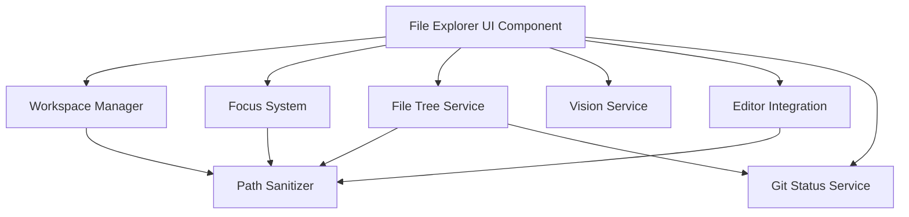

# Design Document: File Explorer UI

## Overview

The File Explorer UI is a terminal-based file management system built with React and Ink. It provides a VS Code-style workspace experience with multi-project support, file tree navigation, focus management for LLM context injection, external editor integration, and vision support for images.

The system is designed around three core concepts:
1. **Workspace Management**: Multi-project organization with per-project configuration
2. **Focus System**: Selective file content injection into LLM context
3. **Virtual Scrolling**: Performance-optimized rendering for large directory trees

The architecture follows a component-based design with clear separation between UI rendering (Ink components), business logic (services), and state management (React contexts).

## Architecture

### High-Level Architecture



### Component Layers

**Presentation Layer (React + Ink)**
- `FileExplorerComponent`: Main container component
- `FileTreeView`: Virtual scrolling tree renderer
- `QuickOpenDialog`: Fuzzy search modal
- `QuickActionsMenu`: Context menu for file operations
- `FocusedFilesPanel`: Display of pinned files
- `SyntaxViewer`: Syntax-highlighted file viewer

**Business Logic Layer (Services)**
- `WorkspaceManager`: Workspace and project configuration
- `FocusSystem`: File focus and content injection
- `FileTreeService`: Directory traversal and tree state
- `VisionService`: Image processing and encoding
- `EditorIntegration`: External editor spawning
- `GitStatusService`: Git status querying and caching
- `PathSanitizer`: Path validation and security

**State Management Layer (React Contexts)**
- `WorkspaceContext`: Current workspace and active project
- `FileFocusContext`: Focused files list and content
- `FileTreeContext`: Tree state, expanded directories, cursor position

### Data Flow

1. **User Input** → FileExplorerComponent → Event Handlers
2. **Event Handlers** → Services (FileTreeService, FocusSystem, etc.)
3. **Services** → State Updates (Context providers)
4. **State Updates** → React Re-render → Ink Terminal Output

## Components and Interfaces

### Core Interfaces

```typescript
// Workspace configuration
interface WorkspaceConfig {
  version: string;
  projects: ProjectConfig[];
}

interface ProjectConfig {
  name: string;
  path: string;
  llmAccess: boolean;
  excludePatterns: string[];
}

// File tree node
interface FileNode {
  name: string;
  path: string;
  type: 'file' | 'directory';
  children?: FileNode[];
  expanded?: boolean;
  gitStatus?: GitStatus;
  isFocused?: boolean;
}

// Git status
type GitStatus = 'untracked' | 'modified' | 'ignored' | 'clean';

// Focused file
interface FocusedFile {
  path: string;
  content: string;
  truncated: boolean;
  size: number;
}

// Image metadata
interface ImageMetadata {
  width: number;
  height: number;
  format: string;
  base64: string;
  resized: boolean;
}
```

### WorkspaceManager

**Responsibilities:**
- Parse `.ollm-workspace` and `.ollm-project` files
- Validate project paths
- Track active project for LLM context
- Provide project metadata

**Key Methods:**
```typescript
class WorkspaceManager {
  loadWorkspace(workspacePath: string): WorkspaceConfig;
  getActiveProject(): ProjectConfig | null;
  setActiveProject(projectName: string): void;
  isPathInWorkspace(path: string): boolean;
  getProjectExcludePatterns(projectName: string): string[];
}
```

### FocusSystem

**Responsibilities:**
- Manage focused files list
- Read and truncate file content (8KB limit)
- Inject focused content into LLM prompts
- Persist focused files across sessions

**Key Methods:**
```typescript
class FocusSystem {
  focusFile(path: string): Promise<FocusedFile>;
  unfocusFile(path: string): void;
  getFocusedFiles(): FocusedFile[];
  injectIntoPrompt(prompt: string): string;
  isFocused(path: string): boolean;
}
```

### FileTreeService

**Responsibilities:**
- Build file tree from filesystem
- Handle directory expansion/collapse
- Apply exclude patterns
- Manage virtual scrolling window

**Key Methods:**
```typescript
class FileTreeService {
  buildTree(rootPath: string, excludePatterns: string[]): Promise<FileNode>;
  expandDirectory(node: FileNode): Promise<void>;
  collapseDirectory(node: FileNode): void;
  getVisibleNodes(tree: FileNode, scrollOffset: number): FileNode[];
  findNodeByPath(tree: FileNode, path: string): FileNode | null;
}
```

### VisionService

**Responsibilities:**
- Detect image dimensions
- Resize images exceeding 2048px
- Encode images as base64
- Validate image formats

**Key Methods:**
```typescript
class VisionService {
  processImage(imagePath: string): Promise<ImageMetadata>;
  resizeImage(imagePath: string, maxDimension: number): Promise<Buffer>;
  encodeBase64(imageBuffer: Buffer): string;
  getSupportedFormats(): string[];
}
```

### EditorIntegration

**Responsibilities:**
- Spawn external editor process
- Detect $EDITOR environment variable
- Provide fallback editors (nano/notepad)
- Reload file after editing

**Key Methods:**
```typescript
class EditorIntegration {
  openInEditor(filePath: string): Promise<void>;
  getEditorCommand(): string;
  waitForEditorExit(): Promise<void>;
  reloadFile(filePath: string): Promise<string>;
}
```

### GitStatusService

**Responsibilities:**
- Query git status for files
- Cache status results (5 second TTL)
- Map git status to color codes
- Handle non-git directories gracefully

**Key Methods:**
```typescript
class GitStatusService {
  getStatus(repoPath: string): Promise<Map<string, GitStatus>>;
  getFileStatus(filePath: string): GitStatus | null;
  clearCache(): void;
  isGitRepository(path: string): boolean;
}
```

### PathSanitizer

**Responsibilities:**
- Validate path safety
- Reject `../` traversal
- Enforce workspace boundaries
- Normalize paths

**Key Methods:**
```typescript
class PathSanitizer {
  sanitize(path: string): string;
  isPathSafe(path: string): boolean;
  isWithinWorkspace(path: string, workspaceRoot: string): boolean;
  rejectTraversal(path: string): void;
}
```

## Data Models

### Workspace State

```typescript
interface WorkspaceState {
  config: WorkspaceConfig | null;
  activeProject: string | null;
  mode: 'browse' | 'workspace';
  rootPath: string;
}
```

### File Tree State

```typescript
interface FileTreeState {
  root: FileNode;
  cursorPosition: number;
  scrollOffset: number;
  expandedPaths: Set<string>;
  visibleWindow: FileNode[];
}
```

### Focus State

```typescript
interface FocusState {
  focusedFiles: Map<string, FocusedFile>;
  totalSize: number;
  maxSize: number; // 8KB per file
}
```

### Explorer Persistence

```typescript
interface ExplorerPersistence {
  expandedDirectories: string[];
  focusedFiles: string[];
  quickOpenHistory: string[];
  lastActiveProject: string | null;
}
```

## Correctness Properties

*A property is a characteristic or behavior that should hold true across all valid executions of a system—essentially, a formal statement about what the system should do. Properties serve as the bridge between human-readable specifications and machine-verifiable correctness guarantees.*


### Property 1: Workspace Configuration Parsing Preserves All Valid Projects

*For any* valid `.ollm-workspace` JSON file, parsing and loading should result in all projects with valid paths being available in the workspace, with their metadata (name, llmAccess, excludePatterns) preserved exactly.

**Validates: Requirements 1.1, 1.3**

### Property 2: Invalid Project Paths Are Gracefully Skipped

*For any* workspace configuration containing a mix of valid and invalid project paths, the workspace manager should load all valid projects and skip invalid ones without throwing errors.

**Validates: Requirements 1.2**

### Property 3: Active Project Selection Updates Context

*For any* project in a loaded workspace, selecting it as active should result in that project being marked as the active project and available for LLM context.

**Validates: Requirements 1.4**

### Property 4: Virtual Scrolling Renders Only Visible Window

*For any* file tree with more than 15 nodes, the rendered output should contain exactly 15 visible items (or fewer if the tree has fewer items), regardless of total tree size.

**Validates: Requirements 2.1, 9.1**

### Property 5: Keyboard Navigation Moves Cursor Correctly

*For any* cursor position in the file tree:
- Pressing 'j' or Down should move to the next item (unless at the end)
- Pressing 'k' or Up should move to the previous item (unless at the start)
- Pressing 'h' or Left on an expanded directory should collapse it
- Pressing 'l' or Right on a collapsed directory should expand it

**Validates: Requirements 2.2, 2.3, 2.4, 2.5**

### Property 6: Git Status Maps to Correct Colors

*For any* file with git status, the displayed color should match the status: untracked → green, modified → yellow, ignored → grey, clean → default.

**Validates: Requirements 2.7, 8.2, 8.3, 8.4**

### Property 7: File Icons Are Displayed for All Nodes

*For any* file or directory node in the tree, the rendered output should contain a Nerd Font icon character appropriate to the node type.

**Validates: Requirements 2.6**

### Property 8: Focusing a File Adds It to Focus List

*For any* file path, focusing it should add it to the focused files list with a 📌 indicator visible in the UI.

**Validates: Requirements 3.1**

### Property 9: Large Files Are Truncated at 8KB

*For any* file larger than 8KB, focusing it should result in the content being truncated to 8KB and the truncated flag being set to true.

**Validates: Requirements 3.2**

### Property 10: Focused File Content Is Injected Into Prompts

*For any* set of focused files, generating an LLM prompt should result in the prompt containing the content of all focused files.

**Validates: Requirements 3.3**

### Property 11: Focus Then Unfocus Removes File

*For any* file, focusing it and then immediately unfocusing it should result in the file not being in the focused files list (round-trip property).

**Validates: Requirements 3.4**

### Property 12: All Focused Files Appear in Context Panel

*For any* set of focused files, the context panel should display all of them with their paths and focus indicators.

**Validates: Requirements 3.5**

### Property 13: Valid File Operations Succeed

*For any* valid file or folder path and valid operation (create, rename), the operation should succeed and the filesystem should reflect the change.

**Validates: Requirements 4.1, 4.2**

### Property 14: Destructive Operations Require Confirmation

*For any* delete operation on a file or folder, a confirmation dialog should be displayed before the operation executes.

**Validates: Requirements 4.3, 10.3**

### Property 15: Copy Path Writes Absolute Path to Clipboard

*For any* file path, copying it should result in the absolute path being written to the system clipboard.

**Validates: Requirements 4.4**

### Property 16: Path Traversal Is Rejected

*For any* path containing `../` sequences, the path sanitizer should reject it and prevent the operation.

**Validates: Requirements 4.5, 10.1**

### Property 17: Failed Operations Display Error Messages

*For any* file operation that fails (due to permissions, invalid path, etc.), an error message should be displayed with the failure reason.

**Validates: Requirements 4.6**

### Property 18: Editor Integration Spawns Correct Editor

*For any* file and $EDITOR environment variable value, opening the file for editing should spawn the editor specified in $EDITOR.

**Validates: Requirements 5.1**

### Property 19: File Content Is Reloaded After Editing

*For any* file edited externally, the file content should be reloaded after the editor exits, reflecting any changes made.

**Validates: Requirements 5.3**

### Property 20: Syntax Highlighting Is Applied to Files

*For any* file with a recognized programming language extension, the syntax viewer should apply appropriate syntax highlighting using shiki.

**Validates: Requirements 5.4, 5.5**

### Property 21: Image Dimensions Are Detected

*For any* valid image file (JPEG, PNG, GIF, WebP), the vision service should correctly determine its width and height.

**Validates: Requirements 6.1**

### Property 22: Large Images Are Resized Proportionally

*For any* image with width or height exceeding 2048 pixels, the vision service should resize it such that the maximum dimension is 2048 pixels while maintaining aspect ratio.

**Validates: Requirements 6.2**

### Property 23: Image Encoding Produces Valid Base64

*For any* valid image, encoding it should produce a valid base64 string that can be decoded back to image data.

**Validates: Requirements 6.3**

### Property 24: Supported Image Formats Are Processed

*For any* image in JPEG, PNG, GIF, or WebP format, the vision service should successfully process it without errors.

**Validates: Requirements 6.4**

### Property 25: Unsupported Image Formats Return Errors

*For any* image in an unsupported format, the vision service should return a descriptive error message.

**Validates: Requirements 6.5**

### Property 26: Quick Open Filters Files by Fuzzy Match

*For any* search query in Quick Open, the filtered results should include all files that fuzzy-match the query and exclude files that don't match.

**Validates: Requirements 7.2**

### Property 27: Quick Open Selection Navigates to File

*For any* file selected from Quick Open results, the file explorer should navigate to that file and highlight it in the tree.

**Validates: Requirements 7.3**

### Property 28: Quick Actions Menu Contains Required Options

*For any* invocation of the Quick Actions menu, it should contain all required options: Open, Focus, Edit, Rename, Delete, Copy Path.

**Validates: Requirements 7.4**

### Property 29: Follow Mode Expands to Referenced Files

*For any* file path referenced by the LLM when Follow Mode is enabled, the file tree should automatically expand to show that file.

**Validates: Requirements 7.5**

### Property 30: Git Status Is Queried for Repositories

*For any* directory that is a git repository, the git status service should query status for all files in that repository.

**Validates: Requirements 8.1**

### Property 31: Git Status Results Are Cached

*For any* git status query, subsequent queries within 5 seconds should return the cached result without calling git again.

**Validates: Requirements 8.5**

### Property 32: Large Directories Trigger Warnings

*For any* directory containing more than 1000 items, attempting to expand it should display a warning or pagination message.

**Validates: Requirements 9.2**

### Property 33: Keyboard Input Is Debounced

*For any* rapid sequence of keyboard inputs, the number of re-renders should be less than the number of inputs due to debouncing.

**Validates: Requirements 9.3**

### Property 34: Collapsed Directories Are Not Loaded

*For any* collapsed directory in the tree, its contents should not be loaded into memory until it is expanded (lazy loading).

**Validates: Requirements 9.4**

### Property 35: Workspace Mode Rejects External Paths

*For any* absolute path outside the workspace root when in Workspace Mode, the path sanitizer should reject it.

**Validates: Requirements 10.2**

### Property 36: File Permissions Are Validated Before Operations

*For any* file operation, the system should check file permissions before attempting the operation and fail gracefully if permissions are insufficient.

**Validates: Requirements 10.4**

### Property 37: File Content Is Sanitized Before LLM Injection

*For any* file content being injected into an LLM prompt, the content should be sanitized to prevent prompt injection attacks.

**Validates: Requirements 10.5**

### Property 38: Current Mode Is Displayed in Header

*For any* file explorer state, the header should display the current mode (Browse or Workspace).

**Validates: Requirements 11.1**

### Property 39: Long Operations Display Loading Indicators

*For any* operation taking longer than 500ms, a loading indicator should be displayed to the user.

**Validates: Requirements 11.4**

### Property 40: Explorer State Persistence Round-Trip

*For any* set of expanded directories and focused files, saving the state and then loading it should restore the exact same set of expanded directories and focused files.

**Validates: Requirements 12.1, 12.2, 12.3**

### Property 41: Quick Open History Tracks Opened Files

*For any* file opened via Quick Open, that file path should appear in the Quick Open history.

**Validates: Requirements 12.4**

### Property 42: Corrupted Configuration Resets to Default

*For any* corrupted configuration file, loading it should result in the default state being used and a warning being logged.

**Validates: Requirements 12.5**

## Error Handling

### Error Categories

**File System Errors**
- File not found
- Permission denied
- Disk full
- Invalid path

**Git Errors**
- Not a git repository
- Git command failed
- Detached HEAD state

**Image Processing Errors**
- Unsupported format
- Corrupted image data
- Resize failure

**Editor Integration Errors**
- Editor not found
- Editor crashed
- File locked by another process

**Configuration Errors**
- Invalid JSON
- Missing required fields
- Invalid path references

### Error Handling Strategy

1. **Graceful Degradation**: When git status fails, continue without status indicators
2. **User Feedback**: Display clear error messages with actionable suggestions
3. **Logging**: Log all errors with context for debugging
4. **Recovery**: Attempt to recover from errors (e.g., reset to default config)
5. **Validation**: Validate inputs before operations to prevent errors

### Error Message Format

```typescript
interface ErrorMessage {
  type: 'error' | 'warning' | 'info';
  title: string;
  message: string;
  suggestion?: string;
  recoverable: boolean;
}
```

## Testing Strategy

### Dual Testing Approach

The File Explorer UI requires both unit tests and property-based tests for comprehensive coverage:

**Unit Tests** focus on:
- Specific examples of file operations
- Edge cases (empty directories, single-file trees)
- Error conditions (invalid paths, permission errors)
- Integration points between components
- UI rendering with specific inputs

**Property-Based Tests** focus on:
- Universal properties that hold for all inputs
- Comprehensive input coverage through randomization
- Invariants that must be maintained
- Round-trip properties (save/load, focus/unfocus)

### Property-Based Testing Configuration

**Library**: fast-check (TypeScript property-based testing)

**Configuration**:
- Minimum 100 iterations per property test
- Each test tagged with feature name and property number
- Tag format: `Feature: file-explorer-ui, Property N: [property description]`

**Example Property Test**:
```typescript
import fc from 'fast-check';

// Feature: file-explorer-ui, Property 16: Path Traversal Is Rejected
test('path sanitizer rejects traversal sequences', () => {
  fc.assert(
    fc.property(
      fc.string().filter(s => s.includes('../')),
      (path) => {
        const sanitizer = new PathSanitizer();
        expect(() => sanitizer.sanitize(path)).toThrow();
      }
    ),
    { numRuns: 100 }
  );
});
```

### Test Coverage Goals

- **Unit Test Coverage**: 80% line coverage minimum
- **Property Test Coverage**: All 42 correctness properties implemented
- **Integration Tests**: Key user workflows (focus file, edit file, navigate tree)
- **UI Tests**: Ink component rendering with ink-testing-library

### Testing Tools

- **Vitest**: Test framework and runner
- **fast-check**: Property-based testing
- **ink-testing-library**: Ink component testing
- **mock-fs**: File system mocking
- **memfs**: In-memory file system for tests

### Test Organization

```
packages/cli/src/ui/components/file-explorer/
├── __tests__/
│   ├── unit/
│   │   ├── WorkspaceManager.test.ts
│   │   ├── FocusSystem.test.ts
│   │   ├── FileTreeService.test.ts
│   │   ├── VisionService.test.ts
│   │   └── PathSanitizer.test.ts
│   ├── property/
│   │   ├── workspace.property.test.ts
│   │   ├── navigation.property.test.ts
│   │   ├── focus.property.test.ts
│   │   ├── persistence.property.test.ts
│   │   └── sanitization.property.test.ts
│   └── integration/
│       ├── file-operations.test.ts
│       ├── editor-integration.test.ts
│       └── git-status.test.ts
```

## Performance Considerations

### Virtual Scrolling

- Render only 15 visible items at a time
- Use React.memo for tree node components
- Debounce scroll events (50ms)

### Git Status Caching

- Cache status results for 5 seconds
- Invalidate cache on file operations
- Batch status queries for multiple files

### Lazy Loading

- Load directory contents only when expanded
- Unload collapsed directory contents after 30 seconds
- Limit tree depth to 10 levels by default

### Memory Management

- Maximum 100MB for tree state
- Prune expanded directories beyond 50 items
- Clear Quick Open history after 100 entries

## Security Considerations

### Path Sanitization

- Reject `../` traversal sequences
- Validate paths against workspace boundaries
- Normalize paths before operations
- Use path.resolve() for absolute path resolution

### Content Sanitization

- Escape special characters in file content
- Limit file content size (8KB per file)
- Sanitize before LLM injection
- Prevent prompt injection attacks

### Permission Validation

- Check file permissions before operations
- Handle permission errors gracefully
- Don't expose system paths in error messages
- Validate user input before filesystem operations

## Future Enhancements

1. **Multi-select**: Select multiple files for batch operations
2. **Drag and Drop**: Move files by dragging in terminal (if supported)
3. **File Preview**: Show file preview in split pane
4. **Search in Files**: Grep-style search across workspace
5. **Bookmarks**: Save frequently accessed paths
6. **Custom Icons**: User-defined icon mappings
7. **Themes**: Customizable color schemes
8. **Remote Filesystems**: Support for SSH/FTP browsing
