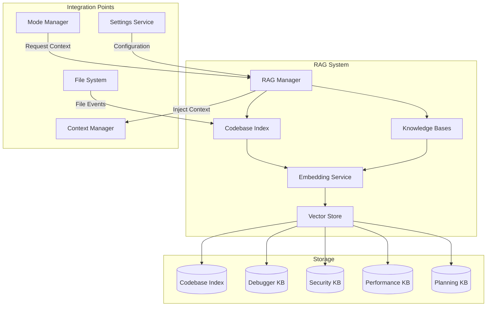

# Design Document: RAG Integration

## Overview

The RAG (Retrieval-Augmented Generation) Integration provides semantic search capabilities over the codebase and mode-specific knowledge bases. This system enables specialized AI modes to automatically access relevant context from indexed code and accumulated knowledge, significantly improving response quality and relevance.

The design emphasizes local-first operation using offline embeddings, efficient incremental indexing, and seamless integration with existing OLLM CLI components. The system uses LanceDB for vector storage and @xenova/transformers for local embedding generation, ensuring privacy and performance without external dependencies.

### Key Design Goals

1. **Local-First**: All embeddings generated locally, no external API calls
2. **Incremental**: File watching and incremental updates for fast re-indexing
3. **Efficient**: Sub-second search queries, minimal memory footprint
4. **Integrated**: Seamless integration with Mode Manager and Context Manager
5. **Resilient**: Graceful error handling and automatic recovery

## Architecture

### High-Level Architecture



### Component Responsibilities

**RAG Manager**
- Coordinates all RAG operations
- Handles mode-specific context retrieval
- Manages lifecycle of indexes and knowledge bases
- Provides public API for other components

**Codebase Index**
- Indexes workspace files based on configuration
- Watches for file system changes
- Splits files into chunks with overlap
- Maintains file metadata (path, timestamps, language)

**Knowledge Bases**
- Stores mode-specific findings and insights
- Supports time-based queries
- Manages knowledge lifecycle (retention, cleanup)
- Provides mode-specific search

**Embedding Service**
- Generates embeddings using local transformer model
- Caches model in memory after first load
- Batches embedding requests for efficiency
- Handles model download on first use

**Vector Store**
- Persists embeddings and metadata using LanceDB
- Supports similarity search with configurable top-K
- Handles incremental updates
- Manages multiple collections (codebase + knowledge bases)

## Components and Interfaces

### RAG Manager

```typescript
interface RAGManager {
  /**
   * Initialize the RAG system
   */
  initialize(): Promise<void>;
  
  /**
   * Shutdown the RAG system
   */
  shutdown(): Promise<void>;
  
  /**
   * Search the codebase index
   */
  searchCodebase(query: string, options?: SearchOptions): Promise<SearchResult[]>;
  
  /**
   * Search a mode-specific knowledge base
   */
  searchKnowledge(mode: ModeType, query: string, options?: SearchOptions): Promise<SearchResult[]>;
  
  /**
   * Store knowledge in a mode-specific knowledge base
   */
  storeKnowledge(mode: ModeType, content: string, metadata: KnowledgeMetadata): Promise<void>;
  
  /**
   * Get context for a mode activation
   */
  getContextForMode(mode: ModeType, query: string): Promise<RAGContext>;
  
  /**
   * Rebuild the codebase index
   */
  rebuildCodebaseIndex(): Promise<void>;
  
  /**
   * Clear a knowledge base
   */
  clearKnowledgeBase(mode: ModeType): Promise<void>;
  
  /**
   * Get indexing status
   */
  getStatus(): RAGStatus;
}

interface SearchOptions {
  topK?: number;
  threshold?: number;
  timeRange?: { start: Date; end: Date };
}

interface SearchResult {
  content: string;
  filePath: string;
  startLine: number;
  endLine: number;
  score: number;
  metadata: Record<string, unknown>;
}

interface KnowledgeMetadata {
  sessionId: string;
  timestamp: Date;
  tags?: string[];
  severity?: 'low' | 'medium' | 'high';
}

interface RAGContext {
  codebaseResults: SearchResult[];
  knowledgeResults: SearchResult[];
  totalTokens: number;
  formattedContext: string;
}

interface RAGStatus {
  enabled: boolean;
  indexing: boolean;
  filesIndexed: number;
  totalFiles: number;
  lastIndexTime?: Date;
  error?: string;
}

type ModeType = 'debugger' | 'security' | 'performance' | 'planning';
```

### Codebase Index

```typescript
interface CodebaseIndex {
  /**
   * Initialize the index and start file watching
   */
  initialize(workspacePath: string): Promise<void>;
  
  /**
   * Index all files in the workspace
   */
  indexWorkspace(): Promise<void>;
  
  /**
   * Index a single file
   */
  indexFile(filePath: string): Promise<void>;
  
  /**
   * Remove a file from the index
   */
  removeFile(filePath: string): Promise<void>;
  
  /**
   * Search the index
   */
  search(query: string, options: SearchOptions): Promise<SearchResult[]>;
  
  /**
   * Get indexing statistics
   */
  getStats(): IndexStats;
  
  /**
   * Stop file watching and cleanup
   */
  dispose(): Promise<void>;
}

interface IndexStats {
  totalFiles: number;
  totalChunks: number;
  indexSize: number;
  lastUpdate: Date;
}
```

### Embedding Service

```typescript
interface EmbeddingService {
  /**
   * Initialize the embedding model
   */
  initialize(): Promise<void>;
  
  /**
   * Generate embeddings for text
   */
  embed(text: string): Promise<number[]>;
  
  /**
   * Generate embeddings for multiple texts (batched)
   */
  embedBatch(texts: string[]): Promise<number[][]>;
  
  /**
   * Get embedding dimensions
   */
  getDimensions(): number;
  
  /**
   * Check if model is ready
   */
  isReady(): boolean;
}
```

### Vector Store

```typescript
interface VectorStore {
  /**
   * Initialize the vector store
   */
  initialize(storagePath: string): Promise<void>;
  
  /**
   * Create a collection
   */
  createCollection(name: string): Promise<void>;
  
  /**
   * Insert vectors into a collection
   */
  insert(collection: string, vectors: VectorRecord[]): Promise<void>;
  
  /**
   * Update vectors in a collection
   */
  update(collection: string, vectors: VectorRecord[]): Promise<void>;
  
  /**
   * Delete vectors from a collection
   */
  delete(collection: string, ids: string[]): Promise<void>;
  
  /**
   * Search for similar vectors
   */
  search(collection: string, query: number[], options: SearchOptions): Promise<VectorSearchResult[]>;
  
  /**
   * Get collection statistics
   */
  getCollectionStats(collection: string): Promise<CollectionStats>;
  
  /**
   * Close the vector store
   */
  close(): Promise<void>;
}

interface VectorRecord {
  id: string;
  vector: number[];
  metadata: Record<string, unknown>;
}

interface VectorSearchResult {
  id: string;
  score: number;
  metadata: Record<string, unknown>;
}

interface CollectionStats {
  name: string;
  count: number;
  dimensions: number;
  sizeBytes: number;
}
```

### Text Chunker

```typescript
interface TextChunker {
  /**
   * Split text into chunks
   */
  chunk(text: string, options: ChunkOptions): Chunk[];
}

interface ChunkOptions {
  chunkSize: number;
  overlap: number;
  preserveStructure?: boolean;
}

interface Chunk {
  content: string;
  startOffset: number;
  endOffset: number;
  startLine: number;
  endLine: number;
}
```

### Event System

```typescript
interface RAGEventEmitter {
  /**
   * Emit indexing progress events
   */
  on(event: 'indexing:progress', listener: (progress: IndexingProgress) => void): void;
  
  /**
   * Emit indexing completion events
   */
  on(event: 'indexing:complete', listener: (stats: IndexStats) => void): void;
  
  /**
   * Emit indexing error events
   */
  on(event: 'indexing:error', listener: (error: RAGError) => void): void;
  
  /**
   * Emit file indexed events
   */
  on(event: 'file:indexed', listener: (filePath: string) => void): void;
  
  /**
   * Emit file removed events
   */
  on(event: 'file:removed', listener: (filePath: string) => void): void;
}

interface IndexingProgress {
  filesProcessed: number;
  totalFiles: number;
  currentFile: string;
  percentComplete: number;
}
```

## Data Models

### Configuration Schema

```typescript
interface RAGConfig {
  enabled: boolean;
  codebase: {
    autoIndex: boolean;
    extensions: string[];
    excludePatterns: string[];
    maxFileSize: number;
    chunkSize: number;
    chunkOverlap: number;
  };
  embedding: {
    provider: 'local';
    model: string;
    batchSize: number;
  };
  search: {
    topK: number;
    threshold: number;
  };
  storage: {
    path: string;
  };
  knowledge: {
    retentionDays: number;
    maxEntriesPerMode: number;
  };
}
```

### Storage Schema

**Storage Directory Structure**:
```
~/.ollm/rag/                    # User-level RAG storage
├── codebase/                   # Codebase index (LanceDB)
│   ├── data.lance              # Vector data
│   └── metadata.json           # Index metadata
├── knowledge/                  # Knowledge bases
│   ├── debugger.lance          # Debugger mode KB
│   ├── security.lance          # Security mode KB
│   ├── performance.lance       # Performance mode KB
│   └── planning.lance          # Planning mode KB
└── models/                     # Cached embedding models
    └── all-MiniLM-L6-v2/       # Xenova model cache

.ollm/rag/                      # Workspace-level RAG storage
├── codebase/                   # Workspace-specific index
└── knowledge/                  # Workspace-specific KB
```

**Codebase Index Collection**
```typescript
interface CodebaseRecord {
  id: string;              // Unique chunk ID
  vector: number[];        // 384-dim embedding
  content: string;         // Chunk text
  filePath: string;        // Relative file path
  startLine: number;       // Starting line number
  endLine: number;         // Ending line number
  language: string;        // Programming language
  fileHash: string;        // File content hash
  indexedAt: Date;         // Indexing timestamp
}
```

**Knowledge Base Collection**
```typescript
interface KnowledgeRecord {
  id: string;              // Unique knowledge ID
  vector: number[];        // 384-dim embedding
  content: string;         // Knowledge text
  mode: ModeType;          // Mode that created it
  sessionId: string;       // Session identifier
  timestamp: Date;         // Creation timestamp
  tags: string[];          // Categorization tags
  severity?: string;       // Importance level
  metadata: Record<string, unknown>;
}
```

## Implementation Details

### Concurrency and Non-Blocking Operations

The RAG system implements a non-blocking architecture to ensure it doesn't interfere with the main application:

**Async/Await Pattern**:
- All I/O operations (file reading, vector store access) use async/await
- Long-running operations (indexing, embedding) run asynchronously
- Main thread remains responsive during indexing

**Worker Thread Strategy** (Future Enhancement):
- Consider using worker threads for CPU-intensive embedding generation
- Offload large batch operations to background threads
- Communicate via message passing for progress updates

**Queue-Based Processing**:
```typescript
class IndexingQueue {
  private queue: string[] = [];
  private processing = false;
  private maxConcurrent = 5;
  
  async enqueue(filePath: string): Promise<void> {
    this.queue.push(filePath);
    if (!this.processing) {
      await this.processQueue();
    }
  }
  
  private async processQueue(): Promise<void> {
    this.processing = true;
    while (this.queue.length > 0) {
      const batch = this.queue.splice(0, this.maxConcurrent);
      await Promise.all(batch.map(file => this.indexFile(file)));
    }
    this.processing = false;
  }
}
```

### Graceful Degradation Strategy

When system resources are constrained, the RAG system degrades functionality gracefully:

**Memory Pressure Response**:
1. **Level 1 (>400MB used)**: Reduce batch size for embeddings
2. **Level 2 (>450MB used)**: Pause indexing, continue search only
3. **Level 3 (>480MB used)**: Clear embedding model cache, reload on demand
4. **Level 4 (>500MB used)**: Disable RAG entirely, log warning

**Disk Space Response**:
1. **<1GB free**: Warn user, continue with caution
2. **<500MB free**: Pause indexing, allow search only
3. **<100MB free**: Disable RAG, prevent corruption

**CPU Throttling**:
- Monitor CPU usage during indexing
- If CPU >80% for >10 seconds, reduce concurrent operations
- Add delays between batch operations to prevent system overload

**Implementation**:
```typescript
class ResourceMonitor {
  private memoryThresholds = [400, 450, 480, 500]; // MB
  
  async checkResources(): Promise<DegradationLevel> {
    const memUsage = process.memoryUsage().heapUsed / 1024 / 1024;
    const diskSpace = await this.getFreeDiskSpace();
    
    if (memUsage > this.memoryThresholds[3] || diskSpace < 100) {
      return DegradationLevel.DISABLED;
    } else if (memUsage > this.memoryThresholds[2] || diskSpace < 500) {
      return DegradationLevel.SEARCH_ONLY;
    } else if (memUsage > this.memoryThresholds[1] || diskSpace < 1000) {
      return DegradationLevel.REDUCED;
    }
    return DegradationLevel.NORMAL;
  }
}

enum DegradationLevel {
  NORMAL = 'normal',
  REDUCED = 'reduced',
  SEARCH_ONLY = 'search_only',
  DISABLED = 'disabled',
}
```

### File Watching Strategy

The system uses `chokidar` for efficient file watching with the following optimizations:

1. **Debouncing**: Batch file changes within 500ms window
2. **Rate Limiting**: Process max 10 files per second during bulk changes
3. **Ignore Patterns**: Respect .gitignore and configured exclude patterns
4. **Atomic Operations**: Use file hashes to detect actual content changes

### Text Chunking Strategy

The chunker implements a sliding window approach:

1. **Token-Based Splitting**: Use approximate token counting (chars / 4)
2. **Overlap**: Maintain context between chunks (default 50 tokens)
3. **Structure Preservation**: Respect code block boundaries when possible
4. **Metadata Tracking**: Store line numbers for each chunk

### Embedding Generation

The embedding service uses a lazy initialization pattern:

1. **Model Loading**: Download and cache model on first use
2. **Batching**: Process multiple texts in single forward pass
3. **Normalization**: L2-normalize embeddings for cosine similarity
4. **Caching**: Keep model in memory for session duration

### Search Algorithm

The search process follows these steps:

1. **Query Embedding**: Generate embedding for search query
2. **Vector Search**: Use LanceDB's ANN search with cosine similarity
3. **Filtering**: Apply similarity threshold
4. **Merging**: Combine adjacent chunks from same file
5. **Ranking**: Sort by similarity score
6. **Formatting**: Add source attribution and line numbers

### Context Injection

When a mode is activated:

1. **Query Generation**: Extract key terms from mode context
2. **Dual Search**: Query both codebase and knowledge base
3. **Token Budget**: Allocate tokens (e.g., 30% for RAG context)
4. **Formatting**: Format results with clear source markers
5. **Injection**: Prepend to mode's system prompt

**Token Budget Management**:
```typescript
class TokenBudgetManager {
  private readonly RAG_ALLOCATION = 0.3; // 30% of context for RAG
  
  calculateBudget(totalContextTokens: number): RAGTokenBudget {
    const ragTokens = Math.floor(totalContextTokens * this.RAG_ALLOCATION);
    return {
      codebase: Math.floor(ragTokens * 0.6), // 60% for codebase
      knowledge: Math.floor(ragTokens * 0.4), // 40% for knowledge
      total: ragTokens,
    };
  }
  
  formatContext(
    codebaseResults: SearchResult[],
    knowledgeResults: SearchResult[],
    budget: RAGTokenBudget
  ): string {
    let context = '## Relevant Context from RAG\n\n';
    let tokensUsed = 0;
    
    // Add codebase results
    context += '### Codebase:\n';
    for (const result of codebaseResults) {
      const tokens = this.estimateTokens(result.content);
      if (tokensUsed + tokens > budget.codebase) break;
      context += `**${result.filePath}** (lines ${result.startLine}-${result.endLine}):\n`;
      context += '```\n' + result.content + '\n```\n\n';
      tokensUsed += tokens;
    }
    
    // Add knowledge results
    tokensUsed = 0;
    context += '### Previous Findings:\n';
    for (const result of knowledgeResults) {
      const tokens = this.estimateTokens(result.content);
      if (tokensUsed + tokens > budget.knowledge) break;
      context += `- ${result.content}\n`;
      tokensUsed += tokens;
    }
    
    return context;
  }
  
  private estimateTokens(text: string): number {
    return Math.ceil(text.length / 4); // Rough approximation
  }
}

interface RAGTokenBudget {
  codebase: number;
  knowledge: number;
  total: number;
}
```

### Integration with Context Manager

The RAG system integrates with the existing Context Manager to respect token limits:

**Integration Points**:
1. **Token Limit Query**: RAG queries Context Manager for available token budget
2. **Context Injection**: RAG injects formatted context before mode activation
3. **Token Tracking**: Context Manager tracks RAG token usage separately
4. **Dynamic Adjustment**: If context exceeds limits, RAG reduces results

**Implementation**:
```typescript
class RAGContextIntegration {
  constructor(
    private ragManager: RAGManager,
    private contextManager: ContextManager
  ) {}
  
  async injectContextForMode(mode: ModeType, query: string): Promise<void> {
    // Get available token budget from Context Manager
    const availableTokens = this.contextManager.getAvailableTokens();
    const ragBudget = Math.floor(availableTokens * 0.3);
    
    // Get RAG context within budget
    const ragContext = await this.ragManager.getContextForMode(mode, query);
    
    // Verify token limit compliance
    if (ragContext.totalTokens > ragBudget) {
      // Truncate results to fit budget
      ragContext.formattedContext = this.truncateToFit(
        ragContext.formattedContext,
        ragBudget
      );
    }
    
    // Inject into Context Manager
    this.contextManager.addSystemContext('rag', ragContext.formattedContext);
  }
}
```

### Event Emission for Progress Tracking

The RAG system emits events for integration with UI and logging:

**Event Types**:
- `indexing:started` - Indexing begins
- `indexing:progress` - Progress update (every 10 files)
- `indexing:complete` - Indexing finished
- `indexing:error` - Error during indexing
- `file:indexed` - Single file indexed
- `file:removed` - File removed from index
- `search:started` - Search query started
- `search:complete` - Search query completed

**Usage Example**:
```typescript
ragManager.on('indexing:progress', (progress) => {
  console.log(`Indexing: ${progress.percentComplete}% (${progress.filesProcessed}/${progress.totalFiles})`);
});

ragManager.on('indexing:complete', (stats) => {
  console.log(`Indexing complete: ${stats.totalFiles} files, ${stats.totalChunks} chunks`);
});

ragManager.on('indexing:error', (error) => {
  console.error(`Indexing error: ${error.message}`);
});
```

### Error Recovery

The system implements multiple recovery strategies:

1. **Corrupted Index**: Detect via checksum, offer rebuild
2. **Failed Embeddings**: Retry with exponential backoff (1s, 2s, 4s)
3. **Disk Full**: Disable indexing, log error, notify user
4. **Model Load Failure**: Disable RAG, continue without it
5. **File Read Errors**: Skip file, log warning, continue indexing

**Corruption Detection**:
The vector store implements checksum-based corruption detection:
- **Write Checksums**: Calculate and store checksums for each collection
- **Read Validation**: Verify checksums on load
- **Corruption Response**: If checksum mismatch, offer rebuild option
- **Backup Strategy**: Keep previous version before updates

### Programmatic API for Components

The RAG system provides a clean API for other components to query and interact with the index:

**Public API Methods**:
```typescript
// For Mode Manager integration
const context = await ragManager.getContextForMode('debugger', 'authentication error');

// For direct codebase search
const results = await ragManager.searchCodebase('user authentication', {
  topK: 5,
  threshold: 0.7,
});

// For knowledge base queries
const findings = await ragManager.searchKnowledge('security', 'SQL injection', {
  topK: 10,
  timeRange: { start: lastWeek, end: now },
});

// For storing mode findings
await ragManager.storeKnowledge('debugger', 'Found memory leak in connection pool', {
  sessionId: currentSession,
  timestamp: new Date(),
  tags: ['memory', 'performance'],
  severity: 'high',
});

// For status monitoring
const status = ragManager.getStatus();
console.log(`RAG enabled: ${status.enabled}, Indexing: ${status.indexing}`);

// For manual operations
await ragManager.rebuildCodebaseIndex();
await ragManager.clearKnowledgeBase('debugger');
```

**Integration Example - Mode Manager**:
```typescript
class ModeManager {
  constructor(private ragManager: RAGManager) {}
  
  async activateMode(mode: ModeType, userQuery: string): Promise<void> {
    // Get RAG context for this mode
    const ragContext = await this.ragManager.getContextForMode(mode, userQuery);
    
    // Build mode prompt with RAG context
    const systemPrompt = this.buildModePrompt(mode, ragContext.formattedContext);
    
    // Activate mode with enhanced context
    await this.setActiveMode(mode, systemPrompt);
  }
  
  async storeModeFindings(mode: ModeType, findings: string[]): Promise<void> {
    // Store findings in mode-specific knowledge base
    for (const finding of findings) {
      await this.ragManager.storeKnowledge(mode, finding, {
        sessionId: this.currentSessionId,
        timestamp: new Date(),
      });
    }
  }
}
```

**Integration Example - Settings Service**:
```typescript
class SettingsService {
  async loadRAGConfig(): Promise<RAGConfig> {
    const config = await this.loadConfig();
    return config.rag || this.getDefaultRAGConfig();
  }
  
  async updateRAGConfig(updates: Partial<RAGConfig>): Promise<void> {
    const config = await this.loadConfig();
    config.rag = { ...config.rag, ...updates };
    await this.saveConfig(config);
    
    // Notify RAG system of config change
    await this.ragManager.reloadConfig();
  }
  
  private getDefaultRAGConfig(): RAGConfig {
    return {
      enabled: true,
      codebase: {
        autoIndex: true,
        extensions: ['.ts', '.js', '.tsx', '.jsx', '.py', '.java', '.go'],
        excludePatterns: ['node_modules/**', 'dist/**', 'build/**', '.git/**'],
        maxFileSize: 1048576, // 1MB
        chunkSize: 512,
        chunkOverlap: 50,
      },
      embedding: {
        provider: 'local',
        model: 'Xenova/all-MiniLM-L6-v2',
        batchSize: 32,
      },
      search: {
        topK: 5,
        threshold: 0.7,
      },
      storage: {
        path: '~/.ollm/rag',
      },
      knowledge: {
        retentionDays: 30,
        maxEntriesPerMode: 1000,
      },
    };
  }
}
```

## Design Decisions and Rationale

### Why LanceDB for Vector Storage?

**Decision**: Use LanceDB instead of alternatives like Chroma, Pinecone, or FAISS.

**Rationale**:
1. **Local-First**: LanceDB is embedded, no server required
2. **Performance**: Fast similarity search with ANN algorithms
3. **Persistence**: Built-in disk persistence, no separate database
4. **TypeScript Support**: Good TypeScript/Node.js integration
5. **Memory Efficient**: Doesn't load entire index into memory
6. **Incremental Updates**: Supports updates without full rebuild

### Why Xenova/all-MiniLM-L6-v2 for Embeddings?

**Decision**: Use Xenova/all-MiniLM-L6-v2 model for local embeddings.

**Rationale**:
1. **Local Execution**: Runs entirely in Node.js, no Python required
2. **Small Size**: ~23MB model, fast download and loading
3. **Good Quality**: 384-dimensional embeddings with good semantic understanding
4. **Fast Inference**: <100ms per chunk on modern hardware
5. **Offline Operation**: Works without internet after initial download
6. **Privacy**: Code never leaves the machine

### Why Separate Knowledge Bases per Mode?

**Decision**: Maintain separate knowledge bases for each mode instead of a single shared knowledge base.

**Rationale**:
1. **Relevance**: Mode-specific findings are more relevant to that mode
2. **Isolation**: Prevents cross-contamination of findings
3. **Performance**: Smaller search space for faster queries
4. **Retention**: Different modes may have different retention policies
5. **Clarity**: Clear ownership and lifecycle management

### Why 30% Token Budget for RAG Context?

**Decision**: Allocate 30% of available context tokens to RAG-injected content.

**Rationale**:
1. **Balance**: Leaves 70% for conversation history and user input
2. **Sufficient Context**: 30% typically provides 2-5 relevant code chunks
3. **Configurable**: Can be adjusted based on mode or user preference
4. **Prevents Overflow**: Ensures RAG doesn't dominate the context
5. **Empirical**: Based on testing with typical workspace sizes

### Why Chunk Size of 512 Tokens?

**Decision**: Default chunk size of 512 tokens with 50-token overlap.

**Rationale**:
1. **Context Window**: Fits well within embedding model's 512-token limit
2. **Semantic Unity**: Large enough to capture meaningful code blocks
3. **Search Granularity**: Small enough for precise search results
4. **Overlap**: 50-token overlap preserves context across boundaries
5. **Performance**: Good balance between index size and search quality

### Why Rate Limit File Watching?

**Decision**: Process maximum 10 files per second during bulk changes.

**Rationale**:
1. **System Stability**: Prevents overwhelming the system during large operations
2. **Resource Management**: Keeps CPU and I/O usage reasonable
3. **User Experience**: Maintains application responsiveness
4. **Batch Operations**: Handles git checkouts, npm installs gracefully
5. **Configurable**: Can be adjusted for more powerful machines

## Correctness Properties

A property is a characteristic or behavior that should hold true across all valid executions of a system—essentially, a formal statement about what the system should do. Properties serve as the bridge between human-readable specifications and machine-verifiable correctness guarantees.

### Property 1: Automatic Workspace Indexing

*For any* workspace with files matching configured extensions, when RAG is enabled, all matching files (excluding those in exclude patterns) should be present in the codebase index.

**Validates: Requirements 1.1, 1.5**

### Property 2: File System Change Propagation

*For any* file system change (create, modify, delete), the codebase index should reflect that change within 1 second.

**Validates: Requirements 1.2, 1.3, 1.4**

### Property 3: File Size Filtering

*For any* file larger than the configured maximum file size, that file should not be present in the codebase index.

**Validates: Requirements 1.6**

### Property 4: Chunk Size and Overlap

*For any* file being indexed, the resulting chunks should have sizes within the configured chunk size (±10% tolerance for boundary conditions) and consecutive chunks should overlap by the configured overlap amount.

**Validates: Requirements 1.7**

### Property 5: Search Result Correctness

*For any* search query, the returned results should: (1) contain at most top-K results, (2) all have similarity scores above the configured threshold, and (3) be sorted by similarity score in descending order.

**Validates: Requirements 2.1, 2.2, 2.6**

### Property 6: Search Performance

*For any* search query, the search operation should complete within 500 milliseconds.

**Validates: Requirements 2.3**

### Property 7: Chunk Merging

*For any* search query where multiple chunks from the same file are in the top-K results, those chunks should be merged into a single result with combined line ranges.

**Validates: Requirements 2.4**

### Property 8: Search Result Completeness

*For any* search result, it should include file path, start line number, end line number, and similarity score.

**Validates: Requirements 2.5**

### Property 9: Embedding Dimensions

*For any* text input, the generated embedding should have exactly 384 dimensions.

**Validates: Requirements 3.2**

### Property 10: Embedding Performance

*For any* text chunk, embedding generation should complete within 100 milliseconds.

**Validates: Requirements 3.3**

### Property 11: Vector Store Persistence Round-Trip

*For any* set of embeddings and metadata stored in the vector store, after restarting the application, querying the vector store should return equivalent data.

**Validates: Requirements 4.1, 4.5**

### Property 12: Incremental Update Isolation

*For any* subset of records being updated in the vector store, records not in that subset should remain unchanged.

**Validates: Requirements 4.3**

### Property 13: Concurrent Read Safety

*For any* set of concurrent read operations on the vector store, all reads should return correct results without corruption or errors.

**Validates: Requirements 4.6**

### Property 14: Write Atomicity

*For any* write operation to the vector store, if the operation is interrupted, the store should either contain the complete write or no write at all (no partial writes).

**Validates: Requirements 4.7**

### Property 15: Knowledge Base Isolation

*For any* knowledge stored in a mode-specific knowledge base, querying a different mode's knowledge base should not return that knowledge.

**Validates: Requirements 5.1**

### Property 16: Knowledge Storage Routing

*For any* knowledge generated by a mode, that knowledge should be stored in the correct mode-specific knowledge base.

**Validates: Requirements 5.2**

### Property 17: Knowledge Search Routing

*For any* mode activation, the RAG system should search only that mode's knowledge base, not other modes' knowledge bases.

**Validates: Requirements 5.3**

### Property 18: Knowledge Metadata Completeness

*For any* knowledge stored in a knowledge base, it should include a timestamp and session ID in its metadata.

**Validates: Requirements 5.4**

### Property 19: Time Range Filtering

*For any* time range query on a knowledge base, all returned results should have timestamps within the specified range.

**Validates: Requirements 5.5**

### Property 20: Automatic Context Injection

*For any* mode activation with relevant indexed content, the RAG system should automatically inject context from both the codebase index and the mode-specific knowledge base.

**Validates: Requirements 6.1, 6.2**

### Property 21: Token Limit Compliance

*For any* context injection, the total tokens in the injected context should not exceed the Context Manager's configured token limit for RAG context.

**Validates: Requirements 6.3**

### Property 22: Source Attribution

*For any* injected context, each piece of context should include clear source attribution (file path or knowledge base identifier).

**Validates: Requirements 6.4**

### Property 23: Recency Prioritization

*For any* knowledge base search with multiple relevant results, more recent entries should rank higher than older entries with similar similarity scores.

**Validates: Requirements 6.6**

### Property 24: Configuration Application

*For any* valid configuration value (extensions, exclude patterns, chunk size, etc.), the RAG system should apply that configuration correctly in its operations.

**Validates: Requirements 7.2, 7.3, 7.4, 7.5, 7.6**

### Property 25: Configuration Validation

*For any* configuration object, if it violates the JSON schema, the validation should fail with a descriptive error message.

**Validates: Requirements 7.7, 7.8**

### Property 26: Rate Limiting

*For any* bulk file system changes (>10 files in <1 second), the RAG system should process them at a rate not exceeding 10 files per second.

**Validates: Requirements 8.4**

### Property 27: Progress Reporting

*For any* indexing operation processing multiple files, the RAG system should emit progress events at regular intervals (at least every 10 files).

**Validates: Requirements 8.6**

### Property 28: Error Isolation

*For any* file that cannot be read during indexing, the indexing process should continue with other files and log the error.

**Validates: Requirements 9.1**

### Property 29: Retry with Exponential Backoff

*For any* embedding generation failure, the system should retry up to 3 times with exponential backoff (1s, 2s, 4s) before giving up.

**Validates: Requirements 9.2**

### Property 30: Data Validation

*For any* data being written to the vector store, if the data is invalid (missing required fields, wrong types), the write should be rejected with an error.

**Validates: Requirements 9.6**

## Error Handling

### Error Categories

**Recoverable Errors**
- File read failures: Log and continue
- Embedding generation failures: Retry with backoff
- Network errors (model download): Retry with user notification

**Non-Recoverable Errors**
- Corrupted vector store: Detect and offer rebuild
- Insufficient disk space: Disable indexing, notify user
- Model load failure: Disable RAG, continue without it

### Error Handling Strategy

```typescript
class RAGError extends Error {
  constructor(
    message: string,
    public code: RAGErrorCode,
    public recoverable: boolean,
    public context?: Record<string, unknown>
  ) {
    super(message);
  }
}

enum RAGErrorCode {
  FILE_READ_ERROR = 'FILE_READ_ERROR',
  EMBEDDING_ERROR = 'EMBEDDING_ERROR',
  VECTOR_STORE_ERROR = 'VECTOR_STORE_ERROR',
  CORRUPTION_DETECTED = 'CORRUPTION_DETECTED',
  DISK_FULL = 'DISK_FULL',
  MODEL_LOAD_ERROR = 'MODEL_LOAD_ERROR',
  INVALID_CONFIG = 'INVALID_CONFIG',
  INVALID_DATA = 'INVALID_DATA',
}
```

### Retry Logic

```typescript
async function withRetry<T>(
  operation: () => Promise<T>,
  maxRetries: number = 3,
  baseDelay: number = 1000
): Promise<T> {
  let lastError: Error;
  
  for (let attempt = 0; attempt < maxRetries; attempt++) {
    try {
      return await operation();
    } catch (error) {
      lastError = error as Error;
      if (attempt < maxRetries - 1) {
        const delay = baseDelay * Math.pow(2, attempt);
        await sleep(delay);
      }
    }
  }
  
  throw lastError!;
}
```

### Corruption Detection

The vector store implements checksum-based corruption detection:

1. **Write Checksums**: Calculate and store checksums for each collection
2. **Read Validation**: Verify checksums on load
3. **Corruption Response**: If checksum mismatch, offer rebuild option
4. **Backup Strategy**: Keep previous version before updates

## Testing Strategy

### Dual Testing Approach

The RAG Integration requires both unit tests and property-based tests for comprehensive coverage:

**Unit Tests** focus on:
- Specific examples of chunking behavior
- Edge cases (empty files, single-line files, very large files)
- Error conditions (unreadable files, corrupted stores)
- Integration points with Mode Manager and Context Manager
- Configuration validation examples

**Property-Based Tests** focus on:
- Universal properties across all inputs (see Correctness Properties)
- Comprehensive input coverage through randomization
- Performance requirements across many scenarios
- Data integrity and consistency guarantees

### Property-Based Testing Configuration

**Testing Library**: fast-check (TypeScript property-based testing)

**Configuration**:
- Minimum 100 iterations per property test
- Each test tagged with feature name and property number
- Tag format: `Feature: stage-10a-rag-integration, Property N: [property text]`

**Example Property Test**:
```typescript
import fc from 'fast-check';

describe('RAG Integration Properties', () => {
  it('Property 9: Embedding Dimensions', async () => {
    // Feature: stage-10a-rag-integration, Property 9: Embedding Dimensions
    await fc.assert(
      fc.asyncProperty(
        fc.string({ minLength: 1, maxLength: 1000 }),
        async (text) => {
          const embedding = await embeddingService.embed(text);
          expect(embedding).toHaveLength(384);
        }
      ),
      { numRuns: 100 }
    );
  });
});
```

### Test Data Generators

**File Structure Generator**:
```typescript
const fileStructureArb = fc.record({
  files: fc.array(
    fc.record({
      path: fc.string(),
      content: fc.string(),
      size: fc.nat(),
    })
  ),
  extensions: fc.array(fc.string()),
  excludePatterns: fc.array(fc.string()),
});
```

**Configuration Generator**:
```typescript
const configArb = fc.record({
  enabled: fc.boolean(),
  codebase: fc.record({
    autoIndex: fc.boolean(),
    extensions: fc.array(fc.string()),
    excludePatterns: fc.array(fc.string()),
    maxFileSize: fc.nat({ max: 10485760 }),
    chunkSize: fc.integer({ min: 100, max: 1000 }),
    chunkOverlap: fc.integer({ min: 0, max: 100 }),
  }),
  search: fc.record({
    topK: fc.integer({ min: 1, max: 20 }),
    threshold: fc.double({ min: 0, max: 1 }),
  }),
});
```

### Integration Testing

**Test Scenarios**:
1. End-to-end indexing and search workflow
2. Mode activation with context injection
3. File watching and incremental updates
4. Persistence and recovery after restart
5. Concurrent operations (indexing + searching)
6. Resource constraints (low memory, disk space)

### Performance Testing

**Benchmarks**:
- Initial indexing: 1000 files in <30 seconds
- Search query: <500ms per query
- Embedding generation: <100ms per chunk
- File update propagation: <1 second
- Memory usage: <500MB for typical workspace

### Mocking Strategy

**Mock Embedding Service** for unit tests:
```typescript
class MockEmbeddingService implements EmbeddingService {
  async embed(text: string): Promise<number[]> {
    // Return deterministic embedding based on text hash
    return Array(384).fill(0).map((_, i) => 
      Math.sin(hashCode(text) + i) / 2 + 0.5
    );
  }
}
```

**Mock Vector Store** for unit tests:
```typescript
class InMemoryVectorStore implements VectorStore {
  private collections = new Map<string, VectorRecord[]>();
  
  // In-memory implementation for fast unit tests
}
```

### Test Coverage Goals

- Line coverage: >80%
- Branch coverage: >75%
- Property test coverage: All 30 properties implemented
- Integration test coverage: All major workflows
