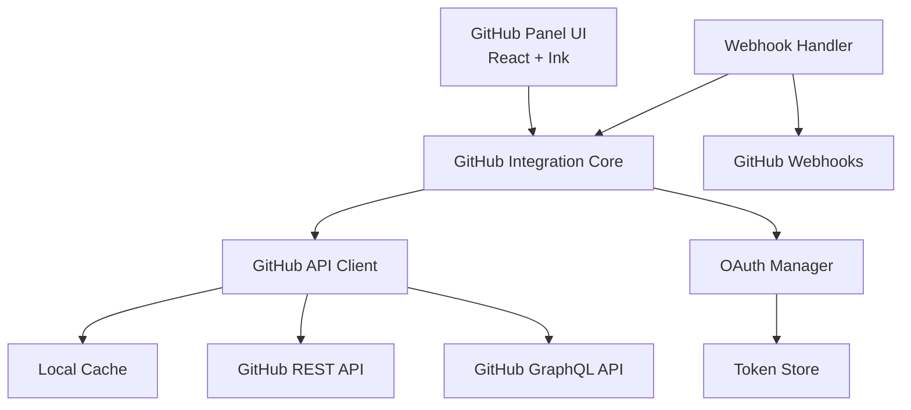
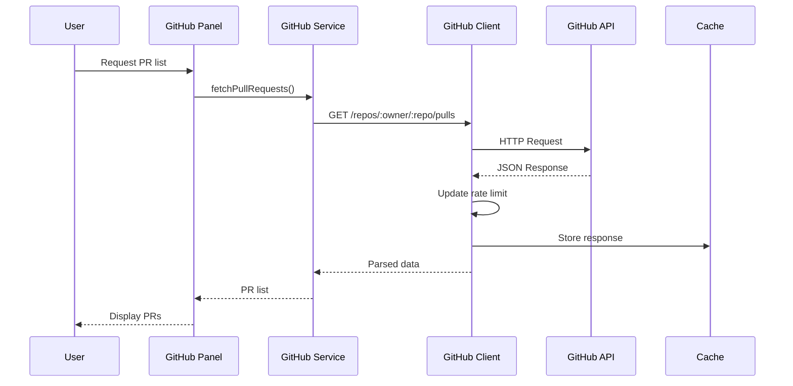

# Design Document: GitHub Integration

## Overview

The GitHub Integration feature provides comprehensive GitHub functionality within OLLM CLI's terminal interface. It enables developers to authenticate with GitHub, manage repositories, handle issues and pull requests, perform code reviews, monitor GitHub Actions, and receive notifications—all without leaving the terminal.

The design follows a layered architecture with clear separation between API communication, business logic, and UI presentation. It leverages both GitHub's REST and GraphQL APIs for optimal performance, implements secure OAuth 2.0 authentication with token management, and provides real-time updates through webhook integration.

Key design principles:

- **Security-first**: Encrypted token storage, signature verification for webhooks
- **Resilient**: Rate limiting, exponential backoff, offline mode support
- **Efficient**: GraphQL for complex queries, caching for offline access
- **User-friendly**: Terminal-optimized UI with keyboard navigation and progress indicators

## Architecture

### High-Level Architecture



### Component Architecture

The GitHub integration consists of several key components organized within the `packages/core/src/github/` directory:

1. **API Layer** (`api/`)
   - `githubClient.ts`: Main API client with REST and GraphQL support
   - `restClient.ts`: REST API wrapper with rate limiting
   - `graphqlClient.ts`: GraphQL query executor
   - `rateLimiter.ts`: Rate limit tracking and enforcement

2. **Authentication** (`auth/`)
   - `oauthManager.ts`: OAuth 2.0 flow implementation
   - `tokenStore.ts`: Secure token storage and encryption
   - `accountManager.ts`: Multi-account support

3. **Services** (`services/`)
   - `repositoryManager.ts`: Repository operations
   - `issueManager.ts`: Issue management
   - `prManager.ts`: Pull request workflows
   - `reviewManager.ts`: Code review operations
   - `actionsManager.ts`: GitHub Actions integration
   - `notificationManager.ts`: Notification handling

4. **UI Components** (`packages/cli/src/ui/components/github/`)
   - `GitHubPanel.tsx`: Main panel container
   - `RepositoryList.tsx`: Repository listing
   - `IssueList.tsx`: Issue listing
   - `PullRequestView.tsx`: PR details and actions
   - `DiffViewer.tsx`: Code diff rendering
   - `NotificationBadge.tsx`: Notification indicator

5. **Utilities** (`utils/`)
   - `webhookHandler.ts`: Webhook event processing
   - `cache.ts`: Local data caching
   - `errorHandler.ts`: Error parsing and formatting

### Data Flow



## Components and Interfaces

### GitHub Client

The main API client provides a unified interface for GitHub operations:

```typescript
interface GitHubClient {
  // REST API methods
  rest: {
    get<T>(endpoint: string, params?: Record<string, any>): Promise<T>;
    post<T>(endpoint: string, body?: any): Promise<T>;
    patch<T>(endpoint: string, body?: any): Promise<T>;
    delete<T>(endpoint: string): Promise<T>;
  };

  // GraphQL API methods
  graphql: {
    query<T>(query: string, variables?: Record<string, any>): Promise<T>;
    mutate<T>(mutation: string, variables?: Record<string, any>): Promise<T>;
  };

  // Rate limit information
  getRateLimit(): Promise<RateLimitInfo>;
}

interface RateLimitInfo {
  limit: number;
  remaining: number;
  reset: Date;
  used: number;
}
```

### OAuth Manager

Handles GitHub authentication flow:

```typescript
interface OAuthManager {
  // Initiate OAuth flow
  startAuthFlow(): Promise<AuthorizationURL>;

  // Complete OAuth flow with authorization code
  completeAuthFlow(code: string): Promise<AccessToken>;

  // Refresh expired token
  refreshToken(refreshToken: string): Promise<AccessToken>;

  // Revoke access
  revokeAccess(accountId: string): Promise<void>;

  // Get current authenticated user
  getCurrentUser(): Promise<GitHubUser | null>;

  // Switch between accounts
  switchAccount(accountId: string): Promise<void>;
}

interface AccessToken {
  token: string;
  refreshToken: string;
  expiresAt: Date;
  scopes: string[];
}

interface GitHubUser {
  id: number;
  login: string;
  name: string;
  email: string;
  avatarUrl: string;
  type: 'User' | 'Organization';
}
```

### Token Store

Secure storage for authentication tokens:

```typescript
interface TokenStore {
  // Store encrypted token
  saveToken(accountId: string, token: AccessToken): Promise<void>;

  // Retrieve and decrypt token
  getToken(accountId: string): Promise<AccessToken | null>;

  // Delete token
  deleteToken(accountId: string): Promise<void>;

  // List all stored accounts
  listAccounts(): Promise<string[]>;
}
```

### Repository Manager

Repository operations:

```typescript
interface RepositoryManager {
  // List repositories
  listRepositories(options: ListRepoOptions): Promise<Repository[]>;

  // Get repository details
  getRepository(owner: string, repo: string): Promise<Repository>;

  // Create repository
  createRepository(options: CreateRepoOptions): Promise<Repository>;

  // Fork repository
  forkRepository(owner: string, repo: string): Promise<Repository>;

  // Clone repository
  cloneRepository(owner: string, repo: string, path: string): Promise<void>;

  // Branch operations
  listBranches(owner: string, repo: string): Promise<Branch[]>;
  createBranch(owner: string, repo: string, name: string, from: string): Promise<Branch>;
  deleteBranch(owner: string, repo: string, name: string): Promise<void>;

  // Repository insights
  getInsights(owner: string, repo: string): Promise<RepositoryInsights>;
}

interface Repository {
  id: number;
  name: string;
  fullName: string;
  owner: GitHubUser;
  description: string;
  private: boolean;
  fork: boolean;
  url: string;
  cloneUrl: string;
  defaultBranch: string;
  createdAt: Date;
  updatedAt: Date;
}

interface Branch {
  name: string;
  commit: {
    sha: string;
    message: string;
  };
  protected: boolean;
}

interface RepositoryInsights {
  stars: number;
  forks: number;
  openIssues: number;
  openPRs: number;
  watchers: number;
  contributors: number;
}
```

### Issue Manager

Issue management operations:

```typescript
interface IssueManager {
  // List issues
  listIssues(owner: string, repo: string, filters: IssueFilters): Promise<Issue[]>;

  // Get issue details
  getIssue(owner: string, repo: string, number: number): Promise<Issue>;

  // Create issue
  createIssue(owner: string, repo: string, options: CreateIssueOptions): Promise<Issue>;

  // Update issue
  updateIssue(owner: string, repo: string, number: number, updates: IssueUpdates): Promise<Issue>;

  // Close/reopen issue
  closeIssue(owner: string, repo: string, number: number): Promise<Issue>;
  reopenIssue(owner: string, repo: string, number: number): Promise<Issue>;

  // Assign users
  assignIssue(owner: string, repo: string, number: number, assignees: string[]): Promise<Issue>;

  // Manage labels
  addLabels(owner: string, repo: string, number: number, labels: string[]): Promise<Issue>;
  removeLabel(owner: string, repo: string, number: number, label: string): Promise<Issue>;

  // Search issues
  searchIssues(query: string): Promise<Issue[]>;

  // Issue templates
  listTemplates(owner: string, repo: string): Promise<IssueTemplate[]>;
}

interface Issue {
  id: number;
  number: number;
  title: string;
  body: string;
  state: 'open' | 'closed';
  user: GitHubUser;
  assignees: GitHubUser[];
  labels: Label[];
  milestone: Milestone | null;
  createdAt: Date;
  updatedAt: Date;
  closedAt: Date | null;
}

interface Label {
  id: number;
  name: string;
  color: string;
  description: string;
}

interface Milestone {
  id: number;
  number: number;
  title: string;
  description: string;
  state: 'open' | 'closed';
  dueOn: Date | null;
}
```

### Pull Request Manager

Pull request workflow operations:

```typescript
interface PRManager {
  // List pull requests
  listPullRequests(owner: string, repo: string, filters: PRFilters): Promise<PullRequest[]>;

  // Get PR details
  getPullRequest(owner: string, repo: string, number: number): Promise<PullRequest>;

  // Create PR
  createPullRequest(owner: string, repo: string, options: CreatePROptions): Promise<PullRequest>;

  // Update PR
  updatePullRequest(
    owner: string,
    repo: string,
    number: number,
    updates: PRUpdates
  ): Promise<PullRequest>;

  // Merge PR
  mergePullRequest(owner: string, repo: string, number: number, method: MergeMethod): Promise<void>;

  // Close PR
  closePullRequest(owner: string, repo: string, number: number): Promise<PullRequest>;

  // Request reviewers
  requestReviewers(
    owner: string,
    repo: string,
    number: number,
    reviewers: string[]
  ): Promise<PullRequest>;

  // Get PR status
  getPRStatus(owner: string, repo: string, number: number): Promise<PRStatus>;

  // Get PR diff
  getPRDiff(owner: string, repo: string, number: number): Promise<string>;
}

interface PullRequest {
  id: number;
  number: number;
  title: string;
  body: string;
  state: 'open' | 'closed';
  user: GitHubUser;
  head: {
    ref: string;
    sha: string;
  };
  base: {
    ref: string;
    sha: string;
  };
  mergeable: boolean | null;
  merged: boolean;
  mergedAt: Date | null;
  createdAt: Date;
  updatedAt: Date;
}

interface PRStatus {
  checks: CheckRun[];
  reviews: Review[];
  hasConflicts: boolean;
  mergeable: boolean;
}

interface CheckRun {
  id: number;
  name: string;
  status: 'queued' | 'in_progress' | 'completed';
  conclusion: 'success' | 'failure' | 'neutral' | 'cancelled' | 'skipped' | null;
  startedAt: Date;
  completedAt: Date | null;
}

type MergeMethod = 'merge' | 'squash' | 'rebase';
```

### Review Manager

Code review operations:

```typescript
interface ReviewManager {
  // Get PR reviews
  listReviews(owner: string, repo: string, prNumber: number): Promise<Review[]>;

  // Create review
  createReview(
    owner: string,
    repo: string,
    prNumber: number,
    review: CreateReviewOptions
  ): Promise<Review>;

  // Submit review
  submitReview(
    owner: string,
    repo: string,
    prNumber: number,
    reviewId: number,
    event: ReviewEvent
  ): Promise<Review>;

  // Add review comment
  addReviewComment(
    owner: string,
    repo: string,
    prNumber: number,
    comment: ReviewCommentOptions
  ): Promise<ReviewComment>;

  // Reply to comment
  replyToComment(
    owner: string,
    repo: string,
    commentId: number,
    body: string
  ): Promise<ReviewComment>;

  // Resolve conversation
  resolveConversation(owner: string, repo: string, threadId: number): Promise<void>;

  // List review comments
  listReviewComments(owner: string, repo: string, prNumber: number): Promise<ReviewComment[]>;
}

interface Review {
  id: number;
  user: GitHubUser;
  body: string;
  state: 'PENDING' | 'APPROVED' | 'CHANGES_REQUESTED' | 'COMMENTED';
  submittedAt: Date | null;
}

interface ReviewComment {
  id: number;
  user: GitHubUser;
  body: string;
  path: string;
  line: number;
  side: 'LEFT' | 'RIGHT';
  inReplyTo: number | null;
  createdAt: Date;
}

type ReviewEvent = 'APPROVE' | 'REQUEST_CHANGES' | 'COMMENT';
```

### Actions Manager

GitHub Actions integration:

```typescript
interface ActionsManager {
  // List workflows
  listWorkflows(owner: string, repo: string): Promise<Workflow[]>;

  // Get workflow details
  getWorkflow(owner: string, repo: string, workflowId: number): Promise<Workflow>;

  // List workflow runs
  listWorkflowRuns(owner: string, repo: string, workflowId: number): Promise<WorkflowRun[]>;

  // Get workflow run
  getWorkflowRun(owner: string, repo: string, runId: number): Promise<WorkflowRun>;

  // Trigger workflow
  triggerWorkflow(
    owner: string,
    repo: string,
    workflowId: number,
    inputs: Record<string, any>
  ): Promise<void>;

  // Cancel workflow run
  cancelWorkflowRun(owner: string, repo: string, runId: number): Promise<void>;

  // Get workflow logs
  getWorkflowLogs(owner: string, repo: string, runId: number): Promise<WorkflowLogs>;

  // Download artifact
  downloadArtifact(owner: string, repo: string, artifactId: number, path: string): Promise<void>;

  // List secrets
  listSecrets(owner: string, repo: string): Promise<Secret[]>;

  // Create/update secret
  createSecret(owner: string, repo: string, name: string, value: string): Promise<void>;
}

interface Workflow {
  id: number;
  name: string;
  path: string;
  state: 'active' | 'disabled';
  createdAt: Date;
  updatedAt: Date;
}

interface WorkflowRun {
  id: number;
  name: string;
  status: 'queued' | 'in_progress' | 'completed';
  conclusion: 'success' | 'failure' | 'neutral' | 'cancelled' | 'skipped' | null;
  workflowId: number;
  createdAt: Date;
  updatedAt: Date;
  runStartedAt: Date | null;
}

interface WorkflowLogs {
  jobs: JobLog[];
}

interface JobLog {
  id: number;
  name: string;
  status: string;
  conclusion: string;
  steps: StepLog[];
}

interface StepLog {
  name: string;
  status: string;
  conclusion: string;
  number: number;
  log: string;
}

interface Secret {
  name: string;
  createdAt: Date;
  updatedAt: Date;
}
```

### Notification Manager

Notification handling:

```typescript
interface NotificationManager {
  // Start notification polling
  startPolling(interval: number): void;

  // Stop notification polling
  stopPolling(): void;

  // Fetch notifications
  fetchNotifications(): Promise<Notification[]>;

  // Mark as read
  markAsRead(notificationId: string): Promise<void>;

  // Mark all as read
  markAllAsRead(): Promise<void>;

  // Subscribe to notification events
  onNotification(callback: (notification: Notification) => void): void;

  // Configure notification settings
  configureSettings(settings: NotificationSettings): void;
}

interface Notification {
  id: string;
  type: 'mention' | 'review_requested' | 'assign' | 'pr_update' | 'workflow_failure';
  subject: {
    title: string;
    url: string;
    type: string;
  };
  repository: {
    fullName: string;
  };
  reason: string;
  unread: boolean;
  updatedAt: Date;
}

interface NotificationSettings {
  pollingInterval: number; // seconds
  desktopNotifications: boolean;
  soundAlerts: boolean;
  filters: {
    mentions: boolean;
    reviews: boolean;
    assignments: boolean;
    prUpdates: boolean;
    workflowFailures: boolean;
  };
}
```

### Webhook Handler

Real-time webhook event processing:

```typescript
interface WebhookHandler {
  // Start webhook server
  start(port: number, secret: string): Promise<void>;

  // Stop webhook server
  stop(): Promise<void>;

  // Verify webhook signature
  verifySignature(payload: string, signature: string, secret: string): boolean;

  // Handle webhook event
  handleEvent(event: WebhookEvent): Promise<void>;

  // Subscribe to specific event types
  on(eventType: string, handler: (payload: any) => void): void;
}

interface WebhookEvent {
  type: string;
  payload: any;
  deliveryId: string;
}
```

### Cache Manager

Local data caching for offline support:

```typescript
interface CacheManager {
  // Store data in cache
  set<T>(key: string, value: T, ttl?: number): Promise<void>;

  // Retrieve data from cache
  get<T>(key: string): Promise<T | null>;

  // Delete from cache
  delete(key: string): Promise<void>;

  // Clear all cache
  clear(): Promise<void>;

  // Check if cache has key
  has(key: string): Promise<boolean>;
}
```

## Data Models

### Configuration Schema

GitHub integration settings stored in `~/.ollm/settings/github.json`:

```typescript
interface GitHubConfig {
  accounts: AccountConfig[];
  activeAccountId: string | null;
  notifications: NotificationSettings;
  defaults: {
    repositoryVisibility: 'public' | 'private';
    mergeMethod: MergeMethod;
    diffViewMode: 'unified' | 'split';
  };
  webhook: {
    enabled: boolean;
    port: number;
    secret: string;
  };
  cache: {
    enabled: boolean;
    ttl: number; // seconds
  };
  rateLimit: {
    warningThreshold: number; // remaining requests
  };
}

interface AccountConfig {
  id: string;
  login: string;
  type: 'User' | 'Organization';
  tokenEncrypted: string;
  scopes: string[];
  createdAt: Date;
}
```

### Cache Schema

Cached data structure:

```typescript
interface CacheEntry<T> {
  key: string;
  value: T;
  expiresAt: Date;
  createdAt: Date;
}

// Cache keys follow pattern: github:{resource}:{identifier}
// Examples:
// - github:repo:owner/name
// - github:issues:owner/name
// - github:pr:owner/name/123
// - github:user:login
```

## Correctness Properties

_A property is a characteristic or behavior that should hold true across all valid executions of a system—essentially, a formal statement about what the system should do. Properties serve as the bridge between human-readable specifications and machine-verifiable correctness guarantees._

### Authentication Properties

**Property 1: OAuth URL contains required parameters**
_For any_ valid OAuth configuration, the generated authorization URL should contain client_id, redirect_uri, scope, and state parameters.
**Validates: Requirements 1.1**

**Property 2: Token storage round-trip**
_For any_ valid access token, storing it and then retrieving it should produce an equivalent token with the same value, scopes, and expiration.
**Validates: Requirements 1.3**

**Property 3: Token refresh produces valid token**
_For any_ expired token with a valid refresh token, the refresh operation should return a new access token with updated expiration.
**Validates: Requirements 1.4**

**Property 4: Account switching activates correct account**
_For any_ set of configured accounts and any account ID in that set, switching to that account should make it the active account and return its token.
**Validates: Requirements 1.5**

**Property 5: Token deletion removes access**
_For any_ account with stored tokens, after revoking access, attempting to retrieve that account's token should return null.
**Validates: Requirements 1.6**

**Property 6: Organization scopes included in OAuth URL**
_For any_ OAuth request with organization access, the generated URL should include organization-specific scopes (read:org, write:org).
**Validates: Requirements 1.7**

### Repository Management Properties

**Property 7: Repository pagination respects parameters**
_For any_ valid page size and page number, the returned repositories should not exceed the page size and should correspond to the requested page.
**Validates: Requirements 2.1**

**Property 8: Clone URL is authenticated**
_For any_ repository, the generated clone URL should include authentication credentials in the format https://token@github.com/owner/repo.git.
**Validates: Requirements 2.2**

**Property 9: Created repository matches specification**
_For any_ valid repository configuration, the created repository should have visibility, description, and settings matching the specification.
**Validates: Requirements 2.3**

**Property 10: Fork references original repository**
_For any_ forked repository, the fork should exist under the authenticated user's account and have a parent reference to the original repository.
**Validates: Requirements 2.4**

**Property 11: Branch listing includes required metadata**
_For any_ repository, all returned branches should include protection status and latest commit information.
**Validates: Requirements 2.5**

**Property 12: New branch inherits base commit**
_For any_ branch creation from a base branch, the new branch's commit SHA should match the base branch's commit SHA at creation time.
**Validates: Requirements 2.6**

**Property 13: Protected branches cannot be deleted**
_For any_ protected branch, attempting to delete it should fail, while deleting an unprotected branch should succeed.
**Validates: Requirements 2.7**

**Property 14: Repository insights contain all statistics**
_For any_ repository, the insights object should contain stars, forks, openIssues, openPRs, watchers, and contributors fields.
**Validates: Requirements 2.8**

### Issue Management Properties

**Property 15: Issue filtering returns matching results**
_For any_ combination of filters (state, assignee, labels, milestone), all returned issues should match all specified filter criteria.
**Validates: Requirements 3.1**

**Property 16: Created issue contains all specified fields**
_For any_ valid issue creation data, the created issue should contain the specified title, body, labels, assignees, and milestone.
**Validates: Requirements 3.2**

**Property 17: Issue updates preserve unmodified fields**
_For any_ issue and any subset of fields to update, after updating, the specified fields should be changed while unspecified fields remain unchanged.
**Validates: Requirements 3.3**

**Property 18: Issue state transitions are correct**
_For any_ open issue, closing it should result in state 'closed', and reopening a closed issue should result in state 'open'.
**Validates: Requirements 3.4, 3.5**

**Property 19: Issue assignees include all specified users**
_For any_ issue and any list of users, after assigning those users, the issue's assignees list should contain all specified users.
**Validates: Requirements 3.6**

**Property 20: Issue labels include all added labels**
_For any_ issue and any list of labels, after adding those labels, the issue's labels list should contain all added labels.
**Validates: Requirements 3.7**

**Property 21: Issue milestone matches specified milestone**
_For any_ issue and any milestone, after setting the milestone, the issue's milestone field should match the specified milestone.
**Validates: Requirements 3.8**

**Property 22: Search query is properly formatted**
_For any_ search query string, the API request should include the query in the correct GitHub search syntax format.
**Validates: Requirements 3.9**

**Property 23: Issue templates populate fields correctly**
_For any_ issue template, creating an issue from that template should populate the issue fields according to the template structure.
**Validates: Requirements 3.10**

### Pull Request Properties

**Property 24: PR filtering returns matching results**
_For any_ combination of filters (state, author, labels), all returned pull requests should match all specified filter criteria.
**Validates: Requirements 4.1**

**Property 25: Created PR contains all specified fields**
_For any_ valid PR creation data, the created PR should contain the specified title, body, base branch, and head branch.
**Validates: Requirements 4.2**

**Property 26: PR updates preserve unmodified fields**
_For any_ PR and any subset of fields to update, after updating, the specified fields should be changed while unspecified fields remain unchanged.
**Validates: Requirements 4.3**

**Property 27: Merged PR has correct state**
_For any_ mergeable PR, after merging with a specified method, the PR should be marked as merged with state 'closed'.
**Validates: Requirements 4.4**

**Property 28: Closed PR is not merged**
_For any_ open PR, after closing without merging, the PR state should be 'closed' and merged should be false.
**Validates: Requirements 4.5**

**Property 29: PR status contains all required information**
_For any_ PR, the status object should contain check runs, review status, and merge conflict information.
**Validates: Requirements 4.6**

**Property 30: PR reviewers include all requested users**
_For any_ PR and any list of reviewers, after requesting those reviewers, the PR's requested reviewers list should contain all specified users.
**Validates: Requirements 4.7**

**Property 31: PR approval creates approval review**
_For any_ PR, after approving it, a review with state 'APPROVED' should exist for that PR.
**Validates: Requirements 4.9**

**Property 32: PR change request creates changes-requested review**
_For any_ PR, after requesting changes, a review with state 'CHANGES_REQUESTED' should exist for that PR.
**Validates: Requirements 4.10**

### Code Review Properties

**Property 33: Diff rendering includes syntax highlighting**
_For any_ file diff, the rendered output should contain syntax highlighting markers appropriate for the file's language.
**Validates: Requirements 5.1**

**Property 34: Review comment exists at specified location**
_For any_ inline comment with path and line number, after creating the comment, it should exist at the specified path and line.
**Validates: Requirements 5.2**

**Property 35: Comment reply references original**
_For any_ comment reply, the reply should exist and have an inReplyTo field referencing the original comment ID.
**Validates: Requirements 5.3**

**Property 36: Resolved thread has correct status**
_For any_ review thread, after resolving it, the thread's resolved status should be true.
**Validates: Requirements 5.4**

**Property 37: Submitted review includes all pending comments**
_For any_ review with pending comments, after submitting, all pending comments should be associated with the submitted review.
**Validates: Requirements 5.5**

**Property 38: Review threads include resolution status**
_For any_ PR, all review threads should include a resolution status field indicating whether they are resolved.
**Validates: Requirements 5.6**

**Property 39: Code suggestions use correct format**
_For any_ code suggestion, the comment body should be wrapped in GitHub's suggestion markdown format (```suggestion blocks).
**Validates: Requirements 5.7**

**Property 40: Diff view mode toggles correctly**
_For any_ diff viewer state, toggling the view mode should switch between 'unified' and 'split' display formats.
**Validates: Requirements 5.8**

**Property 41: Large diffs are paginated**
_For any_ diff exceeding the size threshold, the output should be split into multiple pages for readability.
**Validates: Requirements 5.9**

### GitHub Actions Properties

**Property 42: All workflows are listed**
_For any_ repository with workflows in .github/workflows, all workflow files should be returned in the workflows list.
**Validates: Requirements 6.1**

**Property 43: Workflow runs include required fields**
_For any_ workflow run, it should contain status, conclusion, and duration fields.
**Validates: Requirements 6.2**

**Property 44: Triggered workflow creates new run**
_For any_ workflow trigger with inputs, a new workflow run should exist with the provided inputs after triggering.
**Validates: Requirements 6.3**

**Property 45: Cancelled run has cancelled status**
_For any_ in-progress workflow run, after canceling it, the run's status should be 'cancelled'.
**Validates: Requirements 6.4**

**Property 46: Workflow logs contain all jobs and steps**
_For any_ workflow run, the logs should contain entries for all jobs and their respective steps with log content.
**Validates: Requirements 6.5**

**Property 47: Downloaded artifact exists at path**
_For any_ artifact download with a specified path, after downloading, the artifact file should exist at that path.
**Validates: Requirements 6.6**

**Property 48: Secret listings never expose values**
_For any_ secret listing operation, the returned data should never contain the actual secret values, only names and metadata.
**Validates: Requirements 6.7**

**Property 49: Created secret appears in list**
_For any_ secret creation, after creating the secret, it should appear in the secrets list with the correct name.
**Validates: Requirements 6.8**

### Notification Properties

**Property 50: Notification polling occurs at configured interval**
_For any_ configured polling interval, notifications should be fetched at that interval (within a reasonable tolerance).
**Validates: Requirements 7.1**

**Property 51: New notifications appear in UI**
_For any_ new notification, it should appear in the GitHub panel's notification list.
**Validates: Requirements 7.2**

**Property 52: Mention notifications are highlighted**
_For any_ notification with type 'mention', it should have a highlight indicator in the UI.
**Validates: Requirements 7.3**

**Property 53: Review request notifications include PR details**
_For any_ review request notification, it should contain PR title, number, and repository information.
**Validates: Requirements 7.4**

**Property 54: Assignment events generate notifications**
_For any_ issue assignment event, a notification should be generated for the assigned user.
**Validates: Requirements 7.5**

**Property 55: PR update events generate notifications**
_For any_ PR update event, a notification should be generated for relevant users.
**Validates: Requirements 7.6**

**Property 56: Workflow failure notifications include details**
_For any_ workflow failure notification, it should contain workflow name, run ID, and failure information.
**Validates: Requirements 7.7**

**Property 57: Desktop notifications are sent when enabled**
_For any_ new notification when desktop notifications are enabled, a system notification should be triggered.
**Validates: Requirements 7.8**

**Property 58: Sound alerts play when enabled**
_For any_ new notification when sound alerts are enabled, a notification sound should be played.
**Validates: Requirements 7.9**

**Property 59: Marked-as-read notifications have correct status**
_For any_ notification, after marking it as read, the notification's unread status should be false.
**Validates: Requirements 7.10**

**Property 60: Notification filter settings persist**
_For any_ notification filter configuration, storing and then retrieving the settings should produce equivalent filter preferences.
**Validates: Requirements 7.11**

### Rate Limiting Properties

**Property 61: Rate limit quota is tracked**
_For any_ API request, after the request completes, the remaining rate limit quota should be updated.
**Validates: Requirements 8.1**

**Property 62: Rate limit warning appears at threshold**
_For any_ rate limit state, when remaining quota falls below the warning threshold, a warning should be displayed in the status bar.
**Validates: Requirements 8.2**

**Property 63: Queued requests execute after reset**
_For any_ set of queued requests, after rate limit reset, all queued requests should be executed in the order they were queued.
**Validates: Requirements 8.4**

**Property 64: Network errors trigger exponential backoff**
_For any_ network error, retry attempts should occur with exponentially increasing delays between attempts.
**Validates: Requirements 8.5**

**Property 65: API errors produce user-friendly messages**
_For any_ GitHub API error response, the error message displayed to the user should be human-readable and actionable.
**Validates: Requirements 8.7**

**Property 66: Multi-resource queries prefer GraphQL**
_For any_ query requesting multiple related resources, when GraphQL is available, the client should use GraphQL instead of multiple REST calls.
**Validates: Requirements 8.8**

### Offline Mode Properties

**Property 67: Online data is cached locally**
_For any_ data fetched while online (repositories, issues, PRs), it should be stored in the local cache.
**Validates: Requirements 9.1**

**Property 68: Offline requests serve from cache**
_For any_ data request while offline, if the data exists in cache and is not expired, it should be served from the cache.
**Validates: Requirements 9.2**

**Property 69: Offline mode shows indicator**
_For any_ offline state, the GitHub panel should display a visual indicator showing offline status.
**Validates: Requirements 9.3**

**Property 70: Offline writes are queued**
_For any_ write operation attempted while offline, the operation should be added to a queue for later execution.
**Validates: Requirements 9.4**

**Property 71: Reconnection syncs queued operations**
_For any_ set of queued operations, after connection is restored, all queued operations should be executed against the GitHub API.
**Validates: Requirements 9.5**

**Property 72: Expired cache refreshes when online**
_For any_ cache entry that has expired, when online, the data should be refreshed from the GitHub API.
**Validates: Requirements 9.6**

### Webhook Properties

**Property 73: Webhook server listens when configured**
_For any_ webhook configuration with enabled set to true, the webhook server should be running and listening on the configured port.
**Validates: Requirements 10.1**

**Property 74: Invalid webhook signatures are rejected**
_For any_ webhook event with an invalid signature, the event should be rejected and not processed.
**Validates: Requirements 10.2**

**Property 75: Push events update repository view**
_For any_ push webhook event, the repository view should be updated to reflect the new commits.
**Validates: Requirements 10.3**

**Property 76: Issue events update issue list**
_For any_ issue webhook event (opened, closed, edited), the issue list should be updated to reflect the change.
**Validates: Requirements 10.4**

**Property 77: PR events update PR view**
_For any_ pull request webhook event, the PR view should be updated to reflect the change.
**Validates: Requirements 10.5**

**Property 78: Workflow events update Actions view**
_For any_ workflow run webhook event, the Actions view should be updated to reflect the run status.
**Validates: Requirements 10.6**

### Configuration Properties

**Property 79: Settings persist correctly**
_For any_ valid GitHub configuration, storing and then retrieving the settings should produce equivalent configuration values.
**Validates: Requirements 11.1**

**Property 80: Polling interval validation**
_For any_ notification polling interval, values less than 30 seconds or greater than 3600 seconds should be rejected.
**Validates: Requirements 11.2**

**Property 81: Desktop notifications request permissions**
_For any_ settings update enabling desktop notifications, system notification permissions should be requested.
**Validates: Requirements 11.3**

**Property 82: Default visibility applies to new repositories**
_For any_ configured default repository visibility, newly created repositories should use that visibility setting.
**Validates: Requirements 11.4**

**Property 83: Default merge method applies to PR merges**
_For any_ configured preferred merge method, PR merge operations should use that method by default.
**Validates: Requirements 11.5**

**Property 84: Webhook URL validation**
_For any_ webhook endpoint configuration, invalid URL formats should be rejected.
**Validates: Requirements 11.6**

**Property 85: Workspace settings override user settings**
_For any_ setting that exists in both workspace and user configurations, the workspace value should take precedence.
**Validates: Requirements 11.7**

### UI Properties

**Property 86: GitHub panel shows auth status**
_For any_ GitHub panel state, when opened, it should display the current authentication status and account information.
**Validates: Requirements 12.1**

**Property 87: Authenticated panel shows navigation**
_For any_ authenticated state, the GitHub panel should display navigation options for repositories, issues, PRs, actions, and notifications.
**Validates: Requirements 12.2**

**Property 88: Keyboard navigation works in lists**
_For any_ list view in the GitHub panel, keyboard events (up/down arrows, page up/down) should navigate through the list items.
**Validates: Requirements 12.3**

**Property 89: Item selection shows details**
_For any_ list item, selecting it should display detailed information in a focused view.
**Validates: Requirements 12.4**

**Property 90: Long operations show progress**
_For any_ operation exceeding a duration threshold, a progress indicator should be displayed in the UI.
**Validates: Requirements 12.5**

**Property 91: Errors display with suggestions**
_For any_ error that occurs, the error message should be displayed with suggested actions for resolution.
**Validates: Requirements 12.6**

**Property 92: Notification badge shows unread count**
_For any_ state with unread notifications, the GitHub panel should display a badge with the count of unread notifications.
**Validates: Requirements 12.7**

**Property 93: Multiple accounts show switcher**
_For any_ configuration with multiple accounts, the GitHub panel should display an account switcher component.
**Validates: Requirements 12.8**

## Error Handling

### Authentication Errors

1. **Token Expiration**: When an access token expires, the OAuth Manager automatically attempts to refresh it using the refresh token. If refresh fails, the user is prompted to re-authenticate.

2. **Invalid Credentials**: If authentication fails due to invalid credentials, a clear error message is displayed with instructions to check credentials and try again.

3. **Scope Insufficient**: If an operation requires scopes not granted during authentication, the user is prompted to re-authenticate with additional scopes.

4. **Network Errors During Auth**: OAuth flow failures due to network issues trigger retry logic with exponential backoff.

### API Errors

1. **Rate Limiting**: When rate limit is exceeded, requests are queued and automatically retried after the reset time. Users see a warning when approaching the limit.

2. **404 Not Found**: Repository, issue, or PR not found errors display user-friendly messages suggesting the resource may have been deleted or access was revoked.

3. **403 Forbidden**: Permission errors clearly indicate the user lacks necessary permissions and suggest checking repository access settings.

4. **422 Validation Error**: GitHub API validation errors are parsed and displayed with specific field-level error messages.

5. **500 Server Error**: GitHub server errors trigger automatic retry with exponential backoff, up to 3 attempts.

### Network Errors

1. **Connection Timeout**: Requests that timeout are automatically retried with exponential backoff.

2. **DNS Resolution Failure**: DNS errors are caught and displayed with suggestions to check internet connectivity.

3. **SSL/TLS Errors**: Certificate validation errors are logged and displayed with security warnings.

### Webhook Errors

1. **Invalid Signature**: Webhook events with invalid signatures are rejected and logged as security violations.

2. **Malformed Payload**: Webhook payloads that fail JSON parsing are rejected and logged.

3. **Unknown Event Type**: Webhook events of unknown types are logged but don't cause errors.

### Cache Errors

1. **Cache Corruption**: If cache data is corrupted, it's cleared and fresh data is fetched from the API.

2. **Cache Write Failure**: Failures to write to cache are logged but don't prevent the operation from completing.

3. **Cache Read Failure**: If cache read fails, data is fetched directly from the API.

### UI Errors

1. **Rendering Errors**: React component errors are caught by error boundaries and display fallback UI.

2. **Invalid Input**: User input validation errors display inline with specific field-level messages.

3. **Navigation Errors**: Invalid navigation states are caught and reset to a safe default view.

## Testing Strategy

### Dual Testing Approach

The GitHub integration requires both unit tests and property-based tests for comprehensive coverage:

**Unit Tests** focus on:

- Specific examples of API responses and edge cases
- Error handling scenarios with mocked API responses
- UI component rendering with specific props
- Integration points between components
- Webhook signature verification with known test cases
- OAuth flow with mocked GitHub responses

**Property-Based Tests** focus on:

- Universal properties that hold for all inputs
- Data validation across random inputs
- Round-trip properties (serialize/deserialize, cache/retrieve)
- Filtering and pagination with random parameters
- State transitions with random sequences of operations

### Property-Based Testing Configuration

**Testing Library**: Use `fast-check` for property-based testing in TypeScript

**Test Configuration**:

- Minimum 100 iterations per property test
- Each property test references its design document property
- Tag format: `Feature: stage-11-github-integration, Property {number}: {property_text}`

**Example Property Test Structure**:

```typescript
import fc from 'fast-check';

// Feature: stage-11-github-integration, Property 79: Settings persist correctly
test('settings round-trip correctly', () => {
  fc.assert(
    fc.property(
      fc.record({
        pollingInterval: fc.integer({ min: 30, max: 3600 }),
        desktopNotifications: fc.boolean(),
        soundAlerts: fc.boolean(),
        defaultVisibility: fc.constantFrom('public', 'private'),
        mergeMethod: fc.constantFrom('merge', 'squash', 'rebase'),
      }),
      async (settings) => {
        const settingsManager = new SettingsManager();
        await settingsManager.saveSettings(settings);
        const retrieved = await settingsManager.getSettings();
        expect(retrieved).toEqual(settings);
      }
    ),
    { numRuns: 100 }
  );
});
```

### Test Organization

Tests are organized by component:

```
packages/core/src/github/__tests__/
├── api/
│   ├── githubClient.test.ts
│   ├── githubClient.property.test.ts
│   ├── rateLimiter.test.ts
│   └── rateLimiter.property.test.ts
├── auth/
│   ├── oauthManager.test.ts
│   ├── oauthManager.property.test.ts
│   ├── tokenStore.test.ts
│   └── tokenStore.property.test.ts
├── services/
│   ├── repositoryManager.test.ts
│   ├── repositoryManager.property.test.ts
│   ├── issueManager.test.ts
│   ├── issueManager.property.test.ts
│   ├── prManager.test.ts
│   ├── prManager.property.test.ts
│   ├── reviewManager.test.ts
│   ├── reviewManager.property.test.ts
│   ├── actionsManager.test.ts
│   ├── actionsManager.property.test.ts
│   ├── notificationManager.test.ts
│   └── notificationManager.property.test.ts
└── utils/
    ├── webhookHandler.test.ts
    ├── webhookHandler.property.test.ts
    ├── cache.test.ts
    └── cache.property.test.ts

packages/cli/src/ui/components/github/__tests__/
├── GitHubPanel.test.tsx
├── RepositoryList.test.tsx
├── IssueList.test.tsx
├── PullRequestView.test.tsx
├── DiffViewer.test.tsx
└── NotificationBadge.test.tsx
```

### Mock Strategy

**GitHub API Mocking**:

- Use MSW (Mock Service Worker) for HTTP mocking
- Create reusable mock handlers for common API endpoints
- Support both REST and GraphQL mocking

**Test Data Generators**:

- Create generators for GitHub entities (repositories, issues, PRs, users)
- Use `fast-check` arbitraries for property-based test data
- Maintain realistic test data that matches GitHub's actual response formats

**UI Component Mocking**:

- Use `ink-testing-library` for terminal UI component testing
- Mock GitHub API clients in component tests
- Test keyboard interactions and navigation flows

### Integration Testing

**End-to-End Scenarios**:

1. Complete OAuth flow from start to authenticated state
2. Repository operations: list → select → view details → perform action
3. Issue workflow: create → edit → assign → label → close
4. PR workflow: create → review → approve → merge
5. Notification flow: receive → display → mark as read
6. Offline mode: go offline → access cached data → queue operations → reconnect → sync

**Test Accounts**:

- Use dedicated GitHub test accounts for integration tests
- Configure test repositories with known data
- Clean up test data after test runs

### Performance Testing

**Rate Limit Testing**:

- Verify rate limit tracking accuracy
- Test queue behavior when rate limited
- Validate warning thresholds

**Cache Performance**:

- Measure cache hit rates
- Test cache expiration behavior
- Validate offline mode performance

**UI Responsiveness**:

- Test rendering performance with large lists
- Measure diff viewer performance with large files
- Validate pagination performance

### Security Testing

**Authentication Security**:

- Verify token encryption at rest
- Test token refresh security
- Validate OAuth state parameter usage

**Webhook Security**:

- Test signature verification with invalid signatures
- Validate replay attack prevention
- Test malformed payload handling

**Data Sanitization**:

- Verify sensitive data is not logged
- Test secret value masking
- Validate error message sanitization

## Existing Placeholder Implementation

**Note:** A placeholder GitHub tab currently exists in the UI. This section documents what needs to be replaced when implementing the full GitHub integration.

### Current Placeholder Components

**Location:** `packages/cli/src/ui/components/`

1. **GitHubTab.tsx** (tabs/)
   - Displays "Coming Soon" message
   - Shows list of planned features
   - Static content only, no functionality
   - **Action:** Replace with full implementation

2. **PlannedFeaturesList.tsx** (github/)
   - Renders 7 feature categories
   - Static list of planned capabilities
   - **Action:** Remove (no longer needed)

3. **FeatureSection.tsx** (github/)
   - Renders individual feature category
   - Displays category title and items
   - **Action:** Remove (no longer needed)

### Current Integration Points

**Navigation:**

- GitHub tab registered in TabBar (Ctrl+6 shortcut)
- Tab routing exists in App.tsx
- TabType includes 'github' in UIContext
- Settings tab uses Ctrl+7 (moved from Ctrl+6)

**Tests:**

- Basic smoke tests in `GitHubTab.test.tsx`
- Tests only verify placeholder renders without errors
- **Action:** Replace with functional tests

### Implementation Approach

When implementing full GitHub integration, follow this approach:

1. **Keep Navigation Structure**
   - Maintain Ctrl+6 shortcut for GitHub tab
   - Keep tab position in navigation bar
   - Preserve TabType definition

2. **Replace Components**
   - Delete `PlannedFeaturesList.tsx` and `FeatureSection.tsx`
   - Replace `GitHubTab.tsx` content with functional implementation
   - Add new components as defined in this design document

3. **Update Tests**
   - Remove placeholder smoke tests
   - Add unit tests for new components
   - Add property-based tests as specified
   - Add integration tests for workflows

4. **Maintain UI Consistency**
   - Follow same styling patterns as Tools, Hooks, and MCP panels
   - Use consistent keyboard navigation
   - Apply same error handling patterns

### Placeholder Visual Layout

The current placeholder shows:

```
┌─────────────────────────────────────────────────────────────┐
│                    🚧 Coming Soon 🚧                         │
│                                                              │
│ GitHub integration will be available in a future release.   │
│                                                              │
│ Planned Features:                                            │
│ ✓ OAuth Authentication                                       │
│   • Secure GitHub account connection                        │
│   • Token management and refresh                            │
│   • Multi-account support                                   │
│ [... 6 more categories ...]                                 │
└─────────────────────────────────────────────────────────────┘
```

This will be replaced with the functional GitHub panel as designed in this document.
