# Adaptive Context Compression Architecture

**Version:** 2.1  
**Date:** January 21, 2026  
**Status:** Design Document

## Executive Summary

This document describes the Adaptive Context Compression Architecture - an intelligent system that dynamically adjusts compression strategies based on context window size and operational mode. The system prevents concept drift in long tasks while optimizing token usage across different context sizes (2K to 128K+).

**New in v2.1:** 85% Context Cap Strategy - Sends 85% of user's selected context to Ollama for natural stops and predictable compression triggers. This enables transparent UX (user sees full 4K) while preventing context overflow and enabling clean compression triggers.

## Table of Contents

1. [Overview](#overview)
2. [Core Principles](#core-principles)
3. [Architecture Components](#architecture-components)
4. [Context Size Tiers](#context-size-tiers)
5. [Mode-Specific Profiles](#mode-specific-profiles)
6. [Adaptive System Prompts](#adaptive-system-prompts)
7. [Compression Strategies](#compression-strategies)
8. [Implementation Details](#implementation-details)
9. [Token Budget Examples](#token-budget-examples)
10. [Migration Path](#migration-path)

## Overview

### The Challenge: LLM Context Management

Large Language Models have a fundamental limitation: **fixed context windows**. When conversations exceed this limit, critical information is lost, leading to:

**Without Context Management:**
- ❌ **Information Loss**: Older messages simply disappear (FIFO truncation)
- ❌ **Concept Drift**: LLM forgets the original task and goals
- ❌ **Repeated Work**: User must re-explain context and decisions
- ❌ **Quality Degradation**: LLM performance drops as context fills
- ❌ **No Preservation**: Architecture decisions and requirements vanish
- ❌ **One-Size-Fits-All**: Same approach for 4K and 128K contexts

**Real-World Impact:**
```
User: "Build a REST API with authentication"
[... 100 messages later ...]
LLM: "What kind of API are we building again?"
```

### Our Solution: Adaptive Context Compression

**Intelligent context management** that adapts to your hardware and workflow:

✅ **Tier-Based Strategies** - Different approaches for 2K, 8K, 32K, 64K+ contexts  
✅ **Mode-Specific Preservation** - Developer mode preserves architecture, Planning mode preserves goals  
✅ **Hardware-Aware Prompts** - System prompts scale with context capacity  
✅ **Never-Compressed Sections** - Critical information (task definition, architecture) always preserved  
✅ **Progressive Checkpoints** - Hierarchical compression maintains full conversation history  
✅ **LLM Erosion Prevention** - Monitors quality and compresses before degradation occurs

**Real-World Result:**
```
User: "Build a REST API with authentication"
[... 100 messages later ...]
LLM: "Continuing with the REST API using JWT authentication 
      and PostgreSQL as discussed in our architecture decisions..."
```

**Key Innovation:** The system automatically detects your context size (2K to 128K+) and applies the optimal compression strategy, ensuring you never lose critical information while maximizing available workspace.


## Core Principles

### 1. Context Size Awareness

Different context sizes require fundamentally different approaches:

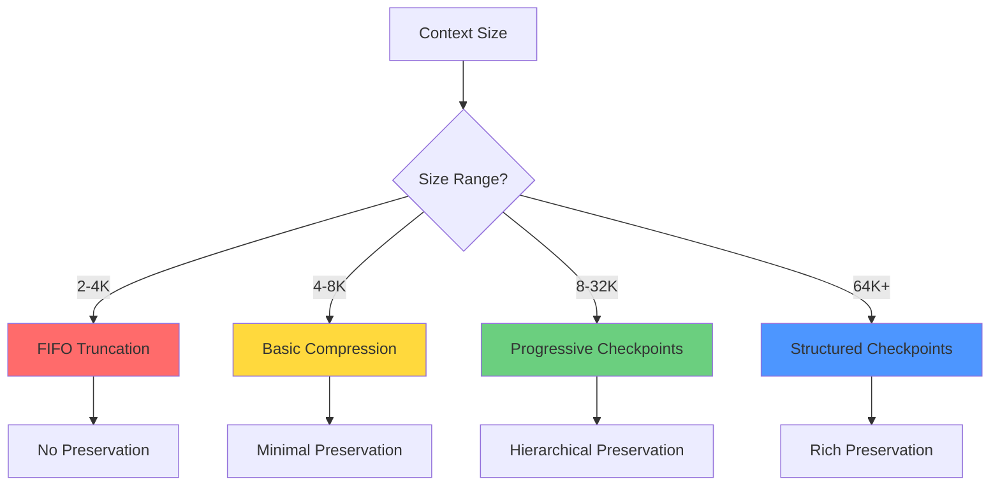

### 2. Mode-Specific Preservation

Each operational mode has unique preservation needs:

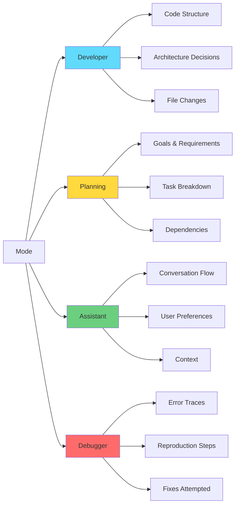

### 3. LLM Erosion Prevention

Monitor and prevent quality degradation:

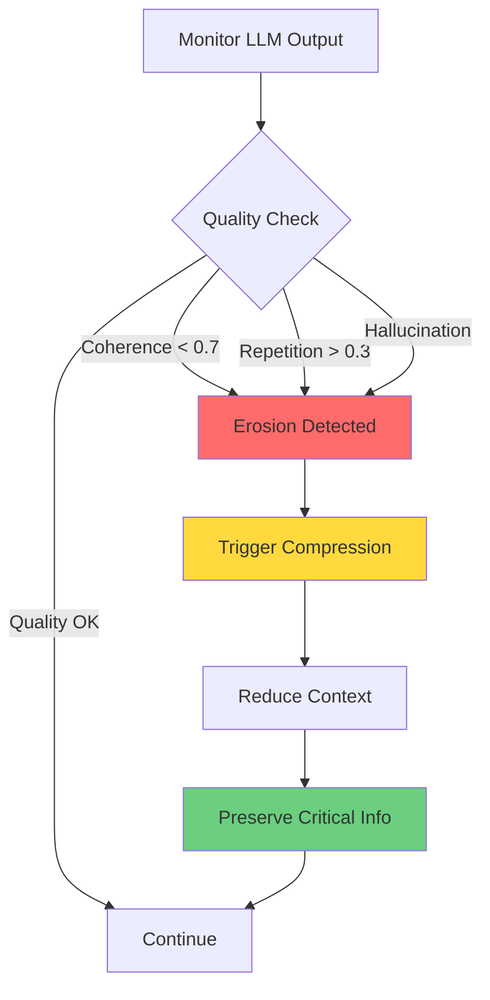

### 4. Adaptive System Prompts

System prompts scale with context capacity to maximize quality:

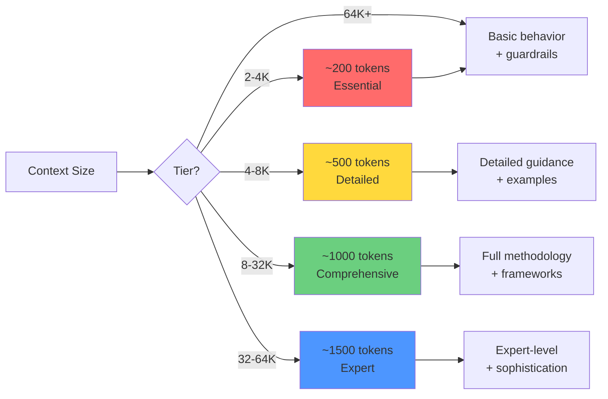

**Key Insight:** Larger contexts can afford more detailed prompts, leading to better output quality without sacrificing work space.


## Architecture Components

### System Overview

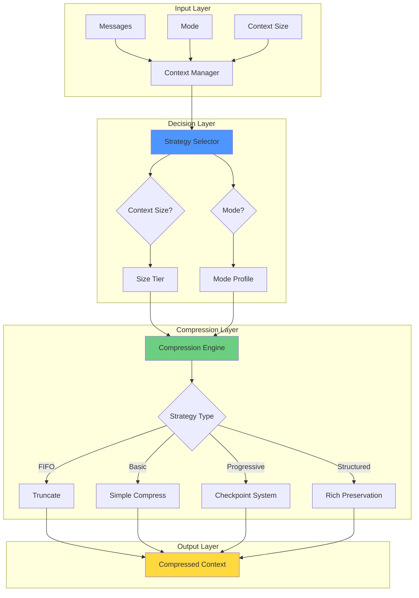

### Component Responsibilities

| Component               | Responsibility                    | Input                  | Output                    |
|-------------------------|-----------------------------------|------------------------|---------------------------|
| **Strategy Selector**   | Choose compression approach       | Context size, mode     | Strategy config           |
| **Mode Profile**        | Define preservation rules         | Mode type              | Preservation priorities   |
| **Compression Engine**  | Execute compression               | Messages, strategy     | Compressed context        |
| **Erosion Monitor**     | Detect quality issues             | LLM outputs            | Quality metrics           |
| **Checkpoint Manager**  | Manage checkpoint lifecycle       | Checkpoints, age       | Compressed checkpoints    |


## Context Size Tiers

### Tier Matrix

```mermaid
graph TD
    subgraph "Tier 1: Minimal (2-4K)"
        A1[Strategy: FIFO Truncation]
        A2[Checkpoints: 0]
        A3[Preservation: None]
        A4[Use Case: Quick Q&A]
        A5[System Prompt: 200 tokens]
    end
    
    subgraph "Tier 2: Basic (4-8K)"
        B1[Strategy: Basic Compression]
        B2[Checkpoints: 1 Compact]
        B3[Preservation: Critical Only]
        B4[Use Case: Short Tasks]
        B5[System Prompt: 500 tokens]
    end
    
    subgraph "Tier 3: Standard (8-32K) ⭐"
        C1[Strategy: Progressive Checkpoints]
        C2[Checkpoints: 5 Mixed]
        C3[Preservation: Hierarchical]
        C4[Use Case: Medium Tasks]
        C5[System Prompt: 1000 tokens]
    end
    
    subgraph "Tier 4: Premium (32-64K)"
        D1[Strategy: Structured Checkpoints]
        D2[Checkpoints: 10 Rich]
        D3[Preservation: Full]
        D4[Use Case: Complex Projects]
        D5[System Prompt: 1500 tokens]
    end
    
    subgraph "Tier 5: Ultra (64K+)"
        E1[Strategy: Pristine Checkpoints]
        E2[Checkpoints: 15 Rich]
        E3[Preservation: Everything]
        E4[Use Case: Enterprise]
        E5[System Prompt: 1500 tokens]
    end
    
    style A1 fill:#ff6b6b
    style B1 fill:#ffd93d
    style C1 fill:#6bcf7f
    style D1 fill:#4d96ff
    style E1 fill:#9b59b6
```

### Tier 1: Minimal Context (2-4K tokens)

**Reality Check:**
- Too small for sophisticated compression
- BUT still needs context continuity for multi-turn conversations
- Summaries would consume space needed for work
- Need lightweight rollover mechanism

**Strategy:**
```
[System Prompt: 200 tokens]        ← Adaptive (Tier 1)
[Session Summary: 300 tokens]      ← Lightweight rollover
[Recent Messages: 3,500 tokens]
────────────────────────────────
Total: 4,000 tokens

Approach: Snapshot-based rollover
Preservation: Ultra-compact session summary
Rollover: Create snapshot, start fresh with summary
```

**Rollover Mechanism:**
When context fills:
1. Create snapshot of full conversation
2. Generate ultra-compact summary (200-300 tokens)
3. Start new context with: System + Summary + Continue
4. User can restore from snapshot if needed

**When to Use:**
- Quick questions and answers
- Simple conversations
- Resource-constrained devices
- Small models (< 7B parameters)


### Tier 2: Basic Context (4-8K tokens)

**Reality Check:**
- LLM erosion starts appearing
- Room for basic checkpoint system
- Must be smart about compression
- Hallucinations increase beyond 6K
- **This is entry-level for serious work**

**Strategy:**
```
[System Prompt: 500 tokens]        ← Adaptive (Tier 2)
[Session Context: 500 tokens]      ← Rollover summary
[Critical Info: 800 tokens]        ← Never compressed
[Checkpoint 1: 700 tokens]         ← Single detailed checkpoint
[Recent Messages: 5,500 tokens]
────────────────────────────────────
Total: 8,000 tokens

Approach: Smart compression with single checkpoint
Preservation: Critical decisions + one checkpoint
Utilization Target: 80% (erosion prevention)
Rollover: Snapshot + compress to checkpoint
```

**Compression Strategy:**
- Maintain ONE detailed checkpoint of older work
- Aggressive compression of ancient history
- Preserve critical decisions separately
- Snapshot-based rollover when needed

**When to Use:**
- Short to medium tasks (< 50 exchanges)
- Single-file modifications
- Focused debugging sessions
- **Most 7-13B parameter models**
- **Entry-level local LLM work**

### Tier 3: Standard Context (8-32K tokens)

**Reality Check:**
- **SWEET SPOT for local LLM work**
- **Most common user hardware supports this**
- Reliable LLM performance
- Room for proper checkpoint hierarchy
- Can preserve architectural decisions
- **This is where 90% of local LLM usage happens**

**Strategy:**
```
[System Prompt: 1,000 tokens]      ← Adaptive (Tier 3)
[Task Definition: 400 tokens]      ← Never compressed
[Architecture: 1,200 tokens]       ← Never compressed (6 decisions)
[Checkpoint 1: 300 tokens]         ← Compact (ancient)
[Checkpoint 2: 600 tokens]         ← Moderate (old)
[Checkpoint 3: 1,200 tokens]       ← Detailed (recent)
[Recent Messages: 27,300 tokens]
────────────────────────────────────
Total: 32,000 tokens

Approach: Progressive checkpoints with proper hierarchy
Preservation: Full structured format
Utilization Target: 70% (optimal performance)
Rollover: Intelligent checkpoint compression
```

**Compression Strategy:**
- Maintain 3-level checkpoint hierarchy
- Preserve task definition and architecture decisions
- Smart compression based on age
- Mode-aware preservation
- Automatic checkpoint aging

**When to Use:**
- **PRIMARY TARGET: Most local LLM users**
- Medium to long tasks (50-200 exchanges)
- Multi-file projects
- Complex debugging
- **13-34B parameter models (Llama 2/3, Mixtral, etc.)**
- **Typical consumer hardware (16-32GB RAM)**


### Tier 4: Premium Context (32-64K tokens)

**Reality Check:**
- **PREMIUM TIER: High-end hardware**
- Excellent LLM performance
- Room for rich metadata and extensive history
- Can track everything with perfect fidelity
- Ideal for complex, long-running projects
- **Requires 32GB+ RAM or cloud/API access**

**Strategy:**
```
[System Prompt: 1,500 tokens]      ← Adaptive (Tier 4)
[Task Definition: 600 tokens]      ← Never compressed
[Architecture: 3,000 tokens]       ← Never compressed (15 decisions)
[API Contracts: 2,000 tokens]      ← Never compressed
[Code Standards: 1,000 tokens]     ← Never compressed
[Checkpoints 1-3: 900 tokens]      ← Compact (ancient, merged)
[Checkpoints 4-6: 3,000 tokens]    ← Moderate (old)
[Checkpoints 7-10: 6,500 tokens]   ← Detailed (recent)
[Recent Messages: 45,500 tokens]
────────────────────────────────────
Total: 64,000 tokens

Approach: Pristine structured checkpoints with intelligent management
Preservation: Everything + rich metadata + full history
Utilization Target: 70% (optimal performance)
Rollover: Sophisticated multi-level compression
```

**Compression Strategy:**
- Maintain 10-level checkpoint hierarchy
- Preserve ALL architectural decisions
- Rich metadata tracking (tests, files, dependencies)
- Intelligent semantic compression
- Mode-specific extraction rules
- Predictive compression
- Erosion detection and prevention

**Advanced Features:**
- **Semantic Checkpoint Merging**: Group related work
- **Intelligent Extraction**: Auto-detect decisions, patterns
- **Quality Monitoring**: Detect and prevent LLM erosion
- **Multi-Mode Support**: Seamless mode transitions
- **Full Audit Trail**: Complete history preservation

**When to Use:**
- **High-end local setups (64GB+ RAM)**
- **Cloud/API deployments**
- Long-running projects (200+ exchanges)
- Full application development
- Complex refactoring across many files
- **70B+ parameter models (Llama 3 70B, etc.)**
- **Professional/enterprise use cases**

### Tier 5: Ultra Context (64K+ tokens)

**Reality Check:**
- **ULTRA TIER: Cloud/API or extreme hardware**
- Exceptional LLM performance
- Massive room for complete history
- Perfect fidelity across entire project
- Ideal for enterprise-scale projects
- **Requires cloud/API access or 128GB+ RAM**

**Strategy:**
```
[System Prompt: 1,500 tokens]      ← Adaptive (Tier 5)
[Task Definition: 600 tokens]      ← Never compressed
[Architecture: 3,000 tokens]       ← Never compressed (15 decisions)
[API Contracts: 2,000 tokens]      ← Never compressed
[Code Standards: 1,000 tokens]     ← Never compressed
[Checkpoints 1-5: 1,500 tokens]    ← Compact (ancient, merged)
[Checkpoints 6-10: 4,500 tokens]   ← Moderate (old)
[Checkpoints 11-15: 9,000 tokens]  ← Detailed (recent)
[Recent Messages: 105,400 tokens]
────────────────────────────────────
Total: 128,000 tokens

Approach: Pristine structured checkpoints with maximum intelligence
Preservation: Everything + rich metadata + complete audit trail
Utilization Target: 65% (maximum performance)
Rollover: Sophisticated multi-level compression with semantic merging
```

### Tier Comparison

| Aspect                | Tier 1 (2-4K)  | Tier 2 (4-8K)   | Tier 3 (8-32K) ⭐ | Tier 4 (32-64K) | Tier 5 (64K+)   |
|-----------------------|----------------|-----------------|-------------------|-----------------|-----------------|
| **Target Users**      | Casual         | Entry-level     | **90% of users**  | Premium/Pro     | Enterprise      |
| **Hardware**          | Low-end        | Mid-range       | **Consumer**      | High-end        | Cloud/Extreme   |
| **Compression**       | Rollover       | Smart           | **Progressive**   | Structured      | Ultra           |
| **Checkpoints**       | 0              | 1               | **5**             | 10              | 15              |
| **Preservation**      | 5%             | 10%             | **15%**           | 25%             | 30%             |
| **Erosion Risk**      | High           | Medium          | **Low**           | Very Low        | Minimal         |
| **Task Length**       | < 20 msgs      | < 50 msgs       | **< 200 msgs**    | < 500 msgs      | Unlimited       |
| **Complexity**        | Simple         | Basic           | **Full**          | Advanced        | Enterprise      |
| **Never-Compressed**  | None           | Critical        | **Task+Arch**     | Everything      | Everything+     |
| **System Prompt**     | 200 tokens     | 500 tokens      | **1000 tokens**   | 1500 tokens     | 1500 tokens     |

⭐ = Primary target for development effort


## Mode-Specific Profiles

### Profile Architecture

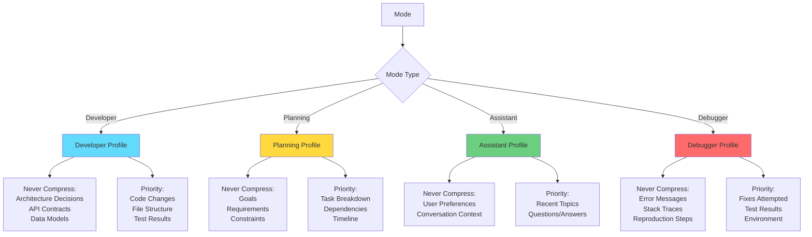


### Developer Mode Profile

**Focus:** Code quality, architecture, and implementation details

**Never Compress:**
- Architecture decisions and rationale
- API contracts and interfaces
- Data models and schemas
- Critical design patterns

**Compression Priority** (compress in this order):
1. General discussion (compress first)
2. Exploratory code (compress second)
3. Dependencies and setup (compress third)
4. Test results (compress fourth)
5. File structure changes (compress last)
6. Code changes (NEVER compress recent)

**Extraction Rules:**
```typescript
{
  architecture_decision: /(?:decided|chose|using|implementing)\s+(\w+)\s+(?:because|for|to)/i,
  file_change: /(?:created|modified|updated|changed)\s+([^\s]+\.\w+)/i,
  api_definition: /(?:interface|class|function|endpoint)\s+(\w+)/i,
  test_result: /(?:test|spec).*(?:passed|failed|error)/i
}
```

**Token Allocation** (32K context):
- Never-compressed: 2,500 tokens (8%)
- Checkpoints: 2,100 tokens (7%)
- Recent work: 27,400 tokens (85%)


### Planning Mode Profile

**Focus:** Goals, requirements, and task organization

**Never Compress:**
- Project goals and objectives
- Requirements and constraints
- Milestones and deadlines
- Success criteria

**Compression Priority** (compress in this order):
1. General brainstorming (compress first)
2. Rejected ideas (compress second)
3. Resources and tools (compress third)
4. Timeline details (compress fourth)
5. Dependencies (compress fifth)
6. Task breakdown (compress last)
7. Requirements (NEVER compress)

**Extraction Rules:**
```typescript
{
  requirement: /(?:must|should|need to|required to)\s+(.+?)(?:\.|$)/i,
  task: /(?:task|step|action):\s*(.+?)(?:\.|$)/i,
  milestone: /(?:milestone|deadline|due):\s*(.+?)(?:\.|$)/i,
  constraint: /(?:constraint|limitation|cannot):\s*(.+?)(?:\.|$)/i
}
```

**Token Allocation** (32K context):
- Never-compressed: 1,600 tokens (5%)
- Checkpoints: 2,400 tokens (7.5%)
- Recent planning: 28,000 tokens (87.5%)

### Assistant Mode Profile

**Focus:** Conversation flow and user preferences

**Never Compress:**
- User preferences and settings
- Conversation context and history
- Important user statements

**Compression Priority** (compress in this order):
1. Small talk (compress first)
2. Clarifications (compress second)
3. Examples (compress third)
4. Explanations (compress fourth)
5. User questions (compress last)
6. User preferences (NEVER compress)

**Extraction Rules:**
```typescript
{
  preference: /(?:prefer|like|want|need)\s+(.+?)(?:\.|$)/i,
  important: /(?:important|critical|must remember)\s+(.+?)(?:\.|$)/i,
  context: /(?:working on|dealing with|trying to)\s+(.+?)(?:\.|$)/i
}
```

**Token Allocation** (32K context):
- Never-compressed: 1,000 tokens (3%)
- Checkpoints: 1,500 tokens (5%)
- Recent conversation: 29,500 tokens (92%)


### Debugger Mode Profile

**Focus:** Error diagnosis and resolution

**Never Compress:**
- Error messages and stack traces
- Reproduction steps
- Environment information
- Critical state at failure

**Compression Priority** (compress in this order):
1. General discussion (compress first)
2. Successful tests (compress second)
3. Environment details (compress third)
4. Test results (compress fourth)
5. Fixes attempted (compress last)
6. Error traces (NEVER compress)

**Extraction Rules:**
```typescript
{
  error: /(?:error|exception|failed):\s*(.+?)(?:\n|$)/i,
  fix_attempt: /(?:tried|attempted|fixed)\s+(.+?)(?:\.|$)/i,
  reproduction: /(?:reproduce|replicate|steps):\s*(.+?)(?:\.|$)/i,
  environment: /(?:version|platform|os):\s*(.+?)(?:\.|$)/i
}
```

**Token Allocation** (32K context):
- Never-compressed: 2,000 tokens (6%)
- Checkpoints: 2,500 tokens (8%)
- Recent debugging: 27,500 tokens (86%)

### Mode Comparison Matrix

| Aspect                | Developer      | Planning       | Assistant      | Debugger       |
|-----------------------|----------------|----------------|----------------|----------------|
| **Never-Compress %**  | 8%             | 5%             | 3%             | 6%             |
| **Checkpoint %**      | 7%             | 7.5%           | 5%             | 8%             |
| **Recent %**          | 85%            | 87.5%          | 92%            | 86%            |
| **Focus**             | Code           | Tasks          | Conversation   | Errors         |
| **Extraction**        | High           | Medium         | Low            | High           |
| **Complexity**        | High           | Medium         | Low            | High           |


## Adaptive System Prompts

### Overview

System prompts are a critical component of the context management system. They consume tokens but directly impact output quality. The adaptive system prompt feature scales prompt complexity with context capacity, ensuring optimal quality without wasting space.

**Key Principle:** Larger contexts can afford more detailed prompts, leading to significantly better output quality.

### Hardware-Aware Prompt Selection ⭐ NEW

**Problem:** When auto-context sizing is enabled, the context window can dynamically adjust based on available VRAM. If we change the system prompt every time the context size changes, it can confuse the LLM mid-conversation.

**Solution:** Lock the prompt tier to hardware capability at startup when auto-sizing is enabled.

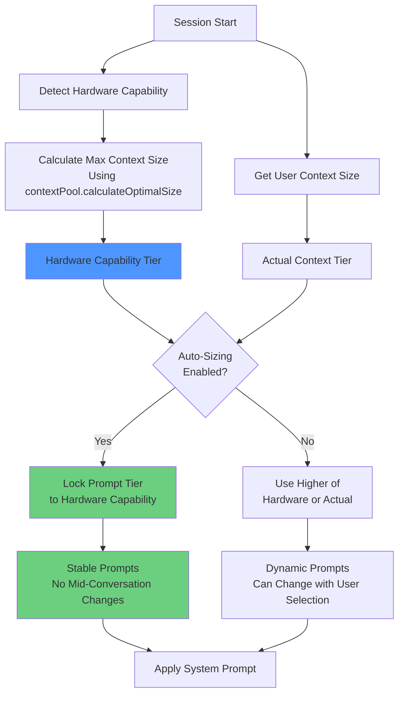

**How It Works:**

1. **Hardware Capability Detection:**
   - Uses existing `contextPool.calculateOptimalSize()` method
   - Accounts for model size already loaded in VRAM
   - Considers KV cache quantization
   - Applies safety buffer
   - Returns maximum context size hardware can support

2. **Actual Context Tier:**
   - Based on user's selected context size
   - Can be smaller than hardware capability
   - Changes when user switches models or adjusts settings

3. **Effective Prompt Tier:**
   - **With auto-sizing:** Locked to hardware capability tier at startup
   - **Without auto-sizing:** Uses higher of hardware or actual tier
   - Prevents mid-conversation prompt changes when context auto-adjusts

**Example Scenario:**

```
Hardware: 24GB VRAM, 13B model
├─ Hardware Capability: Can support up to 32K context
├─ Hardware Capability Tier: Tier 3 (8-32K)
└─ Effective Prompt Tier: Tier 3 (locked)

User Selection: 16K context
├─ Actual Context Tier: Tier 3 (8-32K)
└─ Context Window: 16K tokens

During Conversation:
├─ Auto-sizing adjusts context: 16K → 20K → 18K
├─ Actual Context Tier: Stays Tier 3
├─ Effective Prompt Tier: Stays Tier 3 (locked)
└─ System Prompt: Never changes (stable!)
```

**Benefits:**
- ✅ Prevents mid-conversation prompt changes
- ✅ LLM maintains consistent behavior
- ✅ No confusion from changing instructions
- ✅ Optimal prompt quality for hardware
- ✅ Automatic and transparent

**Implementation:**
```typescript
// In contextManager.ts
private hardwareCapabilityTier: ContextTier;
private actualContextTier: ContextTier;

private async detectHardwareCapabilityTier(): Promise<ContextTier> {
  const vramInfo = await this.vramMonitor.getInfo();
  const maxPossibleContext = this.contextPool.calculateOptimalSize(
    vramInfo,
    this.modelInfo
  );
  // Map to tier based on max possible context
  return this.mapContextSizeToTier(maxPossibleContext);
}

private getEffectivePromptTier(): ContextTier {
  if (this.config.autoSize) {
    // Lock to hardware capability when auto-sizing
    return this.hardwareCapabilityTier;
  }
  // Use higher tier when manual sizing
  return this.getHigherTier(
    this.hardwareCapabilityTier,
    this.actualContextTier
  );
}
```

### Token Budget Strategy

```mermaid
graph TB
    subgraph "Tier 1: 2-4K"
        T1[~200 tokens<br/>5.0% of context]
        T2[Essential behavior<br/>Basic guardrails<br/>1-2 examples]
    end
    
    subgraph "Tier 2: 4-8K"
        T3[~500 tokens<br/>6.3% of context]
        T4[Detailed guidance<br/>Full guardrails<br/>3-5 examples]
    end
    
    subgraph "Tier 3: 8-32K ⭐"
        T5[~1000 tokens<br/>3.1% of context]
        T6[Comprehensive<br/>Frameworks<br/>5-8 examples]
    end
    
    subgraph "Tier 4: 32-64K"
        T7[~1500 tokens<br/>2.3% of context]
        T8[Expert-level<br/>Sophistication<br/>10+ examples]
    end
    
    subgraph "Tier 5: 64K+"
        T9[~1500 tokens<br/>1.2% of context]
        T10[Maximum sophistication<br/>Advanced patterns<br/>Extensive examples]
    end
    end
    
    subgraph "Tier 4: 32K+"
        D1[~1500 tokens<br/>1.2% of context]
        D2[Expert-level<br/>Sophisticated<br/>10+ examples]
    end
    
    style A1 fill:#ff6b6b
    style B1 fill:#ffd93d
    style C1 fill:#6bcf7f
    style D1 fill:#4d96ff
```

### Prompt Components by Tier

| Component           | Tier 1         | Tier 2              | Tier 3 ⭐            | Tier 4/5            |
|---------------------|----------------|---------------------|----------------------|---------------------|
| **Core Behavior**   | ✅ Basic       | ✅ Detailed         | ✅ Comprehensive     | ✅ Expert           |
| **Guardrails**      | ✅ 5-7 rules   | ✅ 10+ rules        | ✅ Full + explain    | ✅ Extensive        |
| **Examples**        | ✅ 1-2 simple  | ✅ 3-5 with code    | ✅ 5-8 detailed      | ✅ 10+ scenarios    |
| **Frameworks**      | ❌ None        | ⚠️ Basic            | ✅ Complete          | ✅ Advanced         |
| **Trade-offs**      | ❌ None        | ⚠️ Mentioned        | ✅ Analyzed          | ✅ Deep analysis    |
| **Reasoning**       | ⚠️ Minimal     | ✅ Included         | ✅ Detailed          | ✅ Sophisticated    |

### Mode-Specific Prompts

Each operational mode has tailored prompts at each tier:

**Developer Mode Focus:**
- Code quality and architecture
- SOLID principles and patterns
- Error handling and testing
- Type safety and documentation

**Planning Mode Focus:**
- Task breakdown methodology
- Dependency identification
- Risk assessment and estimation
- Clear success criteria

**Assistant Mode Focus:**
- Clear communication
- User preferences and context
- Helpful explanations
- Question clarification

**Debugger Mode Focus:**
- Systematic debugging process
- Root cause analysis
- Reproduction steps
- Fix documentation

### Automatic Adaptation

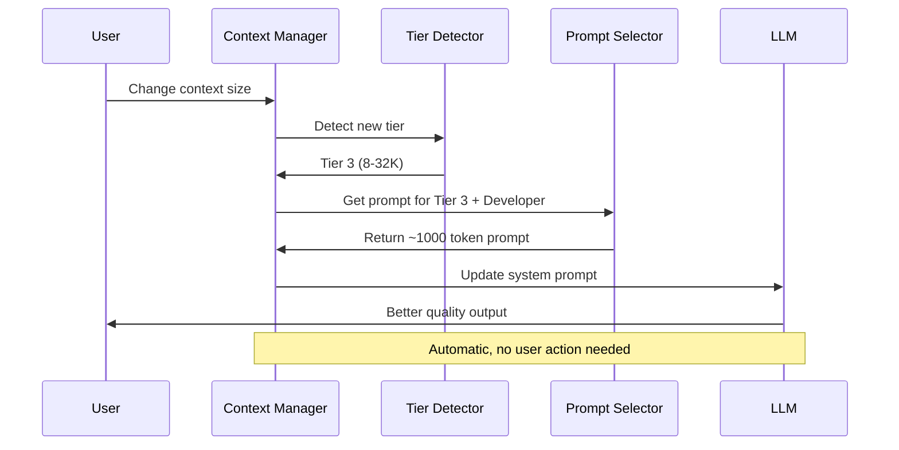

**Triggers:**
1. Context size changes (model switch)
2. Mode changes (user switches mode)
3. Manual update request

### Token Efficiency Analysis

**Tier 1 (8K context):**
```
System Prompt:    200 tokens (2.5%)
Work Space:     7,800 tokens (97.5%)
────────────────────────────────
Total:          8,000 tokens
```
✅ Minimal overhead, maximum work space

**Tier 3 (32K context) ⭐:**
```
System Prompt:  1,000 tokens (3.1%)
Work Space:    31,000 tokens (96.9%)
────────────────────────────────
Total:         32,000 tokens
```
✅ Excellent balance of guidance and work space

**Tier 4 (128K context):**
```
System Prompt:   1,500 tokens (1.2%)
Work Space:    126,500 tokens (98.8%)
────────────────────────────────
Total:         128,000 tokens
```
✅ Negligible overhead, comprehensive guidance

### Quality Impact

**Expected Improvements by Tier:**

| Quality Metric      | Tier 1         | Tier 2         | Tier 3 ⭐       | Tier 4/5        |
|---------------------|----------------|----------------|-----------------|-----------------|
| **Error Handling**  | Basic          | Good           | Comprehensive   | Enterprise      |
| **Type Safety**     | Minimal        | Good           | Strict          | Advanced        |
| **Code Structure**  | Simple         | Clear          | Well-structured | Architected     |
| **Edge Cases**      | Few            | Some           | Most            | All             |
| **Tests**           | ❌ Rare        | ⚠️ Sometimes   | ✅ Included     | ✅ Comprehensive|
| **Documentation**   | ❌ Minimal     | ⚠️ Basic       | ✅ Good         | ✅ Excellent    |
| **Architecture**    | ❌ None        | ⚠️ Basic       | ✅ Thoughtful   | ✅ Expert       |

### Example Prompt Comparison

**Tier 1 (~200 tokens) - Developer Mode:**
```
You are a coding assistant focused on practical solutions.

Core Behavior:
- Write clean, working code
- Use TypeScript with types
- Add brief comments for complex logic
- Handle errors appropriately

Guardrails:
- Don't over-engineer simple solutions
- Don't skip error handling
- Don't ignore edge cases

Example:
✓ DO: Write simple, clear functions with error handling
✗ DON'T: Create complex abstractions for simple tasks
```

**Tier 3 (~1000 tokens) - Developer Mode:**
```
You are an expert software developer and architect.

Core Responsibilities:
- Write production-quality code with proper error handling
- Design scalable architectures with clear separation of concerns
- Follow SOLID principles and appropriate design patterns
- Document architectural decisions with clear rationale
- Consider performance, security, accessibility, maintainability

Code Quality Standards:
- Use TypeScript with strict mode and comprehensive types
- Write self-documenting code with meaningful names
- Keep functions focused (single responsibility)
- Add JSDoc comments for public APIs
- Implement proper error handling with specific error types
- Write tests at appropriate levels
- Optimize for readability first

Behavioral Guidelines:
- Explain your reasoning and approach
- Point out potential issues or risks
- Ask clarifying questions when ambiguous
- Acknowledge trade-offs honestly

Guardrails - What NOT to Do:
✗ Don't use 'any' types without justification
✗ Don't skip error handling or validation
✗ Don't create deeply nested code (max 3 levels)
✗ Don't write functions longer than 50 lines
✗ Don't ignore TypeScript errors
✗ Don't over-engineer simple solutions
✗ Don't skip tests for critical logic

Examples - Do This, Not That:
[... 5-8 detailed code examples ...]

When Making Decisions:
1. Understand full context and requirements
2. Consider 2-3 different approaches
3. Evaluate trade-offs
4. Choose simplest solution that meets requirements
5. Document why you chose this approach
6. Implement with proper error handling
7. Consider how this fits the larger system
```

**Impact:** Tier 3 produces significantly better code with proper error handling, tests, and documentation.

### Integration with Context Management

**System Prompt is Part of Context Budget:**

```
Total Context: 32,000 tokens

Breakdown:
├─ System Prompt:     1,000 tokens (3.1%)  ← Adaptive
├─ Task Definition:     400 tokens (1.2%)  ← Never-compressed
├─ Architecture:      1,200 tokens (3.8%)  ← Never-compressed
├─ Checkpoints:       2,100 tokens (6.6%)  ← Compressed
└─ Work Space:       27,300 tokens (85.3%) ← Active work
```

**Coordination:**
- Prompt size is considered in tier detection
- Prompt updates trigger context recalculation
- Mode changes update both prompt and preservation rules
- Tier changes update both prompt and compression strategy

### Implementation Notes

**Prompt Storage:**
```
packages/core/src/context/prompts/
├── tier1/
│   ├── developer.txt  (~200 tokens)
│   ├── planning.txt   (~200 tokens)
│   ├── assistant.txt  (~200 tokens)
│   └── debugger.txt   (~200 tokens)
├── tier2/
│   └── ... (~500 tokens each)
├── tier3/
│   └── ... (~1000 tokens each)
└── tier4/
    └── ... (~1500 tokens each)
```

**Selection Logic:**
```typescript
function getSystemPrompt(tier: ContextTier, mode: OperationalMode): string {
  const key = `tier${tier.split('-')[0]}-${mode}`;
  return SYSTEM_PROMPT_TEMPLATES[key].template;
}
```

**Automatic Updates:**
```typescript
// On tier change
private onTierChange(newTier: ContextTier): void {
  this.currentTier = newTier;
  this.updateSystemPrompt();
  this.emit('tier-changed', { tier: newTier });
}

// On mode change
public setMode(mode: OperationalMode): void {
  this.currentMode = mode;
  this.updateSystemPrompt();
  this.emit('mode-changed', { mode });
}
```

### Benefits

1. **Quality Scaling** ✅
   - Small contexts: Basic but functional
   - Large contexts: Professional-grade output

2. **Token Efficiency** ✅
   - Overhead stays under 4% for all tiers
   - More tokens = better guidance without waste

3. **Automatic Adaptation** ✅
   - No manual configuration needed
   - Seamless tier/mode transitions

4. **Mode-Specific** ✅
   - Developer gets code-focused guidance
   - Planning gets task-focused guidance
   - Each mode optimized for its purpose

5. **Consistent Quality** ✅
   - Clear guardrails prevent mistakes
   - Examples demonstrate best practices
   - Frameworks guide decision-making

**See Also:** [ADAPTIVE-SYSTEM-PROMPTS.md](./ADAPTIVE-SYSTEM-PROMPTS.md) for complete prompt examples and detailed breakdown.


## Compression Strategies

### Strategy Selection Flow

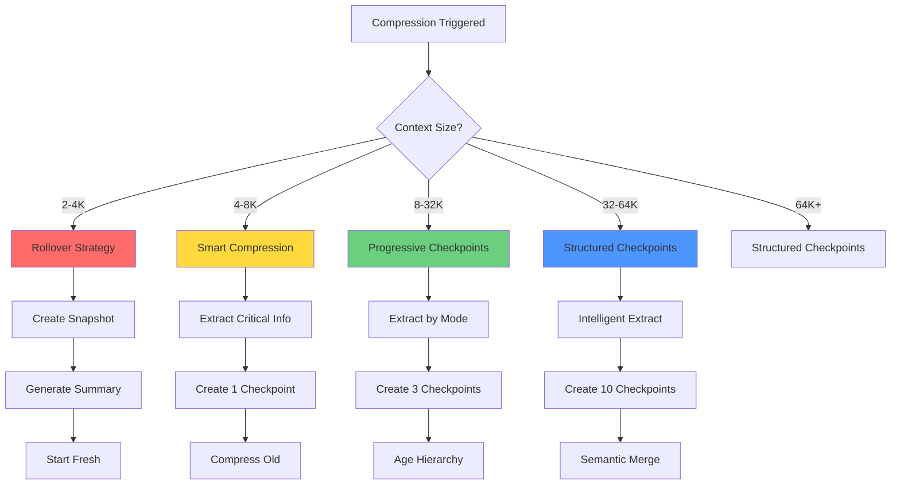


### Rollover Strategy (2-4K)

**When:** Context reaches 90% capacity  
**Goal:** Maintain conversation continuity with minimal overhead

**Process:**
1. **Snapshot Creation**
   - Save full conversation to disk
   - Generate snapshot ID
   - Store metadata (timestamp, token count, mode)

2. **Summary Generation**
   - Ultra-compact summary (200-300 tokens)
   - Key points only
   - No detailed preservation

3. **Context Reset**
   - Clear all messages
   - Keep system prompt
   - Add summary as system message
   - Continue conversation

**Example:**
```
Before Rollover (4K tokens):
[System: 500]
[Messages 1-50: 3,500]

After Rollover (800 tokens):
[System: 500]
[Summary: 300]
[Continue...]

Snapshot saved: snapshot-abc123.json
```

### Smart Compression (4-8K)

**When:** Context reaches 75% capacity  
**Goal:** Preserve critical information with one checkpoint

**Process:**
1. **Critical Extraction**
   - Extract by mode profile
   - Identify never-compress items
   - Mark for preservation

2. **Checkpoint Creation**
   - Create ONE detailed checkpoint
   - Summarize messages 1-N
   - Preserve recent M messages

3. **Compression**
   - Compress ancient history aggressively
   - Keep checkpoint + recent
   - Maintain critical info separately

**Example:**
```
Before Compression (16K tokens):
[System: 1,000]
[Messages 1-100: 15,000]

After Compression (12K tokens):
[System: 1,000]
[Critical: 800]
[Checkpoint: 700]
[Recent 80-100: 9,500]
```


### Progressive Checkpoints (8-32K) ⭐

**When:** Context reaches 70% capacity  
**Goal:** Full structured preservation with hierarchy

**Process:**
1. **Mode-Aware Extraction**
   - Extract by mode profile rules
   - Identify never-compress sections
   - Categorize by importance

2. **Checkpoint Hierarchy**
   - Create 3-level checkpoint system
   - Compact (ancient): 300 tokens
   - Moderate (old): 600 tokens
   - Detailed (recent): 1,200 tokens

3. **Intelligent Compression**
   - Age-based compression
   - Preserve task definition
   - Preserve architecture decisions
   - Maintain checkpoint hierarchy

4. **Reconstruction**
   - System prompt
   - Never-compressed sections
   - All checkpoints (hierarchical)
   - Recent messages

**Example:**
```
Before Compression (32K tokens):
[System: 1,000]
[Messages 1-200: 31,000]

After Compression (22K tokens):
[System: 1,000]
[Task Definition: 400]
[Architecture: 1,200]
[Checkpoint 1 (Compact): 300]
[Checkpoint 2 (Moderate): 600]
[Checkpoint 3 (Detailed): 1,200]
[Recent 180-200: 17,300]
```

**This is the PRIMARY TARGET for development!**


### Structured Checkpoints (32K+)

**When:** Context reaches 70% capacity  
**Goal:** Pristine preservation with full intelligence

**Process:**
1. **Intelligent Extraction**
   - Semantic analysis of messages
   - Auto-detect patterns and decisions
   - Extract rich metadata
   - Mode-specific rules

2. **Rich Checkpoint System**
   - Create 10-level hierarchy
   - Compact (ancient, merged): 900 tokens
   - Moderate (old): 3,000 tokens
   - Detailed (recent): 6,500 tokens

3. **Advanced Features**
   - Semantic checkpoint merging
   - Quality monitoring
   - Erosion detection
   - Predictive compression

4. **Full Preservation**
   - Task definition
   - All architecture decisions
   - API contracts
   - Code standards
   - Complete audit trail

**Example:**
```
Before Compression (128K tokens):
[System: 1,000]
[Messages 1-800: 127,000]

After Compression (90K tokens):
[System: 1,000]
[Task: 600]
[Architecture: 3,000]
[API Contracts: 2,000]
[Standards: 1,000]
[Checkpoints 1-3 (Compact): 900]
[Checkpoints 4-6 (Moderate): 3,000]
[Checkpoints 7-10 (Detailed): 6,500]
[Recent 750-800: 72,000]
```

## Implementation Details

### 85% Context Cap Strategy ⭐ NEW

**Status:** ✅ Implemented (v2.1)

**Problem:** When users select a context size (e.g., 4K), sending the full 4096 tokens to Ollama can cause:
- Context overflow errors
- Unpredictable compression triggers
- Poor user experience with sudden stops

**Solution:** Send 85% of selected context to Ollama via `num_ctx` parameter:
- User selects **4K** → App sends **3482 tokens** (85%) to Ollama
- User sees **"4096 tokens"** in UI (transparent)
- Ollama stops naturally at ~3482 with `done_reason: 'length'`
- App detects natural stop and triggers compression
- 15% buffer (614 tokens) gives Ollama room to complete thoughts

**Implementation:**
```typescript
// Pre-calculated values in LLM_profiles.json
{
  "size": 4096,
  "size_label": "4k",
  "ollama_context_size": 3482  // 85% pre-calculated
}

// Sent to Ollama in options
{
  "num_ctx": 3482,  // 85% cap
  "temperature": 0.7
}
```

**Benefits:**
- ✅ Transparent UX - User sees full context size
- ✅ Natural stops - Ollama stops cleanly without overflow
- ✅ Predictable compression - Always triggers at same point
- ✅ Buffer for response - 15% gives room to complete thoughts
- ✅ No runtime math - Pre-calculated values in JSON

**Values:**
- 4K → 3482 tokens (85%)
- 8K → 6963 tokens (85%)
- 16K → 13926 tokens (85%)
- 32K → 27853 tokens (85%)
- 64K → 55706 tokens (85%)
- 128K → 111411 tokens (85%)

**See Also:** [85% Cap Implementation Guide](./85-PERCENT-CAP-IMPLEMENTATION.md)

---

### Phase 1: Foundation (Current)

**Status:** ✅ Implemented

- Basic checkpoint system
- Hierarchical compression (3 levels)
- Additive checkpoint history
- Checkpoint aging and merging
- 85% context cap strategy

**Limitations:**
- No mode awareness
- No context size adaptation
- No never-compressed sections
- No rollover mechanism


### Phase 2: Adaptive System (Next)

**Priority:** HIGH  
**Target:** Tier 3 (8-32K) - 90% of users

**Components to Add:**

1. **Context Size Detection**
   ```typescript
   interface ContextTier {
     name: string;
     minSize: number;
     maxSize: number;
     strategy: CompressionStrategy;
   }
   
   function detectTier(contextSize: number): ContextTier
   ```

2. **Mode Profile System**
   ```typescript
   interface ModeProfile {
     mode: string;
     neverCompress: string[];
     priorityOrder: string[];
     extractionRules: ExtractionRule[];
   }
   
   function getModeProfile(mode: string): ModeProfile
   ```

3. **Rollover Mechanism** (Tier 1)
   ```typescript
   async function rolloverContext(
     context: ConversationContext
   ): Promise<RolloverResult>
   ```

4. **Smart Compression** (Tier 2)
   ```typescript
   async function smartCompress(
     context: ConversationContext,
     profile: ModeProfile
   ): Promise<CompressedContext>
   ```

5. **Never-Compressed Sections**
   ```typescript
   interface NeverCompressed {
     taskDefinition?: TaskDefinition;
     architectureDecisions?: ArchitectureDecision[];
     apiContracts?: APIContract[];
   }
   ```

**Effort:** 15-20 hours  
**Impact:** Covers 90% of use cases


### Phase 3: Intelligence Layer (Future)

**Priority:** MEDIUM  
**Target:** Tier 4 (32K+) - Premium users

**Components to Add:**

1. **Semantic Extraction**
   - LLM-based decision detection
   - Pattern recognition
   - Automatic categorization

2. **Quality Monitoring**
   - Erosion detection
   - Coherence scoring
   - Hallucination detection

3. **Predictive Compression**
   - Compress before hitting limits
   - Smart threshold adjustment
   - Usage pattern learning

4. **Rich Metadata**
   - Test results tracking
   - Dependency graphs
   - File change history

**Effort:** 25-30 hours  
**Impact:** Premium experience for high-end users

## Token Budget Examples

### Example 1: Small Context (4K) - Assistant Mode

```
Context: 4,000 tokens
Mode: Assistant
Tier: 1 (Rollover)

Structure:
├─ System Prompt: 500 tokens (12.5%)
├─ Session Summary: 300 tokens (7.5%)
└─ Recent Messages: 3,200 tokens (80%)

Rollover Trigger: 90% (3,600 tokens)
Rollover Result: 800 tokens → Continue
```

### Example 2: Medium Context (16K) - Developer Mode

```
Context: 16,000 tokens
Mode: Developer
Tier: 2 (Smart Compression)

Structure:
├─ System Prompt: 1,000 tokens (6%)
├─ Session Context: 500 tokens (3%)
├─ Critical Info: 800 tokens (5%)
│  ├─ Architecture decisions
│  └─ API contracts
├─ Checkpoint 1: 700 tokens (4%)
└─ Recent Messages: 13,000 tokens (82%)

Compression Trigger: 75% (12,000 tokens)
Compression Result: 16K → 12K tokens
```


### Example 3: Standard Context (32K) - Developer Mode ⭐

```
Context: 32,000 tokens
Mode: Developer
Tier: 3 (Progressive Checkpoints)

Structure:
├─ System Prompt: 1,000 tokens (3%)
├─ Task Definition: 400 tokens (1%)
│  ├─ Goal
│  ├─ Requirements
│  └─ Constraints
├─ Architecture Decisions: 1,200 tokens (4%)
│  ├─ Decision 1: Use React + TypeScript
│  ├─ Decision 2: REST API design
│  ├─ Decision 3: Database schema
│  ├─ Decision 4: Authentication flow
│  ├─ Decision 5: Error handling
│  └─ Decision 6: Testing strategy
├─ Checkpoints: 2,100 tokens (7%)
│  ├─ Checkpoint 1 (Compact): 300 tokens
│  │  └─ Messages 1-50: Initial setup
│  ├─ Checkpoint 2 (Moderate): 600 tokens
│  │  └─ Messages 51-120: Core features
│  └─ Checkpoint 3 (Detailed): 1,200 tokens
│      └─ Messages 121-180: Recent work
└─ Recent Messages: 27,300 tokens (85%)
    └─ Messages 181-200: Active development

Compression Trigger: 70% (22,400 tokens)
Compression Result: 32K → 22K tokens
Never Lost: Task definition + 6 architecture decisions
```

**This is the PRIMARY TARGET!**

### Example 4: Premium Context (128K) - Developer Mode

```
Context: 128,000 tokens
Mode: Developer
Tier: 4 (Structured Checkpoints)

Structure:
├─ System Prompt: 1,000 tokens (0.8%)
├─ Never-Compressed: 7,600 tokens (6%)
│  ├─ Task Definition: 600 tokens
│  ├─ Architecture Decisions: 3,000 tokens (15 decisions)
│  ├─ API Contracts: 2,000 tokens
│  └─ Code Standards: 1,000 tokens
├─ Checkpoints: 10,400 tokens (8%)
│  ├─ Checkpoints 1-3 (Compact): 900 tokens
│  │  └─ Messages 1-200: Ancient history (merged)
│  ├─ Checkpoints 4-6 (Moderate): 3,000 tokens
│  │  └─ Messages 201-500: Old work
│  └─ Checkpoints 7-10 (Detailed): 6,500 tokens
│      └─ Messages 501-750: Recent work
└─ Recent Messages: 109,000 tokens (85%)
    └─ Messages 751-800: Active development

Compression Trigger: 70% (89,600 tokens)
Compression Result: 128K → 90K tokens
Never Lost: Everything important + full audit trail
```


## Implementation Roadmap

### Phase 1: Foundation ✅ Complete

**Status:** Implemented and tested

**Features:**
- Basic checkpoint system with hierarchical compression
- 3-level checkpoint hierarchy (Compact, Moderate, Detailed)
- Additive checkpoint history (never loses information)
- Automatic checkpoint aging and merging
- 93 passing tests covering all scenarios

**Current Capabilities:**


**What Works:**
- ✅ Prevents information loss through additive checkpoints
- ✅ Hierarchical compression maintains conversation history
- ✅ Automatic aging compresses old checkpoints
- ✅ Checkpoint merging prevents unlimited growth
- ✅ Stable and well-tested

**Limitations:**
- ⚠️ Same strategy for all context sizes (not optimal)
- ⚠️ No mode-specific preservation rules
- ⚠️ No rollover mechanism for small contexts
- ⚠️ No never-compressed sections
- ⚠️ System prompts don't scale with context

---

### Phase 2: Adaptive System 🚧 Next Priority

**Target:** Tier 3 (8-32K) - 90% of users  
**Effort:** 15-20 hours  
**Impact:** Optimal experience for most users

**Goals:**
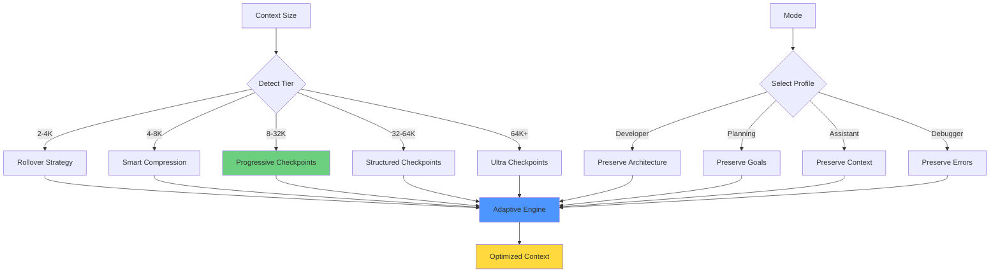


**Components to Implement:**

1. **Context Tier Detection** (2 hours)
   ```typescript
   function detectContextTier(contextSize: number): ContextTier {
     if (contextSize <= 4096) return TIER_1_MINIMAL;
     if (contextSize <= 8192) return TIER_2_BASIC;
     if (contextSize <= 32768) return TIER_3_STANDARD;
     if (contextSize <= 65536) return TIER_4_PREMIUM;
     return TIER_5_ULTRA;
   }
   ```

2. **Rollover Mechanism for Tier 1** (3 hours)
   - Snapshot full conversation to disk
   - Generate ultra-compact summary (200-300 tokens)
   - Reset context with system + summary
   - Enable snapshot restoration

3. **Smart Compression for Tier 2** (4 hours)
   - Extract critical information by mode
   - Create single detailed checkpoint
   - Preserve recent messages
   - Maintain critical info separately

4. **Mode Profile System** (3 hours)
   - Define never-compress sections per mode
   - Set compression priority order
   - Create extraction rules
   - Implement mode-specific logic

5. **Never-Compressed Sections** (4 hours)
   - Task definition preservation
   - Architecture decisions tracking
   - API contracts storage
   - Integration with compression engine

6. **Integration Testing** (4 hours)
   - Test all 5 tiers
   - Test all 4 modes
   - Test tier transitions
   - Test mode transitions
   - Performance benchmarking

**Expected Benefits:**
- ✅ Optimal strategy for each context size
- ✅ Mode-aware preservation prevents information loss
- ✅ Rollover enables small context workflows
- ✅ Never-compressed sections preserve critical decisions
- ✅ 90% of users get optimal experience (Tier 3)

---

### Phase 3: Intelligence Layer 📋 Future

**Target:** Tier 4/5 (32K+) - Premium/Enterprise users  
**Effort:** 25-30 hours  
**Impact:** Advanced features for high-end deployments

**Components to Implement:**

1. **Semantic Extraction**
   - LLM-based decision detection
   - Automatic pattern recognition
   - Intelligent categorization
   - Context-aware summarization

2. **Quality Monitoring**
   - Real-time erosion detection
   - Coherence scoring
   - Hallucination detection
   - Automatic quality recovery

3. **Predictive Compression**
   - Compress before hitting limits
   - Smart threshold adjustment
   - Usage pattern learning
   - Proactive optimization

4. **Rich Metadata Tracking**
   - Test results history
   - Dependency graphs
   - File change tracking
   - Complete audit trail

**Expected Benefits:**
- ✅ Pristine preservation for complex projects
- ✅ Proactive quality management
- ✅ Complete audit trail for enterprise
- ✅ Intelligent semantic compression
- ✅ Premium experience for high-end users

---

## System Benefits

### For Users

**Automatic and Transparent:**
- No configuration required
- System detects context size and adapts
- Mode-specific preservation happens automatically
- Hardware-aware prompt selection
- Seamless tier transitions

**Quality Improvements:**
- Never lose critical information (task definition, architecture)
- LLM maintains context across long conversations
- Better output quality with scaled prompts
- Reduced concept drift and hallucinations
- Consistent performance throughout session

**Flexibility:**
- Works with 2K to 128K+ contexts
- Adapts to your hardware capabilities
- Supports multiple operational modes
- Scales from casual to enterprise use

### For Developers

**Well-Architected:**
- Clean separation of concerns
- Modular component design
- Comprehensive test coverage
- Clear extension points

**Performance:**
- < 100ms compression overhead
- Efficient token usage (70-75% utilization)
- Minimal memory footprint
- Optimized for real-time operation

**Maintainability:**
- Clear documentation
- Type-safe TypeScript
- Extensive test suite
- Monitoring and metrics

---

## Key Takeaways

### 1. Context Size Matters

Different context sizes require fundamentally different strategies:
- **2-4K**: Rollover with snapshots (too small for compression)
- **4-8K**: Smart compression with single checkpoint
- **8-32K**: Progressive checkpoints with hierarchy ⭐ (90% of users)
- **32-64K**: Structured checkpoints with rich metadata
- **64K+**: Ultra checkpoints with complete preservation

### 2. Mode Awareness is Critical

Each operational mode has unique preservation needs:
- **Developer**: Preserves architecture, APIs, data models
- **Planning**: Preserves goals, requirements, constraints
- **Assistant**: Preserves user preferences, conversation context
- **Debugger**: Preserves error traces, reproduction steps

Never-compressed sections prevent critical information loss.

### 3. LLM Erosion is Real

Quality degrades as context fills:
- Monitor context utilization (target: 70-75%)
- Compress before quality degradation occurs
- Hierarchical checkpoints prevent concept drift
- Hardware-aware prompts maintain consistency

### 4. Progressive Implementation

**Phase 1** ✅ Complete: Basic checkpoint system  
**Phase 2** 🚧 Next: Adaptive system for Tier 3 (90% of users)  
**Phase 3** 📋 Future: Intelligence layer for Tier 4/5 (premium)

Focus on Tier 3 (8-32K) delivers maximum impact for most users.

---

## Development Priority

### Primary Focus: Tier 3 (8-32K)

**Why Tier 3?**
- 90% of local LLM users operate in this range
- Most consumer hardware (16-32GB RAM) supports it
- Biggest impact for development effort
- Foundation for future tiers
- Sweet spot for quality and performance

**Implementation Order:**
1. ⭐ **Tier 3** (8-32K) - Progressive checkpoints
2. **Tier 2** (4-8K) - Smart compression
3. **Tier 1** (2-4K) - Rollover mechanism
4. **Tier 4/5** (32K+) - Advanced features

**Rationale:**
- Start with most common use case
- Build foundation that scales up and down
- Deliver value to majority of users first
- Learn from Tier 3 before tackling extremes

---

## References

### Internal Documentation

- [Adaptive System Prompts](./ADAPTIVE-SYSTEM-PROMPTS.md) - Complete prompt examples and token budgets
- [Prompt Budget Revision](./PROMPT-BUDGET-REVISION.md) - Rationale for token allocations
- [Progressive Checkpoints Implementation](./old/development/progressive-checkpoints-implementation.md)
- [Checkpoint Migration Guide](./old/CHECKPOINT-MIGRATION-GUIDE.md)
- [Checkpoint Quick Reference](./old/CHECKPOINT-QUICKREF.md)
- [Context Management Documentation](../../docs/Context/README.md)
- [Implementation Plan](./IMPLEMENTATION-PLAN.md) - Detailed task breakdown
- [Code Audit](./CODE-AUDIT.md) - Alignment with existing code

### Related Systems

- **Context Manager**: `packages/core/src/context/contextManager.ts`
- **Compression Service**: `packages/core/src/services/chatCompressionService.ts`
- **Token Counter**: `packages/core/src/context/tokenCounter.ts`
- **VRAM Monitor**: `packages/core/src/context/vramMonitor.ts`

### External Resources

- [LLM Context Window Research](https://arxiv.org/abs/2307.03172) - Lost in the Middle
- [Attention Mechanisms](https://arxiv.org/abs/1706.03762) - Transformer Architecture
- [Context Length Extrapolation](https://arxiv.org/abs/2306.15595) - RoPE Scaling
- [Memory and Compression](https://arxiv.org/abs/2304.03442) - Compression Strategies

### Tools and Libraries

- **Token Counting**: tiktoken, transformers
- **Compression**: LLM-based summarization
- **Monitoring**: Custom quality metrics
- **Storage**: SQLite for snapshots

---

## Changelog

### Version 2.2 (January 21, 2026)

**Goal Management Integration:**
- Goal-oriented context management system
- Automatic goal tracking with checkpoints, decisions, and artifacts
- Dual implementation: Tool-based (for tool-capable models) and marker-based (for non-tool models)
- Goal context never compressed - always preserved
- Reasoning trace capture for reasoning models (DeepSeek-R1, QwQ, o1)
- Structured data extraction from thinking processes
- Complete audit trail of decisions and rationale

**Reasoning Trace System:**
- Automatic capture of `<think>` tags from reasoning models
- Structured data extraction (alternatives, chosen approach, rationale, confidence)
- Hierarchical storage (recent traces full, archived traces summarized)
- Integration with goal system (traces linked to goals and checkpoints)
- Preserved across compression and rollover

**System Prompt Enhancements:**
- Goal management addendum for tool-capable models (~200 tokens)
- Marker-based addendum for non-tool models (~300 tokens)
- Automatic detection of model capabilities
- Dynamic prompt composition based on active goals

**Snapshot Enhancements:**
- Goal stack preservation in snapshots
- Reasoning trace preservation in snapshots
- Goal completion snapshots (never auto-deleted)
- Enhanced metadata with goal and reasoning context

**Documentation:**
- New Session Snapshots documentation
- Updated Checkpoint Flow Diagram with goal management
- Updated Adaptive System Prompts with goal integration
- Comprehensive test suite (72 tests passing)

### Version 2.1 (January 20, 2026)

**85% Context Cap Strategy:**
- Transparent UX (user sees full context size)
- Sends 85% to Ollama via `num_ctx` parameter
- Natural stops with `done_reason: 'length'`
- Predictable compression triggers
- 15% buffer for response completion

**Hardware-Aware Prompts:**
- Lock prompt tier to hardware capability when auto-sizing enabled
- Prevents mid-conversation prompt changes
- Stable LLM behavior throughout session
- Automatic and transparent

### Version 2.0 (January 20, 2026)

**Major Features:**
- 5-tier adaptive architecture (2-4K, 4-8K, 8-32K, 32-64K, 64K+)
- Hardware-aware prompt selection with auto-sizing support
- 20 adaptive system prompts (5 tiers × 4 modes)
- Mode-specific profiles (Developer, Planning, Assistant, Debugger)
- Never-compressed sections for critical information
- Comprehensive documentation with visual diagrams

**Architecture:**
- Rollover mechanism for Tier 1 (2-4K contexts)
- Smart compression for Tier 2 (4-8K contexts)
- Progressive checkpoints for Tier 3 (8-32K contexts) ⭐
- Structured checkpoints for Tier 4/5 (32K+ contexts)

**System Prompts:**
- Token budgets: ~200, ~500, ~1000, ~1500, ~1500 tokens
- Automatic scaling with context capacity
- Hardware capability detection and locking
- Mode-specific prompt focus

**Documentation:**
- Complete architecture documentation
- Visual mermaid diagrams for all flows
- Token budget examples for all tiers
- Implementation roadmap (Phase 1-3)

### Version 1.0 (January 19, 2026)

**Initial Release:**
- Progressive checkpoint system (Phase 1)
- 3-level hierarchical compression
- Additive checkpoint history
- Automatic checkpoint aging and merging
- Comprehensive test suite (93 tests)
- Foundation for adaptive system

---

## Appendix

### Glossary

| Term | Definition |
|------|------------|
| **Checkpoint** | Compressed summary of conversation history |
| **Context Window** | Maximum tokens an LLM can process |
| **Concept Drift** | Loss of task direction over time |
| **LLM Erosion** | Quality degradation in long contexts |
| **Never-Compressed** | Sections preserved without compression |
| **Rollover** | Snapshot and restart with summary |
| **Tier** | Context size category with specific strategy |
| **Token Budget** | Allocation of tokens across sections |

### Acronyms

| Acronym | Full Form |
|---------|-----------|
| **LLM** | Large Language Model |
| **FIFO** | First In, First Out |
| **API** | Application Programming Interface |
| **VRAM** | Video Random Access Memory |
| **RAG** | Retrieval-Augmented Generation |
| **OOM** | Out Of Memory |

### Contact

For questions or contributions:
- **Documentation**: `.dev/docs/Context/`
- **Implementation**: `packages/core/src/context/`
- **Tests**: `packages/core/src/context/__tests__/`
- **Issues**: Project issue tracker

---

**Document Status:** ✅ Complete  
**Last Updated:** January 20, 2026  
**Next Review:** After Phase 2 implementation

