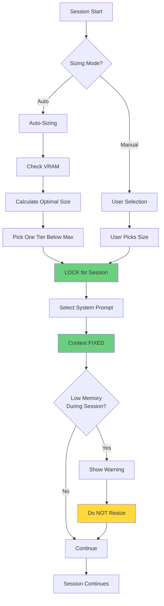
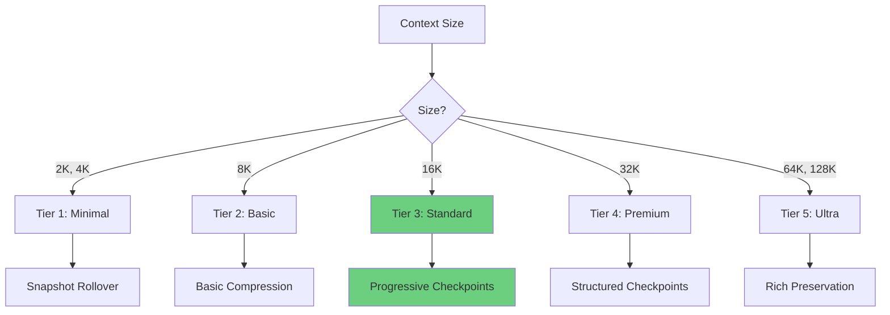
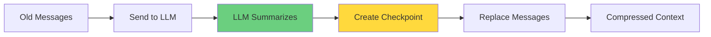
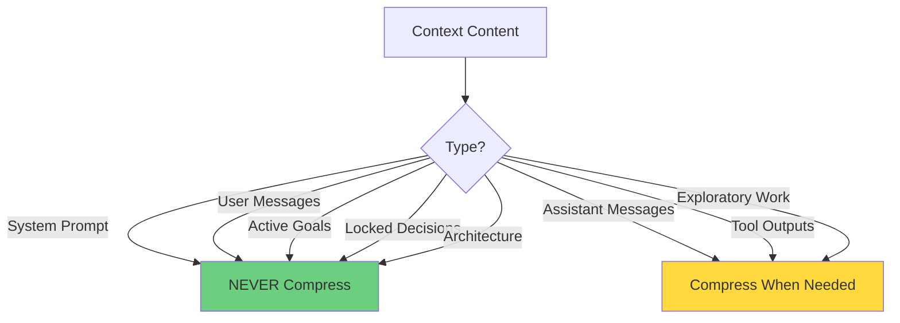
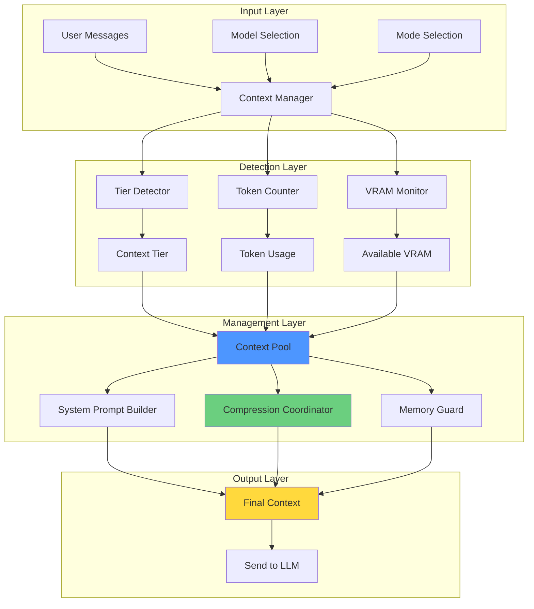
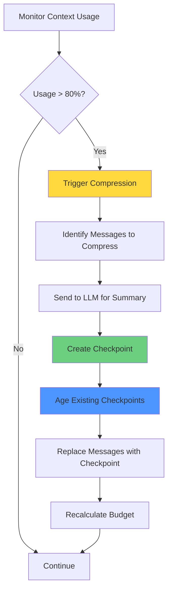
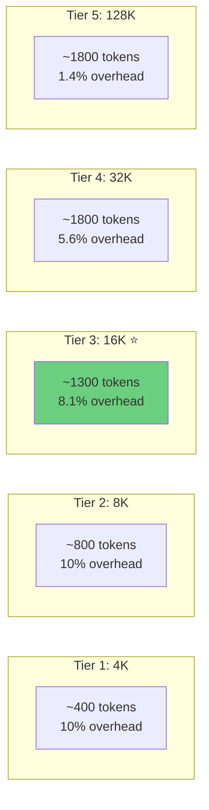
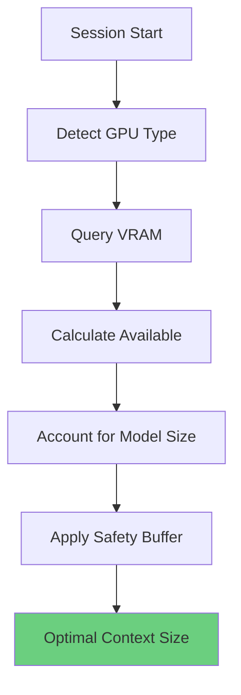

# Context Management System Architecture

**Last Updated:** January 26, 2026  
**Status:** Source of Truth

**Related Documents:**
- `ContextManagement.md` - Context sizing, tiers, VRAM monitoring
- `ContextCompression.md` - Compression, checkpoints, snapshots
- `SystemPrompts.md` - System prompt architecture
- `PromptsRouting.md` - Prompt selection and routing

---

## Executive Summary

This document describes the Context Management System Architecture - an intelligent system that manages LLM context windows, prevents information loss, and maintains conversation quality across different context sizes (2K to 128K+).

**Key Innovation:** The system automatically detects your context size and applies optimal management strategies, ensuring you never lose critical information while maximizing available workspace.

---

## Table of Contents

1. [Overview](#overview)
2. [Core Principles](#core-principles)
3. [Architecture Components](#architecture-components)
4. [Context Tier System](#context-tier-system)
5. [Compression Strategies](#compression-strategies)
6. [System Prompts](#system-prompts)
7. [VRAM Monitoring](#vram-monitoring)
8. [Token Management](#token-management)
9. [Implementation Details](#implementation-details)

---

## Overview

### The Challenge: LLM Context Management

Large Language Models have a fundamental limitation: **fixed context windows**. When conversations exceed this limit, critical information is lost, leading to:

**Without Context Management:**
- ❌ **Information Loss**: Older messages simply disappear (FIFO truncation)
- ❌ **Concept Drift**: LLM forgets the original task and goals
- ❌ **Repeated Work**: User must re-explain context and decisions
- ❌ **Quality Degradation**: LLM performance drops as context fills
- ❌ **No Preservation**: Architecture decisions and requirements vanish
- ❌ **One-Size-Fits-All**: Same approach for 4K and 128K contexts

**Real-World Impact:**
```
User: "Build a REST API with authentication"
[... 100 messages later ...]
LLM: "What kind of API are we building again?"
```

### Our Solution: Intelligent Context Management

**Smart context management** that adapts to your hardware and workflow:

✅ **Tier-Based Strategies** - Different approaches for 2K, 8K, 16K, 32K, 128K contexts  
✅ **Fixed Context Sizing** - Context size determined once at startup, stays stable  
✅ **VRAM-Aware** - Monitors GPU memory and selects optimal context size  
✅ **Compression System** - LLM-based summarization preserves critical information  
✅ **Never-Compressed Content** - Goals, decisions, and architecture always preserved  
✅ **Adaptive Prompts** - System prompts scale with context capacity  

**Real-World Result:**
```
User: "Build a REST API with authentication"
[... 100 messages later ...]
LLM: "Continuing with the REST API using JWT authentication 
      and PostgreSQL as discussed in our architecture decisions..."
```

---

## Core Principles

### 1. Fixed Context Sizing

Context size is determined once at startup and stays FIXED for the entire session.



**Key Points:**
- Context size selected once at startup
- Stays fixed for entire session
- No mid-conversation changes
- Low memory warnings instead of resizing
- Predictable, stable behavior

### 2. Tier-Based Management

Different context sizes require fundamentally different approaches:



### 3. LLM-Based Compression

The LLM itself does the summarization, not our app:



**Key Points:**
- LLM summarizes its own output
- Preserves meaning and context
- Compression quality scales with model size
- User messages NEVER compressed

### 4. Never-Compressed Content

Critical information is always preserved in full:



---

## Architecture Components

### System Overview



### Component Responsibilities

| Component | Responsibility | Input | Output |
|-----------|---------------|-------|--------|
| **Context Manager** | Main orchestration | Messages, config | Managed context |
| **VRAM Monitor** | Track GPU memory | Hardware info | VRAM availability |
| **Tier Detector** | Determine tier | Context size | Tier label |
| **Token Counter** | Count tokens | Messages | Token counts |
| **Context Pool** | Dynamic sizing | VRAM, model | Optimal size |
| **System Prompt Builder** | Build prompts | Tier, mode | System prompt |
| **Compression Coordinator** | Manage compression | Messages, tier | Checkpoints |
| **Memory Guard** | Prevent OOM | Usage metrics | Warnings |

---

## Context Tier System

### Tier Definitions

| Tier | Label | Context Sizes | Ollama Size (85%) | Use Case |
|------|-------|---------------|-------------------|----------|
| 1 | Minimal | 2K, 4K | 1700, 3400 | Quick tasks, minimal context |
| 2 | Basic | 8K | 6800 | Standard conversations |
| 3 | Standard ⭐ | 16K | 13600 | Complex tasks, code review |
| 4 | Premium | 32K | 27200 | Large codebases, long conversations |
| 5 | Ultra | 64K, 128K | 54400, 108800 | Maximum context, research tasks |

**Key Points:**
- Tiers are **labels** that represent context size ranges
- Context size drives everything
- Each tier has specific context sizes (not arbitrary ranges)
- The 85% values are **pre-calculated** in `LLM_profiles.json`
- Tier 3 (Standard) is the primary target for most users

### Tier 1: Minimal Context (2K, 4K)

**Reality Check:**
- Too small for sophisticated compression
- Still needs context continuity
- Summaries would consume needed workspace
- Lightweight rollover mechanism required

**Strategy:**
```
[System Prompt: 200 tokens]        ← Core Mandates only
[Session Summary: 300 tokens]      ← Lightweight rollover
[Recent Messages: 3,500 tokens]
────────────────────────────────
Total: 4,000 tokens

Approach: Snapshot-based rollover
Preservation: Ultra-compact session summary
Rollover: Create snapshot, start fresh with summary
```

**When to Use:**
- Quick questions and answers
- Simple conversations
- Resource-constrained devices
- Small models (< 7B parameters)

### Tier 2: Basic Context (8K)

**Reality Check:**
- Entry-level for serious work
- Room for basic checkpoint system
- Must be smart about compression
- LLM quality starts to matter

**Strategy:**
```
[System Prompt: 500 tokens]        ← Core + Sanity
[Session Context: 500 tokens]      ← Rollover summary
[Critical Info: 800 tokens]        ← Never compressed
[Checkpoint 1: 700 tokens]         ← Single detailed checkpoint
[Recent Messages: 5,500 tokens]
────────────────────────────────────
Total: 8,000 tokens

Approach: Smart compression with single checkpoint
Preservation: Critical decisions + one checkpoint
Utilization Target: 80% (erosion prevention)
```

**When to Use:**
- Short to medium tasks (< 50 exchanges)
- Single-file modifications
- Focused debugging sessions
- 7-13B parameter models

### Tier 3: Standard Context (16K) ⭐

**Reality Check:**
- **SWEET SPOT for most users**
- **Most common hardware supports this**
- Reliable LLM performance
- Room for proper checkpoint hierarchy
- Can preserve architectural decisions
- **This is where 90% of usage happens**

**Strategy:**
```
[System Prompt: 1,000 tokens]      ← Core + Sanity + Mode
[Task Definition: 400 tokens]      ← Never compressed
[Architecture: 1,200 tokens]       ← Never compressed
[Checkpoint 1: 300 tokens]         ← Compact (ancient)
[Checkpoint 2: 600 tokens]         ← Moderate (old)
[Checkpoint 3: 1,200 tokens]       ← Detailed (recent)
[Recent Messages: 11,300 tokens]
────────────────────────────────────
Total: 16,000 tokens (Ollama gets 13,600)

Approach: Progressive checkpoints with hierarchy
Preservation: Full structured format
Utilization Target: 70% (optimal performance)
```

**When to Use:**
- **PRIMARY TARGET: Most users**
- Medium to long tasks (50-200 exchanges)
- Multi-file projects
- Complex debugging
- 13-34B parameter models
- Typical consumer hardware (16-32GB RAM)

### Tier 4: Premium Context (32K)

**Reality Check:**
- **PREMIUM TIER: High-end hardware**
- Excellent LLM performance
- Room for rich metadata
- Can track everything with fidelity
- Ideal for complex projects
- **Requires 32GB+ RAM or cloud/API**

**Strategy:**
```
[System Prompt: 1,500 tokens]      ← Full expert prompt
[Task Definition: 600 tokens]      ← Never compressed
[Architecture: 3,000 tokens]       ← Never compressed
[API Contracts: 2,000 tokens]      ← Never compressed
[Checkpoints 1-3: 900 tokens]      ← Compact (ancient)
[Checkpoints 4-6: 3,000 tokens]    ← Moderate (old)
[Checkpoints 7-10: 6,500 tokens]   ← Detailed (recent)
[Recent Messages: 15,700 tokens]
────────────────────────────────────
Total: 32,000 tokens (Ollama gets 27,200)

Approach: Structured checkpoints with intelligence
Preservation: Everything + rich metadata
Utilization Target: 70% (optimal performance)
```

**When to Use:**
- High-end local setups (64GB+ RAM)
- Cloud/API deployments
- Long-running projects (200+ exchanges)
- Full application development
- 70B+ parameter models

### Tier 5: Ultra Context (64K, 128K)

**Reality Check:**
- **ULTRA TIER: Cloud/API or extreme hardware**
- Exceptional LLM performance
- Massive room for complete history
- Perfect fidelity across entire project
- **Requires cloud/API or 128GB+ RAM**

**Strategy:**
```
[System Prompt: 1,500 tokens]      ← Full expert prompt
[Task Definition: 600 tokens]      ← Never compressed
[Architecture: 3,000 tokens]       ← Never compressed
[API Contracts: 2,000 tokens]      ← Never compressed
[Checkpoints 1-5: 1,500 tokens]    ← Compact (ancient)
[Checkpoints 6-10: 4,500 tokens]   ← Moderate (old)
[Checkpoints 11-15: 9,000 tokens]  ← Detailed (recent)
[Recent Messages: 86,900 tokens]
────────────────────────────────────
Total: 128,000 tokens (Ollama gets 108,800)

Approach: Rich preservation with semantic merging
Preservation: Everything + complete audit trail
Utilization Target: 65% (maximum performance)
```

### Tier Comparison

| Aspect | Tier 1 | Tier 2 | Tier 3 ⭐ | Tier 4 | Tier 5 |
|--------|--------|--------|-----------|--------|--------|
| **Target Users** | Casual | Entry | **90% of users** | Premium | Enterprise |
| **Hardware** | Low-end | Mid | **Consumer** | High-end | Cloud |
| **Compression** | Rollover | Smart | **Progressive** | Structured | Ultra |
| **Checkpoints** | 0 | 1 | **3** | 10 | 15 |
| **Preservation** | 5% | 10% | **15%** | 25% | 30% |
| **Task Length** | < 20 msgs | < 50 | **< 200** | < 500 | Unlimited |
| **System Prompt** | 200 tokens | 500 | **1000** | 1500 | 1500 |

⭐ = Primary target for development effort

---

## Compression Strategies

### Overview

Compression is triggered at **80% of available context budget** to prevent context overflow.



### Dynamic Budget Calculation

```
Available Budget = ollama_context_size - system_prompt_tokens - checkpoint_tokens
```

**Example: 16K Context (Tier 3)**

```
Initial State:
├─ Ollama context: 13,600 tokens (FIXED, 85% of 16K)
├─ System prompt: 1,000 tokens (fixed)
└─ Available for conversation: 12,600 tokens
   └─ Trigger compression at: 12,600 * 0.80 = 10,080 tokens

After 1st Compression:
├─ Ollama context: 13,600 tokens (FIXED)
├─ System prompt: 1,000 tokens (fixed)
├─ Checkpoint 1: 1,200 tokens (recent history, 50-70% compressed)
└─ Available for NEW conversation: 10,400 tokens
   └─ Trigger compression at: 10,400 * 0.80 = 8,320 tokens

After 2nd Compression:
├─ Ollama context: 13,600 tokens (FIXED)
├─ System prompt: 1,000 tokens (fixed)
├─ Checkpoint 1: 600 tokens (aged, 60% compressed)
├─ Checkpoint 2: 1,200 tokens (recent, 50-70% compressed)
└─ Available for NEW: 10,800 tokens
   └─ Trigger at: 10,800 * 0.80 = 8,640 tokens
```

### Checkpoint Aging

When a new compression is triggered, existing checkpoints age and compress further:


**Compression Levels:**
- **Recent (Checkpoint 3):** 50-70% compression, ~1200 tokens
- **Old (Checkpoint 2):** 60% compression, ~600 tokens
- **Ancient (Checkpoint 1):** 70% compression, ~300 tokens
- **Ultra (Merged):** 80% compression, ~150 tokens

### Never-Compressed Content

The following content is ALWAYS preserved in full:

1. **System Prompt** - Core mandates, sanity checks, mode guidance
2. **User Messages** - All user input, questions, instructions
3. **Active Goals** - Current goal description, checkpoints, decisions
4. **Locked Decisions** - Architecture decisions, API contracts
5. **Artifacts** - Files created/modified

**Example Context Structure:**
```
[System Prompt] - 1000 tokens (never compressed)
  ├─ Core Mandates
  ├─ Active Goal - 200 tokens (never compressed)
  │  ├─ Goal description
  │  ├─ Checkpoints
  │  ├─ Decisions (locked)
  │  └─ Artifacts
  └─ Mode Guidance

[Checkpoint 1] - 300 tokens (ancient, 70% compressed)
[Checkpoint 2] - 600 tokens (old, 60% compressed)
[Checkpoint 3] - 1200 tokens (recent, 50-70% compressed)

[User Messages] - 3000 tokens (never compressed)
[Recent Assistant Messages] - 7500 tokens (not yet compressed)
```

---

## System Prompts

### Adaptive Prompt Sizing

System prompts scale with context tier to provide appropriate guidance:



### Prompt Components

**All Tiers:**
- Core Mandates (~200 tokens)

**Tier 2+:**
- Core Mandates (~200 tokens)
- Sanity Checks (~100 tokens)
- Mode Template (200-1500 tokens)

**Token Budget Breakdown:**
- Tier 1: 200 tokens (Core only)
- Tier 2: 800 tokens (Core + Sanity + Basic Mode)
- Tier 3: 1300 tokens (Core + Sanity + Comprehensive Mode)
- Tier 4/5: 1800 tokens (Core + Sanity + Expert Mode)

### Operational Modes

Each mode has specific focus areas:

**Developer Mode:**
- Focus: Code quality, architecture, testing
- Preserves: Architecture decisions, API contracts, file changes

**Planning Mode:**
- Focus: Task breakdown, dependencies, estimation
- Preserves: Goals, requirements, task breakdown

**Assistant Mode:**
- Focus: Clear communication, helpful responses
- Preserves: User preferences, conversation context
- Only available in Tier 4 and 5

**Debugger Mode:**
- Focus: Systematic debugging, root cause analysis
- Preserves: Error traces, reproduction steps, fixes attempted

---

## VRAM Monitoring

### Purpose

VRAM monitoring helps determine optimal context size based on available GPU memory.



### Platform Support

**NVIDIA (nvidia-smi):**
- Total VRAM
- Used VRAM
- Free VRAM
- GPU utilization

**AMD (rocm-smi):**
- Total VRAM
- Used VRAM
- Free VRAM

**Apple Silicon (system APIs):**
- Unified memory
- Memory pressure
- Available memory

### Memory Thresholds

```typescript
enum MemoryLevel {
  NORMAL,      // < 70% usage
  WARNING,     // 70-85% usage
  CRITICAL,    // 85-95% usage
  EMERGENCY    // > 95% usage
}
```

**Actions by Level:**
- **NORMAL:** Continue normally
- **WARNING:** Show warning message
- **CRITICAL:** Show critical warning
- **EMERGENCY:** Show emergency warning

**Note:** System does NOT automatically resize context. User must restart with smaller context if needed.

---

## Token Management

### Token Counter

Tracks token usage across all context components:

```typescript
interface ContextUsage {
  currentTokens: number;    // Current usage
  maxTokens: number;        // Ollama limit (85% of user selection)
  percentage: number;       // Usage percentage
  available: number;        // Remaining tokens
}
```

**Example:**
```
User selects: 16K
Ollama limit: 13,600 (85%)
Current usage: 8,500 tokens
Percentage: 62%
Available: 5,100 tokens
```

### Token Counting

- System prompt tokens (counted once)
- Checkpoint tokens (sum of all checkpoints)
- User message tokens (never compressed)
- Assistant message tokens (compressed when needed)
- Tool output tokens (compressed when needed)

### Budget Recalculation

After each compression:
1. Count system prompt tokens
2. Count checkpoint tokens
3. Calculate available budget
4. Set new compression trigger (80% of available)

---

## Implementation Details

### File Locations

| Component | File Path |
|-----------|-----------|
| **Context Manager** | `packages/core/src/context/contextManager.ts` |
| **VRAM Monitor** | `packages/core/src/context/vramMonitor.ts` |
| **Token Counter** | `packages/core/src/context/tokenCounter.ts` |
| **Context Pool** | `packages/core/src/context/contextPool.ts` |
| **Memory Guard** | `packages/core/src/context/memoryGuard.ts` |
| **Compression Coordinator** | `packages/core/src/context/compressionCoordinator.ts` |
| **Compression Service** | `packages/core/src/context/compressionService.ts` |
| **Checkpoint Manager** | `packages/core/src/context/checkpointManager.ts` |
| **Snapshot Manager** | `packages/core/src/context/snapshotManager.ts` |
| **System Prompt Builder** | `packages/core/src/context/SystemPromptBuilder.ts` |
| **Prompt Registry** | `packages/core/src/prompts/PromptRegistry.ts` |

### Configuration

```typescript
interface ContextConfig {
  targetSize: number;      // Target context size (user selection)
  minSize: number;         // Minimum context size
  maxSize: number;         // Maximum context size
  autoSize: boolean;       // Enable auto-sizing
  vramBuffer: number;      // VRAM safety buffer (MB)
  kvQuantization: boolean; // Enable KV cache quantization
}
```

### Events

**Context Events:**
- `started` - Context management started
- `stopped` - Context management stopped
- `config-updated` - Configuration changed
- `tier-changed` - Context tier changed
- `mode-changed` - Operational mode changed

**Memory Events:**
- `low-memory` - Low VRAM detected
- `memory-warning` - Memory usage warning (70-85%)
- `memory-critical` - Critical memory usage (85-95%)
- `memory-emergency` - Emergency memory condition (>95%)

**Compression Events:**
- `compressed` - Compression completed
- `compression-skipped` - Compression skipped (not needed)
- `compression-error` - Compression failed
- `checkpoint-created` - New checkpoint created
- `checkpoint-aged` - Checkpoint aged

**Snapshot Events:**
- `snapshot-created` - Snapshot created
- `snapshot-restored` - Snapshot restored
- `snapshot-error` - Snapshot operation failed

---

## Best Practices

### 1. Context Size Selection

- Start with Tier 3 (16K) for most tasks
- Use Tier 2 (8K) for quick conversations
- Use Tier 1 (2K, 4K) for minimal context needs
- Use Tier 4 (32K) for large codebases
- Use Tier 5 (64K, 128K) only when necessary

### 2. Auto-Sizing

- Enable for automatic optimization
- Picks one tier below maximum for safety
- Fixed for session (no mid-conversation changes)
- Show warnings on low memory

### 3. Compression

- Enable compression for long conversations
- Monitor reliability score
- Start new conversation if reliability drops below 40%
- Use larger models for complex long-term tasks

### 4. Goals and Decisions

- Set clear goals at conversation start
- Mark important decisions as "never compress"
- Track checkpoints for complex tasks
- Goals are preserved across all compressions

---

## Summary

### Key Features

1. **Fixed Context Sizing** ✅
   - Context size determined once at startup
   - Stays fixed for entire session
   - No mid-conversation changes
   - Predictable, stable behavior

2. **Tier-Based Management** ✅
   - 5 tiers from Minimal to Ultra
   - Each optimized for its context size
   - Tier 3 (Standard) is primary target
   - Automatic tier detection

3. **LLM-Based Compression** ✅
   - LLM summarizes its own output
   - Preserves meaning and context
   - Quality scales with model size
   - User messages never compressed

4. **Never-Compressed Content** ✅
   - System prompts
   - User messages
   - Active goals
   - Locked decisions
   - Architecture decisions

5. **VRAM Monitoring** ✅
   - Platform-specific implementations
   - Real-time memory tracking
   - Low memory warnings
   - Optimal size calculation

6. **Adaptive Prompts** ✅
   - Prompts scale with context tier
   - Mode-specific guidance
   - Automatic selection
   - Token-efficient

---

**Document Status:** ✅ Updated  
**Last Updated:** January 26, 2026  
**Purpose:** Complete architecture overview of context management system
