# Context Compression and Checkpoint System

**Last Updated:** January 26, 2026  
**Status:** Source of Truth

**Related Documents:**
- `ContextManagement.md` - Context sizing, tiers, VRAM
- `ContextArchitecture.md` - Overall system architecture
- `SystemPrompts.md` - System prompt structure

---

## Overview

The Compression System manages conversation history when context approaches its limit. It creates checkpoints (compressed summaries) and ages them over time to sustain long conversations within fixed context limits.

**Core Principle:** Dynamic budget management with checkpoint aging enables long conversations within fixed context limits.

---

## Table of Contents

1. [Why Compression Matters](#why-compression-matters)
2. [Architecture](#architecture)
3. [Dynamic Budget Calculation](#dynamic-budget-calculation)
4. [Compression Trigger](#compression-trigger)
5. [Checkpoint System](#checkpoint-system)
6. [LLM-Based Summarization](#llm-based-summarization)
7. [Goal-Aware Compression](#goal-aware-compression)
8. [Session History Storage](#session-history-storage)
9. [Snapshot System](#snapshot-system)
10. [Reliability Tracking](#reliability-tracking)

---

## Why Compression Matters

Ollama enforces a fixed context limit (e.g., 13,600 tokens for 16K selection). As conversation grows, we must compress history into checkpoints while maintaining available space for new messages.

**Without dynamic budget tracking:**
- Compression triggers too frequently
- Context fills up prematurely
- Conversation ends after 1-2 compressions

**With dynamic budget tracking:**
- Compression triggers based on available space
- Checkpoints age and compress further
- Conversation sustains 3-5+ compressions

### The Problem


### The Solution


---

## Architecture

### Core Components


**Component Responsibilities:**

| Component | Responsibility |
|-----------|---------------|
| **Compression Coordinator** | Orchestrates compression strategies, manages checkpoint aging, handles context rollover |
| **Compression Service** | Calls LLM for summarization, generates compressed summaries, handles compression failures |
| **Checkpoint Manager** | Stores and retrieves checkpoints, ages checkpoints over time, merges old checkpoints |
| **Snapshot Manager** | Creates full conversation snapshots, saves to disk for recovery, restores previous states |
| **Message Store** | Tracks token usage, triggers compression at thresholds, manages message history |

---

## Dynamic Budget Calculation

### Available Budget Formula

```
Available Budget = ollama_context_size - system_prompt_tokens - checkpoint_tokens
```

### Example: 16K Context (Tier 3)


**Key Insight:** Available budget shrinks with each checkpoint, but aging keeps it sustainable for 3-5+ compressions.

---

## Compression Trigger

Compression is triggered at **80% of available context budget**.

### Trigger Calculation

```typescript
// Calculate available budget (excludes system + checkpoints)
const systemTokens = countTokens(systemPrompt);
const checkpointTokens = checkpoints.reduce((sum, cp) => sum + cp.tokens, 0);
const availableBudget = context.maxTokens - systemTokens - checkpointTokens;

// Trigger compression at 80% of AVAILABLE budget
const compressionTrigger = availableBudget * 0.80;
```

**Why 80%?**
- Leaves 20% buffer for final messages
- Prevents race condition with Ollama's limit
- Allows time for compression to complete

### Trigger Flow


---

## Checkpoint System

### Checkpoint Structure

```typescript
interface CompressionCheckpoint {
  id: string;
  level: 1 | 2 | 3;           // Compression level (1=compact, 3=detailed)
  range: string;              // Message range (e.g., "Messages 1-50")
  summary: Message;           // LLM-generated summary
  createdAt: Date;
  compressedAt?: Date;        // When aged/re-compressed
  originalTokens: number;     // Before compression
  currentTokens: number;      // After compression
  compressionCount: number;   // How many times compressed
  compressionNumber?: number; // Sequence number
  keyDecisions?: string[];    // Important decisions
  filesModified?: string[];   // Files changed
  nextSteps?: string[];       // Planned actions
}
```

### Checkpoint Aging

When a new compression is triggered, existing checkpoints age and compress further:

```mermaid
graph TD
    A[New Compression Triggered] --> B[Create New Checkpoint]
    B --> C[Compress LLM Output Only]
    C --> D[Target: ~1200 tokens]
    
    D --> E[Age Existing Checkpoints]
    E --> F[Checkpoint 3 → Checkpoint 2]
    F --> G[Compress to 60%]
    G --> H[~600 tokens]
    
    H --> I[Checkpoint 2 → Checkpoint 1]
    I --> J[Compress to 50%]
    J --> K[~300 tokens]
    
    K --> L[Checkpoint 1 → Ultra-compress]
    L --> M[Compress to 40%]
    M --> N[~150 tokens]
    
    N --> O[Recalculate Available Budget]
    O --> P[Continue Conversation]
    
    style B fill:#6bcf7f
    style E fill:#ffd93d
    style O fill:#4d96ff
```



### Compression Levels


---

## LLM-Based Summarization

### Who Does the Compression?

**The LLM does the summarization**, not our app. Our app:
1. Identifies messages to compress
2. Sends them to the LLM with a summarization prompt
3. Receives the summary back
4. Stores the summary as a checkpoint
5. Removes the original messages from active context

### Summarization Process


### Summarization Prompt

```typescript
const summaryPrompt = `Summarize the following conversation history, preserving key decisions, code changes, and important context:

${messagesToCompress.join('\n')}

Provide a concise summary that maintains essential information.`;

const summary = await llm.generate(summaryPrompt);
```

### Compression Rules

- ✅ Compress LLM output only (assistant messages)
- ❌ Never compress user messages
- ❌ Never compress system prompt
- ❌ Never compress goals or architecture decisions
- ❌ Never compress active goal checkpoints
- ❌ Never compress locked decisions
- ✅ Each aging step compresses more aggressively
- ✅ Oldest checkpoints are most compressed

### Never-Compressed Content


**Example Context Structure:**
```
[System Prompt] - 1000 tokens (never compressed)
  ├─ Core Mandates
  ├─ Active Goal - 200 tokens (never compressed)
  │  ├─ Goal description
  │  ├─ Checkpoints
  │  ├─ Decisions (locked)
  │  └─ Artifacts
  └─ Skills

[Checkpoint 1] - 300 tokens (ancient, 70% compressed)
[Checkpoint 2] - 600 tokens (old, 60% compressed)
[Checkpoint 3] - 1200 tokens (recent, 50-70% compressed)

[User Messages] - 3000 tokens (never compressed)
[Recent Assistant Messages] - 7500 tokens (not yet compressed)
```

### Compression Quality by Model Size

```
Small models (3B-7B):
  - Basic summarization
  - May lose subtle context
  - Good for simple conversations
  - Compression: 50-70%
  - Recommend: 2-3 compressions max

Medium models (13B-30B):
  - Good summarization
  - Preserves most context
  - Handles complex topics
  - Compression: 60-80%
  - Recommend: 3-5 compressions

Large models (70B+):
  - Excellent summarization
  - Preserves nuance and meaning
  - Handles very complex topics
  - Compression: 70-90%
  - Recommend: 5-7 compressions
```

---

## Goal-Aware Compression

### Overview

Goals guide the compression process by helping the LLM understand what information is important to preserve.

### Goal Structure in Context

```typescript
interface Goal {
  id: string;
  description: string;
  priority: 'high' | 'medium' | 'low';
  status: 'active' | 'paused' | 'completed';
  createdAt: Date;
  completedAt?: Date;
  checkpoints: Checkpoint[];
  decisions: Decision[];
  artifacts: Artifact[];
}
```

### Goal Preservation Rules

**Always Preserved (Never Compressed):**
- Active goal description
- All checkpoints (pending, in-progress, completed)
- Locked decisions
- Artifact list (files created/modified)
- Next steps

**Updated During Compression:**
- Checkpoint status (marked as completed)
- New decisions added
- New artifacts recorded

### Goal-Aware Summarization Prompt

```typescript
const summaryPrompt = `
ACTIVE GOAL: ${goal.description}
Priority: ${goal.priority}
Status: ${goal.status}

COMPLETED CHECKPOINTS:
${goal.checkpoints.filter(cp => cp.status === 'completed').map(cp => `✅ ${cp.description}`).join('\n')}

IN PROGRESS:
${goal.checkpoints.filter(cp => cp.status === 'in-progress').map(cp => `🔄 ${cp.description}`).join('\n')}

PENDING:
${goal.checkpoints.filter(cp => cp.status === 'pending').map(cp => `⏳ ${cp.description}`).join('\n')}

LOCKED DECISIONS:
${goal.decisions.filter(d => d.locked).map(d => `🔒 ${d.description}`).join('\n')}

---

Summarize the following conversation, focusing on progress toward the goal:
${messagesToCompress.join('\n')}

PRESERVE:
- Decisions made toward the goal
- Checkpoints completed
- Files created/modified
- Blockers encountered
- Technical details relevant to the goal
- Next steps planned

SUMMARIZE AGGRESSIVELY:
- Off-topic discussions
- Exploratory conversations
- Debugging steps that succeeded
- Repeated information

Provide a concise summary that maintains essential information for continuing work on the goal.
`;
```

### Goal Markers

The LLM can use special markers in its output to update goals:

```
[GOAL] Implement user authentication system
[CHECKPOINT] Design authentication flow - COMPLETED
[CHECKPOINT] Implement login endpoint - COMPLETED
[CHECKPOINT] Add JWT token generation - IN PROGRESS
[DECISION] Use JWT for authentication - LOCKED
[DECISION] Store tokens in httpOnly cookies - LOCKED
[ARTIFACT] Created src/auth/login.ts
[ARTIFACT] Created src/auth/jwt.ts
[ARTIFACT] Modified src/routes/api.ts
[NEXT] Complete JWT token generation, then move to user registration
```

### Context Structure with Goals


### Benefits of Goal-Aware Compression

**1. Better Summarization Quality**
- LLM knows what's important
- Preserves goal-relevant information
- Summarizes off-topic content more aggressively

**2. Maintains Context Continuity**
- Goals provide thread through conversation
- Checkpoints show progress
- Decisions prevent backtracking

**3. Improved Reliability**
- Less context loss over compressions
- Clear progress tracking
- Explicit decision recording

**4. Better User Experience**
- User can see progress at a glance
- Clear next steps
- Transparent decision-making

---

## Session History Storage

The system maintains two separate storage systems:

### 1. Active Context (Memory)


- Compressed for LLM efficiency
- Sent to LLM with each message
- Contains:
  - System prompt
  - Checkpoints (compressed history)
  - User messages (never compressed)
  - Recent messages (not yet compressed)

### 2. Full History (Disk)


- Uncompressed complete record
- Saved to `~/.ollm/sessions/{sessionId}.json`
- Contains:
  - ALL messages (uncompressed)
  - ALL tool calls
  - Metadata (tokens, compressions)
- Never affected by compression
- User can review anytime

**Key Principle:** Compression only affects what's sent to the LLM, not what's saved to disk.

### Session File Structure

```json
{
  "sessionId": "uuid",
  "startTime": "2026-01-26T10:00:00Z",
  "lastActivity": "2026-01-26T11:30:00Z",
  "model": "llama3.2:3b",
  "provider": "ollama",
  "messages": [
    {
      "role": "user",
      "parts": [{ "type": "text", "text": "..." }],
      "timestamp": "2026-01-26T10:00:00Z"
    },
    {
      "role": "assistant",
      "parts": [{ "type": "text", "text": "..." }],
      "timestamp": "2026-01-26T10:00:15Z"
    }
  ],
  "toolCalls": [
    {
      "id": "call_123",
      "name": "read_file",
      "args": { "path": "file.ts" },
      "result": { "llmContent": "..." },
      "timestamp": "2026-01-26T10:00:20Z"
    }
  ],
  "metadata": {
    "tokenCount": 8500,
    "compressionCount": 2
  }
}
```

---

## Snapshot System

### Snapshot vs Checkpoint


**Checkpoint:**
- Compressed summary of conversation history
- Part of active context
- Sent to LLM with each message
- Ages over time

**Snapshot:**
- Full conversation state saved to disk
- Not part of active context
- Used for recovery and rollback
- Never changes after creation

### Snapshot Structure

```typescript
interface ContextSnapshot {
  id: string;
  sessionId: string;
  timestamp: Date;
  context: ConversationContext;  // Full state
  tokenCount: number;
  messageCount: number;
  checkpointCount: number;
  metadata: {
    model: string;
    tier: ContextTier;
    mode: OperationalMode;
  };
}
```

### Snapshot Operations


**Create Snapshot:**
```typescript
const snapshot = await contextManager.createSnapshot();
// Saves full conversation state to disk
```

**Restore Snapshot:**
```typescript
await contextManager.restoreSnapshot(snapshotId);
// Restores conversation to previous state
```

**List Snapshots:**
```typescript
const snapshots = await contextManager.listSnapshots();
// Returns all available snapshots
```

---

## Reliability Tracking

The system tracks conversation reliability based on model size and compression count.

### Reliability Score Calculation

```typescript
// Model size factor
const modelFactor = 
  modelSize >= 70 ? 0.95 :  // 70B+ models
  modelSize >= 30 ? 0.85 :  // 30B models
  modelSize >= 13 ? 0.70 :  // 13B models
  modelSize >= 7  ? 0.50 :  // 7B models
  0.30;                      // 3B and below

// Compression penalty (15% per compression)
const compressionPenalty = Math.max(
  1.0 - (compressionCount * 0.15),
  0.30  // Never go below 30%
);

// Final score
const score = modelFactor * compressionPenalty * contextConfidence;
```

### Reliability Levels


### UI Display

```
Context: 5,234/13,600  🟡 65%  (2 compressions)
```

**Warning for Low Reliability:**
```
⚠️ Context Compression Warning
Your model (llama3.2:3b) has compressed the conversation 3 times.
Small models may lose context accuracy after multiple compressions.

Recommendations:
- Continue if making good progress
- Start new conversation if seeing hallucinations
- Use larger model for complex long-term tasks
```

---

## Configuration

### Compression Config

```typescript
interface CompressionConfig {
  enabled: boolean;
  strategy: 'summarize' | 'truncate';
  preserveRecent: number;     // Tokens to preserve
  summaryMaxTokens: number;   // Max tokens for summary
}
```

### Snapshot Config

```typescript
interface SnapshotConfig {
  enabled: boolean;
  autoCreate: boolean;
  autoThreshold: number;  // Trigger at % of context
}
```

### Default Values

```typescript
const DEFAULT_CONFIG = {
  compression: {
    enabled: true,
    strategy: 'summarize',
    preserveRecent: 2048,
    summaryMaxTokens: 1024,
  },
  snapshots: {
    enabled: true,
    autoCreate: true,
    autoThreshold: 0.80,  // 80% of available budget
  },
};
```

---

## Events

### Compression Events

- `compressed` - Compression completed
- `compression-skipped` - Compression skipped (not needed)
- `compression-error` - Compression failed
- `rollover-complete` - Context rollover completed
- `checkpoint-created` - New checkpoint created
- `checkpoint-aged` - Checkpoint aged

### Snapshot Events

- `snapshot-created` - Snapshot created
- `snapshot-restored` - Snapshot restored
- `snapshot-error` - Snapshot operation failed
- `auto-snapshot-created` - Auto-snapshot created

---

## Best Practices

### 1. Compression

- Enable compression for long conversations
- Monitor reliability score
- Start new conversation if reliability drops below 40%
- Use larger models for complex long-term tasks

### 2. Goals and Decisions

- Always mark important decisions as "never compress"
- Set clear goals at conversation start
- Track checkpoints for complex tasks
- Goals are preserved across all compressions

### 3. Session Management

- Full history always saved to disk
- Review full history anytime
- Export sessions for documentation
- Search across sessions for insights

### 4. Snapshots

- Create snapshots before major changes
- Use snapshots for experimentation
- Restore snapshots if conversation goes off track
- Keep important snapshots for reference

---

## Troubleshooting

### Poor Reliability

**Symptom:** Reliability score below 40%

**Solutions:**
1. Start new conversation
2. Use larger model (13B+ recommended)
3. Review and preserve important decisions
4. Create checkpoint before continuing

### Compression Failures

**Symptom:** "Compression failed" error

**Solutions:**
1. Check LLM is responding
2. Verify enough messages to compress
3. Check compression config
4. Review logs for specific error

### Rapid Re-Compression

**Symptom:** Compression triggers immediately after previous compression

**Solutions:**
1. Verify dynamic budget calculation is working
2. Check checkpoint tokens are being tracked
3. Ensure checkpoints are aging properly
4. Review compression trigger threshold (should be 80% of available)

---

## File Locations

| File | Purpose |
|------|---------|
| `packages/core/src/context/compressionCoordinator.ts` | Orchestrates compression |
| `packages/core/src/context/compressionService.ts` | LLM summarization |
| `packages/core/src/context/checkpointManager.ts` | Checkpoint management |
| `packages/core/src/context/snapshotManager.ts` | Snapshot operations |
| `packages/core/src/context/messageStore.ts` | Tracks usage, triggers compression |
| `packages/core/src/context/goalManager.ts` | Goal management |
| `packages/core/src/services/chatRecordingService.ts` | Full history storage |

---

## Summary

### Key Features

1. **Dynamic Budget Management** ✅
   - Available budget recalculated after each compression
   - Accounts for system prompt and checkpoints
   - Triggers at 80% of available space

2. **Checkpoint Aging** ✅
   - Checkpoints compress further over time
   - Recent: 50-70% compression
   - Old: 60% compression
   - Ancient: 70% compression
   - Ultra: 80% compression

3. **LLM-Based Summarization** ✅
   - LLM summarizes its own output
   - Preserves meaning and context
   - Quality scales with model size
   - User messages never compressed

4. **Goal-Aware Compression** ✅
   - Goals guide summarization
   - Important decisions preserved
   - Progress tracked across compressions
   - Clear continuity maintained

5. **Dual Storage** ✅
   - Active context: Compressed for LLM
   - Full history: Uncompressed on disk
   - Compression doesn't affect saved history
   - Complete audit trail maintained

6. **Reliability Tracking** ✅
   - Scores based on model size and compressions
   - Warnings for low reliability
   - Recommendations for improvement
   - Clear user feedback

---

**Document Status:** ✅ Complete  
**Last Updated:** January 26, 2026  
**Purpose:** Complete guide to context compression and checkpoint system
