```mermaid
graph LR
    A[Memory Usage] --> B{Level?}
    
    B -->|< 70%| C[🟢 NORMAL<br/>Continue]
    B -->|70-85%| D[🟡 WARNING<br/>Show Warning]
    B -->|85-95%| E[🟠 CRITICAL<br/>Critical Warning]
    B -->|> 95%| F[🔴 EMERGENCY<br/>Emergency Warning]
    
    style C fill:#6bcf7f
    style D fill:#ffd93d
    style E fill:#ff9f43
    style F fill:#ff6b6b
```

# Context Management System

**Last Updated:** January 26, 2026  
**Status:** Source of Truth

**Related Documents:**
- `ContextArchitecture.md` - Overall system architecture
- `ContextCompression.md` - Compression, checkpoints, snapshots
- `SystemPrompts.md` - System prompt architecture

---

## Overview

The Context Management System determines context window sizes, monitors VRAM, and manages token counting. It provides the foundation for compression and prompt systems.

**Core Responsibility:** Determine and maintain the context size that will be sent to Ollama.

---

## Table of Contents

1. [Architecture](#architecture)
2. [Context Tiers](#context-tiers)
3. [Context Size Flow](#context-size-flow)
4. [Auto-Sizing](#auto-sizing)
5. [Token Counting](#token-counting)
6. [VRAM Monitoring](#vram-monitoring)
7. [Configuration](#configuration)
8. [API Reference](#api-reference)

---

## Architecture

### Core Components


**Component Responsibilities:**

1. **Context Manager** (`contextManager.ts`)
   - Main orchestration layer
   - Coordinates all context services
   - Manages conversation state
   - Owns system prompt

2. **VRAM Monitor** (`vramMonitor.ts`)
   - Tracks GPU memory availability
   - Detects low memory conditions
   - Platform-specific implementations (NVIDIA, AMD, Apple Silicon)

3. **Token Counter** (`tokenCounter.ts`)
   - Measures context usage in tokens
   - Caches token counts for performance
   - Estimates tokens for messages

4. **Context Pool** (`contextPool.ts`)
   - Manages dynamic context sizing
   - Calculates optimal context size based on VRAM
   - Handles context resizing

5. **Memory Guard** (`memoryGuard.ts`)
   - Prevents OOM errors
   - Emits warnings at memory thresholds
   - Triggers emergency actions

---

## Context Tiers

Context tiers are **labels** that represent different context window sizes. They are the **result** of user selection or hardware detection, not decision makers.

### Tier Definitions


| Tier | Context Size | Ollama Size (85%) | Use Case |
|------|--------------|-------------------|----------|
| Tier 1 (Minimal) | 2K, 4K | 1700, 3400 | Quick tasks, minimal context |
| Tier 2 (Basic) | 8K | 6800 | Standard conversations |
| Tier 3 (Standard) | 16K | 13600 | Complex tasks, code review ⭐ |
| Tier 4 (Premium) | 32K | 27200 | Large codebases, long conversations |
| Tier 5 (Ultra) | 64K, 128K | 54400, 108800 | Maximum context, research tasks |

**Key Points:**
- Tiers are **labels only** - they don't make decisions
- Context size drives everything
- Each tier has specific context sizes (not ranges)
- Tiers are used for prompt selection (see `SystemPrompts.md`)
- The 85% values are **pre-calculated by devs** in `LLM_profiles.json`

---

## Context Size Flow

### User Selection → Ollama


**Flow Steps:**

1. User selects context size (e.g., 16K)
2. System reads LLM_profiles.json
3. Gets pre-calculated ollama_context_size (e.g., 13600 for 16K)
4. System determines tier label (Tier 3 for 16K)
5. System builds prompt based on tier label
6. System sends prompt + ollama_context_size (13600) to Ollama
7. Ollama uses 100% of that value (13600 tokens)

**Critical:** The 85% is already calculated in `LLM_profiles.json`. No runtime calculation of 85% should exist in the code.

### Data Flow Chain


**Critical:** `context.maxTokens` MUST equal `ollamaContextSize`, not user's selection.

---

## LLM_profiles.json Structure

### Profile Format

```json
{
  "models": [{
    "id": "llama3.2:3b",
    "context_profiles": [{
      "size": 4096,                    // User sees this
      "ollama_context_size": 3482,     // We send this to Ollama (85%)
      "size_label": "4k"
    }]
  }]
}
```

**Why pre-calculate ratios?**
- Model-specific (different models need different ratios)
- Empirically tested values
- No runtime calculation = no bugs
- Single source of truth

---

## Auto-Sizing

Auto-sizing picks the optimal context size at startup based on available VRAM, then **stays fixed** for the session.

### Auto-Sizing Flow


### Context Sizing Logic

**Step 1: Load Profile**
```typescript
const modelEntry = profileManager.getModelEntry(modelId);
```

**Step 2: Calculate Sizing**
```typescript
const contextSizing = calculateContextSizing(requestedSize, modelEntry, contextCapRatio);
// Returns: { requested: 4096, allowed: 4096, ollamaContextSize: 3482, ratio: 0.85 }
```

**Step 3: Set Context Limits (CRITICAL)**
```typescript
// Set context.maxTokens to Ollama's limit, NOT user's selection
contextActions.updateConfig({ targetSize: contextSizing.ollamaContextSize });
// Now context.maxTokens = 3482
```

**Step 4: Send to Provider**
```typescript
provider.chatStream({
  options: { num_ctx: contextSizing.ollamaContextSize }  // 3482
});
```

### Expected Behavior


- **Auto mode:** Check VRAM → pick one tier below max → FIXED for session
- **Manual mode:** User picks → FIXED for session
- **On low memory:** Show warning to user (system message)
- **No automatic mid-conversation changes**

### Warning Message Example

```
⚠️ Low memory detected (VRAM: 85% used)
Your current context size may cause performance issues.
Consider restarting with a smaller context size.
```

---

## Token Counting

### Token Counter Responsibilities


- Count tokens in messages
- Cache token counts for performance
- Estimate tokens for new content
- Track total context usage

### Usage Tracking

```typescript
interface ContextUsage {
  currentTokens: number;    // Current usage
  maxTokens: number;        // Ollama limit (85% of user selection)
  percentage: number;       // Usage percentage
  available: number;        // Remaining tokens
}
```

**Example:**
```
User selects: 16K
Ollama limit: 13,600 (85%)
Current usage: 8,500 tokens
Percentage: 62%
Available: 5,100 tokens
```

### Token Budget Breakdown


---

## VRAM Monitoring

### VRAM Monitor Responsibilities


- Detect GPU type (NVIDIA, AMD, Apple Silicon)
- Query VRAM usage
- Emit low memory warnings
- Calculate optimal context size

### Platform Support

**NVIDIA (nvidia-smi):**
- Total VRAM
- Used VRAM
- Free VRAM
- GPU utilization

**AMD (rocm-smi):**
- Total VRAM
- Used VRAM
- Free VRAM

**Apple Silicon (system APIs):**
- Unified memory
- Memory pressure
- Available memory

### Memory Thresholds

```typescript
enum MemoryLevel {
  NORMAL,      // < 70% usage
  WARNING,     // 70-85% usage
  CRITICAL,    // 85-95% usage
  EMERGENCY    // > 95% usage
}
```



---

## Configuration

### Context Config

```typescript
interface ContextConfig {
  targetSize: number;      // Target context size (user selection)
  minSize: number;         // Minimum context size
  maxSize: number;         // Maximum context size
  autoSize: boolean;       // Enable auto-sizing
  vramBuffer: number;      // VRAM safety buffer (MB)
  kvQuantization: boolean; // Enable KV cache quantization
}
```

### Default Values

```typescript
const DEFAULT_CONTEXT_CONFIG = {
  targetSize: 8192,
  minSize: 2048,
  maxSize: 131072,
  autoSize: false,
  vramBuffer: 1024,  // 1GB safety buffer
  kvQuantization: false,
};
```

---

## Events

### Core Events

- `started` - Context management started
- `stopped` - Context management stopped
- `config-updated` - Configuration changed
- `tier-changed` - Context tier changed
- `mode-changed` - Operational mode changed

### Memory Events

- `low-memory` - Low VRAM detected
- `memory-warning` - Memory usage warning (70-85%)
- `memory-critical` - Critical memory usage (85-95%)
- `memory-emergency` - Emergency memory condition (>95%)

### Context Events

- `context-resized` - Context size changed
- `context-recalculated` - Available tokens recalculated
- `context-discovered` - New context discovered (JIT)

---

## API Reference

### Context Manager

```typescript
class ConversationContextManager {
  // Lifecycle
  async start(): Promise<void>;
  async stop(): Promise<void>;
  
  // Configuration
  updateConfig(config: Partial<ContextConfig>): void;
  
  // Context
  getUsage(): ContextUsage;
  getContext(): ConversationContext;
  
  // Messages
  async addMessage(message: Message): Promise<void>;
  async getMessages(): Promise<Message[]>;
  
  // System Prompt (see SystemPrompts.md)
  setSystemPrompt(content: string): void;
  getSystemPrompt(): string;
  
  // Mode & Skills (see SystemPrompts.md)
  setMode(mode: OperationalMode): void;
  getMode(): OperationalMode;
  setActiveSkills(skills: string[]): void;
  setActiveTools(tools: string[]): void;
  setActiveHooks(hooks: string[]): void;
  setActiveMcpServers(servers: string[]): void;
  
  // Compression (see ContextCompression.md)
  async compress(): Promise<void>;
  getCheckpoints(): CompressionCheckpoint[];
  
  // Snapshots (see ContextCompression.md)
  async createSnapshot(): Promise<ContextSnapshot>;
  async restoreSnapshot(snapshotId: string): Promise<void>;
  
  // Discovery
  async discoverContext(targetPath: string): Promise<void>;
  
  // Streaming
  reportInflightTokens(delta: number): void;
  clearInflightTokens(): void;
}
```

---

## Best Practices

### 1. Context Size Selection

- Start with Tier 3 (16K) for most tasks
- Use Tier 2 (8K) for quick conversations
- Use Tier 1 (2K, 4K) for minimal context needs
- Use Tier 4 (32K) for large codebases
- Use Tier 5 (64K, 128K) only when necessary (high VRAM cost)

### 2. Auto-Sizing

- Enable for automatic optimization
- Picks one tier below maximum for safety
- Fixed for session (no mid-conversation changes)
- Show warnings on low memory

### 3. VRAM Management

- Monitor VRAM usage regularly
- Keep 1GB safety buffer
- Close other GPU applications
- Use KV cache quantization for large contexts

---

## Troubleshooting

### Context Overflow

**Symptom:** "Context usage at 95%" warning

**Solutions:**
1. Create a snapshot and start fresh (see `ContextCompression.md`)
2. Enable compression if disabled
3. Use smaller context size
4. Clear old messages

### Low Memory

**Symptom:** "Low memory detected" warning

**Solutions:**
1. Restart with smaller context size
2. Close other applications
3. Use model with smaller parameters
4. Enable KV cache quantization

### Wrong Context Size Sent to Ollama

**Symptom:** Ollama receives wrong `num_ctx` value

**Solutions:**
1. Verify `context.maxTokens` equals `ollamaContextSize`
2. Check `LLM_profiles.json` has correct pre-calculated values
3. Ensure `calculateContextSizing()` reads from profile (no calculation)
4. Verify `contextActions.updateConfig()` is called before sending to provider

---

## Common Mistakes

### ❌ Calculating instead of reading
```typescript
const ollamaSize = userSize * 0.85;  // Wrong
const ollamaSize = profile.ollama_context_size;  // Correct
```

### ❌ Not updating context.maxTokens
```typescript
// Wrong - maxTokens stays at user selection
provider.chat({ options: { num_ctx: ollamaContextSize } });

// Correct - update maxTokens first
contextActions.updateConfig({ targetSize: ollamaContextSize });
provider.chat({ options: { num_ctx: ollamaContextSize } });
```

### ❌ Using user selection for thresholds
```typescript
const trigger = userContextSize * 0.75;  // Wrong - uses user selection
const trigger = context.maxTokens * 0.75;  // Correct - uses ollama limit
```

---

## File Locations

| File | Purpose |
|------|---------|
| `packages/core/src/context/contextManager.ts` | Main orchestration |
| `packages/core/src/context/vramMonitor.ts` | VRAM monitoring |
| `packages/core/src/context/tokenCounter.ts` | Token counting |
| `packages/core/src/context/contextPool.ts` | Dynamic sizing |
| `packages/core/src/context/memoryGuard.ts` | Memory safety |
| `packages/core/src/context/types.ts` | Type definitions |
| `packages/cli/src/config/LLM_profiles.json` | Pre-calculated 85% values |
| `packages/cli/src/features/context/contextSizing.ts` | calculateContextSizing() |
| `packages/cli/src/features/context/ModelContext.tsx` | Interactive mode |
| `packages/cli/src/nonInteractive.ts` | CLI mode |

---

## Summary

### Key Features

1. **Fixed Context Sizing** ✅
   - Context size determined once at startup
   - Stays fixed for entire session
   - No mid-conversation changes
   - Predictable behavior

2. **Tier-Based System** ✅
   - 5 tiers from Minimal to Ultra
   - Labels represent context size ranges
   - Used for prompt selection
   - Tier 3 (Standard) is primary target

3. **Pre-Calculated Ratios** ✅
   - 85% values in LLM_profiles.json
   - No runtime calculation
   - Model-specific values
   - Single source of truth

4. **VRAM Monitoring** ✅
   - Platform-specific implementations
   - Real-time memory tracking
   - Low memory warnings
   - Optimal size calculation

5. **Auto-Sizing** ✅
   - Automatic optimization
   - One tier below max for safety
   - Fixed for session
   - Clear warnings

6. **Token Counting** ✅
   - Accurate token measurement
   - Performance caching
   - Usage tracking
   - Budget management

---

**Document Status:** ✅ Updated  
**Last Updated:** January 26, 2026  
**Purpose:** Complete guide to context management system

**Note:** This document focuses on context sizing logic. For compression and snapshots, see `ContextCompression.md`. For prompt structure, see `SystemPrompts.md`.
