# Adaptive System Prompts - Routing & Switching

**Date:** January 20, 2026  
**Purpose:** Visual representation of prompt selection and switching logic  
**Status:** Design Complete

---

## Overview

The adaptive system prompt system automatically selects and switches prompts based on:
1. **Context Tier** - Detected from context size (2-4K, 4-8K, 8-32K, 32-64K, 64K+)
2. **Operational Mode** - User-selected mode (Developer, Planning, Assistant, Debugger)
3. **Hardware Capability** - Maximum context size hardware can support (auto-sizing)

**Note on 85% Context Cap (v2.1):** When user selects a context size (e.g., 4K), the app sends 85% (3482 tokens) to Ollama via `num_ctx` parameter. This is transparent to the user but affects actual token budgets. Prompt tier selection is based on the **user-selected size** (4K), not the 85% cap (3482).

This document provides visual diagrams showing how prompts are selected and when they switch.

---

## Prompt Selection Matrix

### Selection Logic

```mermaid
graph TB
    Start[Context Manager Start] --> DetectTier[Detect Context Tier]
    Start --> GetMode[Get Current Mode]
    
    DetectTier --> T1{Context Size?}
    T1 -->|≤ 4K| Tier1[Tier 1: 2-4K]
    T1 -->|≤ 8K| Tier2[Tier 2: 4-8K]
    T1 -->|≤ 32K| Tier3[Tier 3: 8-32K]
    T1 -->|≤ 64K| Tier4[Tier 4: 32-64K]
    T1 -->|> 64K| Tier5[Tier 5: 64K+]
    
    GetMode --> M1{Mode?}
    M1 --> Dev[Developer]
    M1 --> Plan[Planning]
    M1 --> Assist[Assistant]
    M1 --> Debug[Debugger]
    
    Tier1 --> Combine[Combine Tier + Mode]
    Tier2 --> Combine
    Tier3 --> Combine
    Tier4 --> Combine
    Tier5 --> Combine
    
    Dev --> Combine
    Plan --> Combine
    Assist --> Combine
    Debug --> Combine
    
    Combine --> Lookup[Lookup Prompt Template]
    Lookup --> Apply[Apply System Prompt]
    Apply --> Done[Ready for Conversation]
    
    style Tier3 fill:#6bcf7f
    style Dev fill:#61dafb
    style Combine fill:#ffd93d
    style Apply fill:#4d96ff
```



**Description:**
1. Context Manager starts and detects context tier from `maxTokens`
2. Gets current operational mode (defaults to Developer)
3. Combines tier + mode to create lookup key (e.g., "tier3-developer")
4. Looks up prompt template from `SYSTEM_PROMPT_TEMPLATES`
5. Applies prompt to conversation
6. Ready for user interaction

---

## Prompt Template Matrix

### 20 Prompt Combinations (5 Tiers × 4 Modes)


**Description:**
- Each cell represents a unique prompt template
- Tier determines prompt complexity and token budget
- Mode determines focus and guidance style
- Tier 3 is the primary target (90% of users)
- Total: 20 prompt templates (5 tiers × 4 modes)

---

## Hardware-Aware Prompt Selection ⭐

### The Problem

When auto-context sizing is enabled, the context window dynamically adjusts based on available VRAM. If we change the system prompt every time the context size changes, it can confuse the LLM mid-conversation.

### The Solution

Lock the prompt tier to hardware capability at startup when auto-sizing is enabled.

### Hardware Capability Detection


**What It Considers:**
- Model size already loaded in VRAM
- Available VRAM after model is loaded
- KV cache quantization type (f16, q8_0, q4_0)
- Safety buffer (512MB default)
- Returns: Maximum context size hardware can support

### Effective Prompt Tier Logic


**Logic:**
```typescript
function getEffectivePromptTier(): ContextTier {
  if (autoSizeEnabled) {
    // Lock to hardware capability - prevents mid-conversation changes
    return hardwareCapabilityTier;
  } else {
    // Use higher tier for best experience
    return max(hardwareCapabilityTier, actualContextTier);
  }
}
```

### Example Scenarios

#### Scenario 1: Auto-Sizing Enabled (Stable Prompts)

```
Hardware: 24GB VRAM, 13B model
├─ Hardware Capability: 32K context possible
├─ Hardware Capability Tier: Tier 3 (8-32K)
└─ Effective Prompt Tier: Tier 3 (LOCKED)

User Selection: 16K context
├─ Actual Context Tier: Tier 3 (8-32K)
└─ Context Window: 16K tokens

During Conversation:
├─ Auto-sizing adjusts: 16K → 20K → 18K → 22K
├─ Actual Context Tier: Stays Tier 3
├─ Effective Prompt Tier: Stays Tier 3 (LOCKED)
└─ System Prompt: NEVER CHANGES ✅

Result: Stable, consistent LLM behavior
```

#### Scenario 2: Manual Sizing (Dynamic Prompts)

```
Hardware: 24GB VRAM, 13B model
├─ Hardware Capability: 32K context possible
├─ Hardware Capability Tier: Tier 3 (8-32K)
└─ Effective Prompt Tier: Tier 3 (initial)

User Selection: 8K context
├─ Actual Context Tier: Tier 2 (4-8K)
├─ Effective Prompt Tier: Tier 3 (higher of HW or Actual)
└─ System Prompt: Tier 3 (1000 tokens)

User Changes to 32K:
├─ Actual Context Tier: Tier 3 (8-32K)
├─ Effective Prompt Tier: Tier 3 (higher of HW or Actual)
└─ System Prompt: Stays Tier 3 (no change)

Result: Best quality prompt for hardware
```

#### Scenario 3: Limited Hardware

```
Hardware: 8GB VRAM, 7B model
├─ Hardware Capability: 8K context possible
├─ Hardware Capability Tier: Tier 2 (4-8K)
└─ Effective Prompt Tier: Tier 2 (LOCKED)

User Selection: 16K context (wants more)
├─ Actual Context Tier: Tier 3 (8-32K)
├─ But hardware can only support: 8K
├─ Effective Prompt Tier: Tier 2 (hardware limit)
└─ System Prompt: Tier 2 (500 tokens)

Result: Realistic prompt for hardware capability
```

### Benefits

| Benefit | With Auto-Sizing | Without Auto-Sizing |
|---------|------------------|---------------------|
| **Prompt Stability** | ✅ Locked to HW tier | ⚠️ Can change with user |
| **Mid-Conversation Changes** | ❌ Never | ⚠️ Possible |
| **LLM Confusion** | ❌ None | ⚠️ Possible |
| **Optimal Quality** | ✅ For hardware | ✅ For selection |
| **Automatic** | ✅ Yes | ✅ Yes |

### Implementation Details

**Detection at Startup:**
```typescript
// In contextManager.ts start() method
async start(): Promise<void> {
  // Get VRAM info
  const vramInfo = await this.vramMonitor.getInfo();
  
  // Calculate max possible context
  const maxPossibleContext = this.contextPool.calculateOptimalSize(
    vramInfo,
    this.modelInfo
  );
  
  // Detect hardware capability tier (LOCKED for session)
  this.hardwareCapabilityTier = this.mapContextSizeToTier(maxPossibleContext);
  
  console.log('[ContextManager] Hardware capability tier:', this.hardwareCapabilityTier);
  
  // Apply initial system prompt based on effective tier
  this.updateSystemPrompt();
}
```

**Effective Tier Selection:**
```typescript
private getEffectivePromptTier(): ContextTier {
  if (this.config.autoSize) {
    // Lock to hardware capability when auto-sizing
    return this.hardwareCapabilityTier;
  }
  
  // Use higher tier when manual sizing
  const tierLevels = {
    [ContextTier.TIER_1_MINIMAL]: 1,
    [ContextTier.TIER_2_BASIC]: 2,
    [ContextTier.TIER_3_STANDARD]: 3,
    [ContextTier.TIER_4_PREMIUM]: 4,
    [ContextTier.TIER_5_ULTRA]: 5
  };
  
  const hwLevel = tierLevels[this.hardwareCapabilityTier];
  const actualLevel = tierLevels[this.actualContextTier];
  
  return hwLevel >= actualLevel 
    ? this.hardwareCapabilityTier 
    : this.actualContextTier;
}
```

**Resize Callback:**
```typescript
// In contextPool resize callback
async (newSize: number) => {
  // Update actual context tier
  const newTierConfig = this.detectContextTier();
  this.actualContextTier = newTierConfig.tier;
  
  // Emit event with tier info
  this.emit('context-resized', {
    newSize,
    actualContextTier: this.actualContextTier,
    hardwareCapabilityTier: this.hardwareCapabilityTier,
    effectivePromptTier: this.getEffectivePromptTier(),
    promptTierStable: this.config.autoSize
  });
  
  // NOTE: We do NOT call updateSystemPrompt() here!
  // When auto-sizing is enabled, effective prompt tier stays locked
}
```

### UI Integration

**Status Display:**
```typescript
<Box>
  <Text>Hardware Capability: </Text>
  <Text bold color="blue">{hardwareCapabilityTier}</Text>
</Box>

<Box>
  <Text>Actual Context: </Text>
  <Text bold color="yellow">{actualContextTier}</Text>
</Box>

<Box>
  <Text>Effective Prompt: </Text>
  <Text bold color="green">{effectivePromptTier}</Text>
  {autoSizeEnabled && <Text color="gray"> (locked)</Text>}
</Box>
```

**Visual Indicator:**
```
┌─ Context Status ─────────────┐
│ Hardware: Tier 3 (8-32K)     │
│ Actual:   Tier 3 (16K)       │
│ Prompt:   Tier 3 🔒 (locked) │
│                              │
│ Auto-sizing: Enabled         │
│ Prompt stable: Yes           │
└──────────────────────────────┘
```

---

## Automatic Tier Switching

### Scenario: User Switches Model (8K → 32K)

```mermaid
sequenceDiagram
    participant User
    participant Manager as Context Manager
    participant Detector as Tier Detector
    participant Selector as Prompt Selector
    participant LLM
    
    Note over User,LLM: Initial State: 8K Model, Developer Mode
    
    User->>Manager: Switch to 32K model
    Manager->>Detector: Detect new tier
    Detector->>Detector: maxTokens = 32768
    Detector->>Manager: Tier 3 (8-32K)
    
    Manager->>Manager: Tier changed: 1 → 3
    Manager->>Selector: Get prompt for Tier 3 + Developer
    Selector->>Selector: Lookup "tier3-developer"
    Selector->>Manager: Return ~1000 token prompt
    
    Manager->>Manager: Update system prompt
    Manager->>Manager: Recalculate context budget
    Manager->>LLM: Apply new prompt
    
    Manager->>User: Emit 'tier-changed' event
    Manager->>User: Emit 'system-prompt-updated' event
    
    Note over User,LLM: Current State: 32K Model, Developer Mode<br/>Prompt: 1000 tokens (Tier 3)
```



**Description:**
1. User switches from 8K to 32K model
2. Context Manager detects tier change (Tier 1 → Tier 3)
3. Prompt Selector retrieves appropriate prompt
4. System prompt scales from ~200 to ~1000 tokens
5. Context budget recalculated
6. Events emitted for UI updates
7. **Fully automatic** - no user action required

---

## Automatic Mode Switching

### Scenario: User Switches Mode (Developer → Planning)

```mermaid
sequenceDiagram
    participant User
    participant Manager as Context Manager
    participant Profile as Mode Profile
    participant Selector as Prompt Selector
    participant LLM
    
    Note over User,LLM: Initial State: Tier 3, Developer Mode
    
    User->>Manager: setMode(PLANNING)
    Manager->>Profile: Load Planning profile
    Profile->>Manager: Return profile config
    
    Manager->>Manager: Mode changed: Developer → Planning
    Manager->>Selector: Get prompt for Tier 3 + Planning
    Selector->>Selector: Lookup "tier3-planning"
    Selector->>Manager: Return ~1000 token prompt
    
    Manager->>Manager: Update system prompt
    Manager->>Manager: Update preservation rules
    Manager->>Manager: Update extraction patterns
    Manager->>LLM: Apply new prompt
    
    Manager->>User: Emit 'mode-changed' event
    Manager->>User: Emit 'system-prompt-updated' event
    
    Note over User,LLM: Current State: Tier 3, Planning Mode<br/>Prompt focus: Tasks and dependencies
```



**Description:**
1. User explicitly switches mode to Planning
2. Context Manager loads Planning mode profile
3. Prompt Selector retrieves planning-focused prompt
4. System prompt changes focus from code to tasks
5. Preservation rules updated (goals, requirements, tasks)
6. Extraction patterns updated
7. Events emitted for UI updates

---

## Combined Switching

### Scenario: User Switches Both Model and Mode

```mermaid
sequenceDiagram
    participant User
    participant Manager as Context Manager
    participant Detector as Tier Detector
    participant Profile as Mode Profile
    participant Selector as Prompt Selector
    participant LLM
    
    Note over User,LLM: Initial: 8K Model, Developer Mode<br/>Prompt: tier1-developer (~200 tokens)
    
    User->>Manager: Switch to 32K model
    Manager->>Detector: Detect tier
    Detector->>Manager: Tier 3 (8-32K)
    
    User->>Manager: setMode(PLANNING)
    Manager->>Profile: Load Planning profile
    Profile->>Manager: Return profile
    
    Manager->>Manager: Both tier and mode changed
    Manager->>Selector: Get prompt for Tier 3 + Planning
    Selector->>Selector: Lookup "tier3-planning"
    Selector->>Manager: Return ~1000 token prompt
    
    Manager->>Manager: Update system prompt
    Manager->>Manager: Update all configurations
    Manager->>LLM: Apply new prompt
    
    Manager->>User: Emit 'tier-changed' event
    Manager->>User: Emit 'mode-changed' event
    Manager->>User: Emit 'system-prompt-updated' event
    
    Note over User,LLM: Final: 32K Model, Planning Mode<br/>Prompt: tier3-planning (~1000 tokens)<br/>Focus: Code → Tasks, Size: 200 → 1000 tokens
```



**Description:**
1. User switches both model (8K → 32K) and mode (Developer → Planning)
2. Tier detection runs (Tier 1 → Tier 3)
3. Mode profile loads (Developer → Planning)
4. Prompt Selector combines both changes
5. Single prompt update with both tier and mode changes
6. All configurations updated atomically
7. Multiple events emitted for UI

---

## Prompt Selection Decision Tree

### Complete Decision Flow


**Description:**
1. **Trigger:** Initialization, tier change, mode change, or manual update
2. **Detection:** Get current tier and mode
3. **Key Building:** Combine into lookup key (e.g., "tier3-developer")
4. **Lookup:** Find template in `SYSTEM_PROMPT_TEMPLATES`
5. **Fallback:** If not found, use default (tier3-developer)
6. **Validation:** Verify token budget is within limits
7. **Application:** Set as system prompt
8. **Events:** Emit for UI updates

---

## Token Budget Flow

### How Token Budgets Scale with Tier

**Note on 85% Context Cap (v2.1):**
The diagrams below show user-selected context sizes. However, the app sends 85% of this to Ollama via `num_ctx`. For example:
- User selects: 8K → Ollama receives: 6963 tokens (85%)
- User selects: 32K → Ollama receives: 27853 tokens (85%)

Prompt tier selection is based on user-selected size, but actual token budgets are calculated against the 85% cap.


**Description:**
- **Tier 1:** Minimal prompt (200 tokens) to maximize work space
- **Tier 2:** Detailed prompt (500 tokens) with examples
- **Tier 3:** Comprehensive prompt (1000 tokens) with frameworks ⭐
- **Tier 4:** Expert prompt (1500 tokens) with sophistication
- **Overhead:** Stays under 4% for all tiers (based on user-selected size)
- **Work Space:** Increases with context size
- **85% Cap:** Actual tokens sent to Ollama are 85% of shown values

---

## Mode Profile Impact

### How Mode Affects Prompt Content


**Description:**
- **Developer:** Focus on code quality, architecture, patterns
- **Planning:** Focus on task breakdown, dependencies, estimation
- **Assistant:** Focus on clear communication, user needs
- **Debugger:** Focus on root cause analysis, systematic debugging
- Each mode has different core responsibilities, focus areas, examples, and guardrails

---

## Prompt Update Lifecycle

### Complete Update Flow


**Description:**
1. **Initialized:** Context Manager starts with default prompt
2. **Active:** Normal operation with current prompt
3. **Triggers:** Tier change, mode change, or manual update
4. **Updating:** Select new prompt based on tier + mode
5. **Validating:** Check token budget and template exists
6. **Applying:** Set as system prompt
7. **Notifying:** Emit events for UI updates
8. **Error Handling:** Fallback to default if validation fails

---

## UI Integration

### How UI Responds to Prompt Changes


**Description:**
1. Context Manager updates system prompt
2. Emits 'system-prompt-updated' event
3. Context Provider updates React state
4. Context Status UI re-renders
5. Shows tier, mode, and prompt size
6. Animates change (highlight, checkmark)
7. Animation clears after 1 second
8. User sees visual confirmation

---

## Prompt Template Storage

### File Organization


**Description:**
- Prompts stored in separate text files for maintainability
- Organized by tier (tier1/, tier2/, tier3/, tier4/)
- Each tier has 4 mode-specific prompts
- File naming: `{mode}.txt` (e.g., developer.txt)
- Token counts verified during build
- Easy to edit and version control

---

## Performance Considerations

### Prompt Selection Performance


**Description:**
- **Fast Path:** Prompts cached in memory after first load (< 1ms)
- **Slow Path:** First load reads from disk (< 10ms)
- **Cache Key:** `tier{num}-{mode}` (e.g., "tier3-developer")
- **Cache Invalidation:** Only on application restart
- **Memory Usage:** ~50KB for all 16 prompts
- **Performance Impact:** Negligible

---

## Error Handling

### Fallback Strategy


**Description:**
1. **Primary:** Try requested tier + mode
2. **Fallback 1:** Try Tier 3 with same mode (most common)
3. **Fallback 2:** Try Tier 3 Developer (default)
4. **Emergency:** Use hardcoded default prompt
5. **Validation:** Check token budget (warn if over)
6. **Logging:** Log all fallbacks and errors
7. **Graceful:** Never fail, always provide a prompt

---

## Testing Strategy

### Prompt Selection Tests


**Description:**
- **Unit Tests:** Test individual functions (tier detection, lookup, etc.)
- **Integration Tests:** Test component interactions (switching, events)
- **E2E Tests:** Test full user workflows (conversations, model changes)
- **Coverage Target:** > 80% for prompt selection logic
- **Performance Tests:** Verify < 10ms prompt selection time

---

## Summary

### Key Points

1. **Automatic Selection** ✅
   - Prompts selected based on tier + mode
   - No manual configuration needed
   - Fully automatic switching

2. **16 Prompt Templates** ✅
   - 4 tiers × 4 modes = 16 combinations
   - Each optimized for its context
   - Token budgets: ~200, ~500, ~1000, ~1500

3. **Seamless Switching** ✅
   - Tier changes: Automatic on model switch
   - Mode changes: User-triggered
   - Combined changes: Handled atomically
   - UI updates: Visual feedback

4. **Performance** ✅
   - Cached in memory (< 1ms)
   - First load from disk (< 10ms)
   - Negligible overhead
   - Graceful fallbacks

5. **Quality Scaling** ✅
   - Small contexts: Essential guidance
   - Medium contexts: Detailed guidance
   - Large contexts: Comprehensive guidance
   - Premium contexts: Expert guidance

---

## Related Documents

- **[compression-architecture.md](./compression-architecture.md)** - Complete system architecture
- **[ADAPTIVE-SYSTEM-PROMPTS.md](./ADAPTIVE-SYSTEM-PROMPTS.md)** - Detailed prompt examples
- **[IMPLEMENTATION-PLAN.md](./IMPLEMENTATION-PLAN.md)** - Task 3: Adaptive System Prompts
- **[PROMPT-BUDGET-REVISION.md](./PROMPT-BUDGET-REVISION.md)** - Token allocation rationale

---

**Document Status:** ✅ Complete  
**Last Updated:** January 20, 2026  
**Visual Diagrams:** 12 mermaid diagrams  
**Purpose:** Visual guide to prompt routing and switching


---

## Version History

### v2.2 (January 21, 2026)
- Added goal management integration
- Added reasoning trace capture
- Enhanced system prompts with goal tracking
- Updated documentation with new features

### v2.1 (January 20, 2026)
- Added 85% context cap strategy
- Added hardware-aware prompt selection
- Enhanced prompt stability for auto-sizing

### v2.0 (January 20, 2026)
- Initial release with adaptive system prompts
- 20 prompt templates (5 tiers × 4 modes)
- Automatic tier and mode switching
- Complete visual documentation
