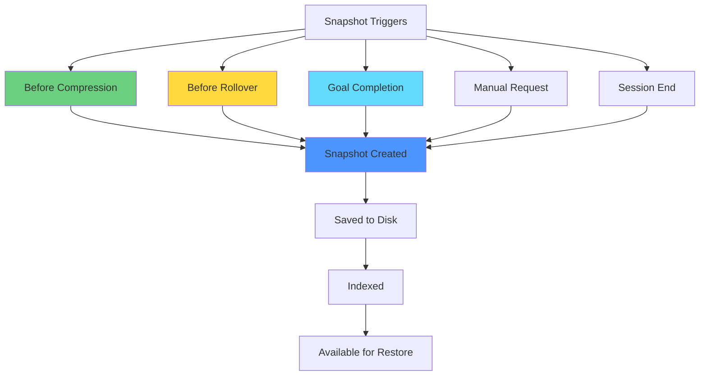
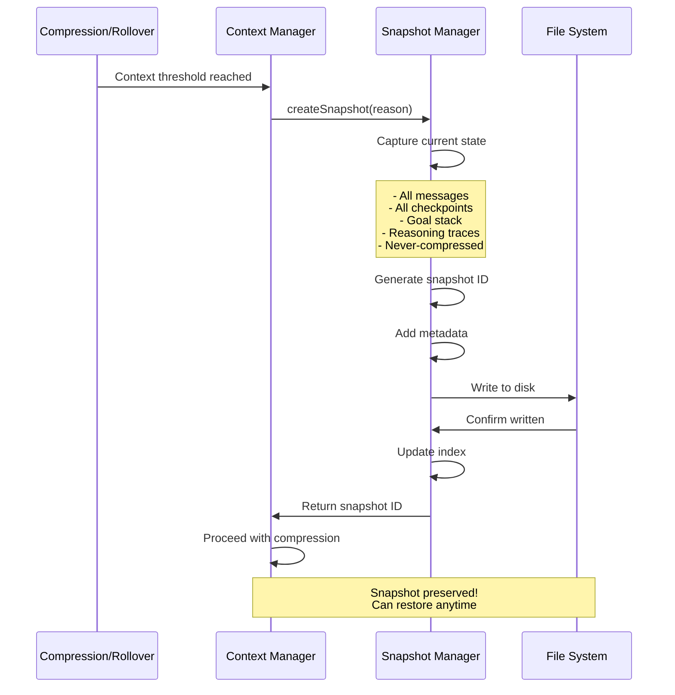
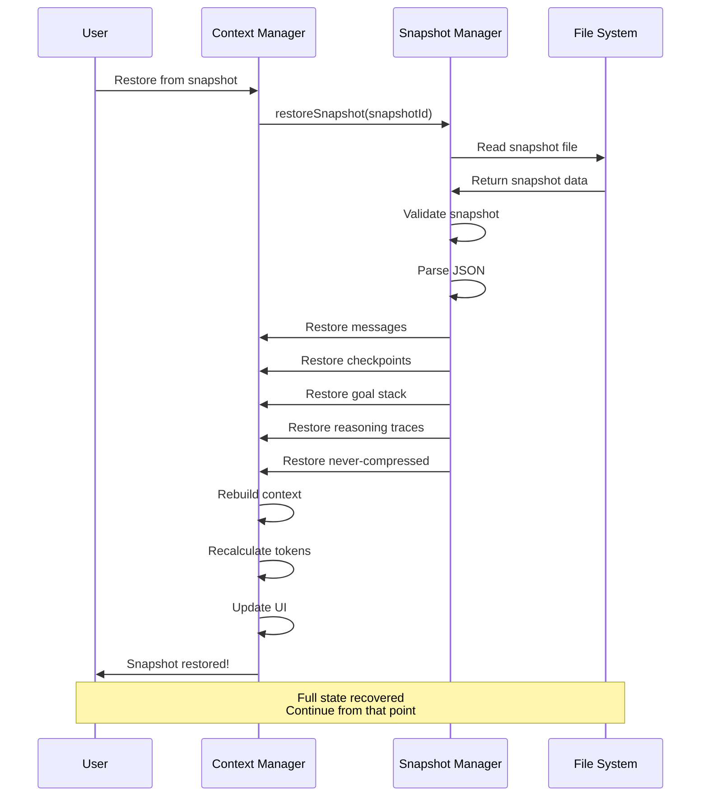
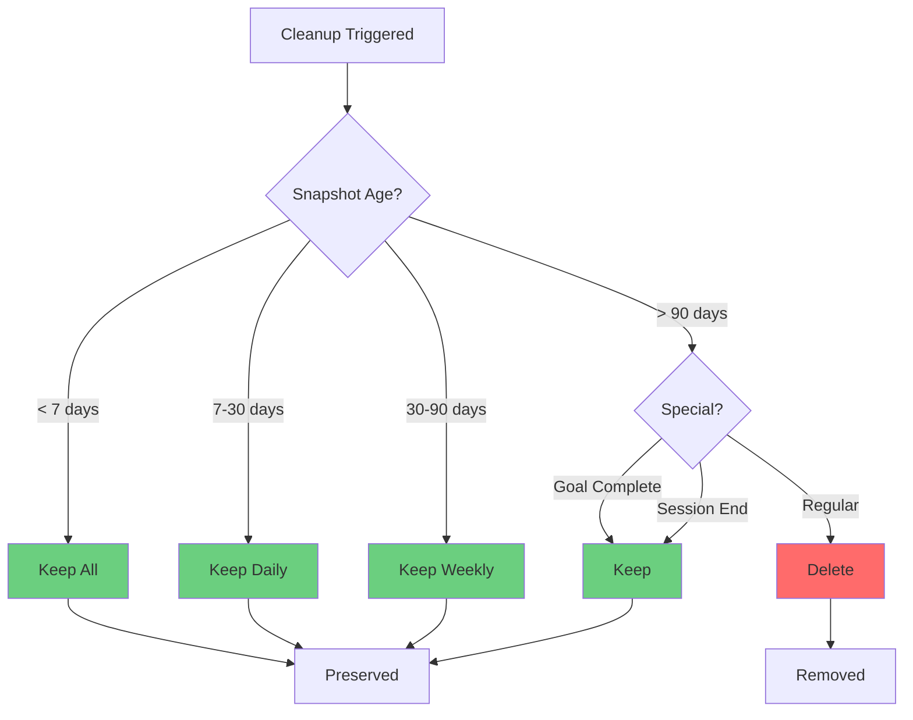

# Session Snapshots - Complete Context Preservation

**Date:** January 21, 2026  
**Feature:** Automatic snapshot creation for context rollover and recovery  
**Status:** ✅ Implemented

---

## Overview

Session snapshots provide complete preservation of conversation state, enabling:
- **Context Rollover** - Start fresh while maintaining history
- **Session Recovery** - Restore from any point in conversation
- **Audit Trail** - Complete record of all interactions
- **Goal Continuity** - Preserve goals and reasoning across sessions

**Key Principle:** Never lose information. Snapshots capture everything before compression or rollover.

---

## What Gets Captured

### Complete Conversation State

```typescript
interface SessionSnapshot {
  // Metadata
  id: string;                    // Unique snapshot ID
  timestamp: Date;               // When snapshot was created
  reason: SnapshotReason;        // Why it was created
  
  // Context State
  messages: Message[];           // All messages (system + user + assistant)
  checkpoints: Checkpoint[];     // All checkpoints (full detail)
  systemPrompt: string;          // Current system prompt
  
  // Goal Management ⭐ NEW
  goalStack: GoalStack;          // Active and completed goals
  reasoningStorage: ReasoningStorage;  // Reasoning traces
  
  // Never-Compressed Sections
  neverCompressed: {
    taskDefinition?: TaskDefinition;
    architectureDecisions?: ArchitectureDecision[];
    apiContracts?: APIContract[];
    codeStandards?: CodeStandards;
  };
  
  // Configuration
  config: {
    tier: ContextTier;           // Context size tier
    mode: OperationalMode;       // Current mode
    maxTokens: number;           // Context limit
    modelName: string;           // Model being used
  };
  
  // Statistics
  stats: {
    totalMessages: number;
    totalTokens: number;
    compressionCount: number;
    sessionDuration: number;     // milliseconds
  };
}
```

### Goal Stack Preservation

```typescript
interface GoalStack {
  activeGoal: Goal | null;       // Current active goal
  goalHistory: Goal[];           // All goals (active, completed, paused)
  stats: {
    totalGoals: number;
    completedGoals: number;
    pausedGoals: number;
    abandonedGoals: number;
    sessionDuration: number;
  };
}

interface Goal {
  id: string;
  description: string;
  priority: 'high' | 'medium' | 'low';
  status: 'active' | 'completed' | 'paused' | 'abandoned';
  createdAt: Date;
  completedAt?: Date;
  
  // Progress tracking
  subtasks: Subtask[];
  checkpoints: GoalCheckpoint[];
  decisions: Decision[];
  artifacts: Artifact[];
  blockers: Blocker[];
  
  // Metadata
  estimatedEffort?: string;
  actualEffort?: number;
  tags?: string[];
}
```

### Reasoning Trace Preservation

```typescript
interface ReasoningStorage {
  recent: ReasoningTrace[];      // Last N traces (full detail)
  archived: ArchivedReasoningTrace[];  // Older traces (summaries)
  totalTraces: number;
  totalThinkingTokens: number;
}

interface ReasoningTrace {
  id: string;
  timestamp: Date;
  messageId: string;
  thinking: string;              // Full thinking content
  structured?: {
    alternatives: string[];
    chosenApproach: string;
    rationale: string;
    confidence: number;
    keyInsights: string[];
  };
  context: {
    goalId?: string;
    checkpointId?: string;
    userMessageId?: string;
  };
  metadata: {
    modelName: string;
    thinkingTokens: number;
    answerTokens: number;
  };
}
```

---

## When Snapshots Are Created

### Automatic Triggers



### Trigger Details

| Trigger | When | Why | Frequency |
|---------|------|-----|-----------|
| **Before Compression** | Context reaches 80% | Preserve pre-compression state | Every compression |
| **Before Rollover** | Context reaches 90% (Tier 1) | Preserve before reset | Tier 1 only |
| **Goal Completion** | User completes a goal | Milestone preservation | Per goal |
| **Manual Request** | User requests snapshot | User-initiated backup | On demand |
| **Session End** | User ends conversation | Final state capture | Per session |

---

## Snapshot Storage

### File Structure

```
.ollm/snapshots/
├── session-{sessionId}/
│   ├── snapshot-{timestamp}-compression.json
│   ├── snapshot-{timestamp}-rollover.json
│   ├── snapshot-{timestamp}-goal-complete.json
│   ├── snapshot-{timestamp}-manual.json
│   └── snapshot-{timestamp}-session-end.json
└── index.json
```

### Index File

```json
{
  "sessions": [
    {
      "sessionId": "session-1768877364575",
      "startTime": "2026-01-21T08:00:00Z",
      "endTime": "2026-01-21T10:30:00Z",
      "snapshots": [
        {
          "id": "snapshot-abc123",
          "timestamp": "2026-01-21T09:15:00Z",
          "reason": "compression",
          "totalMessages": 150,
          "totalTokens": 25600,
          "activeGoal": "Build authentication system",
          "filePath": "session-1768877364575/snapshot-abc123.json"
        }
      ]
    }
  ]
}
```

---

## Snapshot Lifecycle

### Creation Flow



### Restoration Flow



---

## Snapshot Compression

### Storage Optimization

**Problem:** Snapshots can be large (100KB - 1MB+ per snapshot)

**Solution:** Compress snapshots after creation

```typescript
interface CompressedSnapshot {
  id: string;
  timestamp: Date;
  reason: SnapshotReason;
  
  // Compressed data (gzip)
  data: Buffer;  // Compressed JSON
  
  // Metadata (uncompressed for quick access)
  metadata: {
    totalMessages: number;
    totalTokens: number;
    activeGoal?: string;
    modelName: string;
    tier: ContextTier;
    mode: OperationalMode;
  };
  
  // Compression stats
  compression: {
    originalSize: number;
    compressedSize: number;
    ratio: number;  // e.g., 0.25 = 75% reduction
  };
}
```

**Compression Ratios:**
- Text messages: ~70-80% reduction
- JSON structure: ~60-70% reduction
- Overall: ~65-75% reduction

**Example:**
```
Original snapshot: 500KB
Compressed: 150KB (70% reduction)
Savings: 350KB per snapshot
```

---

## Snapshot Cleanup

### Automatic Cleanup Policy

```typescript
interface CleanupPolicy {
  // Keep all snapshots from last N days
  keepRecentDays: number;  // Default: 7 days
  
  // Keep one snapshot per day for older sessions
  keepDailyDays: number;   // Default: 30 days
  
  // Keep one snapshot per week for ancient sessions
  keepWeeklyDays: number;  // Default: 90 days
  
  // Delete everything older than this
  maxAgeDays: number;      // Default: 180 days
  
  // Always keep goal completion snapshots
  keepGoalSnapshots: boolean;  // Default: true
  
  // Always keep session end snapshots
  keepSessionEndSnapshots: boolean;  // Default: true
}
```

### Cleanup Flow



---

## Use Cases

### 1. Context Rollover (Tier 1)

**Scenario:** 4K context fills up, need to continue conversation

```
Before Rollover:
├─ System Prompt: 500 tokens
├─ Messages 1-50: 3,500 tokens
└─ Total: 4,000 tokens (100%)

Action: Create snapshot
├─ Snapshot ID: snapshot-abc123
├─ Saved to: .ollm/snapshots/session-xyz/snapshot-abc123.json
└─ Size: 250KB (compressed: 75KB)

After Rollover:
├─ System Prompt: 500 tokens
├─ Summary: 300 tokens (from snapshot)
└─ Total: 800 tokens (20%)

Result: Can continue conversation, full history in snapshot
```

### 2. Goal Milestone Preservation

**Scenario:** User completes major goal, want to preserve state

```
Goal Completed: "Build authentication system"
├─ Duration: 2.5 hours
├─ Messages: 150
├─ Checkpoints: 5
├─ Decisions: 8
├─ Artifacts: 12 files
└─ Reasoning Traces: 15

Action: Create snapshot
├─ Snapshot ID: snapshot-goal-auth
├─ Reason: goal-complete
├─ Tagged: "authentication", "milestone"
└─ Preserved: Full goal context + reasoning

Result: Complete audit trail of goal achievement
```

### 3. Session Recovery

**Scenario:** App crashes, need to recover session

```
Session Interrupted:
├─ Last snapshot: 5 minutes ago
├─ Snapshot ID: snapshot-def456
└─ State: 80% through compression

Action: Restore from snapshot
├─ Load: snapshot-def456.json
├─ Restore: All messages, goals, reasoning
├─ Rebuild: Context state
└─ Resume: From exact point

Result: No data loss, seamless recovery
```

### 4. Experimentation

**Scenario:** User wants to try different approach without losing current work

```
Current State:
├─ Working on feature X
├─ 100 messages
└─ 3 goals in progress

Action: Create manual snapshot
├─ Snapshot ID: snapshot-before-experiment
├─ Reason: manual
└─ Tagged: "experiment", "backup"

Try Experiment:
├─ Make changes
├─ Test approach
└─ Evaluate results

If Failed:
├─ Restore: snapshot-before-experiment
└─ Continue: From original state

If Successful:
├─ Keep: Current state
└─ Delete: Experimental snapshot

Result: Safe experimentation without risk
```

---

## Integration with Goal Management

### Goal-Aware Snapshots

```typescript
interface GoalSnapshot extends SessionSnapshot {
  // Goal-specific metadata
  goalContext: {
    goalId: string;
    goalDescription: string;
    goalStatus: GoalStatus;
    completionSummary?: string;
    
    // Progress metrics
    checkpointsReached: number;
    decisionsMade: number;
    artifactsCreated: number;
    blockersResolved: number;
    
    // Time tracking
    estimatedEffort?: string;
    actualEffort: number;  // milliseconds
    
    // Reasoning traces for this goal
    reasoningTraces: ReasoningTrace[];
  };
}
```

### Goal Completion Snapshots

**Special Treatment:**
- Never automatically deleted
- Tagged with goal description
- Includes all reasoning traces
- Full artifact list
- Complete decision history

**Benefits:**
- Complete audit trail per goal
- Can review past decisions
- Learn from previous approaches
- Share goal achievements

---

## Performance Considerations

### Snapshot Creation

| Operation | Time | Notes |
|-----------|------|-------|
| **Capture State** | < 10ms | In-memory copy |
| **Serialize JSON** | < 50ms | For 500KB snapshot |
| **Compress** | < 100ms | gzip compression |
| **Write to Disk** | < 50ms | Async write |
| **Update Index** | < 10ms | Small JSON update |
| **Total** | < 220ms | Non-blocking |

### Snapshot Restoration

| Operation | Time | Notes |
|-----------|------|-------|
| **Read from Disk** | < 50ms | Async read |
| **Decompress** | < 100ms | gzip decompression |
| **Parse JSON** | < 50ms | For 500KB snapshot |
| **Restore State** | < 20ms | Object reconstruction |
| **Rebuild Context** | < 30ms | Token recalculation |
| **Total** | < 250ms | User-initiated |

### Storage Requirements

**Per Session:**
- Average: 5-10 snapshots
- Size: 75KB compressed each
- Total: 375KB - 750KB per session

**Per Month (active user):**
- Sessions: ~60 (2 per day)
- Snapshots: ~300-600
- Storage: ~22MB - 45MB
- After cleanup: ~5MB - 10MB

---

## Best Practices

### For Users

1. **Let Automatic Snapshots Work**
   - System creates snapshots before compression
   - No manual action needed
   - Snapshots are your safety net

2. **Create Manual Snapshots for Experiments**
   - Before trying risky changes
   - Before major refactoring
   - Before switching approaches

3. **Review Goal Completion Snapshots**
   - Complete audit trail of achievements
   - Learn from past decisions
   - Share with team

4. **Trust the Cleanup Policy**
   - Recent snapshots always preserved
   - Important snapshots never deleted
   - Storage managed automatically

### For Developers

1. **Always Snapshot Before Compression**
   - Enables rollback if needed
   - Provides audit trail
   - Minimal performance impact

2. **Include Full Context**
   - All messages (don't filter)
   - All checkpoints (full detail)
   - All goals and reasoning
   - All never-compressed sections

3. **Compress Snapshots**
   - 70% storage savings
   - Fast compression (< 100ms)
   - Transparent to users

4. **Index for Fast Access**
   - Metadata in index
   - Quick snapshot lookup
   - Efficient restoration

---

## Future Enhancements

### Planned Features

1. **Snapshot Diff Viewer**
   - Compare two snapshots
   - See what changed
   - Understand progression

2. **Snapshot Export**
   - Export to JSON
   - Share with team
   - Import to another session

3. **Snapshot Search**
   - Search by goal
   - Search by date range
   - Search by content

4. **Snapshot Analytics**
   - Session duration trends
   - Goal completion rates
   - Token usage patterns
   - Reasoning trace insights

5. **Cloud Backup**
   - Optional cloud storage
   - Cross-device sync
   - Team collaboration

---

## Summary

### Key Benefits

✅ **Never Lose Information**
- Complete state preservation
- Automatic before compression
- Manual on demand

✅ **Goal Continuity**
- Goals preserved across sessions
- Reasoning traces maintained
- Decision history intact

✅ **Session Recovery**
- Recover from crashes
- Restore any point
- No data loss

✅ **Experimentation Safety**
- Try approaches safely
- Rollback if needed
- Learn from attempts

✅ **Audit Trail**
- Complete conversation history
- Goal achievement records
- Decision documentation

### Implementation Status

| Feature | Status |
|---------|--------|
| **Basic Snapshots** | ✅ Implemented |
| **Goal Integration** | ✅ Implemented |
| **Reasoning Traces** | ✅ Implemented |
| **Compression** | ✅ Implemented |
| **Cleanup Policy** | ✅ Implemented |
| **Restoration** | ✅ Implemented |
| **Index Management** | ✅ Implemented |

---

## Related Documentation

- [Context Architecture](./Context-Architecture.md) - Overall system design
- [Checkpoint Flow Diagram](./Checkpoint_Flow-Diagram.md) - Compression flow
- [Goal Management](./development/2026-01-21/GOAL-ORIENTED-CONTEXT-DESIGN.md) - Goal system design
- [Reasoning Traces](./development/2026-01-21/REASONING-TRACES-COMPLETE.md) - Reasoning capture

---

**Document Status:** ✅ Complete  
**Last Updated:** January 21, 2026  
**Feature Version:** 2.2  
**Implementation:** Fully integrated with goal management and reasoning traces
