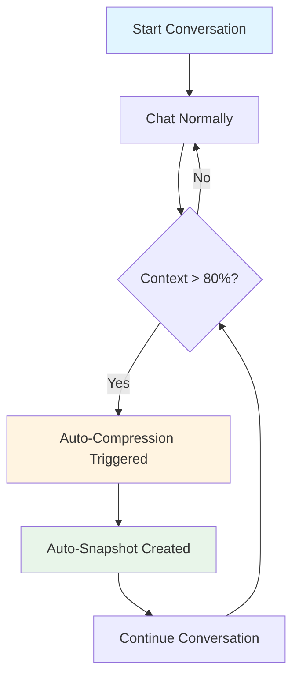
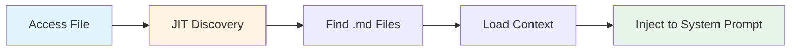
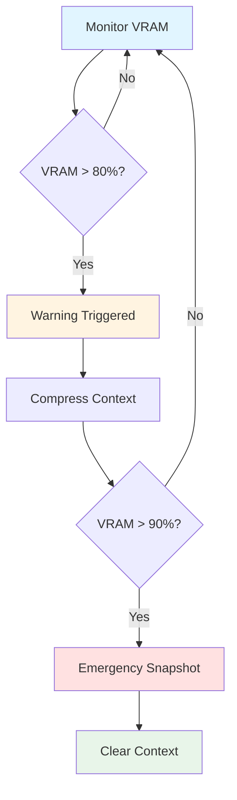

# Getting Started with Context Management

**Quick Start Guide for OLLM CLI Context Management**

---

## 📋 Table of Contents

1. [Introduction](#introduction)
2. [Prerequisites](#prerequisites)
3. [Quick Start](#quick-start)
4. [Basic Usage](#basic-usage)
5. [Configuration](#configuration)
6. [Common Workflows](#common-workflows)
7. [Troubleshooting](#troubleshooting)
8. [Next Steps](#next-steps)

**See Also:**
- [Context Overview](README.md) - Main documentation
- [Configuration Guide](Context_configuration.md) - Detailed configuration
- [Commands Reference](Context_commands.md) - All commands

---

## Introduction

### What is Context Management?

Context Management in OLLM CLI handles conversation memory efficiently, ensuring your local LLM can:
- Maintain long conversations without running out of memory
- Automatically adjust context size based on available VRAM
- Save and restore conversation checkpoints
- Compress older messages to stay within token limits

### Why Do You Need It?

**Without Context Management:**
- ❌ Conversations crash when GPU runs out of memory
- ❌ Hit token limits and lose conversation history
- ❌ Manual memory management required
- ❌ Risk of out-of-memory errors

**With Context Management:**
- ✅ Automatic VRAM monitoring and adjustment
- ✅ Intelligent compression keeps conversations going
- ✅ Snapshots let you save/restore conversation states
- ✅ Memory safety prevents crashes

---

## Prerequisites

### System Requirements

**Minimum:**
- OLLM CLI installed
- Local LLM running (via Ollama)
- 4GB VRAM (or CPU mode)

**Recommended:**
- 8GB+ VRAM for larger contexts
- SSD for fast snapshot storage
- GPU with monitoring support (NVIDIA, AMD, or Apple Silicon)

### Check Your Setup

```bash
# Check OLLM CLI version
ollm --version

# Check available models
ollm models list

# Check GPU memory (if available)
nvidia-smi  # NVIDIA
rocm-smi    # AMD
```

---

## Quick Start

### Step 1: Check Context Status

```bash
/context
```

**Output:**
```
┌─ Context Status ─────────────────────────────────────┐
│ Model: llama3.1:8b                                   │
│ Context: 2,048 / 8,192 tokens (25%)                 │
│ VRAM: 4.2 / 8.0 GB (52%)                            │
│ Auto-size: disabled                                  │
│ Compression: disabled                                │
│ Snapshots: 0 available                               │
└──────────────────────────────────────────────────────┘
```

### Step 2: Enable Auto-Sizing

Auto-sizing automatically adjusts your context window based on available VRAM:

```bash
/context auto
```

**Output:**
```
✅ Auto-sizing enabled
📊 Optimal context size: 16,384 tokens
💾 VRAM usage: 4.2 / 8.0 GB (52%)
```

### Step 3: Enable Compression

Compression keeps long conversations manageable:

```bash
# Enable via command (temporary)
/context compress enable

# Or configure permanently
```

Add to `~/.ollm/config.yaml`:
```yaml
context:
  compression:
    enabled: true
    strategy: hybrid
    threshold: 0.8
```

### Step 4: Test It Out

Start a conversation and watch context management in action:

```bash
# Long conversation example
You: Tell me about TypeScript
AI: [Response about TypeScript...]

You: What are its benefits?
AI: [Response about benefits...]

# Check status
/context

# Create a snapshot
/context snapshot
```

---

## Basic Usage

### Viewing Context Status

**Show current status:**
```bash
/context
```

**Show detailed statistics:**
```bash
/context stats
```

**Output:**
```
📊 Context Statistics
━━━━━━━━━━━━━━━━━━━━━━━━━━━━━━━━━━━━━━━━━━━━━━━━━━━━
Model: llama3.1:8b
Context Window: 16,384 tokens
━━━━━━━━━━━━━━━━━━━━━━━━━━━━━━━━━━━━━━━━━━━━━━━━━━━━
Usage:
  Current: 12,847 tokens (78%)
  System Prompt: 256 tokens
  Messages: 12,591 tokens (45 messages)
  
VRAM:
  Total: 8.0 GB
  Used: 6.2 GB (77%)
  Available: 1.8 GB
  Model: 4.1 GB
  KV Cache: 1.9 GB
  
Compression:
  Status: Enabled (hybrid strategy)
  Threshold: 80%
  Last Compressed: 5 minutes ago
  Saved: 3,456 tokens
  
Snapshots:
  Available: 3
  Last Created: 10 minutes ago
  Total Size: 2.4 MB
━━━━━━━━━━━━━━━━━━━━━━━━━━━━━━━━━━━━━━━━━━━━━━━━━━━━
```

### Managing Context Size

**Set specific size:**
```bash
/context size 8192
```

**Enable auto-sizing:**
```bash
/context auto
```

**Set size range:**
```yaml
# ~/.ollm/config.yaml
context:
  minSize: 2048
  maxSize: 32768
  targetSize: 16384
```

### Creating Snapshots

**Manual snapshot:**
```bash
/context snapshot
```

**With description:**
```bash
/context snapshot "Before refactoring discussion"
```

**List snapshots:**
```bash
/context list
```

**Output:**
```
📸 Available Snapshots
━━━━━━━━━━━━━━━━━━━━━━━━━━━━━━━━━━━━━━━━━━━━━━━━━━━━
1. snapshot-2026-01-16-14-30-45
   Created: 2 hours ago
   Tokens: 12,847
   Messages: 45
   Description: Before refactoring discussion
   
2. snapshot-2026-01-16-12-15-22
   Created: 4 hours ago
   Tokens: 8,234
   Messages: 32
   Description: Auto-snapshot at 80%
   
3. snapshot-2026-01-16-10-00-00
   Created: 6 hours ago
   Tokens: 5,123
   Messages: 20
   Description: Auto-snapshot at 80%
━━━━━━━━━━━━━━━━━━━━━━━━━━━━━━━━━━━━━━━━━━━━━━━━━━━━
```

**Restore snapshot:**
```bash
/context restore snapshot-2026-01-16-14-30-45
```

### Compressing Context

**Manual compression:**
```bash
/context compress
```

**Output:**
```
🗜️ Compressing context...
📊 Before: 12,847 tokens (45 messages)
📊 After: 8,234 tokens (15 messages)
✅ Saved: 4,613 tokens (36%)
```

### Clearing Context

**Clear all messages (keep system prompt):**
```bash
/context clear
```

**Clear with confirmation:**
```bash
/context clear --confirm
```

---

## Configuration

### Basic Configuration

Create or edit `~/.ollm/config.yaml`:

```yaml
context:
  # Target context size (tokens)
  targetSize: 16384
  
  # Enable auto-sizing based on VRAM
  autoSize: true
  
  # VRAM safety buffer (MB)
  vramBuffer: 512
  
  # KV cache quantization
  kvQuantization: q8_0
  
  # Compression settings
  compression:
    enabled: true
    threshold: 0.8          # Trigger at 80%
    strategy: hybrid        # truncate, summarize, or hybrid
    preserveRecent: 4096    # Keep last 4K tokens
  
  # Snapshot settings
  snapshots:
    enabled: true
    maxCount: 5
    autoCreate: true
    autoThreshold: 0.8
```

### Configuration by Scenario

**Limited VRAM (4GB):**
```yaml
context:
  targetSize: 4096
  autoSize: true
  vramBuffer: 256
  kvQuantization: q4_0  # More aggressive quantization
```

**Large VRAM (24GB+):**
```yaml
context:
  targetSize: 32768
  autoSize: true
  vramBuffer: 1024
  kvQuantization: q8_0  # Better quality
```

**Long Conversations:**
```yaml
context:
  compression:
    enabled: true
    strategy: hybrid
    threshold: 0.7      # Compress earlier
  snapshots:
    enabled: true
    autoCreate: true
    maxCount: 10        # Keep more snapshots
```

**Performance Priority:**
```yaml
context:
  compression:
    enabled: true
    strategy: truncate  # Fastest
  snapshots:
    enabled: false      # Disable for speed
```

---

## Common Workflows

### Workflow 1: Long Conversation



**Steps:**
1. Start conversation normally
2. System monitors context usage
3. At 80%, automatic compression triggers
4. Snapshot created automatically
5. Continue conversation seamlessly

### Workflow 2: Project Context



**Steps:**
1. Create `.ollm.md` in project root
2. Add project-specific instructions
3. Access any file in project
4. Context automatically loaded
5. LLM aware of project conventions

**Example `.ollm.md`:**
```markdown
# Project Context

This is a TypeScript project using:
- React 18
- Vite for bundling
- Vitest for testing

Code style:
- Use functional components
- Prefer const over let
- Use TypeScript strict mode
```

### Workflow 3: Memory Management



**Steps:**
1. System monitors VRAM continuously
2. At 80%, warning and compression
3. At 90%, emergency snapshot
4. At 95%, clear context to prevent crash

---

## Troubleshooting

### Problem: Out of Memory Errors

**Symptoms:**
- GPU crashes
- "CUDA out of memory" errors
- System freezes

**Solutions:**

1. **Enable auto-sizing:**
   ```bash
   /context auto
   ```

2. **Reduce target size:**
   ```bash
   /context size 4096
   ```

3. **Increase VRAM buffer:**
   ```yaml
   context:
     vramBuffer: 1024  # Increase buffer
   ```

4. **Use more aggressive quantization:**
   ```yaml
   context:
     kvQuantization: q4_0  # Instead of q8_0
   ```

### Problem: Context Overflow

**Symptoms:**
- "Context length exceeded" errors
- Responses truncated
- Can't add more messages

**Solutions:**

1. **Enable compression:**
   ```yaml
   context:
     compression:
       enabled: true
       strategy: hybrid
   ```

2. **Create snapshot and clear:**
   ```bash
   /context snapshot "Before clearing"
   /context clear
   ```

3. **Reduce preserve recent:**
   ```yaml
   context:
     compression:
       preserveRecent: 2048  # Reduce from 4096
   ```

### Problem: Slow Performance

**Symptoms:**
- Slow responses
- High memory usage
- Compression takes long time

**Solutions:**

1. **Use truncate strategy:**
   ```yaml
   context:
     compression:
       strategy: truncate  # Faster than summarize
   ```

2. **Disable auto-snapshots:**
   ```yaml
   context:
     snapshots:
       autoCreate: false
   ```

3. **Reduce compression frequency:**
   ```yaml
   context:
     compression:
       threshold: 0.9  # Compress less often
   ```

---

## Next Steps

### Learn More

**User Guides:**
- [User Guide](management/user-guide.md) - Detailed usage guide
- [Snapshots](management/snapshots.md) - Snapshot system
- [Compression](management/compression.md) - Compression strategies

**Technical Documentation:**
- [Architecture](Context_architecture.md) - System design
- [Configuration](Context_configuration.md) - All options
- [Commands](Context_commands.md) - Complete reference

**Monitoring:**
- [VRAM Monitoring](monitoring/vram-monitoring.md) - GPU tracking
- [Memory Safety](monitoring/memory-safety.md) - OOM prevention

### Advanced Topics

1. **Custom Compression Strategies**
   - Learn about [Compression Service API](api/compression-service.md)
   - Implement custom strategies

2. **Integration**
   - Integrate context management in your app
   - See [Context Manager API](api/context-manager.md)

3. **Performance Tuning**
   - Optimize for your hardware
   - See [Configuration Guide](Context_configuration.md#performance-tuning)

---

## Quick Reference

### Essential Commands

```bash
/context                    # Show status
/context auto               # Enable auto-sizing
/context size 8192          # Set size
/context snapshot           # Create snapshot
/context list               # List snapshots
/context restore <id>       # Restore snapshot
/context compress           # Compress now
/context clear              # Clear context
/context stats              # Detailed stats
```

### Essential Configuration

```yaml
context:
  targetSize: 16384
  autoSize: true
  vramBuffer: 512
  compression:
    enabled: true
    strategy: hybrid
  snapshots:
    enabled: true
    autoCreate: true
```

---

**Last Updated:** 2026-01-16  
**Version:** 0.1.0  
**Status:** ✅ Complete
