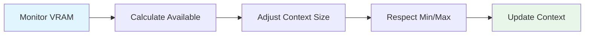
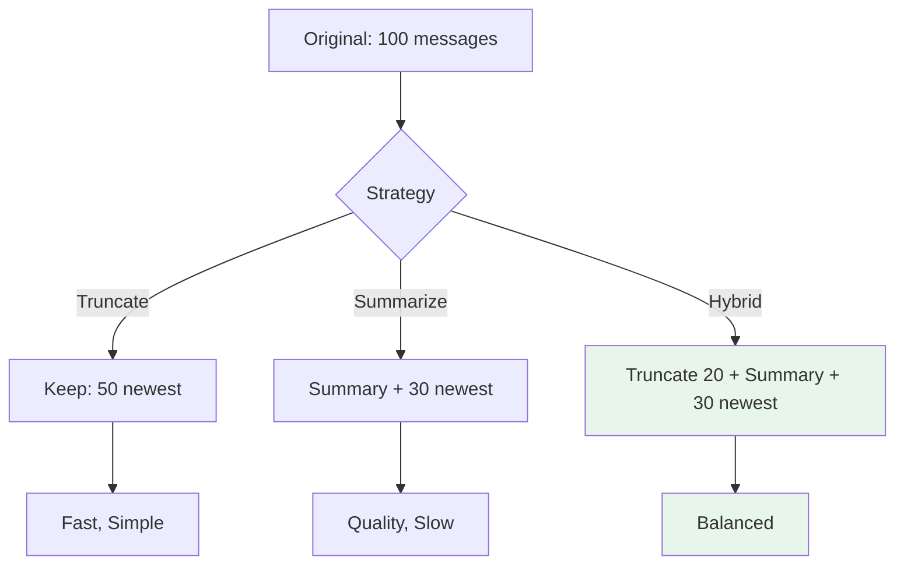

# Context Management User Guide

Complete guide to using Context Management features in OLLM CLI.

## Table of Contents

- [Understanding Context](#understanding-context)
- [Monitoring Context](#monitoring-context)
- [Managing Context Size](#managing-context-size)
- [Working with Snapshots](#working-with-snapshots)
- [Using Compression](#using-compression)
- [Memory Warnings](#memory-warnings)
- [Best Practices](#best-practices)
- [Common Workflows](#common-workflows)
- [Troubleshooting](#troubleshooting)

---

## Understanding Context

### What is Context?

Context is the conversation history that the AI model uses to generate responses. It includes:
- System prompt (instructions for the AI)
- Previous user messages
- Previous assistant responses
- Any loaded files or documentation

### Why Context Matters

**Context Size Affects:**
- **Response Quality**: More context = better understanding
- **Memory Usage**: Larger context = more VRAM needed
- **Response Speed**: Very large context = slower responses
- **Conversation Length**: Limited context = need to compress or clear

### Context Limits

Every model has a maximum context window:
- **Llama 2**: 4,096 tokens
- **Llama 3**: 8,192 tokens
- **Llama 3.1**: 128,000 tokens (practical: 32K-64K)
- **Mistral**: 32,768 tokens

**Token Estimation:**
- ~4 characters = 1 token
- ~750 words = 1,000 tokens
- Average message = 50-200 tokens

---

## Monitoring Context

### Checking Context Status

**Command:**
```bash
/context
```

**Output:**
```
Context Status:
  Model: llama3.1:8b
  Tokens: 12,847 / 32,768 (39.2%)
  VRAM: 6.2 GB / 8.0 GB (77.5%)
  KV Cache: q8_0 (1.8 GB)
  Snapshots: 3 available
  Auto-compress: enabled at 80%
```

**What to Look For:**
- **Token Usage**: How full is your context?
- **VRAM Usage**: Is GPU memory getting tight?
- **Snapshots**: Do you have restore points?
- **Auto-compress**: Is automatic compression enabled?

### Status Bar

The status bar shows real-time context information:
```
[●] llama3.1:8b | 12.8K/32.7K (39%) | VRAM: 6.2/8.0GB
```

**Indicators:**
- **Green**: Normal operation (< 80%)
- **Yellow**: Warning (80-90%)
- **Red**: Critical (> 90%)

### Detailed Statistics

**Command:**
```bash
/context stats
```

**Output:**
```
Detailed Context Statistics:

Memory:
  Model Weights: 4.2 GB
  KV Cache: 1.8 GB (q8_0)
  Total VRAM: 6.2 GB / 8.0 GB
  Safety Buffer: 512.0 MB reserved

Context:
  Current: 12,847 tokens
  Maximum: 32,768 tokens
  Usage: 39.2%

Session:
  Duration: 2h 15m
  Messages: 24
  Snapshots: 3
```

---

## Managing Context Size

### Automatic Sizing (Recommended)

**Enable auto-sizing:**
```bash
/context auto
```

**Benefits:**
- Adapts to available VRAM
- Maximizes context within limits
- Handles memory pressure automatically
- Recommended for most users

**How It Works:**


### Manual Sizing

**Set specific size:**
```bash
/context size 16384
```

**When to Use:**
- Testing with consistent size
- Specific application requirements
- Troubleshooting issues
- Benchmarking performance

**Examples:**
```bash
# Small context for low VRAM
/context size 4096

# Medium context
/context size 8192

# Large context
/context size 16384

# Maximum context
/context size 32768
```

### Size Recommendations

**By VRAM:**
- **4GB**: 4K-8K tokens
- **6GB**: 8K-16K tokens
- **8GB**: 16K-24K tokens
- **12GB+**: 24K-32K+ tokens

**By Use Case:**
- **Quick questions**: 4K-8K tokens
- **Code assistance**: 8K-16K tokens
- **Long conversations**: 16K-32K tokens
- **Document analysis**: 32K+ tokens

---

## Working with Snapshots

### What are Snapshots?

Snapshots are saved states of your conversation that you can restore later. Think of them as "save points" in a game.

**Snapshots Include:**
- All messages in conversation
- System prompt
- Token count and metadata
- Timestamp and model info

### Creating Snapshots

**Manual snapshot:**
```bash
/context snapshot
```

**Output:**
```
Snapshot created: snapshot-2026-01-16-14-30-45
Tokens: 12,847 | Messages: 24
```

**Automatic snapshots:**
- Created automatically at 80% context usage (configurable)
- Created before emergency context clear
- Rolling cleanup keeps last N snapshots

### Listing Snapshots

**Command:**
```bash
/context list
```

**Output:**
```
Snapshots:
  1. snapshot-2026-01-16-14-30-45 - 2 hours ago (12,847 tokens)
  2. snapshot-2026-01-16-12-15-30 - 4 hours ago (8,234 tokens)
  3. snapshot-2026-01-16-10-00-00 - 6 hours ago (15,432 tokens)
```

### Restoring Snapshots

**Command:**
```bash
/context restore snapshot-2026-01-16-14-30-45
```

**Output:**
```
Restored snapshot snapshot-2026-01-16-14-30-45
Tokens: 12,847
```

**⚠️ Warning:** Restoring replaces current context!

**Safe Restore:**
```bash
# 1. Create snapshot of current state
/context snapshot

# 2. Restore previous snapshot
/context restore <snapshot-id>

# 3. If needed, restore current state
/context list
/context restore <current-snapshot-id>
```

### Snapshot Management

**Storage Location:**
```
~/.ollm/session-data/{sessionId}/snapshots/
```

**Automatic Cleanup:**
- Keeps last N snapshots (default: 5)
- Oldest snapshots deleted automatically
- Configurable via `snapshots.maxCount`

**Manual Cleanup:**
```bash
# List snapshots
/context list

# Delete old snapshots manually
rm ~/.ollm/session-data/*/snapshots/snapshot-*
```

---

## Using Compression

### What is Compression?

Compression reduces context size by:
- Removing oldest messages (truncate)
- Summarizing old messages (summarize)
- Combining both approaches (hybrid)

**Always Preserved:**
- System prompt
- Recent messages (configurable)

### Manual Compression

**Command:**
```bash
/context compress
```

**Output:**
```
Compressed: 12,847 → 8,234 tokens (35.9% reduction)
```

**When to Compress:**
- Context approaching limit (> 80%)
- Before adding large content
- Optimize memory usage
- Prepare for long conversation

### Automatic Compression

**Enabled by default** at 80% context usage.

**Configuration:**
```yaml
context:
  compression:
    enabled: true
    threshold: 0.8
    strategy: hybrid
```

**Disable if needed:**
```yaml
context:
  compression:
    enabled: false
```

### Compression Strategies

**1. Truncate** (Fast)
- Simply removes oldest messages
- No LLM call required
- May lose important context

**2. Summarize** (Quality)
- LLM generates summary
- Preserves semantic meaning
- Requires ~2s LLM call

**3. Hybrid** (Recommended)
- Truncates oldest
- Summarizes middle
- Preserves recent
- Best balance

**Comparison:**



---

## Memory Warnings

### Warning Levels

**Normal (< 80%)**
- Green indicator
- No action needed
- Context operating normally

**Warning (80-90%)**
- Yellow indicator
- Automatic compression triggered
- Monitor usage

**Critical (90-95%)**
- Red indicator
- Context size reduced
- Consider manual intervention

**Emergency (> 95%)**
- Red flashing indicator
- Emergency snapshot created
- Context cleared automatically
- Restore from snapshot to continue

### Responding to Warnings

**At 80% (Warning):**
```bash
# Check status
/context

# Compress if needed
/context compress

# Or create snapshot and clear
/context snapshot
/context clear
```

**At 90% (Critical):**
```bash
# Immediate compression
/context compress

# Or reduce context size
/context size 8192

# Or clear and start fresh
/context snapshot
/context clear
```

**At 95% (Emergency):**
```bash
# System will automatically:
# 1. Create emergency snapshot
# 2. Clear context
# 3. Preserve system prompt

# To continue, restore snapshot:
/context list
/context restore <emergency-snapshot-id>

# Or start fresh conversation
# (system prompt preserved)
```

---

## Best Practices

### 1. Enable Auto-Sizing

```bash
/context auto
```

**Benefits:**
- Adapts to available memory
- Maximizes context automatically
- Handles memory pressure
- Recommended for most users

### 2. Create Snapshots Regularly

```bash
# Before important operations
/context snapshot

# At conversation milestones
/context snapshot

# Before clearing context
/context snapshot
/context clear
```

### 3. Monitor Context Usage

```bash
# Check status periodically
/context

# Watch status bar
# Green = good, Yellow = warning, Red = critical
```

### 4. Compress Proactively

```bash
# Don't wait for automatic compression
# Compress when approaching 70-80%
/context compress
```

### 5. Use Appropriate Context Size

```bash
# Match your use case
/context size 8192   # Quick questions
/context size 16384  # Code assistance
/context size 32768  # Long conversations
```

### 6. Clean Up Old Snapshots

```bash
# List snapshots
/context list

# Keep only recent ones
# Delete old snapshots manually if needed
```

### 7. Configure for Your Hardware

**Low VRAM (4GB):**
```yaml
context:
  targetSize: 4096
  vramBuffer: 1073741824  # 1GB
  kvQuantization: q4_0
```

**High VRAM (16GB+):**
```yaml
context:
  targetSize: 32768
  vramBuffer: 536870912   # 512MB
  kvQuantization: f16
```

---

## Common Workflows

### Workflow 1: Long Conversation

```bash
# 1. Enable auto-sizing
/context auto

# 2. Enable auto-compression (default)
# (configured in config.yaml)

# 3. Create periodic snapshots
/context snapshot

# 4. Monitor usage
/context

# 5. Compress manually if needed
/context compress
```

### Workflow 2: Code Review Session

```bash
# 1. Set appropriate context size
/context size 16384

# 2. Create snapshot before starting
/context snapshot

# 3. Review code
# ... conversation ...

# 4. Create snapshot at milestones
/context snapshot

# 5. Compress if needed
/context compress
```

### Workflow 3: Document Analysis

```bash
# 1. Maximize context
/context auto

# 2. Load document
# ... load large document ...

# 3. Check usage
/context

# 4. Compress if needed
/context compress

# 5. Create snapshot of analysis
/context snapshot
```

### Workflow 4: Quick Questions

```bash
# 1. Use smaller context
/context size 4096

# 2. Ask questions
# ... quick Q&A ...

# 3. Clear when done
/context clear
```

### Workflow 5: Recovery from Error

```bash
# 1. List available snapshots
/context list

# 2. Restore previous state
/context restore <snapshot-id>

# 3. Verify restoration
/context

# 4. Continue conversation
```

---

## Troubleshooting

### Context Filling Up Too Fast

**Symptoms:**
- Reaching 80% quickly
- Frequent compression
- Running out of context

**Solutions:**
```bash
# 1. Enable auto-compression
# (check config.yaml)

# 2. Compress manually
/context compress

# 3. Increase context size
/context size 32768

# 4. Clear old messages
/context clear
```

### Snapshots Not Working

**Symptoms:**
- Snapshot creation fails
- Cannot restore snapshots
- Snapshots not listed

**Solutions:**
```bash
# 1. Check disk space
df -h ~/.ollm/

# 2. Check permissions
ls -la ~/.ollm/session-data/

# 3. Verify snapshot directory
ls ~/.ollm/session-data/*/snapshots/

# 4. Create snapshot manually
/context snapshot
```

### Memory Warnings Persist

**Symptoms:**
- Constant yellow/red indicators
- Frequent warnings
- Performance issues

**Solutions:**
```bash
# 1. Check VRAM usage
/context stats

# 2. Reduce context size
/context size 8192

# 3. Increase VRAM buffer
# (edit config.yaml: vramBuffer: 1073741824)

# 4. Use aggressive quantization
# (edit config.yaml: kvQuantization: q4_0)

# 5. Close other GPU applications
```

### Compression Not Reducing Tokens

**Symptoms:**
- Compression has minimal effect
- Token count stays high
- Still hitting limits

**Reasons:**
- Already at minimum (system prompt + recent)
- `preserveRecent` set too high
- Short conversation (nothing to compress)

**Solutions:**
```bash
# 1. Check configuration
# (edit config.yaml: preserveRecent: 2048)

# 2. Use more aggressive strategy
# (edit config.yaml: strategy: truncate)

# 3. Clear context if needed
/context snapshot
/context clear
```

### Auto-Sizing Not Working

**Symptoms:**
- Context size not adjusting
- Fixed size despite auto-sizing
- Not adapting to VRAM

**Solutions:**
```bash
# 1. Verify auto-sizing enabled
/context
# Should show "Auto-sizing: enabled"

# 2. Enable auto-sizing
/context auto

# 3. Check VRAM monitoring
/context stats
# Should show VRAM info

# 4. Check configuration
# (config.yaml: autoSize: true)
```

### Restore Fails

**Symptoms:**
- Cannot restore snapshot
- Error message on restore
- Snapshot corrupted

**Solutions:**
```bash
# 1. List available snapshots
/context list

# 2. Try different snapshot
/context restore <different-snapshot-id>

# 3. Check snapshot file
cat ~/.ollm/session-data/*/snapshots/<snapshot-id>.json

# 4. Start fresh if needed
/context clear
```

---

## See Also

- [Snapshots Guide](./snapshots.md) - Detailed snapshot documentation
- [Compression Guide](./compression.md) - Compression strategies
- [Commands Reference](../Context_commands.md) - All CLI commands
- [Configuration](../Context_configuration.md) - Configuration options
- [Troubleshooting](../../troubleshooting.md) - General troubleshooting

---

**Last Updated:** 2026-01-16  
**Version:** 1.0.0
