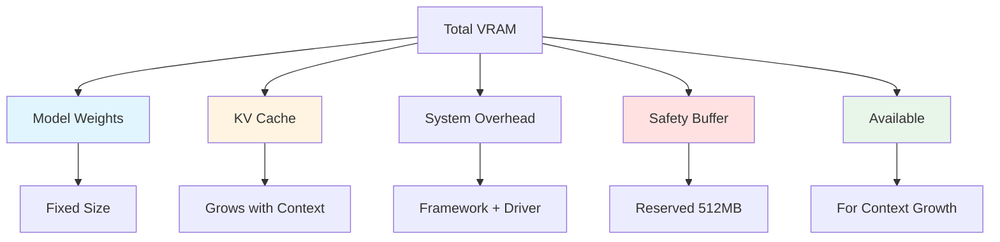
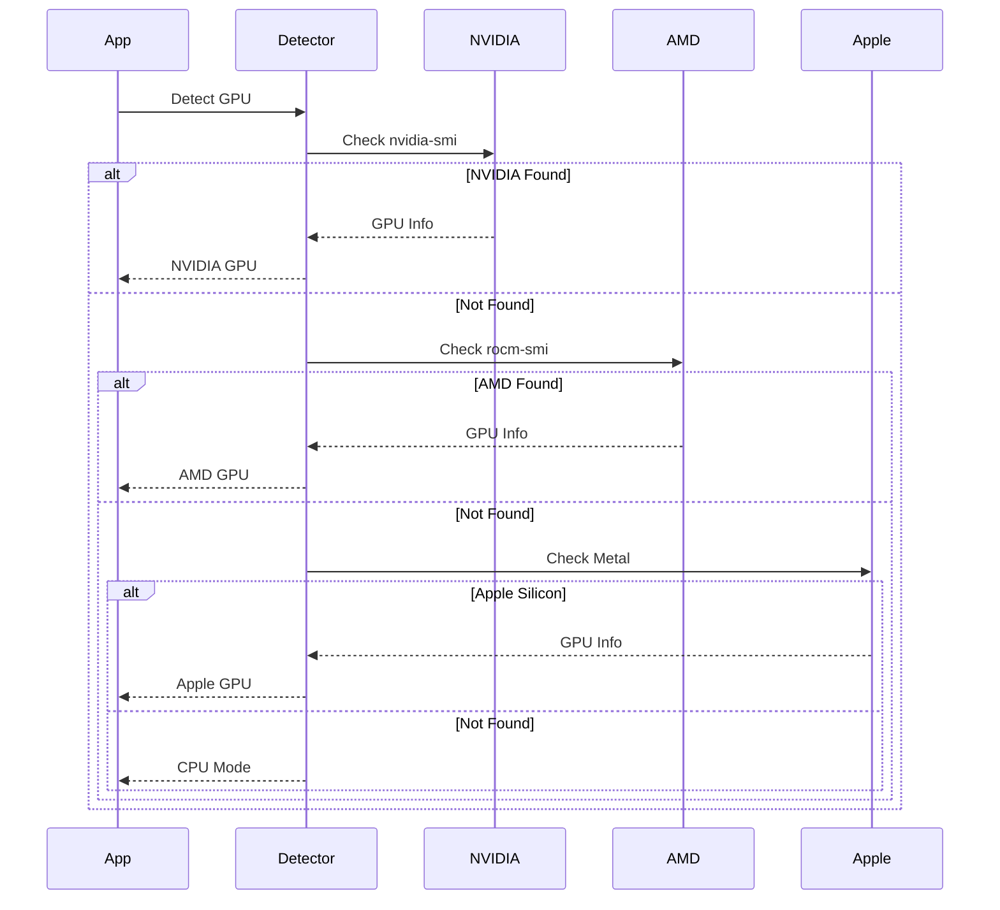
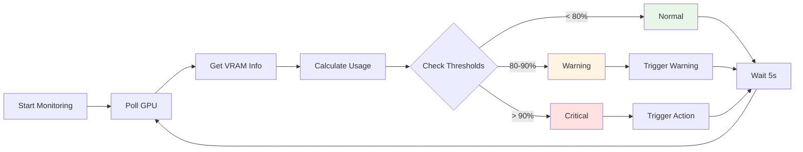
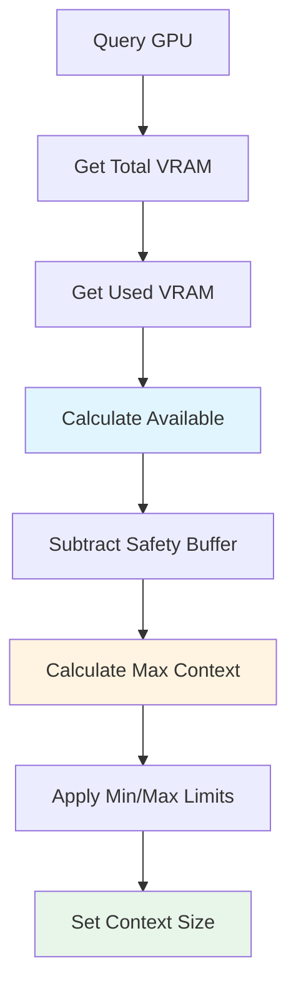
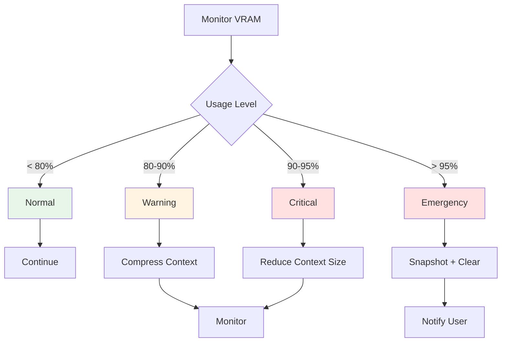

# VRAM Monitoring Guide

Complete guide to GPU memory monitoring in OLLM CLI.

## Table of Contents

- [Overview](#overview)
- [Understanding VRAM](#understanding-vram)
- [GPU Detection](#gpu-detection)
- [Checking VRAM Usage](#checking-vram-usage)
- [Real-time Monitoring](#real-time-monitoring)
- [VRAM Calculation](#vram-calculation)
- [Platform Support](#platform-support)
- [Low Memory Warnings](#low-memory-warnings)
- [Optimization](#optimization)
- [Troubleshooting](#troubleshooting)

---

## Overview

VRAM (Video RAM) monitoring tracks GPU memory usage to:
- Prevent out-of-memory errors
- Optimize context size dynamically
- Provide real-time usage feedback
- Enable memory-aware decisions

**Key Features:**
- Automatic GPU detection
- Real-time memory polling
- Cross-platform support
- Low memory warnings

---

## Understanding VRAM

### What is VRAM?

VRAM is dedicated memory on your GPU used for:
- **Model weights**: The LLM parameters
- **KV cache**: Context storage during inference
- **Overhead**: System and framework memory

### VRAM Usage Breakdown



### VRAM Components

**1. Model Weights (Fixed)**
```
8B model at Q4: ~4 GB
8B model at Q8: ~8 GB
8B model at F16: ~16 GB
```

**2. KV Cache (Dynamic)**
```
Grows with context size
Depends on quantization
Main variable component
```

**3. System Overhead (~500MB-1GB)**
```
CUDA/ROCm runtime
Framework overhead
Driver memory
```

**4. Safety Buffer (Configurable)**
```
Default: 512 MB
Prevents OOM errors
Configurable in settings
```

---

## GPU Detection

### Automatic Detection

OLLM CLI automatically detects your GPU:



### Supported Platforms

**NVIDIA GPUs:**
- Detection: `nvidia-smi`
- Platforms: Windows, Linux
- Memory query: Real-time
- Accuracy: High

**AMD GPUs:**
- Detection: `rocm-smi`
- Platforms: Linux
- Memory query: Real-time
- Accuracy: High

**Apple Silicon:**
- Detection: Metal API
- Platforms: macOS
- Memory query: System API
- Accuracy: Medium

**CPU Mode:**
- Detection: Fallback
- Platforms: All
- Memory query: System RAM
- Accuracy: Estimated

### Verify Detection

**Check GPU detection:**
```bash
/context stats
```

**Output:**
```
Memory:
  Model Weights: 4.2 GB
  KV Cache: 1.8 GB (q8_0)
  Total VRAM: 6.2 GB / 8.0 GB
  Safety Buffer: 512.0 MB reserved
```

**GPU Info:**
- Shows total VRAM (8.0 GB = GPU detected)
- Shows current usage (6.2 GB)
- Shows safety buffer

---

## Checking VRAM Usage

### Quick Status Check

**Command:**
```bash
/context
```

**Output:**
```
Context Status:
  Model: llama3.1:8b
  Tokens: 12,847 / 32,768 (39.2%)
  VRAM: 6.2 GB / 8.0 GB (77.5%)
  KV Cache: q8_0 (1.8 GB)
```

**Key Metrics:**
- **VRAM**: Current / Total (Percentage)
- **KV Cache**: Size and quantization
- **Tokens**: Context usage

### Detailed Statistics

**Command:**
```bash
/context stats
```

**Output:**
```
Detailed Context Statistics:

Memory:
  Model Weights: 4.2 GB
  KV Cache: 1.8 GB (q8_0)
  Total VRAM: 6.2 GB / 8.0 GB
  Safety Buffer: 512.0 MB reserved

Context:
  Current: 12,847 tokens
  Maximum: 32,768 tokens
  Usage: 39.2%
```

**Breakdown:**
- **Model Weights**: Fixed size for loaded model
- **KV Cache**: Dynamic, grows with context
- **Total VRAM**: Current usage / Available
- **Safety Buffer**: Reserved memory

### Status Bar Monitoring

**Real-time display:**
```
[●] llama3.1:8b | 12.8K/32.7K (39%) | VRAM: 6.2/8.0GB
```

**Color Indicators:**
- 🟢 **Green** (< 80%): Normal operation
- 🟡 **Yellow** (80-90%): Warning level
- 🔴 **Red** (> 90%): Critical level

---

## Real-time Monitoring

### Polling Interval

**Default:** 5 seconds during active inference

**Behavior:**
- Polls GPU memory every 5s
- Updates status bar
- Triggers warnings if needed
- Minimal overhead

### Monitoring Flow



### Watch VRAM in Real-time

**During conversation:**
```bash
# Start conversation
ollm

# Watch status bar
[●] llama3.1:8b | VRAM: 6.2/8.0GB

# As context grows
[●] llama3.1:8b | VRAM: 6.8/8.0GB

# Warning level
[⚠] llama3.1:8b | VRAM: 7.2/8.0GB

# Critical level
[!] llama3.1:8b | VRAM: 7.6/8.0GB
```

---

## VRAM Calculation

### Available VRAM Formula

```
Available VRAM = Total VRAM - Model Weights - System Overhead - Safety Buffer
```

**Example (8GB GPU, 8B model at Q4):**
```
Total VRAM:      8.0 GB
Model Weights:  -4.0 GB
System Overhead: -0.5 GB
Safety Buffer:   -0.5 GB
─────────────────────────
Available:       3.0 GB
```

### Context Size Calculation

```
Max Context = Available VRAM / Bytes Per Token
```

**Bytes Per Token (8B model):**
- **F16**: 0.25 GB per 1K tokens
- **Q8_0**: 0.125 GB per 1K tokens
- **Q4_0**: 0.0625 GB per 1K tokens

**Example (3GB available, Q8_0):**
```
Max Context = 3.0 GB / 0.125 GB per 1K
            = 24K tokens
```

### KV Cache Size

```
KV Cache Size = Context Tokens × Bytes Per Token
```

**Example (16K context, Q8_0):**
```
KV Cache = 16,384 tokens × 0.125 GB per 1K
         = 2.0 GB
```

### Calculation Flow



---

## Platform Support

### NVIDIA GPUs

**Detection Method:**
```bash
nvidia-smi --query-gpu=memory.total,memory.used --format=csv,noheader,nounits
```

**Output:**
```
8192,6144
```

**Platforms:**
- Windows: ✅ Full support
- Linux: ✅ Full support
- macOS: ❌ Not applicable

**Requirements:**
- NVIDIA driver installed
- `nvidia-smi` in PATH
- CUDA toolkit (optional)

**Accuracy:** High (direct GPU query)

---

### AMD GPUs

**Detection Method:**
```bash
rocm-smi --showmeminfo vram
```

**Output:**
```
GPU[0]: VRAM Total: 8192 MB
GPU[0]: VRAM Used: 6144 MB
```

**Platforms:**
- Windows: ⚠️ Limited support
- Linux: ✅ Full support
- macOS: ❌ Not applicable

**Requirements:**
- ROCm driver installed
- `rocm-smi` in PATH

**Accuracy:** High (direct GPU query)

---

### Apple Silicon

**Detection Method:**
- Metal API
- System profiler
- Unified memory architecture

**Platforms:**
- macOS: ✅ Supported (M1/M2/M3)

**Characteristics:**
- Unified memory (shared with CPU)
- Dynamic allocation
- No dedicated VRAM

**Accuracy:** Medium (estimated from system)

**Special Considerations:**
```yaml
# Apple Silicon configuration
context:
  vramBuffer: 2147483648  # 2GB (more conservative)
  autoSize: true
```

---

### CPU Mode (Fallback)

**When Used:**
- No GPU detected
- GPU tools not available
- Explicit CPU mode

**Memory Source:**
- System RAM
- Swap space (if enabled)

**Behavior:**
```yaml
# CPU mode uses system RAM
context:
  targetSize: 8192  # Smaller default
  vramBuffer: 1073741824  # 1GB buffer
```

**Limitations:**
- Slower inference
- Larger memory overhead
- No GPU acceleration

---

## Low Memory Warnings

### Warning Levels

**Normal (< 80%)**
```
[●] llama3.1:8b | VRAM: 6.2/8.0GB
```
- Green indicator
- No warnings
- Normal operation

**Warning (80-90%)**
```
[⚠] llama3.1:8b | VRAM: 7.2/8.0GB
⚠ Warning: VRAM usage high (90%). Compression triggered.
```
- Yellow indicator
- Background compression
- Continue monitoring

**Critical (90-95%)**
```
[!] llama3.1:8b | VRAM: 7.6/8.0GB
⚠ Critical: VRAM usage critical (95%). Context reduced.
```
- Red indicator
- Force context reduction
- Immediate action

**Emergency (> 95%)**
```
[!] llama3.1:8b | VRAM: 7.8/8.0GB
🚨 Emergency: VRAM exhausted. Snapshot created, context cleared.
```
- Red flashing indicator
- Emergency snapshot
- Context cleared
- Restore to continue

### Warning Actions



---

## Optimization

### Optimize VRAM Usage

**1. Use Appropriate Quantization**
```yaml
context:
  kvQuantization: q8_0  # Balance quality/memory
```

**Memory Impact:**
- F16: 2× memory of Q8_0
- Q8_0: Balanced (recommended)
- Q4_0: 0.5× memory of Q8_0

**2. Adjust Safety Buffer**
```yaml
context:
  vramBuffer: 536870912  # 512MB (default)
```

**Guidelines:**
- Dedicated GPU: 512MB
- Shared GPU: 1GB
- Unstable system: 2GB

**3. Enable Auto-Sizing**
```yaml
context:
  autoSize: true
```

**Benefits:**
- Adapts to available VRAM
- Maximizes context safely
- Handles memory pressure

**4. Configure Compression**
```yaml
context:
  compression:
    enabled: true
    threshold: 0.75  # Compress earlier
```

**Effect:**
- Frees VRAM proactively
- Prevents hitting limits
- Maintains headroom

### Monitor Optimization Results

**Before optimization:**
```bash
/context stats
→ VRAM: 7.6 GB / 8.0 GB (95%)
→ Context: 32,768 tokens
```

**After optimization:**
```bash
/context stats
→ VRAM: 6.2 GB / 8.0 GB (77.5%)
→ Context: 24,576 tokens
```

---

## Troubleshooting

### VRAM Monitoring Not Working

**Symptoms:**
- No VRAM information shown
- Shows 0 GB / 0 GB
- CPU mode when GPU present

**Solutions:**

**1. Verify GPU detection:**
```bash
# NVIDIA
nvidia-smi

# AMD
rocm-smi

# Check in OLLM
/context stats
```

**2. Check GPU tools installed:**
```bash
# NVIDIA
which nvidia-smi

# AMD
which rocm-smi
```

**3. Install GPU tools:**
```bash
# NVIDIA (Ubuntu/Debian)
sudo apt install nvidia-utils

# AMD (Ubuntu/Debian)
sudo apt install rocm-smi
```

**4. Check PATH:**
```bash
echo $PATH
# Should include GPU tool directories
```

---

### Inaccurate VRAM Readings

**Symptoms:**
- VRAM usage seems wrong
- Doesn't match other tools
- Fluctuates unexpectedly

**Solutions:**

**1. Compare with GPU tools:**
```bash
# NVIDIA
nvidia-smi

# AMD
rocm-smi

# Compare with OLLM
/context stats
```

**2. Check for other GPU processes:**
```bash
# NVIDIA
nvidia-smi pmon

# Shows all GPU processes
```

**3. Restart OLLM:**
```bash
# Fresh start
exit
ollm
```

---

### GPU Not Detected

**Symptoms:**
- Falls back to CPU mode
- No GPU information
- "GPU not found" message

**Solutions:**

**1. Verify GPU present:**
```bash
# Linux
lspci | grep -i vga

# macOS
system_profiler SPDisplaysDataType
```

**2. Check drivers installed:**
```bash
# NVIDIA
nvidia-smi

# AMD
rocm-smi
```

**3. Install drivers:**
- NVIDIA: Download from nvidia.com
- AMD: Download ROCm
- Apple: Built-in (no action needed)

**4. Restart system:**
```bash
# After driver installation
sudo reboot
```

---

### High VRAM Usage

**Symptoms:**
- Constant high usage (> 90%)
- Frequent warnings
- Performance issues

**Solutions:**

**1. Reduce context size:**
```bash
/context size 16384
```

**2. Use aggressive quantization:**
```yaml
context:
  kvQuantization: q4_0
```

**3. Increase safety buffer:**
```yaml
context:
  vramBuffer: 1073741824  # 1GB
```

**4. Close other GPU applications:**
```bash
# Check GPU processes
nvidia-smi pmon

# Close unnecessary applications
```

**5. Compress context:**
```bash
/context compress
```

---

## See Also

- [Memory Safety](./memory-safety.md) - Memory guard system
- [Configuration](../Context_configuration.md) - VRAM configuration
- [Architecture](../Context_architecture.md) - Technical details
- [User Guide](../management/user-guide.md) - Managing context
- [Troubleshooting](../../troubleshooting.md) - General troubleshooting

---

**Last Updated:** 2026-01-16  
**Version:** 1.0.0
