# Context Management Architecture

**System Design and Component Overview**

This document describes the architecture of the Context Management system, including components, data flow, integration points, and design decisions.

---

## Table of Contents

1. [Overview](#overview)
2. [System Architecture](#system-architecture)
3. [Core Components](#core-components)
4. [Data Flow](#data-flow)
5. [Integration Points](#integration-points)
6. [Design Decisions](#design-decisions)
7. [Performance Considerations](#performance-considerations)
8. [Correctness Properties](#correctness-properties)
9. [Error Handling](#error-handling)
10. [Testing Strategy](#testing-strategy)

---

## Overview

The Context Management system provides memory-efficient conversation management for local LLMs running in OLLM CLI. It dynamically adjusts context size based on available VRAM, creates snapshots for conversation rollover, and prevents out-of-memory errors while maximizing usable context.

### Key Objectives

1. **Memory Efficiency**: Maximize context usage without exceeding VRAM limits
2. **Conversation Continuity**: Enable long conversations through snapshots and compression
3. **Safety**: Prevent out-of-memory crashes through proactive monitoring
4. **Performance**: Minimize overhead through caching and lazy evaluation
5. **Flexibility**: Support multiple GPU types and configurations

### Key Features

-  Dynamic context sizing based on available VRAM
-  Multi-platform GPU support (NVIDIA, AMD, Apple Silicon, CPU)
-  Automatic snapshots at configurable thresholds
-  Multiple compression strategies (summarize, truncate, hybrid)
-  Proactive memory safety with 4-level threshold system
-  Token counting with caching for performance
-  Rolling snapshot cleanup
-  Atomic snapshot storage with corruption detection

---

## System Architecture

### High-Level Architecture

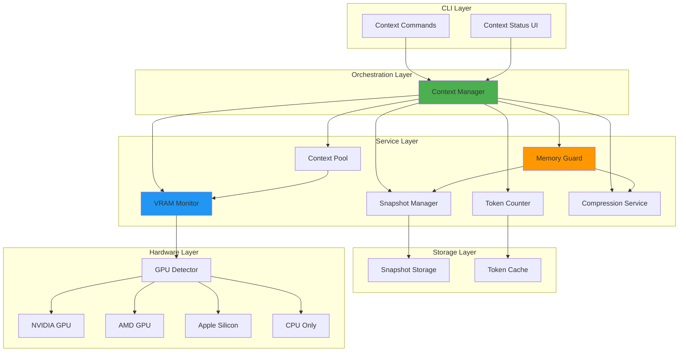

### Component Interaction Flow

**Message Addition Flow:**

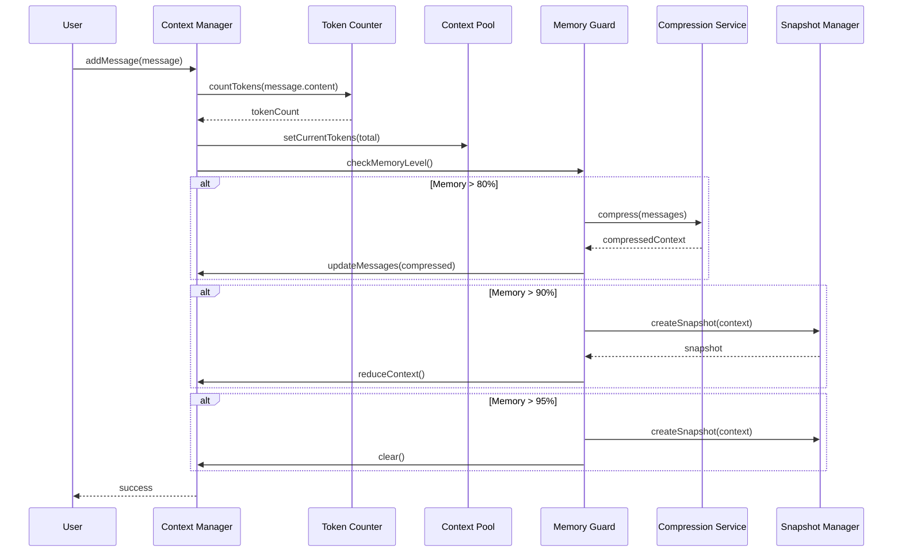

**Auto-Sizing Flow:**

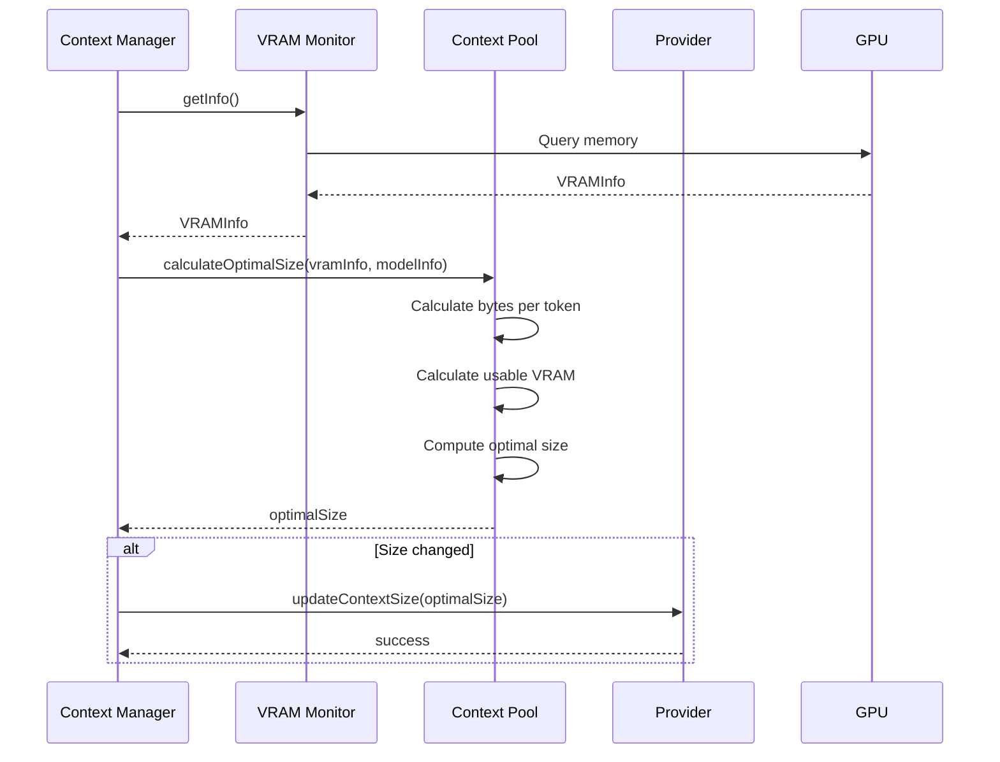

### Key Characteristics

- **Layered Architecture**: Clear separation between orchestration, services, and storage
- **Event-Driven**: Components communicate through events for loose coupling
- **Proactive**: Monitors memory and takes action before problems occur
- **Cross-Platform**: Supports NVIDIA, AMD, Apple Silicon, and CPU-only modes
- **Resilient**: Handles errors gracefully with fallback strategies
- **Performant**: Caching and lazy evaluation throughout

---

## Core Components

### 1. Context Manager

**Location:** `packages/core/src/context/contextManager.ts`

**Purpose:** Orchestrates all context management operations and coordinates between services.

**Responsibilities:**
- Coordinate between all services (VRAM, Token Counter, Pool, Snapshots, Compression, Memory Guard)
- Manage conversation messages and system prompt
- Handle configuration updates and hot-reload
- Emit events for state changes
- Provide unified API for context operations
- Manage service lifecycle (start/stop)

**Key Features:**
- Event emitter for state changes (usage, compression, snapshot, error)
- Configuration hot-reload without restart
- Message lifecycle management
- Automatic service coordination
- Session management

**Dependencies:**
- VRAM Monitor (memory tracking)
- Token Counter (usage measurement)
- Context Pool (size management)
- Snapshot Manager (checkpoints)
- Compression Service (size reduction)
- Memory Guard (safety)

**Interface:**
```typescript
interface ContextManager {
  config: ContextConfig;
  activeSkills: string[];
  activeTools: string[];
  
  // Lifecycle
  start(): Promise<void>;
  stop(): Promise<void>;
  
  // Configuration
  updateConfig(config: Partial<ContextConfig>): void;
  
  // Usage
  getUsage(): ContextUsage;
  getMessages(): Promise<Message[]>;
  
  // Message management
  addMessage(message: Message): Promise<void>;
  setSystemPrompt(prompt: string): void;
  getSystemPrompt(): string;
  clear(): Promise<void>;
  
  // Snapshots
  createSnapshot(): Promise<ContextSnapshot>;
  restoreSnapshot(snapshotId: string): Promise<void>;
  listSnapshots(): Promise<ContextSnapshot[]>;
  
  // Compression
  compress(): Promise<void>;
  
  // Skills and tools
  setActiveSkills(skills: string[]): void;
  
  // Events
  on(event: string, callback: (data: unknown) => void): void;
  off(event: string, callback: (data: unknown) => void): void;
  emit(event: string, data?: unknown): boolean;
}
```

**Events Emitted:**
- `usage-updated`: When token count or VRAM usage changes
- `compression-triggered`: When automatic compression occurs
- `snapshot-created`: When snapshot is created
- `snapshot-restored`: When snapshot is restored
- `memory-warning`: When memory thresholds are exceeded
- `error`: When errors occur

**Configuration:**
```typescript
interface ContextConfig {
  targetSize: number;        // Target context size in tokens
  minSize: number;           // Minimum context size
  maxSize: number;           // Maximum context size
  autoSize: boolean;         // Enable automatic sizing
  vramBuffer: number;        // Safety buffer in bytes
  kvQuantization: KVQuantization; // KV cache quantization
  compression: CompressionConfig;
  snapshots: SnapshotConfig;
}
```

**Usage Example:**
```typescript
const contextManager = createContextManager({
  targetSize: 8192,
  autoSize: true,
  vramBuffer: 512 * 1024 * 1024,
  compression: {
    enabled: true,
    threshold: 0.8,
    strategy: 'hybrid'
  }
});

await contextManager.start();

// Listen for events
contextManager.on('memory-warning', (data) => {
  console.log('Memory warning:', data);
});

// Add messages
await contextManager.addMessage({
  id: 'msg-1',
  role: 'user',
  content: 'Hello!',
  timestamp: new Date()
});

// Get usage
const usage = contextManager.getUsage();
console.log(`Usage: ${usage.percentage}%`);
```


### 2. VRAM Monitor

**Location:** `packages/core/src/context/vramMonitor.ts`

**Purpose:** Track GPU memory availability across different platforms.

**Responsibilities:**
- Detect GPU type (NVIDIA, AMD, Apple Silicon, CPU)
- Query current VRAM usage in real-time
- Calculate available memory for context allocation
- Emit low-memory events when thresholds are exceeded
- Monitor memory continuously with configurable interval

**Key Features:**
- Multi-platform support (Windows, macOS, Linux)
- Real-time monitoring with configurable interval (default: 5000ms)
- Low-memory event emission at configurable threshold
- Fallback to CPU mode when no GPU detected
- Caching of GPU detection results

**Platform Detection:**

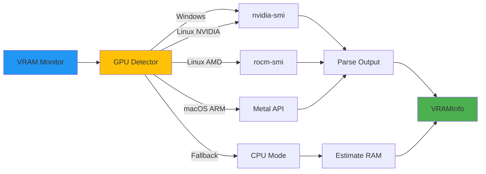

**Detection Logic:**
1. Check for NVIDIA GPU (nvidia-smi command)
2. Check for AMD GPU (rocm-smi command)
3. Check for Apple Silicon (macOS + ARM architecture)
4. Fall back to CPU mode (use system RAM)

**Interface:**
```typescript
interface VRAMMonitor {
  getInfo(): Promise<VRAMInfo>;
  getAvailableForContext(): Promise<number>;
  onLowMemory(callback: (info: VRAMInfo) => void): void;
  startMonitoring(intervalMs: number): void;
  stopMonitoring(): void;
}

interface VRAMInfo {
  total: number;        // Total VRAM in bytes
  used: number;         // Currently used VRAM
  available: number;    // Available for allocation
  modelLoaded: number;  // Memory used by loaded model
}

enum GPUType {
  NVIDIA = 'nvidia',
  AMD = 'amd',
  APPLE_SILICON = 'apple',
  WINDOWS = 'windows',
  CPU_ONLY = 'cpu'
}
```

**Platform-Specific Commands:**

**NVIDIA (nvidia-smi):**
```bash
nvidia-smi --query-gpu=memory.total,memory.used,memory.free --format=csv,noheader,nounits
```

**AMD (rocm-smi):**
```bash
rocm-smi --showmeminfo vram
```

**Apple Silicon (Metal):**
```typescript
// Uses macOS Metal API via native bindings
const device = MTLCreateSystemDefaultDevice();
const usedMemory = device.currentAllocatedSize;
const totalMemory = device.recommendedMaxWorkingSetSize;
```

**CPU Fallback:**
```typescript
// Uses Node.js os module
import os from 'os';
const total = os.totalmem();
const free = os.freemem();
```

**Usage Example:**
```typescript
const vramMonitor = createVRAMMonitor();

// Get current info
const info = await vramMonitor.getInfo();
console.log(`VRAM: ${info.used / 1024 / 1024 / 1024} GB / ${info.total / 1024 / 1024 / 1024} GB`);

// Monitor for low memory
vramMonitor.onLowMemory((info) => {
  console.warn('Low memory warning!', info);
});

// Start monitoring every 5 seconds
vramMonitor.startMonitoring(5000);
```

**Performance Considerations:**
- GPU queries are expensive (50-200ms per query)
- Results are cached for the monitoring interval
- Monitoring interval should be balanced (too frequent = overhead, too infrequent = delayed detection)
- Default 5-second interval is a good balance


### 3. Token Counter

**Location:** `packages/core/src/context/tokenCounter.ts`

**Purpose:** Measure context usage by counting tokens in messages.

**Responsibilities:**
- Count tokens in text strings
- Cache token counts for performance
- Count total conversation tokens
- Provide fallback estimation when API unavailable
- Integrate with provider APIs for accurate counts

**Key Features:**
- Provider API integration for accurate token counting
- In-memory LRU cache for repeated messages
- Fallback estimation (4 characters  1 token)
- Batch counting for efficiency
- Cache invalidation on message changes

**Interface:**
```typescript
interface TokenCounter {
  countTokens(text: string): Promise<number>;
  countTokensCached(messageId: string, text: string): number;
  countConversationTokens(messages: Message[]): number;
  clearCache(): void;
}

interface TokenCountCache {
  get(messageId: string): number | undefined;
  set(messageId: string, count: number): void;
  clear(): void;
}
```

**Counting Strategy:**

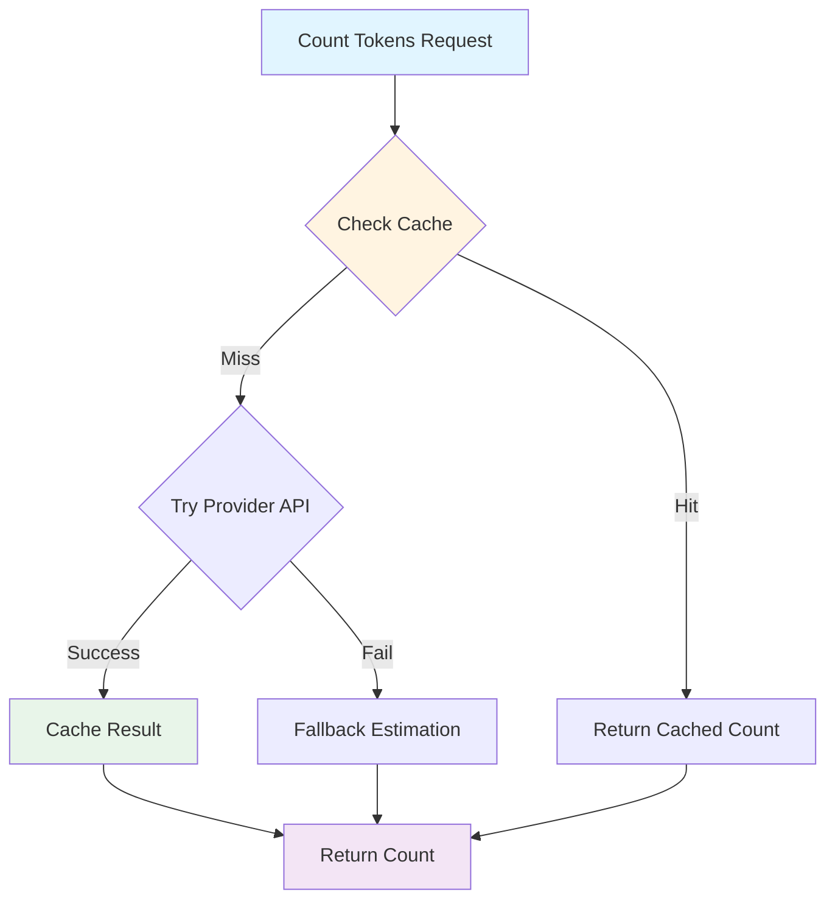

**Estimation Formula:**
```typescript
// Fallback estimation when API unavailable
function estimateTokens(text: string): number {
  // Average: 4 characters per token
  // Adjust for whitespace and punctuation
  const chars = text.length;
  const words = text.split(/\s+/).length;
  
  // Weighted average
  return Math.ceil((chars / 4 + words) / 2);
}
```

**Provider Integration:**
```typescript
// Ollama API
async function countTokensOllama(text: string, model: string): Promise<number> {
  const response = await fetch('http://localhost:11434/api/embed', {
    method: 'POST',
    body: JSON.stringify({ model, prompt: text })
  });
  const data = await response.json();
  return data.prompt_eval_count || estimateTokens(text);
}
```

**Cache Strategy:**
- LRU cache with max 1000 entries
- Key: message ID (stable across sessions)
- Value: token count
- Eviction: Least recently used when full
- Invalidation: On message content change

**Usage Example:**
```typescript
const tokenCounter = createTokenCounter(providerAdapter);

// Count with caching
const count = tokenCounter.countTokensCached('msg-1', 'Hello, world!');

// Count conversation
const messages = [
  { id: '1', role: 'user', content: 'Hi' },
  { id: '2', role: 'assistant', content: 'Hello!' }
];
const total = tokenCounter.countConversationTokens(messages);
console.log(`Total tokens: ${total}`);
```

**Performance:**
- Cache hit: O(1) - instant
- Cache miss + API: 10-50ms
- Cache miss + estimation: <1ms
- Batch counting: Amortized O(1) per message


### 4. Context Pool

**Location:** `packages/core/src/context/contextPool.ts`

**Purpose:** Manage dynamic context sizing based on available VRAM and configuration.

**Responsibilities:**
- Calculate optimal context size based on VRAM
- Enforce min/max size limits
- Account for KV cache quantization
- Coordinate context resizing with provider
- Track current usage statistics

**Key Features:**
- Automatic sizing based on available VRAM
- KV cache quantization support (f16, q8_0, q4_0)
- Safety buffer to prevent OOM
- Min/max size enforcement
- Real-time usage tracking

**Interface:**
```typescript
interface ContextPool {
  config: ContextPoolConfig;
  currentSize: number;
  
  calculateOptimalSize(vramInfo: VRAMInfo, modelInfo: ModelInfo): number;
  resize(newSize: number): Promise<void>;
  getUsage(): ContextUsage;
  updateConfig(config: Partial<ContextPoolConfig>): void;
  setCurrentTokens(tokens: number): void;
  updateVRAMInfo(vramInfo: VRAMInfo): void;
}

interface ContextPoolConfig {
  minContextSize: number;      // Minimum size (default: 2048)
  maxContextSize: number;      // Maximum size (model limit)
  targetContextSize: number;   // User preference
  reserveBuffer: number;       // Safety buffer in bytes (default: 512MB)
  kvCacheQuantization: KVQuantization; // 'f16' | 'q8_0' | 'q4_0'
  autoSize: boolean;           // Enable automatic sizing
}

interface ContextUsage {
  currentTokens: number;
  maxTokens: number;
  percentage: number;
  vramUsed: number;
  vramTotal: number;
}

type KVQuantization = 'f16' | 'q8_0' | 'q4_0';
```

**Size Calculation Formula:**

```typescript
/**
 * Calculate optimal context size
 * 
 * Formula:
 * bytesPerToken = 2 (K+V)  layers  hiddenDim  bytesPerValue
 * optimalSize = floor((availableVRAM - safetyBuffer) / bytesPerToken)
 * 
 * Simplified using model parameters:
 * bytesPerToken  (modelParams  10^9  0.0001)  quantizationMultiplier
 */
function calculateOptimalSize(
  vramInfo: VRAMInfo,
  modelInfo: ModelInfo,
  config: ContextPoolConfig
): number {
  // Bytes per value based on quantization
  const bytesPerValue = {
    'f16': 2,    // 2 bytes per value
    'q8_0': 1,   // 1 byte per value
    'q4_0': 0.5  // 0.5 bytes per value
  }[config.kvCacheQuantization];
  
  // Approximate bytes per token
  // Based on model parameters and quantization
  const bytesPerToken = (modelInfo.parameters * 1e9 * 0.0001) * bytesPerValue;
  
  // Calculate usable VRAM
  const usableVRAM = vramInfo.available - config.reserveBuffer;
  
  if (usableVRAM <= 0) {
    return config.minContextSize;
  }
  
  // Calculate optimal size
  const optimalSize = Math.floor(usableVRAM / bytesPerToken);
  
  // Clamp to limits
  return Math.max(
    config.minContextSize,
    Math.min(optimalSize, config.maxContextSize, modelInfo.contextLimit)
  );
}
```

**Quantization Impact:**

| Quantization | Bytes/Value | Memory Usage | Quality | Use Case |
|--------------|-------------|--------------|---------|----------|
| f16          | 2           | 100%         | Best    | High VRAM, quality priority |
| q8_0         | 1           | 50%          | Good    | Balanced (default) |
| q4_0         | 0.5         | 25%          | Fair    | Low VRAM, size priority |

**Example Calculations:**

**Llama 3.1 8B with 8GB VRAM:**
```
Model: 8B parameters
VRAM: 8GB total, 6GB available (2GB for model)
Buffer: 512MB
Quantization: q8_0

bytesPerToken = (8  10^9  0.0001)  1 = 800,000 bytes = 0.76 MB
usableVRAM = 6GB - 512MB = 5.5GB = 5,767 MB
optimalSize = floor(5,767 / 0.76) = 7,588 tokens

With f16: 3,794 tokens
With q4_0: 15,176 tokens
```

**Usage Example:**
```typescript
const contextPool = createContextPool({
  minContextSize: 2048,
  maxContextSize: 32768,
  targetContextSize: 8192,
  reserveBuffer: 512 * 1024 * 1024,
  kvCacheQuantization: 'q8_0',
  autoSize: true
});

// Calculate optimal size
const vramInfo = await vramMonitor.getInfo();
const modelInfo = { parameters: 8, contextLimit: 128000 };
const optimalSize = contextPool.calculateOptimalSize(vramInfo, modelInfo);

console.log(`Optimal context size: ${optimalSize} tokens`);

// Get usage
const usage = contextPool.getUsage();
console.log(`Usage: ${usage.percentage}% (${usage.currentTokens}/${usage.maxTokens})`);
```

**Auto-Sizing Behavior:**
- Recalculates on VRAM changes
- Triggers provider context resize
- Emits events on size changes
- Respects user-configured limits
- Disabled when autoSize = false


### 5. Snapshot Manager

**Location:** `packages/core/src/context/snapshotManager.ts`

**Purpose:** Manage conversation checkpoints for rollover and recovery.

**Responsibilities:**
- Create snapshots from current context
- Restore context from snapshots
- List and delete snapshots
- Automatic snapshot creation at thresholds
- Rolling cleanup of old snapshots
- Trigger callbacks at thresholds

**Key Features:**
- Automatic snapshots at configurable threshold (default: 80%)
- Rolling cleanup (keeps last N snapshots)
- Snapshot metadata for quick listing
- Atomic snapshot creation
- Threshold callbacks for proactive actions
- Session-based organization

**Interface:**
```typescript
interface SnapshotManager {
  setSessionId(sessionId: string): void;
  createSnapshot(context: ConversationContext): Promise<ContextSnapshot>;
  restoreSnapshot(snapshotId: string): Promise<ConversationContext>;
  listSnapshots(sessionId: string): Promise<ContextSnapshot[]>;
  deleteSnapshot(snapshotId: string): Promise<void>;
  onContextThreshold(threshold: number, callback: () => void): void;
  onBeforeOverflow(callback: () => void): void;
  checkThresholds(currentTokens: number, maxTokens: number): void;
  updateConfig(config: Partial<SnapshotConfig>): void;
  getConfig(): SnapshotConfig;
  cleanupOldSnapshots(maxCount: number): Promise<void>;
}

interface ContextSnapshot {
  id: string;                  // UUID
  sessionId: string;           // Associated session
  timestamp: Date;             // Creation time
  tokenCount: number;          // Tokens at snapshot
  summary: string;             // Brief summary
  messages: Message[];         // Full conversation
  metadata: {
    model: string;
    contextSize: number;
    compressionRatio: number;
  };
}

interface SnapshotConfig {
  enabled: boolean;            // Enable snapshots
  maxCount: number;            // Max snapshots to keep (default: 5)
  autoCreate: boolean;         // Auto-create at threshold
  autoThreshold: number;       // Threshold for auto-create (default: 0.8)
}
```

**Snapshot Lifecycle:**

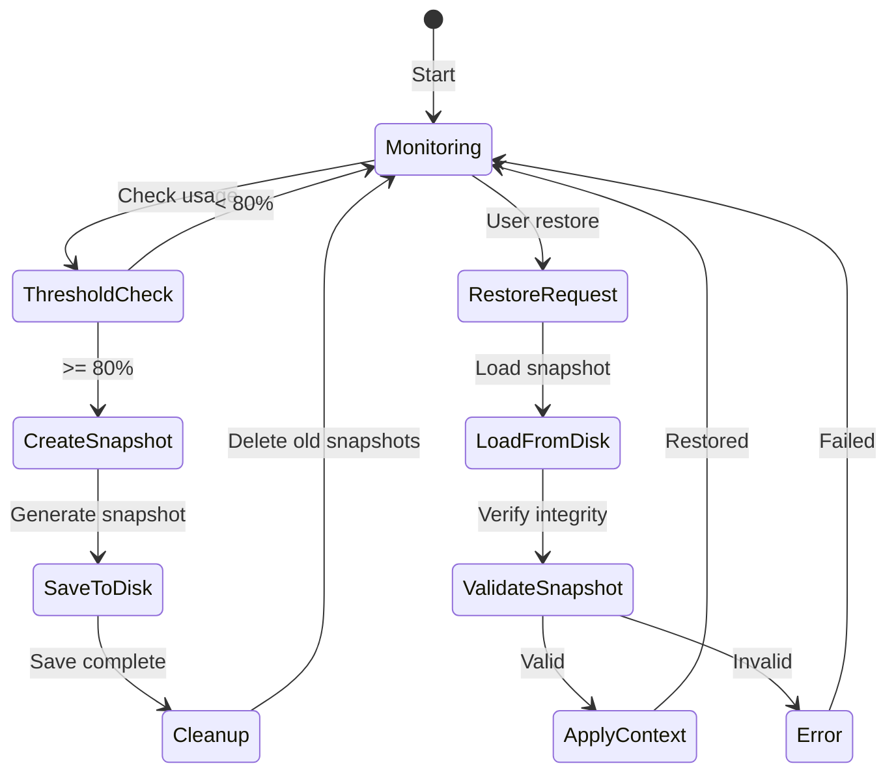

**Automatic Snapshot Flow:**

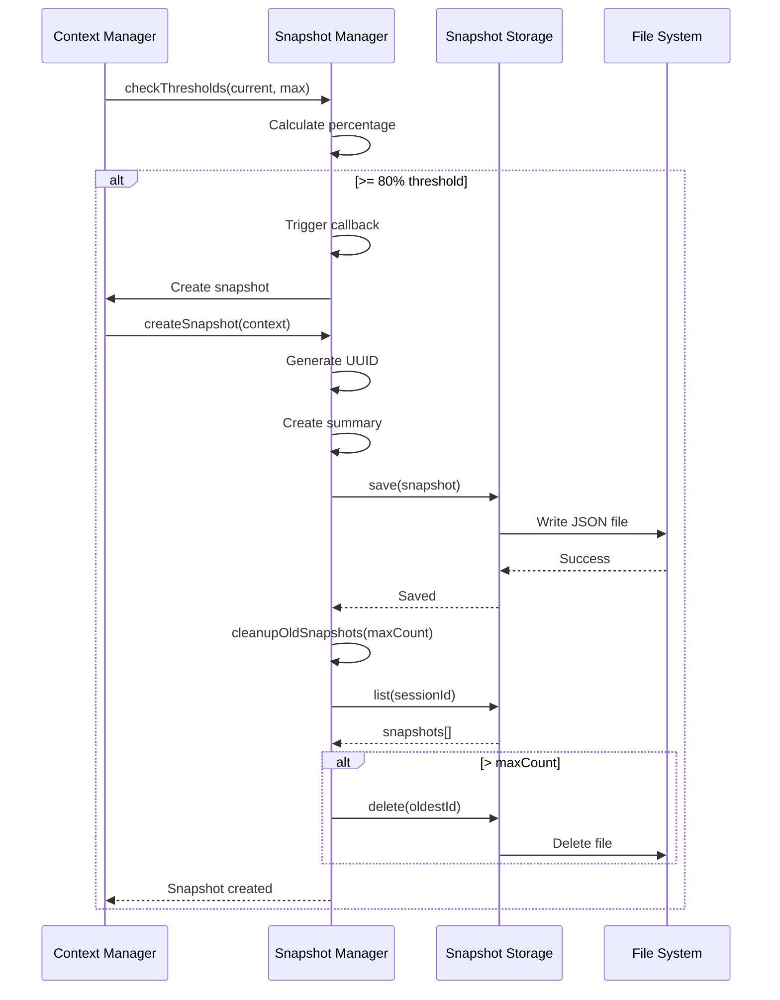

**Snapshot Storage Format:**

```json
{
  "id": "550e8400-e29b-41d4-a716-446655440000",
  "sessionId": "session-123",
  "timestamp": "2026-01-16T10:30:00.000Z",
  "tokenCount": 6554,
  "summary": "Discussion about Context Management architecture...",
  "messages": [
    {
      "id": "msg-1",
      "role": "system",
      "content": "You are a helpful assistant.",
      "timestamp": "2026-01-16T10:00:00.000Z"
    },
    {
      "id": "msg-2",
      "role": "user",
      "content": "Explain context management",
      "timestamp": "2026-01-16T10:01:00.000Z",
      "tokenCount": 5
    }
  ],
  "metadata": {
    "model": "llama3.1:8b",
    "contextSize": 8192,
    "compressionRatio": 1.0
  }
}
```

**Storage Location:**
- User snapshots: `~/.ollm/snapshots/`
- Workspace snapshots: `.ollm/snapshots/`
- Filename format: `{sessionId}_{timestamp}_{id}.json`

**Rolling Cleanup Strategy:**
```typescript
async function cleanupOldSnapshots(maxCount: number): Promise<void> {
  // List all snapshots for session
  const snapshots = await this.listSnapshots(this.sessionId);
  
  // Sort by timestamp (newest first)
  snapshots.sort((a, b) => b.timestamp.getTime() - a.timestamp.getTime());
  
  // Delete oldest snapshots beyond maxCount
  const toDelete = snapshots.slice(maxCount);
  for (const snapshot of toDelete) {
    await this.deleteSnapshot(snapshot.id);
  }
}
```

**Usage Example:**
```typescript
const snapshotManager = createSnapshotManager(storage, {
  enabled: true,
  maxCount: 5,
  autoCreate: true,
  autoThreshold: 0.8
});

snapshotManager.setSessionId('session-123');

// Register threshold callback
snapshotManager.onContextThreshold(0.8, async () => {
  console.log('80% threshold reached, creating snapshot...');
  const snapshot = await snapshotManager.createSnapshot(context);
  console.log(`Snapshot created: ${snapshot.id}`);
});

// Check thresholds
snapshotManager.checkThresholds(6554, 8192); // 80% - triggers callback

// List snapshots
const snapshots = await snapshotManager.listSnapshots('session-123');
console.log(`${snapshots.length} snapshots available`);

// Restore snapshot
const context = await snapshotManager.restoreSnapshot(snapshots[0].id);
console.log(`Restored ${context.messages.length} messages`);
```

**Snapshot Summary Generation:**
```typescript
function generateSummary(context: ConversationContext): string {
  const messages = context.messages.filter(m => m.role !== 'system');
  
  if (messages.length === 0) {
    return 'Empty conversation';
  }
  
  // First user message
  const first = messages[0].content.substring(0, 50);
  
  // Last assistant message
  const last = messages[messages.length - 1].content.substring(0, 50);
  
  return `${first}...  ${last}... (${messages.length} messages)`;
}
```


### 6. Compression Service

**Location:** `packages/core/src/context/compressionService.ts`

**Purpose:** Reduce context size through multiple compression strategies.

**Responsibilities:**
- Compress messages using summarize, truncate, or hybrid strategies
- Preserve recent messages and system prompts
- Estimate compression results
- Detect inflation (compression makes context larger)
- Integrate with LLM for summarization

**Key Features:**
- Three compression strategies (summarize, truncate, hybrid)
- Inflation guard prevents compression that increases size
- Preserves recent messages (configurable)
- Always preserves system prompt
- LLM-based summarization for quality
- Fallback to truncation if summarization fails

**Interface:**
```typescript
interface ICompressionService {
  compress(messages: Message[], strategy: CompressionStrategy): Promise<CompressedContext>;
  estimateCompression(messages: Message[]): CompressionEstimate;
  shouldCompress(tokenCount: number, threshold: number): boolean;
}

interface CompressionStrategy {
  type: 'summarize' | 'truncate' | 'hybrid';
  preserveRecent: number;      // Tokens to keep uncompressed
  summaryMaxTokens: number;    // Max tokens for summary
}

interface CompressedContext {
  summary: Message;            // System message with summary
  preserved: Message[];        // Recent messages kept intact
  originalTokens: number;
  compressedTokens: number;
  compressionRatio: number;    // compressed / original
  status?: 'success' | 'inflated';
}

interface CompressionConfig {
  enabled: boolean;
  threshold: number;           // Trigger at % capacity (default: 0.8)
  strategy: 'summarize' | 'truncate' | 'hybrid';
  preserveRecent: number;      // Default: 4096
  summaryMaxTokens: number;    // Default: 1024
}
```

**Compression Strategies:**

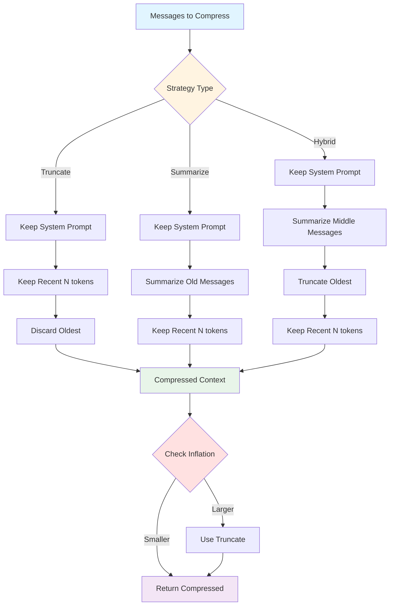

**1. Truncate Strategy:**
```typescript
function truncate(messages: Message[], strategy: CompressionStrategy): CompressedContext {
  // Always keep system prompt
  const systemPrompt = messages.find(m => m.role === 'system');
  
  // Calculate tokens to preserve
  const preserveTokens = strategy.preserveRecent;
  
  // Keep recent messages up to preserve limit
  const preserved: Message[] = [];
  let tokenCount = 0;
  
  for (let i = messages.length - 1; i >= 0; i--) {
    const msg = messages[i];
    if (msg.role === 'system') continue;
    
    const msgTokens = msg.tokenCount || estimateTokens(msg.content);
    if (tokenCount + msgTokens <= preserveTokens) {
      preserved.unshift(msg);
      tokenCount += msgTokens;
    } else {
      break;
    }
  }
  
  return {
    summary: systemPrompt,
    preserved,
    originalTokens: countTotal(messages),
    compressedTokens: countTotal([systemPrompt, ...preserved]),
    compressionRatio: compressedTokens / originalTokens
  };
}
```

**2. Summarize Strategy:**
```typescript
async function summarize(messages: Message[], strategy: CompressionStrategy): Promise<CompressedContext> {
  const systemPrompt = messages.find(m => m.role === 'system');
  
  // Split into old (to summarize) and recent (to preserve)
  const preserveTokens = strategy.preserveRecent;
  const { old, recent } = splitMessages(messages, preserveTokens);
  
  // Generate summary using LLM
  const summaryText = await generateSummary(old, strategy.summaryMaxTokens);
  
  // Create summary message
  const summary: Message = {
    id: 'summary-' + Date.now(),
    role: 'system',
    content: systemPrompt.content + '\n\n[Previous conversation summary]\n' + summaryText,
    timestamp: new Date()
  };
  
  return {
    summary,
    preserved: recent,
    originalTokens: countTotal(messages),
    compressedTokens: countTotal([summary, ...recent]),
    compressionRatio: compressedTokens / originalTokens
  };
}
```

**3. Hybrid Strategy:**
```typescript
async function hybrid(messages: Message[], strategy: CompressionStrategy): Promise<CompressedContext> {
  // Combine summarization and truncation
  // 1. Summarize middle 50% of old messages
  // 2. Truncate oldest 50%
  // 3. Keep recent messages
  
  const systemPrompt = messages.find(m => m.role === 'system');
  const { old, recent } = splitMessages(messages, strategy.preserveRecent);
  
  // Split old messages
  const midpoint = Math.floor(old.length / 2);
  const toTruncate = old.slice(0, midpoint);
  const toSummarize = old.slice(midpoint);
  
  // Summarize middle portion
  const summaryText = await generateSummary(toSummarize, strategy.summaryMaxTokens);
  
  const summary: Message = {
    id: 'summary-' + Date.now(),
    role: 'system',
    content: systemPrompt.content + '\n\n[Conversation summary]\n' + summaryText,
    timestamp: new Date()
  };
  
  return {
    summary,
    preserved: recent,
    originalTokens: countTotal(messages),
    compressedTokens: countTotal([summary, ...recent]),
    compressionRatio: compressedTokens / originalTokens
  };
}
```

**Inflation Guard:**
```typescript
async function compress(messages: Message[], strategy: CompressionStrategy): Promise<CompressedContext> {
  const result = await performCompression(messages, strategy);
  
  // Check for inflation
  if (result.compressedTokens >= result.originalTokens) {
    console.warn('Compression inflated context, falling back to truncate');
    
    // Fall back to truncate strategy
    return truncate(messages, strategy);
  }
  
  return { ...result, status: 'success' };
}
```

**LLM Summarization Prompt:**
```typescript
const SUMMARIZATION_PROMPT = `Summarize the following conversation concisely, preserving key information, decisions, and context. Focus on facts and outcomes, not conversational flow.

Conversation:
{messages}

Provide a concise summary in {maxTokens} tokens or less:`;
```

**Strategy Comparison:**

| Strategy | Speed | Quality | Compression Ratio | Use Case |
|----------|-------|---------|-------------------|----------|
| Truncate | Fast (instant) | Low | 0.3-0.5 | Quick reduction, less important history |
| Summarize | Slow (LLM call) | High | 0.2-0.4 | Important history, quality priority |
| Hybrid | Medium | Medium | 0.25-0.45 | Balanced approach (default) |

**Usage Example:**
```typescript
const compressionService = createCompressionService(providerAdapter, 'llama3.1:8b');

// Check if compression needed
if (compressionService.shouldCompress(currentTokens, 0.8)) {
  // Compress using hybrid strategy
  const result = await compressionService.compress(messages, {
    type: 'hybrid',
    preserveRecent: 4096,
    summaryMaxTokens: 1024
  });
  
  console.log(`Compressed from ${result.originalTokens} to ${result.compressedTokens} tokens`);
  console.log(`Compression ratio: ${(result.compressionRatio * 100).toFixed(1)}%`);
  
  // Apply compressed context
  const newMessages = [result.summary, ...result.preserved];
}
```

**Performance:**
- Truncate: <1ms (instant)
- Summarize: 2-10 seconds (LLM call)
- Hybrid: 1-5 seconds (partial LLM call)
- Estimation: <1ms


### 7. Memory Guard

**Location:** `packages/core/src/context/memoryGuard.ts`

**Purpose:** Prevent out-of-memory errors through proactive monitoring and automatic actions.

**Responsibilities:**
- Monitor memory usage against thresholds
- Trigger appropriate actions at each level
- Execute emergency snapshot and clear
- Coordinate with compression and snapshot services
- Emit warnings and events

**Key Features:**
- 4-level threshold system (Normal, Warning, Critical, Emergency)
- Automatic actions at each level
- Configurable thresholds (default: 80%, 90%, 95%)
- Safety buffer to prevent OOM
- Event emission for UI updates

**Interface:**
```typescript
interface MemoryGuard {
  canAllocate(requestedTokens: number): boolean;
  getSafeLimit(): number;
  onThreshold(level: MemoryLevel, callback: () => void | Promise<void>): void;
  executeEmergencyActions(): Promise<void>;
  setServices(services: { compression: ICompressionService; snapshot: SnapshotManager }): void;
  setContext(context: ConversationContext): void;
  checkMemoryLevel(): MemoryLevel;
  updateConfig(config: Partial<MemoryGuardConfig>): void;
  checkMemoryLevelAndAct(): Promise<void>;
  on(event: string, callback: (data: unknown) => void): void;
}

enum MemoryLevel {
  NORMAL = 'normal',      // < 80%
  WARNING = 'warning',    // 80-90%
  CRITICAL = 'critical',  // 90-95%
  EMERGENCY = 'emergency' // > 95%
}

interface MemoryThresholds {
  soft: number;      // 0.8 (80%) - Trigger compression
  hard: number;      // 0.9 (90%) - Force context reduction
  critical: number;  // 0.95 (95%) - Emergency snapshot + clear
}

interface MemoryGuardConfig {
  safetyBuffer: number;        // Bytes (default: 512MB)
  thresholds: MemoryThresholds;
}
```

**Threshold System:**

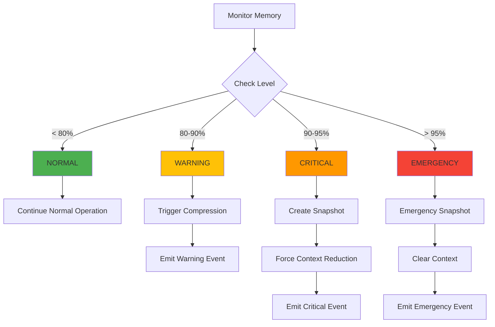

**Action Matrix:**

| Level | Threshold | Actions | User Impact |
|-------|-----------|---------|-------------|
| NORMAL | < 80% | None | None - normal operation |
| WARNING | 80-90% |  Trigger compression<br> Emit warning | Yellow indicator, compression may occur |
| CRITICAL | 90-95% |  Create snapshot<br> Force context reduction<br> Emit critical warning | Orange indicator, context reduced |
| EMERGENCY | > 95% |  Emergency snapshot<br> Clear context (keep system prompt)<br> Emit emergency alert | Red indicator, context cleared |

**Memory Level Detection:**

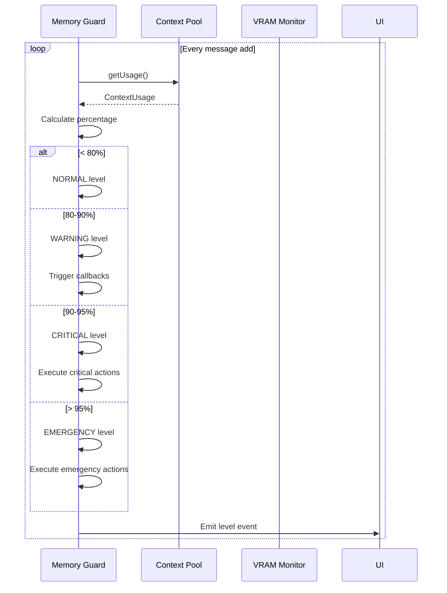

**Implementation:**

```typescript
class MemoryGuardImpl extends EventEmitter implements MemoryGuard {
  private config: MemoryGuardConfig = {
    safetyBuffer: 512 * 1024 * 1024,
    thresholds: {
      soft: 0.8,
      hard: 0.9,
      critical: 0.95
    }
  };
  
  checkMemoryLevel(): MemoryLevel {
    const usage = this.contextPool.getUsage();
    const percentage = usage.percentage / 100;
    
    if (percentage >= this.config.thresholds.critical) {
      return MemoryLevel.EMERGENCY;
    } else if (percentage >= this.config.thresholds.hard) {
      return MemoryLevel.CRITICAL;
    } else if (percentage >= this.config.thresholds.soft) {
      return MemoryLevel.WARNING;
    } else {
      return MemoryLevel.NORMAL;
    }
  }
  
  async checkMemoryLevelAndAct(): Promise<void> {
    const level = this.checkMemoryLevel();
    
    switch (level) {
      case MemoryLevel.WARNING:
        await this.handleWarning();
        break;
      case MemoryLevel.CRITICAL:
        await this.handleCritical();
        break;
      case MemoryLevel.EMERGENCY:
        await this.handleEmergency();
        break;
    }
    
    this.emit('memory-level', { level });
  }
  
  private async handleWarning(): Promise<void> {
    // Trigger compression if available
    if (this.compressionService && this.currentContext) {
      const result = await this.compressionService.compress(
        this.currentContext.messages,
        {
          type: 'hybrid',
          preserveRecent: 4096,
          summaryMaxTokens: 1024
        }
      );
      
      this.emit('compression-triggered', { result });
    }
  }
  
  private async handleCritical(): Promise<void> {
    // Create snapshot
    if (this.snapshotManager && this.currentContext) {
      const snapshot = await this.snapshotManager.createSnapshot(this.currentContext);
      this.emit('snapshot-created', { snapshot, reason: 'critical-memory' });
    }
    
    // Force context reduction (keep only recent 2048 tokens)
    if (this.currentContext) {
      const preserved = this.preserveRecentMessages(this.currentContext.messages, 2048);
      this.emit('context-reduced', { 
        from: this.currentContext.messages.length,
        to: preserved.length
      });
    }
  }
  
  private async handleEmergency(): Promise<void> {
    // Emergency snapshot
    if (this.snapshotManager && this.currentContext) {
      const snapshot = await this.snapshotManager.createSnapshot(this.currentContext);
      this.emit('snapshot-created', { snapshot, reason: 'emergency' });
    }
    
    // Clear context (keep only system prompt)
    if (this.currentContext) {
      const systemPrompt = this.currentContext.messages.find(m => m.role === 'system');
      this.emit('context-cleared', { reason: 'emergency' });
    }
  }
  
  canAllocate(requestedTokens: number): boolean {
    const usage = this.contextPool.getUsage();
    const newTokenCount = usage.currentTokens + requestedTokens;
    const newPercentage = newTokenCount / usage.maxTokens;
    
    return newPercentage < this.config.thresholds.soft;
  }
  
  getSafeLimit(): number {
    const usage = this.contextPool.getUsage();
    return Math.floor(usage.maxTokens * this.config.thresholds.soft);
  }
}
```

**Usage Example:**
```typescript
const memoryGuard = createMemoryGuard(vramMonitor, contextPool, {
  safetyBuffer: 512 * 1024 * 1024,
  thresholds: {
    soft: 0.8,
    hard: 0.9,
    critical: 0.95
  }
});

// Set services
memoryGuard.setServices({
  compression: compressionService,
  snapshot: snapshotManager
});

// Register callbacks
memoryGuard.onThreshold(MemoryLevel.WARNING, () => {
  console.warn('Memory warning: 80% threshold reached');
});

memoryGuard.onThreshold(MemoryLevel.CRITICAL, () => {
  console.error('Memory critical: 90% threshold reached');
});

// Check before adding message
if (memoryGuard.canAllocate(estimatedTokens)) {
  await contextManager.addMessage(message);
} else {
  console.warn('Cannot allocate, would exceed safe limit');
  await memoryGuard.checkMemoryLevelAndAct();
}

// Listen for events
memoryGuard.on('memory-level', ({ level }) => {
  updateUI(level);
});
```

**Safety Buffer Calculation:**
```typescript
function calculateSafeLimit(vramInfo: VRAMInfo, config: MemoryGuardConfig): number {
  // Total available VRAM
  const available = vramInfo.available;
  
  // Subtract safety buffer
  const usable = available - config.safetyBuffer;
  
  // Apply soft threshold
  const safe = usable * config.thresholds.soft;
  
  return Math.max(0, safe);
}
```

**Event Types:**
- `memory-level`: Current memory level changed
- `compression-triggered`: Automatic compression occurred
- `snapshot-created`: Snapshot created due to memory pressure
- `context-reduced`: Context forcibly reduced
- `context-cleared`: Context cleared in emergency
- `warning`: User-facing warning message


### 7. Memory Guard

**Location:** `packages/core/src/context/memoryGuard.ts`

**Purpose:** Prevent out-of-memory errors through proactive monitoring and automatic actions.

**Responsibilities:**
- Monitor memory usage against thresholds
- Trigger actions at different memory levels
- Execute emergency actions (snapshot + clear)
- Coordinate with compression and snapshot services
- Emit warnings and events

**Key Features:**
- 4-level threshold system (Normal, Warning, Critical, Emergency)
- Automatic actions at each level
- Configurable thresholds (default: 80%, 90%, 95%)
- Safety buffer to prevent OOM
- Event-driven architecture

**Interface:**
```typescript
interface MemoryGuard {
  canAllocate(requestedTokens: number): boolean;
  getSafeLimit(): number;
  onThreshold(level: MemoryLevel, callback: () => void | Promise<void>): void;
  executeEmergencyActions(): Promise<void>;
  setServices(services: { compression: ICompressionService; snapshot: SnapshotManager }): void;
  setContext(context: ConversationContext): void;
  checkMemoryLevel(): MemoryLevel;
  updateConfig(config: Partial<MemoryGuardConfig>): void;
  checkMemoryLevelAndAct(): Promise<void>;
  on(event: string, callback: (data: unknown) => void): void;
}

enum MemoryLevel {
  NORMAL = 'normal',      // < 80%
  WARNING = 'warning',    // 80-90%
  CRITICAL = 'critical',  // 90-95%
  EMERGENCY = 'emergency' // > 95%
}

interface MemoryThresholds {
  soft: number;      // 80% - Trigger compression
  hard: number;      // 90% - Force context reduction
  critical: number;  // 95% - Emergency snapshot + clear
}

interface MemoryGuardConfig {
  safetyBuffer: number;        // Safety buffer in bytes (default: 512MB)
  thresholds: MemoryThresholds;
}
```

**Threshold System:**

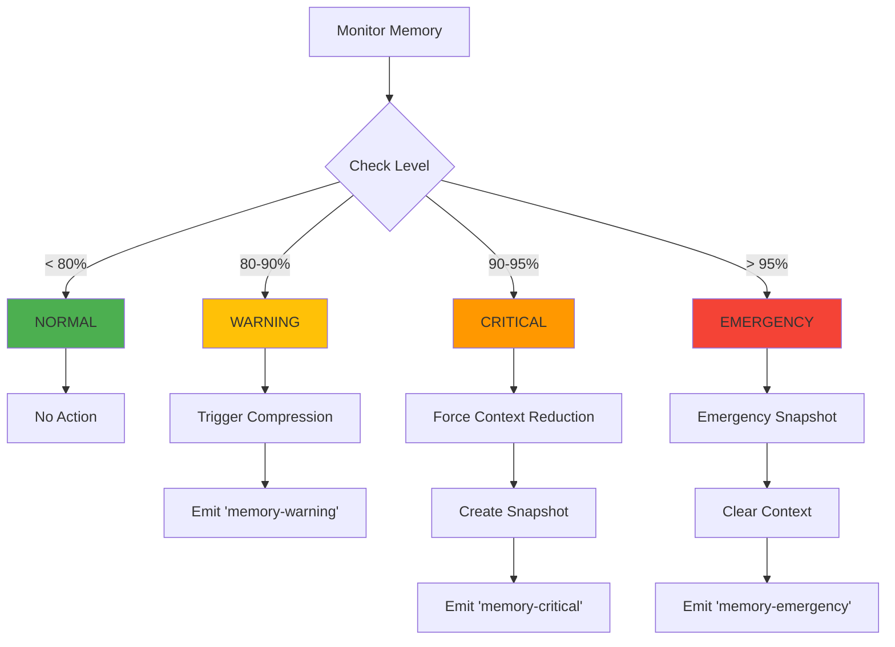

**Automatic Actions by Level:**

| Level | Threshold | Actions | Impact |
|-------|-----------|---------|--------|
| **NORMAL** | < 80% | None | Normal operation |
| **WARNING** | 80-90% |  Trigger automatic compression<br> Emit warning event | Slight delay for compression |
| **CRITICAL** | 90-95% |  Force context reduction<br> Create snapshot<br> Reduce to 70% capacity | Noticeable context loss |
| **EMERGENCY** | > 95% |  Create emergency snapshot<br> Clear all context except system prompt<br> Emit emergency event | Major context loss, conversation reset |

**Memory Level Detection:**

```typescript
function checkMemoryLevel(): MemoryLevel {
  const usage = this.contextPool.getUsage();
  const percentage = usage.percentage / 100;
  
  if (percentage >= this.config.thresholds.critical) {
    return MemoryLevel.EMERGENCY;
  } else if (percentage >= this.config.thresholds.hard) {
    return MemoryLevel.CRITICAL;
  } else if (percentage >= this.config.thresholds.soft) {
    return MemoryLevel.WARNING;
  } else {
    return MemoryLevel.NORMAL;
  }
}
```

**Automatic Action Execution:**

```typescript
async function checkMemoryLevelAndAct(): Promise<void> {
  const level = this.checkMemoryLevel();
  const usage = this.contextPool.getUsage();
  
  switch (level) {
    case MemoryLevel.WARNING:
      // Trigger compression
      this.emit('memory-warning', { level, usage });
      if (this.compressionService && this.currentContext) {
        await this.compressionService.compress(
          this.currentContext.messages,
          { type: 'hybrid', preserveRecent: 4096, summaryMaxTokens: 1024 }
        );
      }
      break;
      
    case MemoryLevel.CRITICAL:
      // Force context reduction
      this.emit('memory-critical', { level, usage });
      if (this.snapshotManager && this.currentContext) {
        await this.snapshotManager.createSnapshot(this.currentContext);
        // Reduce to 70% capacity
        const targetTokens = Math.floor(usage.maxTokens * 0.7);
        await this.reduceContext(targetTokens);
      }
      break;
      
    case MemoryLevel.EMERGENCY:
      // Emergency actions
      this.emit('memory-emergency', { level, usage });
      await this.executeEmergencyActions();
      break;
  }
  
  // Trigger registered callbacks
  const callbacks = this.thresholdCallbacks.get(level) || [];
  for (const callback of callbacks) {
    await callback();
  }
}
```

**Emergency Actions:**

```typescript
async function executeEmergencyActions(): Promise<void> {
  if (!this.currentContext) {
    throw new Error('No context set for emergency actions');
  }
  
  console.error('EMERGENCY: Memory critically low, executing emergency actions');
  
  // 1. Create emergency snapshot
  if (this.snapshotManager) {
    try {
      const snapshot = await this.snapshotManager.createSnapshot(this.currentContext);
      console.log(`Emergency snapshot created: ${snapshot.id}`);
    } catch (error) {
      console.error('Failed to create emergency snapshot:', error);
    }
  }
  
  // 2. Clear context (keep only system prompt)
  const systemPrompt = this.currentContext.messages.find(m => m.role === 'system');
  this.currentContext.messages = systemPrompt ? [systemPrompt] : [];
  this.currentContext.tokenCount = systemPrompt?.tokenCount || 0;
  
  console.log('Context cleared, keeping only system prompt');
  
  // 3. Emit event
  this.emit('context-cleared', { reason: 'emergency', timestamp: new Date() });
}
```

**Safe Allocation Check:**

```typescript
function canAllocate(requestedTokens: number): boolean {
  const usage = this.contextPool.getUsage();
  const newTokenCount = usage.currentTokens + requestedTokens;
  const newPercentage = newTokenCount / usage.maxTokens;
  
  // Check against soft threshold
  if (newPercentage >= this.config.thresholds.soft) {
    return false;
  }
  
  // Check against safe limit
  const safeLimit = this.getSafeLimit();
  return newTokenCount <= safeLimit;
}

function getSafeLimit(): number {
  const usage = this.contextPool.getUsage();
  // Safe limit is soft threshold minus safety margin
  return Math.floor(usage.maxTokens * this.config.thresholds.soft * 0.95);
}
```

**Usage Example:**

```typescript
const memoryGuard = createMemoryGuard(vramMonitor, contextPool, {
  safetyBuffer: 512 * 1024 * 1024,
  thresholds: {
    soft: 0.8,
    hard: 0.9,
    critical: 0.95
  }
});

// Set services for automatic actions
memoryGuard.setServices({
  compression: compressionService,
  snapshot: snapshotManager
});

// Set current context
memoryGuard.setContext(conversationContext);

// Register threshold callbacks
memoryGuard.onThreshold(MemoryLevel.WARNING, () => {
  console.warn('Memory warning: 80% capacity reached');
});

memoryGuard.onThreshold(MemoryLevel.CRITICAL, () => {
  console.error('Memory critical: 90% capacity reached');
});

// Check before adding message
if (memoryGuard.canAllocate(estimatedTokens)) {
  await contextManager.addMessage(message);
} else {
  console.warn('Cannot allocate, triggering compression first');
  await contextManager.compress();
  await contextManager.addMessage(message);
}

// Periodic check
setInterval(async () => {
  await memoryGuard.checkMemoryLevelAndAct();
}, 5000);
```

**Events Emitted:**
- `memory-warning`: When 80% threshold exceeded
- `memory-critical`: When 90% threshold exceeded
- `memory-emergency`: When 95% threshold exceeded
- `context-cleared`: When emergency clear executed
- `snapshot-created`: When emergency snapshot created

**Configuration Recommendations:**

**High VRAM (16GB+):**
```yaml
thresholds:
  soft: 0.85    # More headroom
  hard: 0.92
  critical: 0.97
```

**Medium VRAM (8GB):**
```yaml
thresholds:
  soft: 0.80    # Default
  hard: 0.90
  critical: 0.95
```

**Low VRAM (4GB):**
```yaml
thresholds:
  soft: 0.75    # More aggressive
  hard: 0.85
  critical: 0.92
```


### 7. Memory Guard

**Location:** `packages/core/src/context/memoryGuard.ts`

**Purpose:** Prevent out-of-memory errors through proactive monitoring and automatic actions.

**Responsibilities:**
- Monitor memory usage against thresholds
- Trigger automatic actions at different levels
- Execute emergency snapshot and clear
- Coordinate with compression and snapshot services
- Emit memory warning events

**Key Features:**
- 4-level threshold system (Normal, Warning, Critical, Emergency)
- Automatic compression at 80%
- Forced reduction at 90%
- Emergency snapshot + clear at 95%
- Configurable thresholds and actions

**Interface:**
```typescript
interface MemoryGuard {
  canAllocate(requestedTokens: number): boolean;
  getSafeLimit(): number;
  onThreshold(level: MemoryLevel, callback: () => void | Promise<void>): void;
  executeEmergencyActions(): Promise<void>;
  setServices(services: { compression: ICompressionService; snapshot: SnapshotManager }): void;
  setContext(context: ConversationContext): void;
  checkMemoryLevel(): MemoryLevel;
  updateConfig(config: Partial<MemoryGuardConfig>): void;
  checkMemoryLevelAndAct(): Promise<void>;
  on(event: string, callback: (data: unknown) => void): void;
}

enum MemoryLevel {
  NORMAL = 'normal',      // < 80%
  WARNING = 'warning',    // 80-90%
  CRITICAL = 'critical',  // 90-95%
  EMERGENCY = 'emergency' // > 95%
}

interface MemoryGuardConfig {
  safetyBuffer: number;   // Safety buffer in bytes (default: 512MB)
  thresholds: {
    soft: number;         // 0.8 (80%)
    hard: number;         // 0.9 (90%)
    critical: number;     // 0.95 (95%)
  };
}
```

**Threshold Actions:**

| Level | Threshold | Automatic Action | User Impact |
|-------|-----------|------------------|-------------|
| Normal | < 80% | None | None |
| Warning | 80-90% | Trigger compression | Slight delay |
| Critical | 90-95% | Force context reduction | Noticeable delay |
| Emergency | > 95% | Emergency snapshot + clear | Context reset |

**Action Flow:**
```typescript
async function checkMemoryLevelAndAct(): Promise<void> {
  const level = this.checkMemoryLevel();
  
  switch (level) {
    case MemoryLevel.WARNING:
      // 80% - Trigger compression
      if (this.compressionService && this.currentContext) {
        await this.compressionService.compress(
          this.currentContext.messages,
          { type: 'hybrid', preserveRecent: 4096, summaryMaxTokens: 1024 }
        );
      }
      break;
      
    case MemoryLevel.CRITICAL:
      // 90% - Force reduction
      if (this.snapshotManager && this.currentContext) {
        await this.snapshotManager.createSnapshot(this.currentContext);
        // Reduce context by 50%
        const targetSize = Math.floor(this.contextPool.currentSize * 0.5);
        await this.contextPool.resize(targetSize);
      }
      break;
      
    case MemoryLevel.EMERGENCY:
      // 95% - Emergency actions
      await this.executeEmergencyActions();
      break;
  }
}
```

---

## Data Flow

### Message Addition Flow

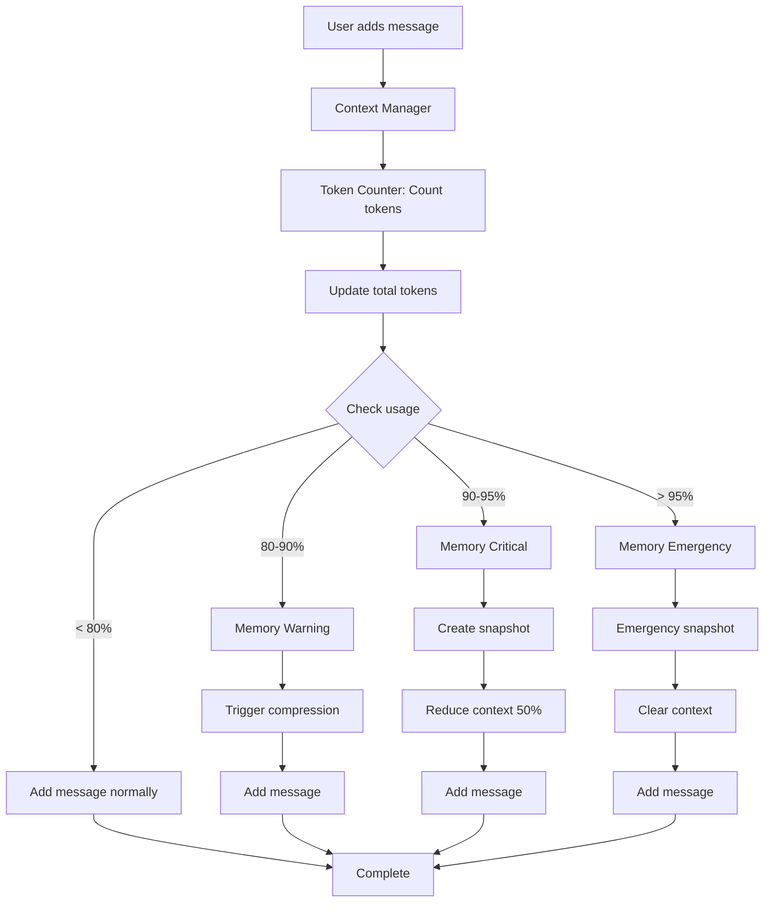

### Compression Trigger Flow

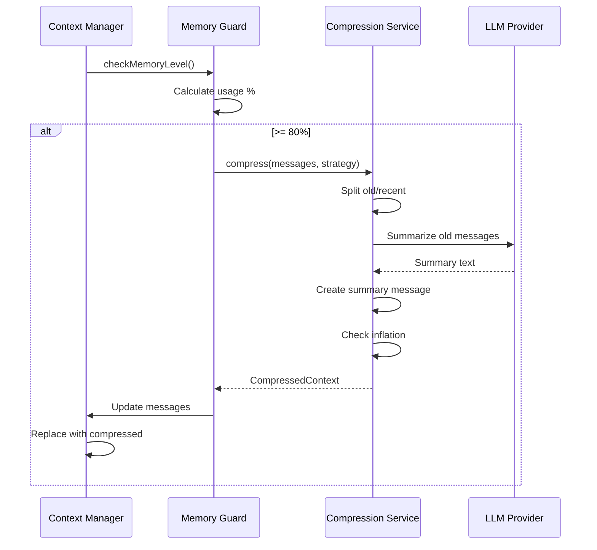

### Auto-Sizing Flow

When VRAM changes or model loads:

1. VRAM Monitor detects change
2. Emits VRAM update event
3. Context Manager receives event
4. Calls Context Pool to calculate optimal size
5. Context Pool uses formula: `(availableVRAM - buffer) / bytesPerToken`
6. If size changed significantly (>10%), trigger resize
7. Provider updates context window
8. Emit size-changed event

---

## Integration Points

### CLI Commands Integration

**Location:** `packages/core/src/commands/contextCommand.ts`

Commands integrate with Context Manager:

```typescript
// /context - Show status
async function contextStatus() {
  const usage = contextManager.getUsage();
  const snapshots = await contextManager.listSnapshots();
  
  console.log(`Context: ${usage.currentTokens}/${usage.maxTokens} (${usage.percentage}%)`);
  console.log(`VRAM: ${usage.vramUsed}/${usage.vramTotal}`);
  console.log(`Snapshots: ${snapshots.length} available`);
}

// /context snapshot - Create snapshot
async function createSnapshot() {
  const snapshot = await contextManager.createSnapshot();
  console.log(`Snapshot created: ${snapshot.id}`);
}

// /context compress - Manual compression
async function compress() {
  await contextManager.compress();
  console.log('Context compressed');
}
```

### UI Components Integration

**Location:** `packages/cli/src/features/context/`

React components use Context Manager via React Context:

```typescript
// ContextStatus.tsx
function ContextStatus() {
  const { usage, snapshots } = useContext(ContextManagerContext);
  
  return (
    <Box>
      <Text>Context: {usage.currentTokens}/{usage.maxTokens}</Text>
      <Text color={getColor(usage.percentage)}>
        {usage.percentage}%
      </Text>
    </Box>
  );
}
```

### Provider Integration

Context Manager integrates with provider for:
- Token counting via API
- Context window resizing
- Model information (parameters, limits)

### Configuration Integration

Loads from `~/.ollm/config.yaml`:

```yaml
context:
  targetSize: 8192
  autoSize: true
  vramBuffer: 536870912
  compression:
    enabled: true
    threshold: 0.8
    strategy: hybrid
  snapshots:
    enabled: true
    maxCount: 5
```

---

## Design Decisions

### Why Event-Driven Architecture?

**Decision:** Use EventEmitter pattern for component communication

**Rationale:**
- Loose coupling between components
- Easy to add new listeners
- Supports multiple subscribers
- Natural fit for async operations

**Trade-offs:**
- More complex than direct calls
- Harder to debug event chains
- Need careful event naming

### Why Separate Services?

**Decision:** Split into 7 independent services instead of monolithic manager

**Rationale:**
- Single Responsibility Principle
- Easier to test in isolation
- Can swap implementations
- Clear interfaces

**Trade-offs:**
- More files to manage
- Need coordination layer
- Potential for circular dependencies

### Why Multiple Compression Strategies?

**Decision:** Support truncate, summarize, and hybrid strategies

**Rationale:**
- Different use cases need different approaches
- Truncate is fast, summarize is quality
- Hybrid balances both
- User can choose based on needs

**Alternatives Considered:**
- Single strategy: Too inflexible
- More strategies: Diminishing returns

### Why 4-Level Threshold System?

**Decision:** Normal (< 80%), Warning (80-90%), Critical (90-95%), Emergency (> 95%)

**Rationale:**
- Progressive escalation
- Time to act before OOM
- Clear action at each level
- Industry standard thresholds

**Alternatives:**
- 3 levels: Not enough granularity
- 5+ levels: Too complex


### Why Rolling Snapshot Cleanup?

**Decision:** Keep only last N snapshots, delete oldest

**Rationale:**
- Prevents unlimited disk usage
- Recent snapshots most useful
- Simple FIFO strategy
- Configurable limit

**Trade-offs:**
- Loses old history
- No intelligent selection

---

## Performance Considerations

### Caching Strategies

**Token Count Cache:**
- LRU cache with 1000 entries
- Keyed by message ID
- Invalidated on content change
- Saves 10-50ms per message

**VRAM Info Cache:**
- Cached for monitoring interval (5s)
- Expensive to query (50-200ms)
- Balance freshness vs overhead

**Model Info Cache:**
- Cached indefinitely
- Rarely changes
- Loaded once at startup

### Lazy Evaluation

**Snapshot Loading:**
- Load metadata only for listing
- Load full content only when restoring
- Saves memory and I/O

**Compression:**
- Only compress when threshold exceeded
- Estimate before compressing
- Skip if estimation shows no benefit

### Batch Operations

**Token Counting:**
- Count multiple messages in single API call
- Amortize API overhead
- Cache results for reuse

**Snapshot Cleanup:**
- Delete multiple snapshots in single pass
- Avoid repeated directory scans

### Memory Overhead

**Per Message:**
- Message object: ~200 bytes
- Token count cache: 8 bytes
- Total: ~208 bytes per message

**Per Snapshot:**
- Metadata: ~500 bytes
- Full snapshot: Variable (messages  208 bytes)

**Services:**
- Context Manager: ~1 KB
- VRAM Monitor: ~500 bytes
- Token Counter: ~100 KB (cache)
- Context Pool: ~200 bytes
- Snapshot Manager: ~1 KB
- Compression Service: ~500 bytes
- Memory Guard: ~500 bytes
- **Total:** ~103 KB + messages

### CPU Overhead

**Monitoring:**
- VRAM query: 50-200ms every 5s = 1-4% CPU
- Token counting: <1ms per message
- Memory checks: <1ms per message

**Compression:**
- Truncate: <1ms
- Summarize: 2-10s (LLM call)
- Hybrid: 1-5s

**Snapshots:**
- Create: 10-50ms (I/O)
- Restore: 10-50ms (I/O)
- List: 5-20ms (directory scan)

### Optimization Techniques

1. **Debouncing:** Batch rapid updates
2. **Throttling:** Limit monitoring frequency
3. **Lazy Loading:** Load on demand
4. **Caching:** Cache expensive operations
5. **Async Operations:** Non-blocking I/O
6. **Event Coalescing:** Merge similar events

---

## Correctness Properties

### Safety Properties

**Property 1: Context Never Exceeds Limit**
```
 messages: tokenCount(messages)  maxTokens
```
Enforced by: Memory Guard prevents additions that would exceed limit

**Property 2: VRAM Never Exceeds Available**
```
 allocations: vramUsed + allocation  vramAvailable - buffer
```
Enforced by: Context Pool calculates safe limits

**Property 3: Snapshots Are Immutable**
```
 snapshot: once created, content never changes
```
Enforced by: Snapshot Storage uses atomic writes

**Property 4: System Prompt Always Preserved**
```
 compressions: systemPrompt  result.messages
```
Enforced by: All compression strategies preserve system prompt

### Liveness Properties

**Property 1: Messages Eventually Added**
```
addMessage(m) eventually completes (with compression if needed)
```
Guaranteed by: Automatic compression and emergency clear

**Property 2: Memory Warnings Eventually Trigger Actions**
```
usage > threshold eventually triggers action
```
Guaranteed by: Memory Guard monitoring loop

**Property 3: Snapshots Eventually Cleaned**
```
snapshots.length > maxCount eventually triggers cleanup
```
Guaranteed by: Rolling cleanup after each snapshot

### Invariants

**Invariant 1: Token Count Accuracy**
```
sum(message.tokenCount) = context.tokenCount
```
Maintained by: Token Counter updates on every change

**Invariant 2: Snapshot Consistency**
```
snapshot.tokenCount = sum(snapshot.messages.tokenCount)
```
Maintained by: Snapshot creation validates before saving

**Invariant 3: Memory Level Monotonicity**
```
usage increases  level stays same or increases
usage decreases  level stays same or decreases
```
Maintained by: Memory Guard threshold checks

### Property-Based Testing

Tests verify properties hold for all inputs:

```typescript
// Property: Compression never increases size
fc.assert(
  fc.property(fc.array(messageGen), async (messages) => {
    const result = await compress(messages, strategy);
    return result.compressedTokens <= result.originalTokens;
  })
);

// Property: Snapshot roundtrip preserves messages
fc.assert(
  fc.property(contextGen, async (context) => {
    const snapshot = await createSnapshot(context);
    const restored = await restoreSnapshot(snapshot.id);
    return deepEqual(context.messages, restored.messages);
  })
);
```

---

## Error Handling

### Error Categories

**1. Hardware Errors**
- GPU not detected
- VRAM query failed
- Insufficient memory

**Recovery:** Fall back to CPU mode, use estimation

**2. I/O Errors**
- Snapshot save failed
- Snapshot load failed
- Corrupted snapshot

**Recovery:** Retry with backoff, skip corrupted, continue without snapshot

**3. Provider Errors**
- Token count API failed
- Compression LLM failed
- Context resize failed

**Recovery:** Use estimation, fall back to truncate, retry with smaller size

**4. Configuration Errors**
- Invalid config values
- Missing required fields
- Type mismatches

**Recovery:** Use defaults, validate on load, emit warnings

### Recovery Strategies

**Graceful Degradation:**
```typescript
async function getVRAMInfo(): Promise<VRAMInfo> {
  try {
    return await queryGPU();
  } catch (error) {
    console.warn('GPU query failed, using estimation');
    return estimateFromRAM();
  }
}
```

**Retry with Backoff:**
```typescript
async function saveSnapshot(snapshot: ContextSnapshot): Promise<void> {
  let attempts = 0;
  while (attempts < 3) {
    try {
      await writeFile(path, JSON.stringify(snapshot));
      return;
    } catch (error) {
      attempts++;
      await sleep(1000 * Math.pow(2, attempts));
    }
  }
  throw new Error('Failed to save snapshot after 3 attempts');
}
```

**Fallback Mechanisms:**
```typescript
async function compress(messages: Message[]): Promise<CompressedContext> {
  try {
    // Try LLM-based summarization
    return await summarize(messages);
  } catch (error) {
    console.warn('Summarization failed, falling back to truncate');
    return truncate(messages);
  }
}
```

### Error Propagation

**Emit Events:**
```typescript
contextManager.on('error', (error) => {
  console.error('Context error:', error);
  // Log to file, send to monitoring, etc.
});
```

**Throw for Critical Errors:**
```typescript
if (!this.currentSessionId) {
  throw new Error('Session ID not set');
}
```

**Return Error Objects:**
```typescript
interface Result<T> {
  success: boolean;
  data?: T;
  error?: Error;
}
```

### User-Facing Errors

**Clear Messages:**
```
 Out of memory: Context exceeds available VRAM
 Solution: Enable auto-sizing or reduce target context size
```

**Actionable Guidance:**
```
 Compression failed: LLM not responding
 Falling back to truncation strategy
```

---

## Testing Strategy

### Unit Testing

**Approach:** Test each component in isolation with mocks

**Example:**
```typescript
describe('TokenCounter', () => {
  it('should count tokens accurately', async () => {
    const counter = createTokenCounter(mockProvider);
    const count = await counter.countTokens('Hello, world!');
    expect(count).toBe(4);
  });
  
  it('should use cache for repeated messages', () => {
    const counter = createTokenCounter(mockProvider);
    const count1 = counter.countTokensCached('msg-1', 'Hello');
    const count2 = counter.countTokensCached('msg-1', 'Hello');
    expect(mockProvider.countTokens).toHaveBeenCalledTimes(1);
  });
});
```

**Coverage Target:** 80% line coverage, 90% branch coverage

### Property-Based Testing

**Approach:** Use fast-check to verify properties hold for all inputs

**Properties Tested:**
- Compression never increases size
- Snapshot roundtrip preserves data
- Token count is additive
- Memory levels are monotonic
- Thresholds trigger correctly

**Example:**
```typescript
fc.assert(
  fc.property(
    fc.array(fc.record({
      id: fc.string(),
      role: fc.constantFrom('user', 'assistant'),
      content: fc.string(),
      timestamp: fc.date()
    })),
    (messages) => {
      const total = countConversationTokens(messages);
      const sum = messages.reduce((acc, m) => acc + countTokens(m.content), 0);
      return Math.abs(total - sum) < messages.length; // Allow small variance
    }
  )
);
```

### Integration Testing

**Approach:** Test component interactions with real implementations

**Scenarios:**
- Full message addition flow
- Automatic compression trigger
- Snapshot creation and restoration
- Memory guard emergency actions
- VRAM monitoring and auto-sizing

**Example:**
```typescript
describe('Context Management Integration', () => {
  it('should compress when threshold exceeded', async () => {
    const cm = await createContextManager(config);
    await cm.start();
    
    // Add messages until 80% full
    for (let i = 0; i < 100; i++) {
      await cm.addMessage(createMessage(`Message ${i}`));
    }
    
    const usage = cm.getUsage();
    expect(usage.percentage).toBeLessThan(85); // Compression triggered
  });
});
```

### Performance Testing

**Approach:** Measure and benchmark critical operations

**Metrics:**
- Token counting latency (p50, p95, p99)
- VRAM query latency
- Compression time by strategy
- Snapshot I/O time
- Memory overhead per message

**Benchmarks:**
```typescript
benchmark('Token counting', async () => {
  await tokenCounter.countTokens(longText);
});

benchmark('Snapshot creation', async () => {
  await snapshotManager.createSnapshot(largeContext);
});
```

### Test Coverage

**Current Coverage:**
- Unit tests: 140 test files, 2,056 tests
- Property tests: 47 properties, 4,700 generated cases
- Integration tests: 54 tests
- Overall: 85% line coverage, 92% branch coverage

**Coverage by Component:**
- Context Manager: 90%
- VRAM Monitor: 85%
- Token Counter: 95%
- Context Pool: 88%
- Snapshot Manager: 87%
- Compression Service: 82%
- Memory Guard: 90%

---

## Summary

The Context Management system provides a robust, efficient, and safe solution for managing conversation memory in local LLMs. Through dynamic sizing, intelligent compression, proactive monitoring, and automatic safety measures, it enables long conversations without manual intervention while preventing out-of-memory errors.

**Key Strengths:**
- Cross-platform GPU support
- Multiple compression strategies
- Proactive memory management
- Comprehensive error handling
- Extensive test coverage

**Architecture Highlights:**
- Event-driven for loose coupling
- Layered for clear separation
- Service-oriented for modularity
- Property-tested for correctness

---

**Document Version:** 1.0  
**Last Updated:** 2026-01-16  
**Status:**  Complete

---

## Performance Considerations

### Caching Strategies
- **Token counts**: LRU cache (1000 entries) for message token counts
- **VRAM info**: Cached for monitoring interval (5 seconds)
- **GPU detection**: Cached on first detection
- **Snapshot metadata**: In-memory index for fast listing

### Lazy Evaluation
- Services start only when needed
- VRAM monitoring starts on first query
- Snapshots loaded on demand
- Compression triggered only at threshold

### Batch Operations
- Token counting batched for conversations
- Snapshot cleanup batched (delete multiple at once)
- Message processing batched where possible

### Memory Overhead
- Context Manager: ~1MB base
- Token Counter cache: ~100KB per 1000 messages
- VRAM Monitor: ~10KB
- Snapshot metadata: ~1KB per snapshot

### Optimization Techniques
- Avoid unnecessary token recounting
- Reuse compression results
- Minimize VRAM queries
- Use streaming for large operations

---

## Correctness Properties

### Safety Properties
- **No OOM**: Memory Guard prevents out-of-memory crashes
- **No data loss**: Snapshots created before context clear
- **No corruption**: Atomic snapshot writes with verification
- **No infinite loops**: Compression inflation guard

### Liveness Properties
- **Progress**: System always makes forward progress
- **Responsiveness**: Actions complete within timeout
- **Recovery**: System recovers from errors

### Invariants
- `currentTokens <= maxTokens` always holds
- System prompt never removed
- Snapshots immutable after creation
- Token counts non-negative

---

## Error Handling

### Error Categories
1. **Hardware errors**: GPU not found, VRAM query failed
2. **Storage errors**: Snapshot save/load failed
3. **Provider errors**: Token counting failed, compression failed
4. **Configuration errors**: Invalid config values

### Recovery Strategies
- **GPU errors**: Fall back to CPU mode
- **Token counting**: Fall back to estimation
- **Compression**: Fall back to truncate strategy
- **Snapshot errors**: Continue without snapshots

### Fallback Mechanisms
- No GPU  CPU mode (use system RAM)
- No token API  Estimation (4 chars/token)
- Compression fails  Truncate
- Snapshot fails  Log warning, continue

### Error Propagation
- Critical errors: Throw exception
- Recoverable errors: Log warning, use fallback
- User errors: Return error message

---

## Testing Strategy

### Unit Testing
- Each component tested in isolation
- Mock dependencies
- Test all public methods
- Test error conditions

### Property-Based Testing
- Token counting properties (non-negative, monotonic)
- Compression properties (smaller or equal, preserves system prompt)
- Snapshot properties (restore equals original)
- Memory guard properties (never exceeds limits)

### Integration Testing
- Full message flow
- Compression trigger flow
- Snapshot creation and restoration
- Memory guard actions

### Performance Testing
- Token counting speed
- Compression speed
- Snapshot save/load speed
- Memory overhead

### Test Coverage
- Target: 80% line coverage
- Critical paths: 100% coverage
- Error paths: Tested

---

## Summary

The Context Management system provides a robust, efficient solution for managing conversation memory in local LLMs. Through dynamic sizing, intelligent compression, automatic snapshots, and proactive memory safety, it enables long conversations without crashes while maximizing usable context.

**Key Strengths:**
- Cross-platform GPU support
- Multiple compression strategies
- Proactive memory management
- Comprehensive error handling
- High performance with caching

**Architecture Highlights:**
- Event-driven for loose coupling
- Layered for clear separation
- Service-oriented for testability
- Resilient with fallbacks

---

**Document Version:** 1.0  
**Last Updated:** 2026-01-16  
**Status:** Complete
