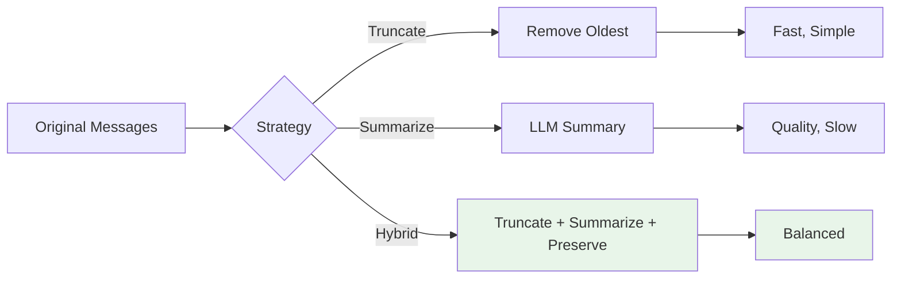
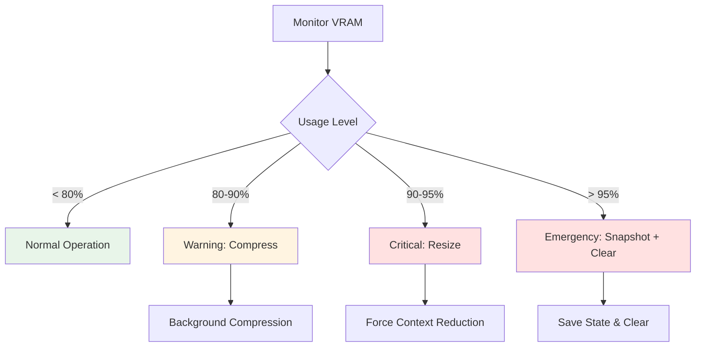

# Context Management Configuration

Complete guide to configuring Context Management in OLLM CLI.

## Table of Contents

- [Overview](#overview)
- [Configuration File](#configuration-file)
- [Configuration Options](#configuration-options)
  - [Basic Settings](#basic-settings)
  - [Auto-Sizing](#auto-sizing)
  - [Compression](#compression)
  - [Snapshots](#snapshots)
  - [Memory Safety](#memory-safety)
- [Environment Variables](#environment-variables)
- [Configuration by Scenario](#configuration-by-scenario)
- [Performance Tuning](#performance-tuning)
- [Validation](#validation)
- [Migration Guide](#migration-guide)
- [See Also](#see-also)

---

## Overview

Context Management configuration controls how OLLM CLI manages conversation memory, GPU resources, and context optimization. Configuration can be set at multiple levels with clear precedence rules.

**Configuration Levels:**
1. **User-level**: `~/.ollm/config.yaml` (global defaults)
2. **Workspace-level**: `.ollm/config.yaml` (project-specific)
3. **Environment variables**: Override file settings
4. **Runtime commands**: Temporary overrides via `/context` commands

**Precedence:** Runtime > Environment > Workspace > User

---

## Configuration File

### Location

**User-level configuration:**
```
~/.ollm/config.yaml
```

**Workspace-level configuration:**
```
.ollm/config.yaml
```

### Format

Configuration uses YAML format with clear structure and comments:

```yaml
# Context Management Configuration
context:
  # Basic context size settings
  targetSize: 16384
  minSize: 2048
  maxSize: 32768
  
  # Auto-sizing based on VRAM
  autoSize: true
  vramBuffer: 536870912  # 512MB in bytes
  kvQuantization: q8_0
  
  # Compression settings
  compression:
    enabled: true
    threshold: 0.8
    strategy: hybrid
    preserveRecent: 4096
    summaryMaxTokens: 1024
  
  # Snapshot settings
  snapshots:
    enabled: true
    maxCount: 5
    autoCreate: true
    autoThreshold: 0.8
  
  # Memory safety
  memoryGuard:
    enabled: true
    warningThreshold: 0.8
    criticalThreshold: 0.9
    emergencyThreshold: 0.95
```

---

## Configuration Options

### Basic Settings

#### targetSize

**Description:** Target context size in tokens

**Type:** Integer  
**Default:** `16384`  
**Range:** `minSize` to `maxSize`  
**Unit:** Tokens

**Example:**
```yaml
context:
  targetSize: 8192   # 8K tokens
```

**When to Adjust:**
- Lower for limited VRAM (4GB or less)
- Higher for large VRAM (16GB or more)
- Match model's native context window
- Optimize for specific workloads

**Common Values:**
- `2048` - Minimum for basic conversations
- `4096` - Small models or low VRAM
- `8192` - Balanced for most use cases
- `16384` - Large contexts, ample VRAM
- `32768` - Maximum for supported models

---

#### minSize

**Description:** Minimum allowed context size

**Type:** Integer  
**Default:** `2048`  
**Range:** `1024` to `maxSize`  
**Unit:** Tokens

**Example:**
```yaml
context:
  minSize: 4096   # Never go below 4K
```

**When to Adjust:**
- Ensure minimum quality for responses
- Prevent context from becoming too small
- Match application requirements

**Recommendations:**
- **Minimum:** 1024 tokens (very constrained)
- **Recommended:** 2048 tokens (basic conversations)
- **Comfortable:** 4096 tokens (good quality)

---

#### maxSize

**Description:** Maximum allowed context size

**Type:** Integer  
**Default:** `32768`  
**Range:** `minSize` to model limit  
**Unit:** Tokens

**Example:**
```yaml
context:
  maxSize: 65536   # 64K for large models
```

**When to Adjust:**
- Match model's maximum context window
- Limit memory usage
- Prevent excessive VRAM consumption

**Model Limits:**
- **Llama 2**: 4096 tokens
- **Llama 3**: 8192 tokens
- **Llama 3.1**: 128K tokens (practical: 32K-64K)
- **Mistral**: 32K tokens
- **Mixtral**: 32K tokens

---

### Auto-Sizing

#### autoSize

**Description:** Enable automatic context sizing based on VRAM

**Type:** Boolean  
**Default:** `true`  
**Recommended:** `true`

**Example:**
```yaml
context:
  autoSize: true
```

**Behavior:**
- Monitors VRAM availability in real-time
- Adjusts context size dynamically
- Respects `minSize` and `maxSize` constraints
- Accounts for KV cache quantization
- Reserves safety buffer

**When to Disable:**
- Need consistent context size for testing
- Troubleshooting memory issues
- Specific application requirements
- Benchmarking performance

**Calculation:**
```
Available Context = (Available VRAM - Safety Buffer) / Bytes Per Token
```

---

#### vramBuffer

**Description:** Safety buffer reserved from VRAM calculations

**Type:** Integer  
**Default:** `536870912` (512MB)  
**Range:** `0` to available VRAM  
**Unit:** Bytes

**Example:**
```yaml
context:
  vramBuffer: 1073741824   # 1GB buffer
```

**When to Adjust:**
- **Increase** for stability (shared GPU, other apps)
- **Decrease** to maximize context (dedicated GPU)
- **Increase** if experiencing OOM errors
- **Decrease** if context is too conservative

**Common Values:**
- `268435456` - 256MB (minimal, risky)
- `536870912` - 512MB (default, balanced)
- `1073741824` - 1GB (conservative, safe)
- `2147483648` - 2GB (very conservative)

**Conversion:**
```
256MB = 268435456 bytes
512MB = 536870912 bytes
1GB   = 1073741824 bytes
2GB   = 2147483648 bytes
```

---

#### kvQuantization

**Description:** KV cache quantization type

**Type:** String (enum)  
**Default:** `q8_0`  
**Options:** `f16`, `q8_0`, `q4_0`

**Example:**
```yaml
context:
  kvQuantization: q8_0
```

**Impact on Memory:**

| Quantization | Bytes/Token | Quality | Speed |
|:-------------|:------------|:--------|:------|
| `f16`        | High        | Best    | Fast  |
| `q8_0`       | Medium      | Good    | Fast  |
| `q4_0`       | Low         | Fair    | Slower|

**When to Adjust:**
- **f16**: Maximum quality, ample VRAM
- **q8_0**: Balanced (recommended)
- **q4_0**: Limited VRAM, acceptable quality loss

**Memory Calculation:**
```
KV Cache Size = Context Tokens × Bytes Per Token × 2 (K+V)

Example (8B model, 16K context):
- f16:  16384 × 0.25 × 2 = 8.2 GB
- q8_0: 16384 × 0.125 × 2 = 4.1 GB
- q4_0: 16384 × 0.0625 × 2 = 2.0 GB
```

---

### Compression

#### compression.enabled

**Description:** Enable automatic context compression

**Type:** Boolean  
**Default:** `true`  
**Recommended:** `true`

**Example:**
```yaml
context:
  compression:
    enabled: true
```

**When to Disable:**
- Debugging compression issues
- Testing without compression
- Short conversations only
- Specific application requirements

---

#### compression.threshold

**Description:** Trigger compression at this usage percentage

**Type:** Float  
**Default:** `0.8` (80%)  
**Range:** `0.0` to `1.0`

**Example:**
```yaml
context:
  compression:
    threshold: 0.75   # Compress at 75%
```

**When to Adjust:**
- **Lower** (0.6-0.7): Compress earlier, more headroom
- **Higher** (0.85-0.9): Compress later, less frequent
- **0.8**: Balanced (recommended)

**Trade-offs:**
- **Lower threshold**: More frequent compression, more overhead
- **Higher threshold**: Less frequent, risk of hitting limit

---

#### compression.strategy

**Description:** Compression strategy to use

**Type:** String (enum)  
**Default:** `hybrid`  
**Options:** `truncate`, `summarize`, `hybrid`

**Example:**
```yaml
context:
  compression:
    strategy: hybrid
```

**Strategies:**

**1. Truncate**
- Simply removes oldest messages
- Fastest (no LLM call)
- May lose important context
- Best for: Quick compression, less critical conversations

**2. Summarize**
- LLM-generated summary of old messages
- Preserves semantic meaning
- Requires LLM call (~2s)
- Best for: Important conversations, context preservation

**3. Hybrid** (Recommended)
- Truncates oldest messages
- Summarizes middle messages
- Preserves recent messages
- Best for: Balanced compression and quality

**Comparison:**



---

#### compression.preserveRecent

**Description:** Number of recent tokens to keep uncompressed

**Type:** Integer  
**Default:** `4096`  
**Range:** `1024` to `targetSize`  
**Unit:** Tokens

**Example:**
```yaml
context:
  compression:
    preserveRecent: 8192   # Keep last 8K tokens
```

**When to Adjust:**
- **Increase**: Preserve more recent context
- **Decrease**: Allow more aggressive compression
- **Match**: Typical conversation turn size

**Recommendations:**
- **Minimum**: 2048 tokens (2-3 turns)
- **Recommended**: 4096 tokens (4-6 turns)
- **Generous**: 8192 tokens (8-12 turns)

---

#### compression.summaryMaxTokens

**Description:** Maximum tokens for compression summary

**Type:** Integer  
**Default:** `1024`  
**Range:** `256` to `4096`  
**Unit:** Tokens

**Example:**
```yaml
context:
  compression:
    summaryMaxTokens: 2048   # Longer summaries
```

**When to Adjust:**
- **Increase**: More detailed summaries
- **Decrease**: More aggressive compression
- **Balance**: Summary quality vs. token savings

**Trade-offs:**
- **Larger**: Better context preservation, less compression
- **Smaller**: More compression, potential information loss

---

### Snapshots

#### snapshots.enabled

**Description:** Enable snapshot system

**Type:** Boolean  
**Default:** `true`  
**Recommended:** `true`

**Example:**
```yaml
context:
  snapshots:
    enabled: true
```

**When to Disable:**
- Disk space constraints
- Privacy concerns
- Testing without snapshots
- Temporary sessions only

---

#### snapshots.maxCount

**Description:** Maximum number of snapshots to keep

**Type:** Integer  
**Default:** `5`  
**Range:** `1` to `100`

**Example:**
```yaml
context:
  snapshots:
    maxCount: 10   # Keep 10 snapshots
```

**When to Adjust:**
- **Increase**: More history, more disk space
- **Decrease**: Less disk space, fewer restore points

**Disk Usage:**
```
Approximate: 1-5 MB per snapshot
Example: 10 snapshots ≈ 10-50 MB
```

**Cleanup:**
- Oldest snapshots deleted automatically
- Manual cleanup via filesystem
- Snapshots stored in `~/.ollm/session-data/{sessionId}/snapshots/`

---

#### snapshots.autoCreate

**Description:** Automatically create snapshots at threshold

**Type:** Boolean  
**Default:** `true`  
**Recommended:** `true`

**Example:**
```yaml
context:
  snapshots:
    autoCreate: true
```

**When to Disable:**
- Manual snapshot control only
- Reduce disk I/O
- Testing scenarios

---

#### snapshots.autoThreshold

**Description:** Create automatic snapshot at this usage percentage

**Type:** Float  
**Default:** `0.8` (80%)  
**Range:** `0.0` to `1.0`

**Example:**
```yaml
context:
  snapshots:
    autoThreshold: 0.75   # Snapshot at 75%
```

**When to Adjust:**
- **Lower** (0.6-0.7): More frequent snapshots
- **Higher** (0.85-0.9): Less frequent snapshots
- **Match**: Compression threshold for coordination

---

### Memory Safety

#### memoryGuard.enabled

**Description:** Enable memory safety system

**Type:** Boolean  
**Default:** `true`  
**Recommended:** `true`

**Example:**
```yaml
context:
  memoryGuard:
    enabled: true
```

**When to Disable:**
- Debugging memory issues
- Testing edge cases
- Controlled environments only

**⚠️ Warning:** Disabling may cause OOM errors!

---

#### memoryGuard.warningThreshold

**Description:** Warning threshold for VRAM usage

**Type:** Float  
**Default:** `0.8` (80%)  
**Range:** `0.0` to `1.0`

**Example:**
```yaml
context:
  memoryGuard:
    warningThreshold: 0.75   # Warn at 75%
```

**Action:** Trigger background compression

---

#### memoryGuard.criticalThreshold

**Description:** Critical threshold for VRAM usage

**Type:** Float  
**Default:** `0.9` (90%)  
**Range:** `0.0` to `1.0`

**Example:**
```yaml
context:
  memoryGuard:
    criticalThreshold: 0.85   # Critical at 85%
```

**Action:** Force context resize (shrink window)

---

#### memoryGuard.emergencyThreshold

**Description:** Emergency threshold for VRAM usage

**Type:** Float  
**Default:** `0.95` (95%)  
**Range:** `0.0` to `1.0`

**Example:**
```yaml
context:
  memoryGuard:
    emergencyThreshold: 0.92   # Emergency at 92%
```

**Action:** Emergency snapshot + clear context

**Memory Guard Flow:**



---

## Environment Variables

Override configuration file settings with environment variables:

### OLLM_CONTEXT_SIZE

**Description:** Target context size  
**Type:** Integer  
**Example:**
```bash
export OLLM_CONTEXT_SIZE=8192
```

### OLLM_CONTEXT_AUTO

**Description:** Enable auto-sizing  
**Type:** Boolean (`true`/`false`)  
**Example:**
```bash
export OLLM_CONTEXT_AUTO=true
```

### OLLM_CONTEXT_VRAM_BUFFER

**Description:** VRAM safety buffer in MB  
**Type:** Integer  
**Example:**
```bash
export OLLM_CONTEXT_VRAM_BUFFER=512
```

### OLLM_KV_CACHE_TYPE

**Description:** KV cache quantization  
**Type:** String (`f16`, `q8_0`, `q4_0`)  
**Example:**
```bash
export OLLM_KV_CACHE_TYPE=q8_0
```

### OLLM_COMPRESSION_ENABLED

**Description:** Enable compression  
**Type:** Boolean (`true`/`false`)  
**Example:**
```bash
export OLLM_COMPRESSION_ENABLED=true
```

### OLLM_COMPRESSION_STRATEGY

**Description:** Compression strategy  
**Type:** String (`truncate`, `summarize`, `hybrid`)  
**Example:**
```bash
export OLLM_COMPRESSION_STRATEGY=hybrid
```

### Complete Example

```bash
# Set all context environment variables
export OLLM_CONTEXT_SIZE=16384
export OLLM_CONTEXT_AUTO=true
export OLLM_CONTEXT_VRAM_BUFFER=512
export OLLM_KV_CACHE_TYPE=q8_0
export OLLM_COMPRESSION_ENABLED=true
export OLLM_COMPRESSION_STRATEGY=hybrid

# Run OLLM with these settings
ollm
```

---

## Configuration by Scenario

### Scenario 1: Low VRAM (4GB or less)

**Goal:** Maximize stability with limited memory

```yaml
context:
  targetSize: 4096
  minSize: 2048
  maxSize: 8192
  autoSize: true
  vramBuffer: 1073741824  # 1GB buffer
  kvQuantization: q4_0     # Aggressive quantization
  
  compression:
    enabled: true
    threshold: 0.7          # Compress early
    strategy: hybrid
    preserveRecent: 2048    # Minimal preservation
    summaryMaxTokens: 512
  
  snapshots:
    enabled: true
    maxCount: 3             # Fewer snapshots
    autoCreate: true
    autoThreshold: 0.7
  
  memoryGuard:
    enabled: true
    warningThreshold: 0.7
    criticalThreshold: 0.85
    emergencyThreshold: 0.92
```

---

### Scenario 2: Balanced (8GB VRAM)

**Goal:** Good performance with reasonable memory

```yaml
context:
  targetSize: 16384
  minSize: 2048
  maxSize: 32768
  autoSize: true
  vramBuffer: 536870912   # 512MB buffer
  kvQuantization: q8_0    # Balanced
  
  compression:
    enabled: true
    threshold: 0.8
    strategy: hybrid
    preserveRecent: 4096
    summaryMaxTokens: 1024
  
  snapshots:
    enabled: true
    maxCount: 5
    autoCreate: true
    autoThreshold: 0.8
  
  memoryGuard:
    enabled: true
    warningThreshold: 0.8
    criticalThreshold: 0.9
    emergencyThreshold: 0.95
```

---

### Scenario 3: High VRAM (16GB+)

**Goal:** Maximum context and quality

```yaml
context:
  targetSize: 32768
  minSize: 4096
  maxSize: 65536
  autoSize: true
  vramBuffer: 536870912   # 512MB buffer
  kvQuantization: f16     # Maximum quality
  
  compression:
    enabled: true
    threshold: 0.85         # Compress later
    strategy: summarize     # Quality preservation
    preserveRecent: 8192    # Generous preservation
    summaryMaxTokens: 2048
  
  snapshots:
    enabled: true
    maxCount: 10            # More history
    autoCreate: true
    autoThreshold: 0.85
  
  memoryGuard:
    enabled: true
    warningThreshold: 0.85
    criticalThreshold: 0.92
    emergencyThreshold: 0.97
```

---

### Scenario 4: Shared GPU

**Goal:** Coexist with other applications

```yaml
context:
  targetSize: 8192
  minSize: 2048
  maxSize: 16384
  autoSize: true
  vramBuffer: 2147483648  # 2GB buffer (conservative)
  kvQuantization: q8_0
  
  compression:
    enabled: true
    threshold: 0.75         # Compress early
    strategy: hybrid
    preserveRecent: 3072
    summaryMaxTokens: 768
  
  snapshots:
    enabled: true
    maxCount: 5
    autoCreate: true
    autoThreshold: 0.75
  
  memoryGuard:
    enabled: true
    warningThreshold: 0.75
    criticalThreshold: 0.85
    emergencyThreshold: 0.92
```

---

### Scenario 5: Testing/Development

**Goal:** Consistent behavior for testing

```yaml
context:
  targetSize: 8192
  minSize: 8192           # Fixed size
  maxSize: 8192           # Fixed size
  autoSize: false         # Disable auto-sizing
  vramBuffer: 536870912
  kvQuantization: q8_0
  
  compression:
    enabled: false        # Disable for testing
    threshold: 0.8
    strategy: truncate    # Simple strategy
    preserveRecent: 4096
    summaryMaxTokens: 1024
  
  snapshots:
    enabled: true
    maxCount: 3
    autoCreate: false     # Manual only
    autoThreshold: 0.8
  
  memoryGuard:
    enabled: false        # Disable for testing
    warningThreshold: 0.8
    criticalThreshold: 0.9
    emergencyThreshold: 0.95
```

---

## Performance Tuning

### Optimize for Speed

**Priority:** Fast responses, minimal overhead

```yaml
context:
  compression:
    strategy: truncate    # Fastest compression
    threshold: 0.85       # Compress less often
  
  snapshots:
    autoCreate: false     # Manual snapshots only
```

**Trade-off:** May lose context quality

---

### Optimize for Quality

**Priority:** Best context preservation

```yaml
context:
  compression:
    strategy: summarize   # Best quality
    preserveRecent: 8192  # Keep more context
    summaryMaxTokens: 2048
  
  snapshots:
    maxCount: 10          # More restore points
```

**Trade-off:** Slower compression, more disk space

---

### Optimize for Memory

**Priority:** Minimal VRAM usage

```yaml
context:
  targetSize: 4096        # Smaller context
  kvQuantization: q4_0    # Aggressive quantization
  vramBuffer: 1073741824  # Large buffer
  
  compression:
    threshold: 0.7        # Compress early
    preserveRecent: 2048  # Minimal preservation
```

**Trade-off:** Smaller context window

---

### Optimize for Stability

**Priority:** Prevent crashes

```yaml
context:
  autoSize: true          # Adapt to conditions
  vramBuffer: 1073741824  # Large safety buffer
  
  compression:
    enabled: true
    threshold: 0.75       # Compress early
  
  memoryGuard:
    enabled: true
    warningThreshold: 0.75
    criticalThreshold: 0.85
    emergencyThreshold: 0.92
```

**Trade-off:** More conservative memory usage

---

## Validation

### Configuration Validation

OLLM CLI validates configuration on startup:

**Checks:**
- All required fields present
- Values within valid ranges
- Type correctness
- Logical consistency (min < target < max)

**Example Errors:**
```
Configuration Error: context.targetSize (100000) exceeds context.maxSize (32768)
Configuration Error: context.minSize (8192) is greater than context.targetSize (4096)
Configuration Error: context.compression.threshold must be between 0.0 and 1.0
```

### Validate Configuration

```bash
# Validate configuration file
ollm config validate

# Show current configuration
ollm config show

# Test configuration
ollm config test
```

---

## Migration Guide

### From v0.1.x to v1.0.0

**Breaking Changes:**
- `contextSize` renamed to `targetSize`
- `buffer` renamed to `vramBuffer` (now in bytes)
- `kvCache` renamed to `kvQuantization`

**Migration:**

**Old Configuration (v0.1.x):**
```yaml
context:
  contextSize: 16384
  buffer: 512  # MB
  kvCache: q8_0
```

**New Configuration (v1.0.0):**
```yaml
context:
  targetSize: 16384
  vramBuffer: 536870912  # bytes
  kvQuantization: q8_0
```

**Automatic Migration:**
```bash
# Migrate configuration automatically
ollm config migrate
```

---

## See Also

- [Getting Started](./getting-started.md) - Quick start guide
- [Architecture](./Context_architecture.md) - System design
- [Commands](./Context_commands.md) - CLI commands reference
- [Management Guide](./management/user-guide.md) - Using context effectively
- [Troubleshooting](../troubleshooting.md) - Common issues

---

**Last Updated:** 2026-01-16  
**Version:** 1.0.0
