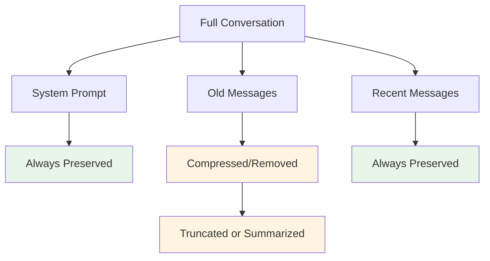
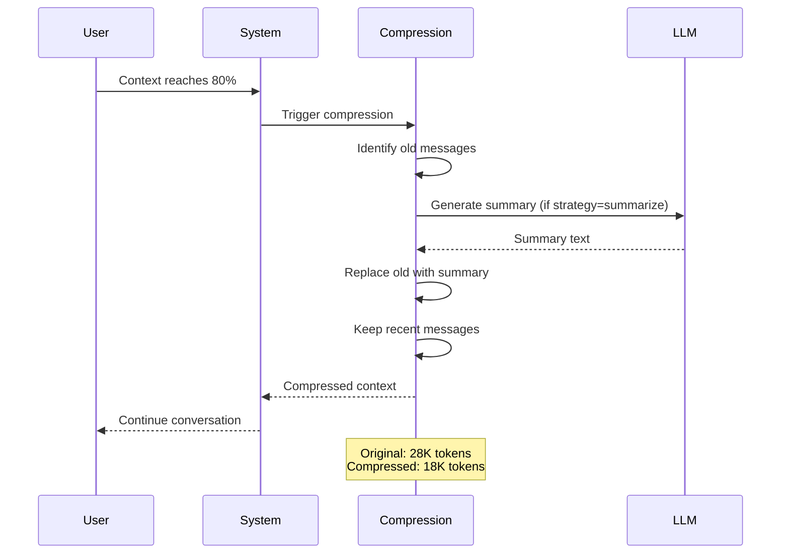
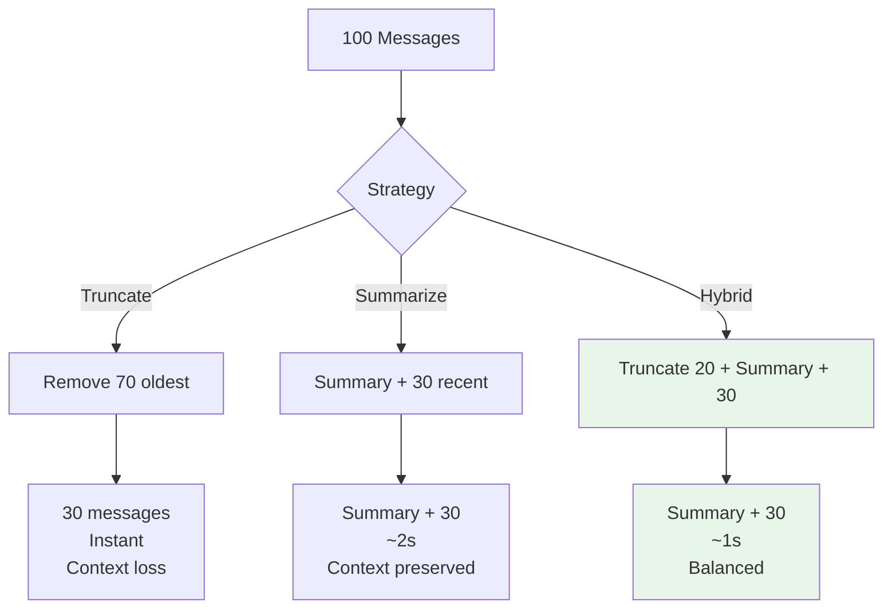

# Context Compression Guide

Complete guide to understanding and using context compression in OLLM CLI.

## Table of Contents

- [Overview](#overview)
- [Understanding Compression](#understanding-compression)
- [Compression Strategies](#compression-strategies)
- [Manual Compression](#manual-compression)
- [Automatic Compression](#automatic-compression)
- [Configuration](#configuration)
- [Optimization](#optimization)
- [Monitoring Compression](#monitoring-compression)
- [Best Practices](#best-practices)
- [Troubleshooting](#troubleshooting)

---

## Overview

Context compression reduces the size of conversation history while preserving important information. This allows you to:
- Continue long conversations indefinitely
- Stay within model token limits
- Optimize memory usage
- Maintain conversation flow

**Key Principle:** Compress old messages, preserve recent context

---

## Understanding Compression

### Why Compress?

**Problem:** Models have limited context windows
- Llama 3: 8K tokens
- Llama 3.1: 128K tokens (practical: 32K-64K)
- Long conversations exceed these limits

**Solution:** Compress older messages
- Remove or summarize old content
- Keep recent messages intact
- Preserve system prompt
- Maintain conversation continuity

### What Gets Compressed?



### Compression Flow



---

## Compression Strategies

### 1. Truncate Strategy

**How it works:**
- Simply removes oldest messages
- Keeps system prompt + recent messages
- No LLM call required

**Pros:**
- ✅ Fastest (instant)
- ✅ No overhead
- ✅ Predictable behavior
- ✅ No additional tokens

**Cons:**
- ❌ Loses context completely
- ❌ May lose important information
- ❌ Abrupt context loss

**Best for:**
- Quick compression needed
- Less critical conversations
- Testing scenarios
- Low-resource environments

**Example:**
```
Before (100 messages):
[System] You are a helpful assistant
[User] Message 1
[Assistant] Response 1
...
[User] Message 98
[Assistant] Response 98
[User] Message 99
[Assistant] Response 99
[User] Message 100

After (30 messages):
[System] You are a helpful assistant
[User] Message 71
[Assistant] Response 71
...
[User] Message 99
[Assistant] Response 99
[User] Message 100
```

---

### 2. Summarize Strategy

**How it works:**
- LLM generates summary of old messages
- Replaces old messages with summary
- Keeps system prompt + recent messages

**Pros:**
- ✅ Preserves semantic meaning
- ✅ Maintains context continuity
- ✅ Best quality compression
- ✅ Smooth conversation flow

**Cons:**
- ❌ Slower (~2s for LLM call)
- ❌ Uses tokens for summary
- ❌ Requires LLM availability
- ❌ Summary overhead

**Best for:**
- Important conversations
- Context preservation critical
- Long-term conversations
- Quality over speed

**Example:**
```
Before (100 messages):
[System] You are a helpful assistant
[User] Message 1
[Assistant] Response 1
...
[User] Message 70
[Assistant] Response 70
[User] Message 71
...
[User] Message 100

After (summary + 30 messages):
[System] You are a helpful assistant
[Summary] Previous conversation covered: topic A, topic B, 
          user asked about X, we discussed Y, concluded Z.
[User] Message 71
[Assistant] Response 71
...
[User] Message 100
```

---

### 3. Hybrid Strategy (Recommended)

**How it works:**
- Truncates very old messages
- Summarizes middle messages
- Preserves recent messages
- Best of both approaches

**Pros:**
- ✅ Balanced compression
- ✅ Good quality preservation
- ✅ Reasonable speed
- ✅ Flexible approach

**Cons:**
- ⚠️ More complex logic
- ⚠️ Moderate overhead

**Best for:**
- Most use cases (default)
- Balanced quality/speed
- General conversations
- Production use

**Example:**
```
Before (100 messages):
[System] You are a helpful assistant
[User] Message 1-20 (very old)
[User] Message 21-70 (middle)
[User] Message 71-100 (recent)

After (summary + 30 messages):
[System] You are a helpful assistant
[Summary] Early conversation covered: initial topics...
[User] Message 71
[Assistant] Response 71
...
[User] Message 100
```

---

### Strategy Comparison

| Strategy | Speed | Quality | Overhead | Best For |
|:---------|:------|:--------|:---------|:---------|
| **Truncate** | ⚡⚡⚡ Fast | ⭐ Basic | None | Quick compression |
| **Summarize** | ⚡ Slow | ⭐⭐⭐ Best | High | Quality preservation |
| **Hybrid** | ⚡⚡ Medium | ⭐⭐ Good | Medium | General use |

**Visual Comparison:**



---

## Manual Compression

### Trigger Compression

**Command:**
```bash
/context compress
```

**Output:**
```
Compressed: 28,000 → 18,000 tokens (35.7% reduction)
```

### When to Compress Manually

**1. Approaching Limit:**
```bash
/context
→ Tokens: 26,000 / 32,768 (79.3%)

/context compress
→ Compressed: 26,000 → 16,000 tokens
```

**2. Before Large Operations:**
```bash
# Before loading large file
/context compress
# Now load file
```

**3. Optimize Memory:**
```bash
# Free up VRAM
/context compress
/context stats
→ VRAM: 5.2 GB / 8.0 GB (was 7.1 GB)
```

**4. Prepare for Long Conversation:**
```bash
# Start with clean slate
/context compress
# Continue conversation
```

### Compression Workflow

```bash
# 1. Check current usage
/context
→ Tokens: 28,000 / 32,768 (85.4%)

# 2. Create snapshot (safety)
/context snapshot

# 3. Compress
/context compress
→ Compressed: 28,000 → 18,000 tokens (35.7% reduction)

# 4. Verify result
/context
→ Tokens: 18,000 / 32,768 (54.9%)

# 5. Continue conversation
```

---

## Automatic Compression

### How Auto-Compression Works

**Trigger:** Context usage reaches threshold (default: 80%)

**Process:**
1. Monitor context usage continuously
2. When threshold exceeded, trigger compression
3. Apply configured strategy
4. Continue conversation seamlessly

**Configuration:**
```yaml
context:
  compression:
    enabled: true
    threshold: 0.8
    strategy: hybrid
```

### Enable/Disable

**Enable (default):**
```yaml
context:
  compression:
    enabled: true
```

**Disable:**
```yaml
context:
  compression:
    enabled: false
```

**Check status:**
```bash
/context
→ Auto-compress: enabled at 80%
```

### Threshold Configuration

**Default threshold: 80%**

**Adjust threshold:**
```yaml
context:
  compression:
    threshold: 0.75  # Compress at 75%
```

**Recommendations:**
- **0.6-0.7**: Compress early, more headroom
- **0.8**: Balanced (default)
- **0.85-0.9**: Compress later, less frequent

**Trade-offs:**

| Threshold | Frequency | Headroom | Overhead |
|:----------|:----------|:---------|:---------|
| 60% | High | Large | High |
| 80% | Medium | Medium | Medium |
| 90% | Low | Small | Low |

---

## Configuration

### Basic Configuration

```yaml
context:
  compression:
    enabled: true
    threshold: 0.8
    strategy: hybrid
    preserveRecent: 4096
    summaryMaxTokens: 1024
```

### Configuration Options

#### enabled

**Enable compression system**

```yaml
compression:
  enabled: true
```

**Values:** `true` | `false`  
**Default:** `true`

---

#### threshold

**Trigger compression at this usage percentage**

```yaml
compression:
  threshold: 0.8
```

**Values:** `0.0` to `1.0`  
**Default:** `0.8` (80%)

---

#### strategy

**Compression strategy to use**

```yaml
compression:
  strategy: hybrid
```

**Values:** `truncate` | `summarize` | `hybrid`  
**Default:** `hybrid`

---

#### preserveRecent

**Number of recent tokens to keep uncompressed**

```yaml
compression:
  preserveRecent: 4096
```

**Values:** `1024` to `targetSize`  
**Default:** `4096`  
**Unit:** Tokens

**Recommendations:**
- **2048**: Minimal (2-3 turns)
- **4096**: Recommended (4-6 turns)
- **8192**: Generous (8-12 turns)

---

#### summaryMaxTokens

**Maximum tokens for compression summary**

```yaml
compression:
  summaryMaxTokens: 1024
```

**Values:** `256` to `4096`  
**Default:** `1024`  
**Unit:** Tokens

**Trade-offs:**
- **Larger**: Better context, less compression
- **Smaller**: More compression, potential loss

---

### Configuration by Scenario

**Aggressive Compression (Low VRAM):**
```yaml
compression:
  enabled: true
  threshold: 0.7
  strategy: truncate
  preserveRecent: 2048
  summaryMaxTokens: 512
```

**Balanced (Recommended):**
```yaml
compression:
  enabled: true
  threshold: 0.8
  strategy: hybrid
  preserveRecent: 4096
  summaryMaxTokens: 1024
```

**Quality Preservation (High VRAM):**
```yaml
compression:
  enabled: true
  threshold: 0.85
  strategy: summarize
  preserveRecent: 8192
  summaryMaxTokens: 2048
```

---

## Optimization

### Optimize for Speed

**Goal:** Fastest compression

```yaml
compression:
  strategy: truncate
  threshold: 0.85
```

**Result:**
- Instant compression
- No LLM overhead
- More frequent manual compression

---

### Optimize for Quality

**Goal:** Best context preservation

```yaml
compression:
  strategy: summarize
  preserveRecent: 8192
  summaryMaxTokens: 2048
```

**Result:**
- Best quality summaries
- Slower compression (~2s)
- More tokens used

---

### Optimize for Balance

**Goal:** Good quality, reasonable speed

```yaml
compression:
  strategy: hybrid
  preserveRecent: 4096
  summaryMaxTokens: 1024
  threshold: 0.8
```

**Result:**
- Balanced approach
- Moderate speed (~1s)
- Good quality

---

### Optimize for Memory

**Goal:** Maximum compression

```yaml
compression:
  threshold: 0.7
  preserveRecent: 2048
  summaryMaxTokens: 512
```

**Result:**
- Compress early and often
- Minimal preservation
- Maximum memory savings

---

## Monitoring Compression

### Check Compression Status

**Command:**
```bash
/context
```

**Output:**
```
Auto-compress: enabled at 80%
```

### View Compression History

**Command:**
```bash
/context stats
```

**Output:**
```
Compression History:
  Last compressed: 45 min ago
  Ratio: 28,000 → 18,000 (36% reduction)
```

### Monitor During Compression

**Watch for:**
- Token count reduction
- Memory usage decrease
- Compression time
- Quality of results

**Example:**
```bash
# Before
/context
→ Tokens: 28,000 / 32,768 (85.4%)
→ VRAM: 7.1 GB / 8.0 GB

# Compress
/context compress
→ Compressed: 28,000 → 18,000 tokens (35.7% reduction)

# After
/context
→ Tokens: 18,000 / 32,768 (54.9%)
→ VRAM: 5.2 GB / 8.0 GB
```

---

## Best Practices

### 1. Use Hybrid Strategy

**Recommended for most users:**
```yaml
compression:
  strategy: hybrid
```

**Benefits:**
- Balanced quality/speed
- Good compression ratio
- Preserves important context

### 2. Enable Auto-Compression

**Let system handle it:**
```yaml
compression:
  enabled: true
  threshold: 0.8
```

**Benefits:**
- Automatic management
- No manual intervention
- Prevents hitting limits

### 3. Preserve Adequate Recent Context

**Keep enough recent messages:**
```yaml
compression:
  preserveRecent: 4096
```

**Guidelines:**
- Minimum: 2048 tokens
- Recommended: 4096 tokens
- Generous: 8192 tokens

### 4. Create Snapshots Before Compression

**Safety first:**
```bash
/context snapshot
/context compress
```

**Benefits:**
- Can restore if needed
- Safety net for mistakes
- Experiment safely

### 5. Monitor Compression Results

**Check effectiveness:**
```bash
/context compress
→ Compressed: 28,000 → 18,000 tokens (35.7% reduction)

# Verify quality
# Continue conversation
# Check if context preserved
```

### 6. Adjust Based on Use Case

**Short conversations:**
```yaml
compression:
  enabled: false
```

**Long conversations:**
```yaml
compression:
  enabled: true
  threshold: 0.75
```

### 7. Test Different Strategies

**Experiment to find best fit:**
```yaml
# Try truncate
compression:
  strategy: truncate

# Try summarize
compression:
  strategy: summarize

# Try hybrid
compression:
  strategy: hybrid
```

---

## Troubleshooting

### Compression Not Reducing Tokens

**Symptoms:**
- Compression has minimal effect
- Token count stays high
- Still hitting limits

**Causes:**
1. Already at minimum
2. `preserveRecent` too high
3. Short conversation

**Solutions:**

**1. Check current state:**
```bash
/context
→ Tokens: 6,000 / 32,768 (18.3%)
# Already small, nothing to compress
```

**2. Reduce preservation:**
```yaml
compression:
  preserveRecent: 2048  # Was 8192
```

**3. Use aggressive strategy:**
```yaml
compression:
  strategy: truncate
```

**4. Clear if needed:**
```bash
/context snapshot
/context clear
```

---

### Compression Too Aggressive

**Symptoms:**
- Losing important context
- Conversation feels disjointed
- Missing previous information

**Solutions:**

**1. Increase preservation:**
```yaml
compression:
  preserveRecent: 8192  # Was 4096
```

**2. Use quality strategy:**
```yaml
compression:
  strategy: summarize
```

**3. Increase summary size:**
```yaml
compression:
  summaryMaxTokens: 2048  # Was 1024
```

**4. Compress less often:**
```yaml
compression:
  threshold: 0.85  # Was 0.8
```

---

### Compression Too Slow

**Symptoms:**
- Long wait during compression
- Noticeable delay
- Interrupts workflow

**Solutions:**

**1. Use fast strategy:**
```yaml
compression:
  strategy: truncate
```

**2. Compress less often:**
```yaml
compression:
  threshold: 0.85
```

**3. Reduce summary size:**
```yaml
compression:
  summaryMaxTokens: 512
```

---

### Auto-Compression Not Triggering

**Symptoms:**
- Context reaches 80%+ without compression
- No automatic compression
- Manual compression required

**Solutions:**

**1. Check enabled:**
```yaml
compression:
  enabled: true
```

**2. Check threshold:**
```yaml
compression:
  threshold: 0.8
```

**3. Verify usage:**
```bash
/context
→ Tokens: 26,000 / 32,768 (79.3%)
# Below 80%, won't trigger yet
```

**4. Lower threshold:**
```yaml
compression:
  threshold: 0.75
```

---

### Summary Quality Poor

**Symptoms:**
- Summaries miss important details
- Context loss after compression
- Conversation quality degraded

**Solutions:**

**1. Increase summary size:**
```yaml
compression:
  summaryMaxTokens: 2048
```

**2. Preserve more recent:**
```yaml
compression:
  preserveRecent: 8192
```

**3. Use better model:**
```yaml
# Use larger model for summaries
# (if supported in future)
```

**4. Manual summaries:**
```bash
# Create snapshot before compression
/context snapshot

# Compress
/context compress

# If quality poor, restore and try different settings
/context restore <snapshot-id>
```

---

## See Also

- [User Guide](./user-guide.md) - General context management
- [Snapshots Guide](./snapshots.md) - Snapshot system
- [Commands Reference](../Context_commands.md) - CLI commands
- [Configuration](../Context_configuration.md) - Configuration options
- [Architecture](../Context_architecture.md) - Technical details

---

**Last Updated:** 2026-01-16  
**Version:** 1.0.0
