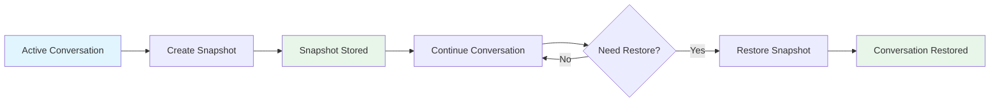
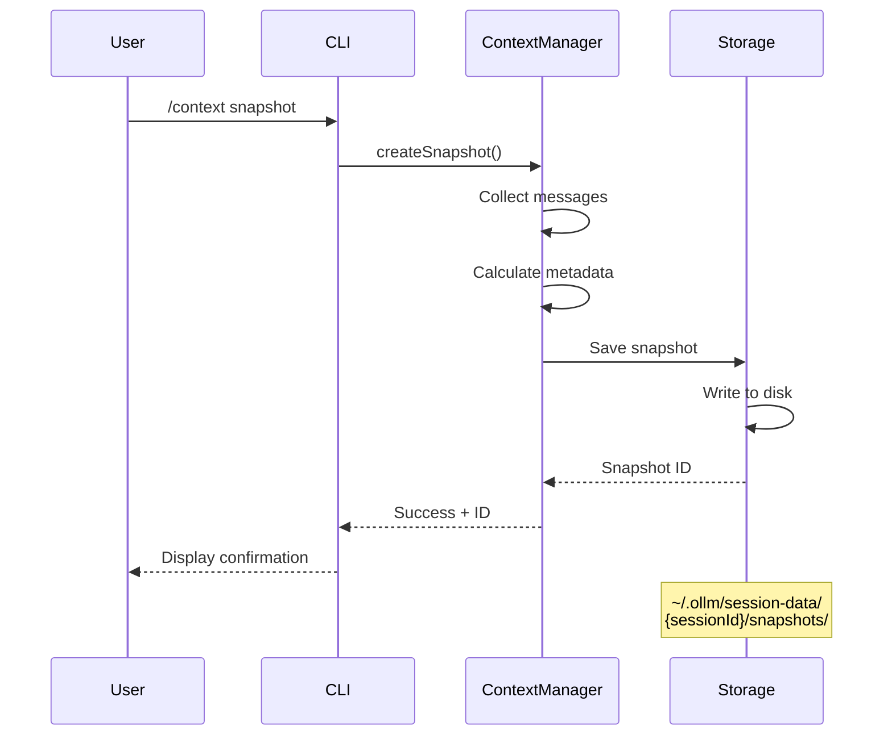
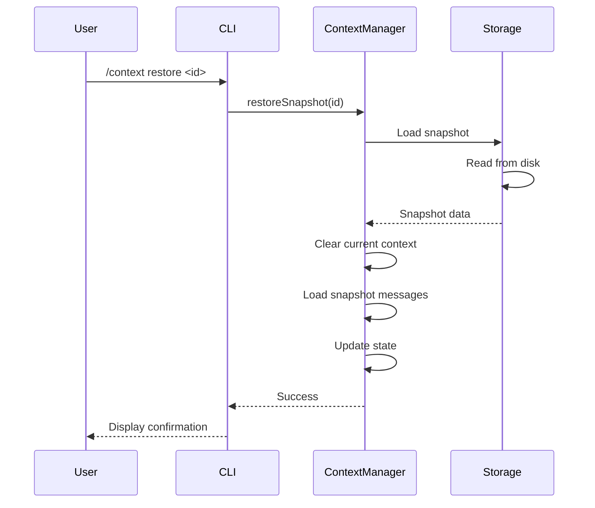
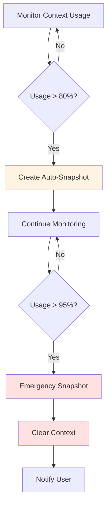

# Snapshot System Guide

Complete guide to using snapshots for conversation checkpoints and recovery.

## Table of Contents

- [Overview](#overview)
- [Understanding Snapshots](#understanding-snapshots)
- [Creating Snapshots](#creating-snapshots)
- [Restoring Snapshots](#restoring-snapshots)
- [Managing Snapshots](#managing-snapshots)
- [Automatic Snapshots](#automatic-snapshots)
- [Snapshot Storage](#snapshot-storage)
- [Recovery Strategies](#recovery-strategies)
- [Best Practices](#best-practices)
- [Troubleshooting](#troubleshooting)

---

## Overview

Snapshots are saved states of your conversation that allow you to:
- Create checkpoints during long conversations
- Recover from mistakes or errors
- Branch conversations in different directions
- Preserve important conversation states
- Roll back to previous points

Think of snapshots as "save points" in a video game - you can always return to them if needed.

---

## Understanding Snapshots

### What's in a Snapshot?

Each snapshot contains:
- **All messages**: Complete conversation history
- **System prompt**: AI instructions and context
- **Metadata**: Timestamp, model, token count
- **State**: Compression state and settings

### Snapshot Lifecycle



### When to Use Snapshots

**Create snapshots:**
- Before risky operations
- At conversation milestones
- Before clearing context
- Before major topic changes
- At end of important discussions

**Restore snapshots:**
- After mistakes or errors
- To explore different paths
- To recover lost context
- To return to previous state

---

## Creating Snapshots

### Manual Snapshot Creation

**Command:**
```bash
/context snapshot
```

**Output:**
```
Snapshot created: snapshot-2026-01-16-14-30-45
Tokens: 12,847 | Messages: 24
```

**Snapshot ID Format:**
```
snapshot-YYYY-MM-DD-HH-MM-SS
```

### When to Create Snapshots

**Before Risky Operations:**
```bash
# Before clearing context
/context snapshot
/context clear

# Before major compression
/context snapshot
/context compress

# Before experimental changes
/context snapshot
# ... try something ...
```

**At Milestones:**
```bash
# After completing a task
# ... finish task ...
/context snapshot

# After important discussion
# ... important conversation ...
/context snapshot

# Before switching topics
/context snapshot
# ... new topic ...
```

**Periodic Backups:**
```bash
# Every hour during long sessions
/context snapshot

# After every N messages
# (can be automated with hooks)
```

### Snapshot Creation Flow



---

## Restoring Snapshots

### List Available Snapshots

**Command:**
```bash
/context list
```

**Output:**
```
Snapshots:
  1. snapshot-2026-01-16-14-30-45 - 2 hours ago (12,847 tokens)
  2. snapshot-2026-01-16-12-15-30 - 4 hours ago (8,234 tokens)
  3. snapshot-2026-01-16-10-00-00 - 6 hours ago (15,432 tokens)
```

### Restore a Snapshot

**Command:**
```bash
/context restore snapshot-2026-01-16-14-30-45
```

**Output:**
```
Restored snapshot snapshot-2026-01-16-14-30-45
Tokens: 12,847
```

### Safe Restore Process

**⚠️ Warning:** Restoring replaces your current context!

**Recommended Process:**
```bash
# 1. Create snapshot of current state
/context snapshot
→ Snapshot created: snapshot-2026-01-16-15-00-00

# 2. List available snapshots
/context list

# 3. Restore desired snapshot
/context restore snapshot-2026-01-16-14-30-45
→ Restored snapshot snapshot-2026-01-16-14-30-45

# 4. If needed, restore current state
/context restore snapshot-2026-01-16-15-00-00
```

### Restore Flow



---

## Managing Snapshots

### Viewing Snapshot Details

**List all snapshots:**
```bash
/context list
```

**Check current status:**
```bash
/context
→ Snapshots: 3 available
```

**Detailed statistics:**
```bash
/context stats
→ Session:
→   Snapshots: 3
```

### Snapshot Limits

**Default Configuration:**
```yaml
context:
  snapshots:
    maxCount: 5
```

**Behavior:**
- Keeps last N snapshots
- Oldest snapshots deleted automatically
- Configurable limit (1-100)

**Adjust limit:**
```yaml
context:
  snapshots:
    maxCount: 10  # Keep 10 snapshots
```

### Manual Cleanup

**View snapshot files:**
```bash
# List snapshot files
ls -lh ~/.ollm/session-data/*/snapshots/

# View snapshot details
cat ~/.ollm/session-data/{sessionId}/snapshots/snapshot-*.json
```

**Delete old snapshots:**
```bash
# Delete specific snapshot
rm ~/.ollm/session-data/{sessionId}/snapshots/snapshot-2026-01-16-10-00-00.json

# Delete all snapshots for session
rm ~/.ollm/session-data/{sessionId}/snapshots/*.json

# Delete all snapshots (all sessions)
rm -rf ~/.ollm/session-data/*/snapshots/
```

**⚠️ Warning:** Manual deletion cannot be undone!

---

## Automatic Snapshots

### Auto-Snapshot Configuration

**Enable automatic snapshots:**
```yaml
context:
  snapshots:
    enabled: true
    autoCreate: true
    autoThreshold: 0.8
```

**Settings:**
- `enabled`: Enable snapshot system
- `autoCreate`: Create snapshots automatically
- `autoThreshold`: Trigger at this context usage (0.8 = 80%)

### When Auto-Snapshots Trigger

**1. Context Threshold (80%)**
```
Context usage reaches 80%
→ Automatic snapshot created
→ Continue conversation
```

**2. Before Emergency Clear (95%)**
```
VRAM usage reaches 95%
→ Emergency snapshot created
→ Context cleared automatically
→ Restore snapshot to continue
```

**3. Before Compression (Optional)**
```
Before automatic compression
→ Snapshot created (if configured)
→ Compression proceeds
```

### Auto-Snapshot Flow



### Disable Auto-Snapshots

**Disable if needed:**
```yaml
context:
  snapshots:
    autoCreate: false
```

**When to disable:**
- Manual control only
- Reduce disk I/O
- Privacy concerns
- Testing scenarios

---

## Snapshot Storage

### Storage Location

**Default location:**
```
~/.ollm/session-data/{sessionId}/snapshots/
```

**Structure:**
```
~/.ollm/
└── session-data/
    └── session-abc123/
        └── snapshots/
            ├── snapshot-2026-01-16-14-30-45.json
            ├── snapshot-2026-01-16-12-15-30.json
            └── snapshot-2026-01-16-10-00-00.json
```

### Snapshot File Format

**JSON structure:**
```json
{
  "id": "snapshot-2026-01-16-14-30-45",
  "timestamp": "2026-01-16T14:30:45.000Z",
  "tokenCount": 12847,
  "messages": [
    {
      "id": "msg-1",
      "role": "system",
      "content": "You are a helpful assistant.",
      "timestamp": "2026-01-16T10:00:00.000Z"
    },
    {
      "id": "msg-2",
      "role": "user",
      "content": "Hello!",
      "timestamp": "2026-01-16T10:00:05.000Z"
    }
  ],
  "metadata": {
    "model": "llama3.1:8b",
    "contextSize": 32768,
    "compressionRatio": 1.0
  }
}
```

### Disk Usage

**Approximate sizes:**
- Small snapshot (10 messages): 1-2 MB
- Medium snapshot (50 messages): 3-5 MB
- Large snapshot (100+ messages): 5-10 MB

**Total usage:**
```
5 snapshots × 5 MB average = 25 MB
10 snapshots × 5 MB average = 50 MB
```

**Check disk usage:**
```bash
# Check snapshot directory size
du -sh ~/.ollm/session-data/*/snapshots/

# Check all session data
du -sh ~/.ollm/session-data/
```

### Snapshot Integrity

**Atomic writes:**
- Snapshots written atomically
- Prevents corruption during write
- Safe even if interrupted

**Corruption detection:**
- JSON validation on load
- Checksum verification (optional)
- Automatic fallback to previous snapshot

---

## Recovery Strategies

### Strategy 1: Undo Recent Changes

**Scenario:** Made a mistake in last few messages

**Solution:**
```bash
# 1. List snapshots
/context list

# 2. Restore most recent snapshot
/context restore snapshot-2026-01-16-14-30-45

# 3. Continue from that point
```

### Strategy 2: Branch Conversation

**Scenario:** Want to explore different direction

**Solution:**
```bash
# 1. Create snapshot at branch point
/context snapshot
→ snapshot-2026-01-16-15-00-00

# 2. Explore path A
# ... conversation path A ...

# 3. Return to branch point
/context restore snapshot-2026-01-16-15-00-00

# 4. Explore path B
# ... conversation path B ...
```

### Strategy 3: Emergency Recovery

**Scenario:** Context cleared unexpectedly

**Solution:**
```bash
# 1. Check for emergency snapshot
/context list
→ snapshot-2026-01-16-15-30-00 (emergency)

# 2. Restore emergency snapshot
/context restore snapshot-2026-01-16-15-30-00

# 3. Verify restoration
/context
```

### Strategy 4: Session Recovery

**Scenario:** Application crashed or closed

**Solution:**
```bash
# 1. Restart application
ollm

# 2. List available snapshots
/context list

# 3. Restore most recent snapshot
/context restore <most-recent-id>

# 4. Continue conversation
```

### Strategy 5: Selective Restore

**Scenario:** Need specific conversation state

**Solution:**
```bash
# 1. List all snapshots with details
/context list

# 2. Identify desired snapshot by time/tokens
# snapshot-2026-01-16-12-15-30 - 4 hours ago (8,234 tokens)

# 3. Restore that specific snapshot
/context restore snapshot-2026-01-16-12-15-30

# 4. Verify correct state
/context
```

---

## Best Practices

### 1. Create Snapshots Regularly

**Frequency recommendations:**
- **Short sessions** (< 1 hour): 1-2 snapshots
- **Medium sessions** (1-3 hours): 3-5 snapshots
- **Long sessions** (> 3 hours): 5-10 snapshots

**Example schedule:**
```bash
# Start of session
/context snapshot

# Every hour
/context snapshot

# Before major operations
/context snapshot

# End of session
/context snapshot
```

### 2. Name Snapshots Meaningfully

While snapshot IDs are automatic, you can track them:

```bash
# Create snapshot and note the ID
/context snapshot
→ snapshot-2026-01-16-14-30-45

# Keep a log (external)
echo "14:30 - Completed code review" >> session-log.txt
echo "Snapshot: snapshot-2026-01-16-14-30-45" >> session-log.txt
```

### 3. Verify Snapshots

**After creation:**
```bash
# Create snapshot
/context snapshot

# Verify it's listed
/context list

# Check count increased
/context
→ Snapshots: 4 available
```

### 4. Test Restore Process

**Periodically test:**
```bash
# 1. Create test snapshot
/context snapshot
→ snapshot-test

# 2. Make a change
# ... add message ...

# 3. Restore snapshot
/context restore snapshot-test

# 4. Verify restoration worked
/context
```

### 5. Clean Up Old Snapshots

**Regular cleanup:**
```bash
# Check snapshot count
/context list

# If too many, adjust configuration
# (edit config.yaml: maxCount: 5)

# Or delete manually
rm ~/.ollm/session-data/*/snapshots/snapshot-2026-01-15-*.json
```

### 6. Backup Important Snapshots

**For critical conversations:**
```bash
# Copy snapshot to backup location
cp ~/.ollm/session-data/{sessionId}/snapshots/snapshot-*.json \
   ~/backups/important-conversation.json

# Or export entire session
cp -r ~/.ollm/session-data/{sessionId}/ \
   ~/backups/session-backup/
```

### 7. Use Auto-Snapshots

**Enable for safety:**
```yaml
context:
  snapshots:
    enabled: true
    autoCreate: true
    autoThreshold: 0.8
```

**Benefits:**
- Automatic safety net
- No manual intervention needed
- Captures state before issues
- Emergency recovery available

---

## Troubleshooting

### Snapshot Creation Fails

**Symptoms:**
```
Failed to create snapshot: <error>
```

**Solutions:**

**1. Check disk space:**
```bash
df -h ~/.ollm/
```

**2. Check permissions:**
```bash
ls -la ~/.ollm/session-data/
chmod 755 ~/.ollm/session-data/
```

**3. Check directory exists:**
```bash
mkdir -p ~/.ollm/session-data/{sessionId}/snapshots/
```

**4. Check disk write:**
```bash
touch ~/.ollm/session-data/test.txt
rm ~/.ollm/session-data/test.txt
```

### Snapshot Restore Fails

**Symptoms:**
```
Failed to restore snapshot: Snapshot not found
Failed to restore snapshot: Corrupted snapshot
```

**Solutions:**

**1. Verify snapshot exists:**
```bash
ls ~/.ollm/session-data/*/snapshots/snapshot-*.json
```

**2. Check snapshot ID:**
```bash
# List available snapshots
/context list

# Use exact ID from list
/context restore <exact-id>
```

**3. Verify snapshot file:**
```bash
# Check file is valid JSON
cat ~/.ollm/session-data/{sessionId}/snapshots/snapshot-*.json | jq .
```

**4. Try different snapshot:**
```bash
# List all snapshots
/context list

# Try second most recent
/context restore <different-id>
```

### Snapshots Not Listed

**Symptoms:**
```
No snapshots available.
```

**Solutions:**

**1. Check snapshots enabled:**
```yaml
context:
  snapshots:
    enabled: true
```

**2. Check snapshot directory:**
```bash
ls ~/.ollm/session-data/*/snapshots/
```

**3. Create new snapshot:**
```bash
/context snapshot
/context list
```

**4. Check session ID:**
```bash
# Snapshots are per-session
# New session = no snapshots
```

### Auto-Snapshots Not Working

**Symptoms:**
- No automatic snapshots created
- Context reaches 80% without snapshot

**Solutions:**

**1. Check configuration:**
```yaml
context:
  snapshots:
    enabled: true
    autoCreate: true
    autoThreshold: 0.8
```

**2. Verify threshold:**
```bash
# Check current usage
/context
→ Tokens: 12,847 / 32,768 (39.2%)

# Must exceed threshold (80%)
```

**3. Check logs:**
```bash
# Look for snapshot creation messages
# in application logs
```

### Snapshot Corruption

**Symptoms:**
```
Failed to restore snapshot: Corrupted snapshot
```

**Solutions:**

**1. Try different snapshot:**
```bash
/context list
/context restore <different-snapshot>
```

**2. Inspect snapshot file:**
```bash
cat ~/.ollm/session-data/{sessionId}/snapshots/snapshot-*.json
```

**3. Validate JSON:**
```bash
cat snapshot-*.json | jq . > /dev/null
echo $?  # Should be 0 if valid
```

**4. Delete corrupted snapshot:**
```bash
rm ~/.ollm/session-data/{sessionId}/snapshots/snapshot-corrupted.json
```

---

## See Also

- [User Guide](./user-guide.md) - General context management
- [Compression Guide](./compression.md) - Context compression
- [Commands Reference](../Context_commands.md) - CLI commands
- [Configuration](../Context_configuration.md) - Configuration options
- [Troubleshooting](../../troubleshooting.md) - General troubleshooting

---

**Last Updated:** 2026-01-16  
**Version:** 1.0.0
