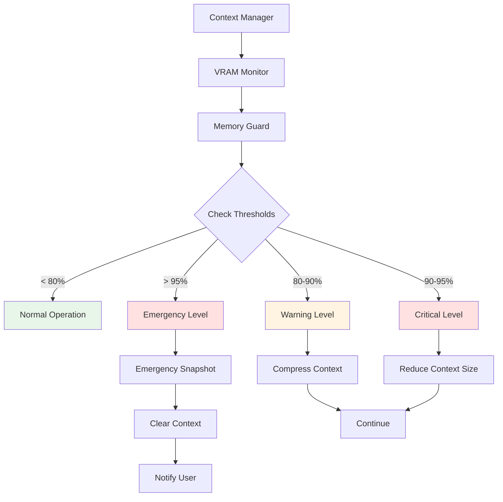
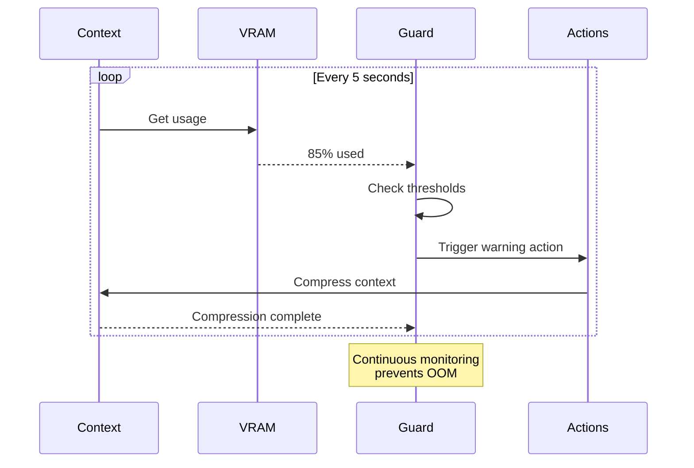
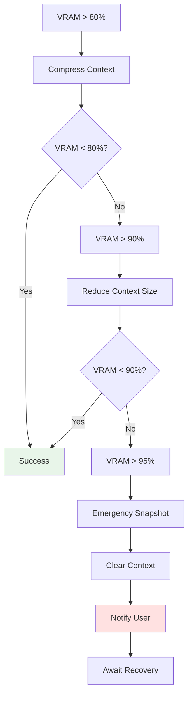

# Memory Safety Guide

Complete guide to the memory guard system and preventing OOM errors in OLLM CLI.

## Table of Contents

- [Overview](#overview)
- [Understanding Memory Safety](#understanding-memory-safety)
- [Memory Guard System](#memory-guard-system)
- [Threshold Levels](#threshold-levels)
- [Automatic Actions](#automatic-actions)
- [Threshold Configuration](#threshold-configuration)
- [Responding to Warnings](#responding-to-warnings)
- [Preventing OOM Errors](#preventing-oom-errors)
- [Best Practices](#best-practices)
- [Troubleshooting](#troubleshooting)

---

## Overview

The Memory Guard system prevents out-of-memory (OOM) errors by:
- Monitoring VRAM usage continuously
- Triggering actions at threshold levels
- Preventing system crashes
- Maintaining conversation continuity

**Key Principle:** Proactive intervention before memory exhaustion

---

## Understanding Memory Safety

### What is Memory Safety?

Memory safety ensures your system doesn't run out of GPU memory (VRAM) during operation. Without it:
- ❌ System crashes (OOM errors)
- ❌ Lost conversation state
- ❌ Corrupted data
- ❌ System instability

With memory safety:
- ✅ Graceful degradation
- ✅ Automatic recovery
- ✅ State preservation
- ✅ Continued operation

### Why Memory Safety Matters

**Problem:** GPU memory is limited
```
8GB GPU with 8B model:
- Model: 4GB
- System: 0.5GB
- Buffer: 0.5GB
- Available: 3GB for context
```

**Risk:** Context can grow beyond available memory
```
Context grows: 1GB → 2GB → 3GB → 4GB → OOM!
```

**Solution:** Memory Guard intervenes before OOM
```
Context grows: 1GB → 2GB → 2.4GB → [Compress] → 1.5GB
```

### Memory Safety Architecture



---

## Memory Guard System

### How It Works

**Continuous Monitoring:**
1. Poll VRAM every 5 seconds
2. Calculate usage percentage
3. Compare against thresholds
4. Trigger actions if needed

**Proactive Intervention:**
- Acts before memory exhausted
- Preserves conversation state
- Enables graceful recovery
- Prevents system crashes

### Memory Guard Flow



### Configuration

**Enable/disable:**
```yaml
context:
  memoryGuard:
    enabled: true
```

**⚠️ Warning:** Disabling may cause OOM errors!

**When to disable:**
- Debugging only
- Controlled environments
- Testing edge cases

---

## Threshold Levels

### Level 1: Normal (< 80%)

**Status:** 🟢 Normal operation

**Indicator:**
```
[●] llama3.1:8b | VRAM: 6.2/8.0GB (77.5%)
```

**Behavior:**
- No warnings
- No actions
- Normal monitoring
- Context grows freely

**User Action:** None required

---

### Level 2: Warning (80-90%)

**Status:** 🟡 Warning level

**Indicator:**
```
[⚠] llama3.1:8b | VRAM: 7.2/8.0GB (90%)
⚠ Warning: VRAM usage high. Compression triggered.
```

**Automatic Actions:**
1. Trigger background compression
2. Create automatic snapshot (if enabled)
3. Continue monitoring
4. Notify user

**User Action:** Monitor situation

**Configuration:**
```yaml
context:
  memoryGuard:
    warningThreshold: 0.8  # 80%
```

---

### Level 3: Critical (90-95%)

**Status:** 🔴 Critical level

**Indicator:**
```
[!] llama3.1:8b | VRAM: 7.6/8.0GB (95%)
⚠ Critical: VRAM usage critical. Context reduced.
```

**Automatic Actions:**
1. Force context size reduction
2. Aggressive compression
3. Create snapshot
4. Reduce max context size
5. Notify user urgently

**User Action:** Take immediate action

**Configuration:**
```yaml
context:
  memoryGuard:
    criticalThreshold: 0.9  # 90%
```

---

### Level 4: Emergency (> 95%)

**Status:** 🚨 Emergency level

**Indicator:**
```
[!] llama3.1:8b | VRAM: 7.8/8.0GB (97.5%)
🚨 Emergency: VRAM exhausted. Snapshot created, context cleared.
```

**Automatic Actions:**
1. Create emergency snapshot
2. Clear all context (except system prompt)
3. Reset to minimum context size
4. Notify user
5. Provide recovery instructions

**User Action:** Restore from snapshot or start fresh

**Configuration:**
```yaml
context:
  memoryGuard:
    emergencyThreshold: 0.95  # 95%
```

---

## Automatic Actions

### Warning Level Actions

**1. Background Compression**
```
Trigger: VRAM > 80%
Action: Compress context
Strategy: Configured strategy (hybrid default)
Result: Reduce VRAM usage
```

**Example:**
```
Before: 28,000 tokens, 7.2 GB VRAM
Action: Compress
After: 18,000 tokens, 6.2 GB VRAM
```

**2. Automatic Snapshot**
```
Trigger: VRAM > 80% (if enabled)
Action: Create snapshot
Purpose: Safety checkpoint
Result: Restore point available
```

---

### Critical Level Actions

**1. Force Context Reduction**
```
Trigger: VRAM > 90%
Action: Reduce max context size
Amount: 25% reduction
Result: Immediate VRAM relief
```

**Example:**
```
Before: Max 32,768 tokens
Action: Reduce by 25%
After: Max 24,576 tokens
```

**2. Aggressive Compression**
```
Trigger: VRAM > 90%
Action: Compress with truncate strategy
Speed: Immediate (no LLM call)
Result: Maximum reduction
```

**3. Create Snapshot**
```
Trigger: VRAM > 90%
Action: Create safety snapshot
Purpose: Recovery point
Result: Can restore if needed
```

---

### Emergency Level Actions

**1. Emergency Snapshot**
```
Trigger: VRAM > 95%
Action: Create emergency snapshot
Priority: Highest
Result: Full state preserved
```

**2. Clear Context**
```
Trigger: VRAM > 95%
Action: Clear all messages
Preserve: System prompt only
Result: Minimum VRAM usage
```

**3. Reset Context Size**
```
Trigger: VRAM > 95%
Action: Reset to minimum size
Size: minSize from config
Result: Safe operation
```

**4. Notify User**
```
Trigger: VRAM > 95%
Action: Display recovery instructions
Info: Snapshot ID for restore
Result: User can recover
```

### Action Flow



---

## Threshold Configuration

### Default Thresholds

```yaml
context:
  memoryGuard:
    enabled: true
    warningThreshold: 0.8    # 80%
    criticalThreshold: 0.9   # 90%
    emergencyThreshold: 0.95 # 95%
```

### Adjusting Thresholds

**Conservative (Safer):**
```yaml
context:
  memoryGuard:
    warningThreshold: 0.75   # 75%
    criticalThreshold: 0.85  # 85%
    emergencyThreshold: 0.92 # 92%
```

**Benefits:**
- Earlier intervention
- More headroom
- Fewer emergencies
- Better stability

**Trade-offs:**
- More frequent compression
- Smaller effective context
- More overhead

---

**Aggressive (More Context):**
```yaml
context:
  memoryGuard:
    warningThreshold: 0.85   # 85%
    criticalThreshold: 0.92  # 92%
    emergencyThreshold: 0.97 # 97%
```

**Benefits:**
- Larger context available
- Less frequent compression
- Less overhead

**Trade-offs:**
- Less safety margin
- Higher risk of OOM
- Less time to react

---

**Balanced (Recommended):**
```yaml
context:
  memoryGuard:
    warningThreshold: 0.8    # 80%
    criticalThreshold: 0.9   # 90%
    emergencyThreshold: 0.95 # 95%
```

**Benefits:**
- Good safety margin
- Reasonable context size
- Balanced approach

---

### Threshold Guidelines

**By VRAM Size:**

**4GB VRAM:**
```yaml
memoryGuard:
  warningThreshold: 0.75
  criticalThreshold: 0.85
  emergencyThreshold: 0.92
```

**8GB VRAM:**
```yaml
memoryGuard:
  warningThreshold: 0.8
  criticalThreshold: 0.9
  emergencyThreshold: 0.95
```

**16GB+ VRAM:**
```yaml
memoryGuard:
  warningThreshold: 0.85
  criticalThreshold: 0.92
  emergencyThreshold: 0.97
```

**By Use Case:**

**Production (Stable):**
```yaml
memoryGuard:
  warningThreshold: 0.75
  criticalThreshold: 0.85
  emergencyThreshold: 0.92
```

**Development (Balanced):**
```yaml
memoryGuard:
  warningThreshold: 0.8
  criticalThreshold: 0.9
  emergencyThreshold: 0.95
```

**Testing (Aggressive):**
```yaml
memoryGuard:
  warningThreshold: 0.85
  criticalThreshold: 0.92
  emergencyThreshold: 0.97
```

---

## Responding to Warnings

### Warning Level Response

**When you see:**
```
[⚠] VRAM: 7.2/8.0GB (90%)
⚠ Warning: VRAM usage high
```

**Recommended actions:**

**1. Monitor situation:**
```bash
/context
→ Check current usage
```

**2. Compress if needed:**
```bash
/context compress
```

**3. Create snapshot:**
```bash
/context snapshot
```

**4. Continue carefully:**
- Avoid loading large files
- Monitor status bar
- Be ready to act

---

### Critical Level Response

**When you see:**
```
[!] VRAM: 7.6/8.0GB (95%)
⚠ Critical: VRAM usage critical
```

**Immediate actions:**

**1. Compress immediately:**
```bash
/context compress
```

**2. Reduce context size:**
```bash
/context size 16384
```

**3. Or clear and restart:**
```bash
/context snapshot
/context clear
```

**4. Check result:**
```bash
/context
→ Verify VRAM reduced
```

---

### Emergency Level Response

**When you see:**
```
[!] VRAM: 7.8/8.0GB (97.5%)
🚨 Emergency: Context cleared
Snapshot: snapshot-emergency-2026-01-16-15-30-00
```

**Recovery steps:**

**1. Note snapshot ID:**
```
snapshot-emergency-2026-01-16-15-30-00
```

**2. Decide recovery approach:**

**Option A: Restore snapshot**
```bash
/context restore snapshot-emergency-2026-01-16-15-30-00
```

**Option B: Start fresh**
```bash
# Context already cleared
# Continue with new conversation
```

**3. Prevent recurrence:**
```bash
# Reduce context size
/context size 16384

# Or enable auto-sizing
/context auto
```

---

## Preventing OOM Errors

### Strategy 1: Enable Memory Guard

**Ensure enabled:**
```yaml
context:
  memoryGuard:
    enabled: true
```

**Benefits:**
- Automatic protection
- Proactive intervention
- State preservation

---

### Strategy 2: Use Auto-Sizing

**Enable auto-sizing:**
```yaml
context:
  autoSize: true
```

**Benefits:**
- Adapts to available VRAM
- Prevents overallocation
- Dynamic adjustment

---

### Strategy 3: Configure Safety Buffer

**Set appropriate buffer:**
```yaml
context:
  vramBuffer: 1073741824  # 1GB
```

**Guidelines:**
- Dedicated GPU: 512MB
- Shared GPU: 1GB
- Unstable: 2GB

---

### Strategy 4: Enable Auto-Compression

**Configure compression:**
```yaml
context:
  compression:
    enabled: true
    threshold: 0.75  # Compress early
```

**Benefits:**
- Proactive memory management
- Prevents hitting limits
- Maintains headroom

---

### Strategy 5: Use Appropriate Quantization

**Choose quantization:**
```yaml
context:
  kvQuantization: q8_0  # Balanced
```

**Options:**
- F16: Best quality, most memory
- Q8_0: Balanced (recommended)
- Q4_0: Least memory, acceptable quality

---

### Strategy 6: Monitor Regularly

**Check status:**
```bash
# Quick check
/context

# Detailed stats
/context stats
```

**Watch for:**
- Rising VRAM usage
- Yellow/red indicators
- Warning messages

---

### Strategy 7: Create Snapshots

**Regular snapshots:**
```bash
# Before risky operations
/context snapshot

# Periodic backups
/context snapshot
```

**Benefits:**
- Recovery points
- State preservation
- Peace of mind

---

## Best Practices

### 1. Keep Memory Guard Enabled

```yaml
context:
  memoryGuard:
    enabled: true
```

**Never disable in production!**

---

### 2. Use Conservative Thresholds

```yaml
context:
  memoryGuard:
    warningThreshold: 0.75
    criticalThreshold: 0.85
    emergencyThreshold: 0.92
```

**Better safe than sorry**

---

### 3. Monitor Status Bar

**Watch for color changes:**
- 🟢 Green = Good
- 🟡 Yellow = Caution
- 🔴 Red = Action needed

---

### 4. Respond to Warnings Promptly

**Don't ignore warnings:**
- Warning → Monitor
- Critical → Act immediately
- Emergency → Recover

---

### 5. Create Regular Snapshots

```bash
# Hourly during long sessions
/context snapshot
```

---

### 6. Test Your Configuration

**Verify thresholds work:**
```bash
# Load large context
# Watch for warnings
# Verify actions trigger
```

---

### 7. Have Recovery Plan

**Know how to recover:**
1. Note snapshot IDs
2. Know restore command
3. Practice recovery
4. Document process

---

## Troubleshooting

### Memory Warnings Persist

**Symptoms:**
- Constant yellow/red indicators
- Warnings don't clear
- Actions don't help

**Solutions:**

**1. Check VRAM usage:**
```bash
/context stats
→ Identify what's using memory
```

**2. Reduce context size:**
```bash
/context size 8192
```

**3. Increase buffer:**
```yaml
context:
  vramBuffer: 1073741824  # 1GB
```

**4. Use aggressive quantization:**
```yaml
context:
  kvQuantization: q4_0
```

**5. Close other GPU apps:**
```bash
nvidia-smi pmon
# Close unnecessary processes
```

---

### Actions Not Triggering

**Symptoms:**
- VRAM high but no actions
- No compression triggered
- No warnings shown

**Solutions:**

**1. Verify enabled:**
```yaml
context:
  memoryGuard:
    enabled: true
```

**2. Check thresholds:**
```yaml
context:
  memoryGuard:
    warningThreshold: 0.8
```

**3. Verify VRAM monitoring:**
```bash
/context stats
→ Should show VRAM info
```

**4. Restart application:**
```bash
exit
ollm
```

---

### OOM Errors Still Occur

**Symptoms:**
- System crashes
- "Out of memory" errors
- GPU driver resets

**Solutions:**

**1. Lower thresholds:**
```yaml
context:
  memoryGuard:
    warningThreshold: 0.7
    criticalThreshold: 0.8
    emergencyThreshold: 0.9
```

**2. Increase buffer:**
```yaml
context:
  vramBuffer: 2147483648  # 2GB
```

**3. Reduce context size:**
```bash
/context size 4096
```

**4. Check for memory leaks:**
```bash
# Monitor over time
watch -n 5 nvidia-smi
```

---

### Emergency Actions Too Aggressive

**Symptoms:**
- Context cleared too often
- Losing conversation state
- Frequent emergencies

**Solutions:**

**1. Lower warning threshold:**
```yaml
context:
  memoryGuard:
    warningThreshold: 0.75  # Act earlier
```

**2. Enable auto-compression:**
```yaml
context:
  compression:
    enabled: true
    threshold: 0.75
```

**3. Increase emergency threshold:**
```yaml
context:
  memoryGuard:
    emergencyThreshold: 0.97  # More tolerance
```

**4. Create more snapshots:**
```bash
# More frequent snapshots
/context snapshot
```

---

## See Also

- [VRAM Monitoring](./vram-monitoring.md) - GPU memory monitoring
- [Configuration](../Context_configuration.md) - Memory configuration
- [User Guide](../management/user-guide.md) - Managing context
- [Architecture](../Context_architecture.md) - Technical details
- [Troubleshooting](../../troubleshooting.md) - General troubleshooting

---

**Last Updated:** 2026-01-16  
**Version:** 1.0.0
