# Hook System Architecture

**Technical Architecture and Design of the Hook System**

---

## Table of Contents

1. [Overview](#overview)
2. [System Architecture](#system-architecture)
3. [Core Components](#core-components)
4. [Data Flow](#data-flow)
5. [Integration Points](#integration-points)
6. [Design Decisions](#design-decisions)
7. [Security Model](#security-model)

**See Also:**

- [Hook User Guide](UserGuide.md) - Using hooks
- [Hook Protocol](Protocol.md) - Technical protocol specification
- [MCP Architecture](../MCP/MCP_Architecture.md) - System architecture
- [MCP Commands](../MCP/MCP_Commands.md) - Hook command reference

---

## Overview

The Hook System provides event-driven automation and safety gates for OLLM CLI. Hooks execute custom scripts in response to lifecycle events, enabling workflow automation, validation, and integration with external systems.

### Key Features

- ✅ 12 event types for comprehensive lifecycle coverage
- ✅ JSON-based stdin/stdout protocol
- ✅ Trust model with approval workflow
- ✅ Rate limiting and execution planning
- ✅ Parallel and sequential execution strategies
- ✅ Command whitelist for security
- ✅ Integration with MCP and extensions

---

## System Architecture

### High-Level Architecture

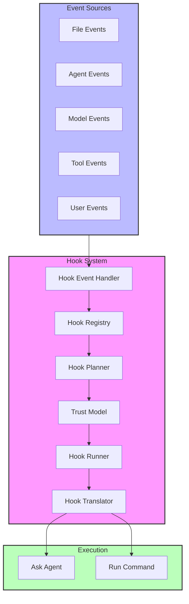

### Component Interaction Flow

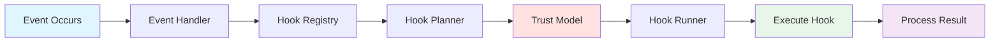

---

## Core Components

### 1. Hook Event Handler

**Location:** `packages/core/src/hooks/hookEventHandler.ts`

**Responsibilities:**

- Emit events when lifecycle points are reached
- Provide event data to hook system
- Manage event subscriptions

**Key Methods:**

```typescript
interface HookEventHandler {
  emit(eventType: string, eventData: any): Promise<void>;
  on(eventType: string, handler: Function): void;
  off(eventType: string, handler: Function): void;
}
```

**Event Types (12 total):**

1. `session_start` - Session initialization
2. `session_end` - Session cleanup
3. `before_agent` - Before agent processes request
4. `after_agent` - After agent response
5. `before_model` - Before model invocation
6. `after_model` - After model response
7. `before_tool_selection` - Before tool selection
8. `before_tool` - Before tool execution
9. `after_tool` - After tool execution
10. `pre_compress` - Before context compression
11. `post_compress` - After context compression
12. `notification` - System notifications

### 2. Hook Registry

**Location:** `packages/core/src/hooks/hookRegistry.ts`

**Responsibilities:**

- Store and retrieve hook definitions
- Filter hooks by event type
- Manage hook lifecycle (register, unregister)
- Track hook metadata

**Key Methods:**

```typescript
interface HookRegistry {
  registerHook(hook: HookDefinition): void;
  unregisterHook(hookId: string): void;
  getHooksForEvent(eventType: string): HookDefinition[];
  getAllHooks(): HookDefinition[];
  getHook(hookId: string): HookDefinition | undefined;
}
```

**Hook Definition:**

```typescript
interface HookDefinition {
  id: string;
  name: string;
  eventType: string;
  filePatterns?: string[];
  action: {
    type: 'askAgent' | 'runCommand';
    prompt?: string;
    command?: string;
  };
  trusted: boolean;
  enabled: boolean;
  source: 'builtin' | 'user' | 'workspace' | 'extension';
}
```

### 3. Hook Planner

**Location:** `packages/core/src/hooks/hookPlanner.ts`

**Responsibilities:**

- Determine execution strategy (sequential, parallel, optimized)
- Check execution conditions
- Evaluate priorities
- Apply rate limiting

**Execution Strategies:**

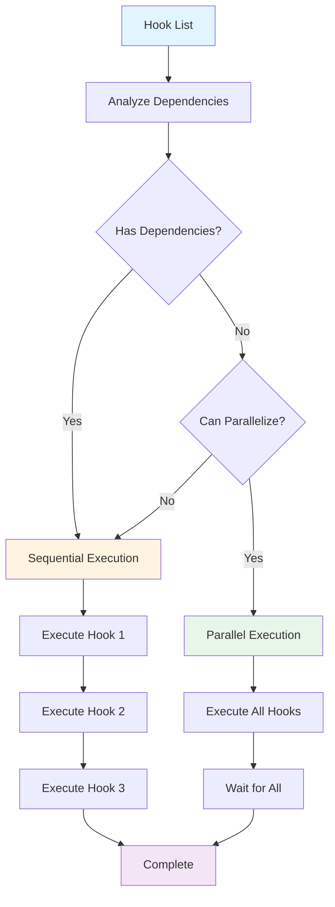

**Rate Limiting:**

- Per-hook rate limits
- Global rate limits
- Cooldown periods
- Execution count tracking

### 4. Hook Runner

**Location:** `packages/core/src/hooks/hookRunner.ts`

**Responsibilities:**

- Execute hook processes
- Manage stdin/stdout communication
- Handle timeouts
- Capture and format results
- Enforce command whitelist

**Command Whitelist (Line 128):**

```typescript
const WHITELISTED_COMMANDS = ['node', 'python', 'python3', 'bash', 'sh', 'npx', 'uvx'];
```

**Execution Flow:**

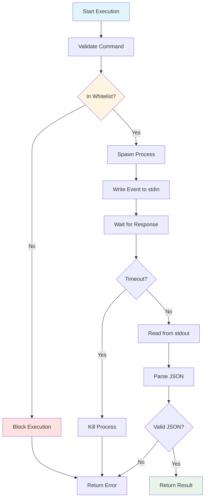

### 5. Hook Translator

**Location:** `packages/core/src/hooks/hookTranslator.ts`

**Responsibilities:**

- Translate legacy hook format to modern format
- Convert between JSON and TypeScript types
- Format hook input/output
- Handle protocol versioning

**Translation Flow:**

```typescript
// Legacy Format (JSON)
{
  "name": "Lint on Save",
  "when": { "type": "fileEdited", "patterns": ["*.ts"] },
  "then": { "type": "askAgent", "prompt": "Run linting" }
}

// Modern Format (TypeScript)
{
  id: "lint-on-save",
  name: "Lint on Save",
  eventType: "fileEdited",
  filePatterns: ["*.ts"],
  action: {
    type: "askAgent",
    prompt: "Run linting on {{file.path}}"
  },
  trusted: false,
  enabled: true
}
```

### 6. Trust Model

**Location:** `packages/core/src/hooks/trustedHooks.ts`

**Responsibilities:**

- Verify hook trust level
- Request user approval
- Store approval decisions
- Compute and verify hook hashes

**Trust Levels:**

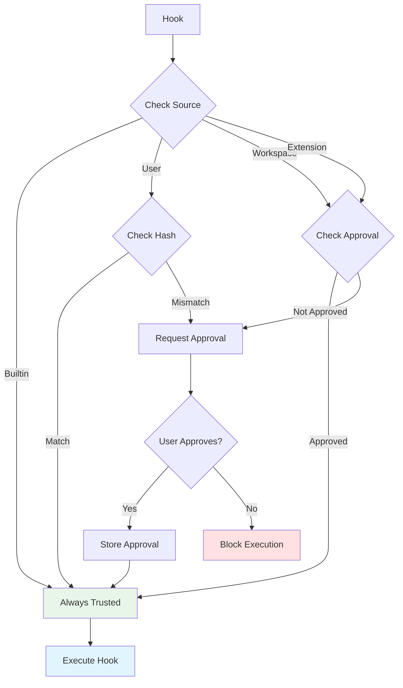

### 7. Message Bus

**Location:** `packages/core/src/hooks/messageBus.ts`

**Responsibilities:**

- Event-driven architecture
- Decouple components
- Enable parallel execution
- Support complex workflows

**Event Flow:**

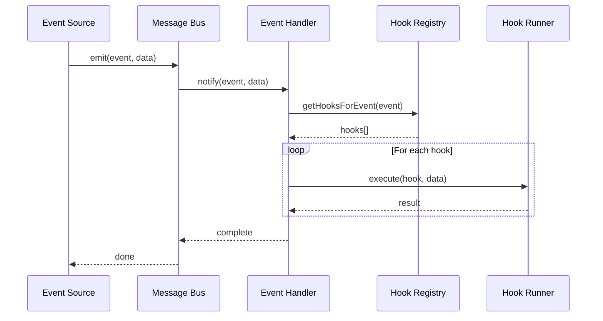

---

## Data Flow

### Hook Execution Flow

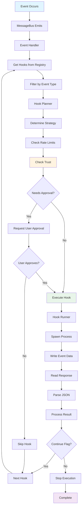

### Hook Input/Output Flow

```mermaid
flowchart LR
    EventData[Event Data] --> Format[Format Input]
    Format --> JSON[JSON Object]
    JSON --> Stdin[Write to stdin]
    Stdin --> Hook[Hook Process]
    Hook --> Stdout[Read from stdout]
    Stdout --> ParseJSON[Parse JSON]
    ParseJSON --> Validate[Validate Response]
    Validate --> Result[Process Result]

    style EventData fill:#e1f5ff
    style Hook fill:#e8f5e9
    style Result fill:#f3e5f5
```

---

## Integration Points

### 1. Tool System Integration

Hooks can trigger tool execution through `askAgent` action:

```typescript
// Hook triggers agent to use tool
{
  action: {
    type: 'askAgent',
    prompt: 'Run linting on {{file.path}} using the shell tool'
  }
}
```

**Flow:**

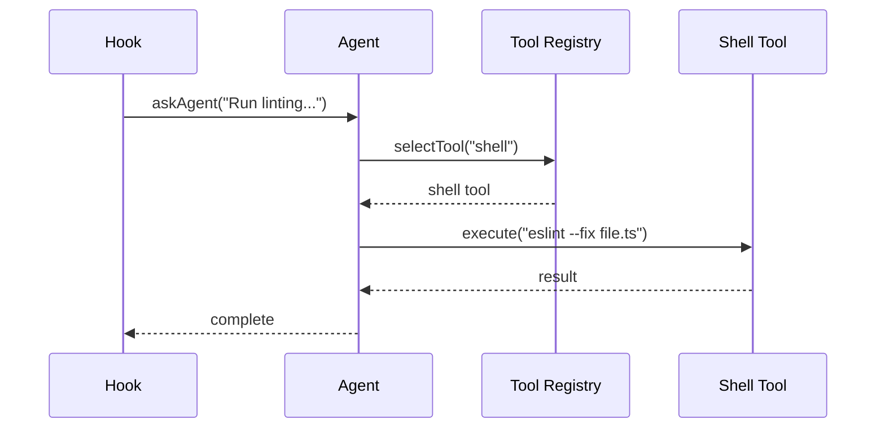

### 2. MCP Integration

**Important:** MCP OAuth must be completed BEFORE hook execution.

**Pre-Authentication Flow:**

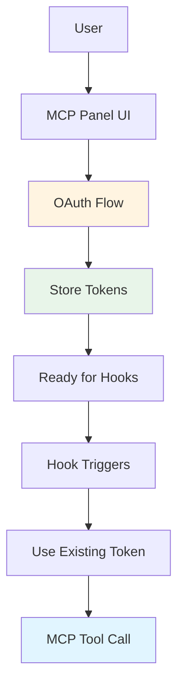

**Why:** Hooks run automatically and cannot prompt for user authentication.

**See:** `dev_MCPIntegration.md` for MCP OAuth details

### 3. Extension System Integration

Extensions can register hooks via manifest:

```json
{
  "hooks": {
    "before_model": [
      {
        "name": "validate-input",
        "command": "node",
        "args": ["hooks/validate.js"]
      }
    ]
  }
}
```

**Registration Flow:**

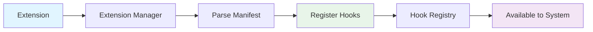

---

## Design Decisions

### 1. JSON stdin/stdout Protocol

**Decision:** Use JSON over stdin/stdout for hook communication

**Rationale:**

- Language-agnostic (works with any language)
- Simple to implement
- Standard input/output (no special libraries needed)
- Easy to debug and test

**Trade-offs:**

- ✅ Universal compatibility
- ✅ Simple implementation
- ❌ No streaming support
- ❌ Limited to text data

### 2. Command Whitelist

**Decision:** Only allow whitelisted commands in `runCommand` hooks

**Rationale:**

- Security first approach
- Prevent arbitrary command execution
- Limit attack surface
- User control over allowed commands

**Whitelisted Commands:**

- `node` - Node.js runtime
- `python`, `python3` - Python runtime
- `bash`, `sh` - Shell scripts
- `npx` - npm package runner
- `uvx` - uv package runner

**Trade-offs:**

- ✅ Enhanced security
- ✅ Predictable behavior
- ❌ Limited flexibility
- ❌ May need updates for new tools

### 3. Trust Model with Approval

**Decision:** Require approval for untrusted hooks

**Rationale:**

- Security and safety
- User control
- Prevent malicious code execution
- Hash verification for changes

**Trust Levels:**

1. **Builtin** - Always trusted
2. **User** - Trusted by default
3. **Workspace** - Requires approval
4. **Downloaded** - Requires approval

**Trade-offs:**

- ✅ Enhanced security
- ✅ User awareness
- ❌ Additional friction
- ❌ Approval fatigue risk

### 4. Event-Driven Architecture

**Decision:** Use MessageBus for event-driven architecture

**Rationale:**

- Decouples components
- Enables parallel execution
- Supports complex workflows
- Easy to extend

**Benefits:**

- ✅ Loose coupling
- ✅ Testability
- ✅ Extensibility
- ✅ Performance (parallel execution)

### 5. Rate Limiting

**Decision:** Implement per-hook and global rate limits

**Rationale:**

- Prevent hook spam
- Protect system resources
- Avoid infinite loops
- Better user experience

**Configuration:**

- Per-hook max executions per minute
- Global max executions per minute
- Cooldown period between runs
- Execution count tracking

---

## Security Model

### 1. Command Injection Prevention

**Threat:** Malicious hooks executing arbitrary commands

**Mitigation:**

- Command whitelist enforcement
- Argument sanitization
- No shell expansion
- Safe process spawning

**Implementation:**

```typescript
// Check command is whitelisted
if (!WHITELISTED_COMMANDS.includes(command)) {
  throw new Error(`Command not allowed: ${command}`);
}

// Spawn process safely (no shell)
const process = spawn(command, args, {
  shell: false, // Prevent shell injection
  stdio: ['pipe', 'pipe', 'pipe'],
});
```

### 2. Input Validation

**Threat:** Malformed input causing crashes or exploits

**Mitigation:**

- JSON schema validation
- Type checking
- Required field verification
- Value range validation

**Implementation:**

```typescript
function validateHookInput(input: any): void {
  if (!input.event) {
    throw new Error('Missing required field: event');
  }
  if (!input.context) {
    throw new Error('Missing required field: context');
  }
  // More validation...
}
```

### 3. Output Sanitization

**Threat:** Malicious output affecting system

**Mitigation:**

- JSON parsing with error handling
- Output size limits
- Special character escaping
- Sensitive data redaction

**Implementation:**

```typescript
function sanitizeHookOutput(output: string): any {
  // Limit output size
  if (output.length > MAX_OUTPUT_SIZE) {
    output = output.substring(0, MAX_OUTPUT_SIZE);
  }

  // Parse JSON safely
  try {
    return JSON.parse(output);
  } catch (error) {
    throw new Error('Invalid JSON output');
  }
}
```

### 4. Resource Limits

**Threat:** Hooks consuming excessive resources

**Mitigation:**

- Execution timeout (default: 5 seconds)
- Memory limits
- Process isolation
- Rate limiting

**Implementation:**

```typescript
// Set timeout
const timeout = setTimeout(() => {
  process.kill();
  reject(new Error('Hook execution timeout'));
}, HOOK_TIMEOUT);

// Clear timeout on completion
process.on('exit', () => {
  clearTimeout(timeout);
});
```

### 5. Privilege Separation

**Threat:** Hooks accessing sensitive resources

**Mitigation:**

- Run with minimal privileges
- File system access restrictions
- Network access restrictions
- Environment variable filtering

---

## Performance Considerations

### 1. Parallel Execution

**Optimization:** Execute independent hooks in parallel

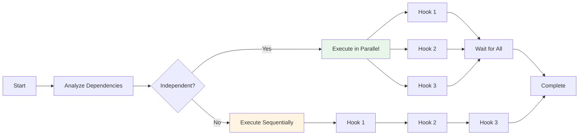

### 2. Process Pooling

**Optimization:** Reuse hook processes for multiple executions

**Implementation:**

- Keep processes alive
- Reuse for multiple events
- Close on idle timeout
- Restart on failure

### 3. Lazy Loading

**Optimization:** Load hooks only when needed

**Implementation:**

- Load hook definitions on startup
- Spawn processes only on execution
- Cache hook metadata
- Unload unused hooks

---

## File Locations

| File                                           | Purpose                               |
| ---------------------------------------------- | ------------------------------------- |
| `packages/core/src/hooks/hookRegistry.ts`      | Hook storage and retrieval            |
| `packages/core/src/hooks/hookEventHandler.ts`  | Event emission                        |
| `packages/core/src/hooks/hookPlanner.ts`       | Execution planning                    |
| `packages/core/src/hooks/hookRunner.ts`        | Hook execution (line 128: whitelist)  |
| `packages/core/src/hooks/types.ts`             | Type definitions (line 30-42: events) |
| `packages/core/src/hooks/hookDebugger.ts`      | Debugging and logging                 |
| `packages/core/src/hooks/hookTranslator.ts`    | Legacy format translation             |
| `packages/core/src/hooks/trustedHooks.ts`      | Trust management                      |
| `packages/core/src/hooks/config.ts`            | Hook configuration                    |
| `packages/core/src/hooks/messageBus.ts`        | Event bus                             |
| `packages/cli/src/commands/hookCommands.ts`    | Hook management commands              |
| `packages/core/src/services/hookService.ts`    | Hook service integration              |
| `packages/cli/src/services/hookLoader.ts`      | Hook loading                          |
| `packages/cli/src/services/hookFileService.ts` | Hook file operations                  |

---

## Further Reading

### Documentation

- [Hook User Guide](UserGuide.md) - Using hooks
- [Hook Protocol](Protocol.md) - Technical protocol specification
- [Keyboard Shortcuts](KeyboardShortcuts.md) - Hooks Panel UI shortcuts
- [Visual Guide](VisualGuide.md) - Hooks Panel UI visual guide

### Related Systems

- [MCP Architecture](../MCP/MCP_Architecture.md) - MCP system architecture
- [Tool Execution](../Tools/Architecture.md) - Tool system architecture
- [Extension System](../Tools/GettingStarted.md) - Extension system

### External References

- JSON Specification (https://www.json.org/)
- Process Management (https://nodejs.org/api/child_process.html)
- Event-Driven Architecture (https://en.wikipedia.org/wiki/Event-driven_architecture)

---

**Document Version:** 1.0  
**Last Updated:** 2026-01-26  
**Status:** ✅ Complete
