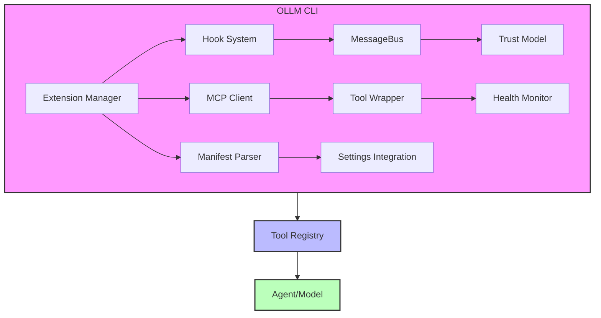
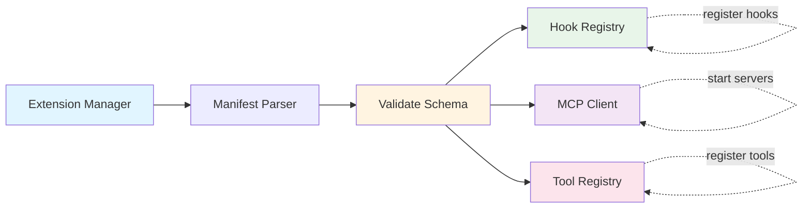
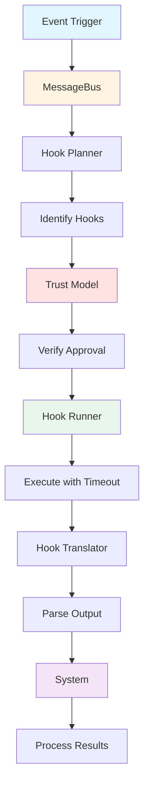
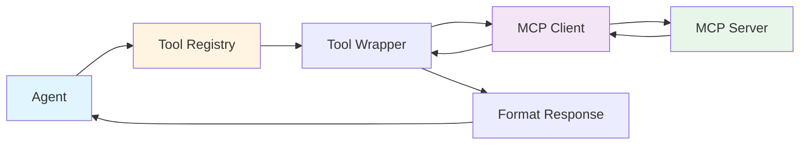
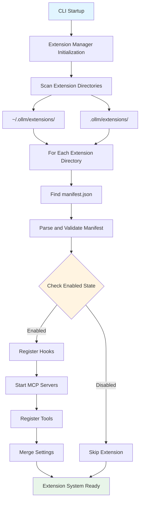
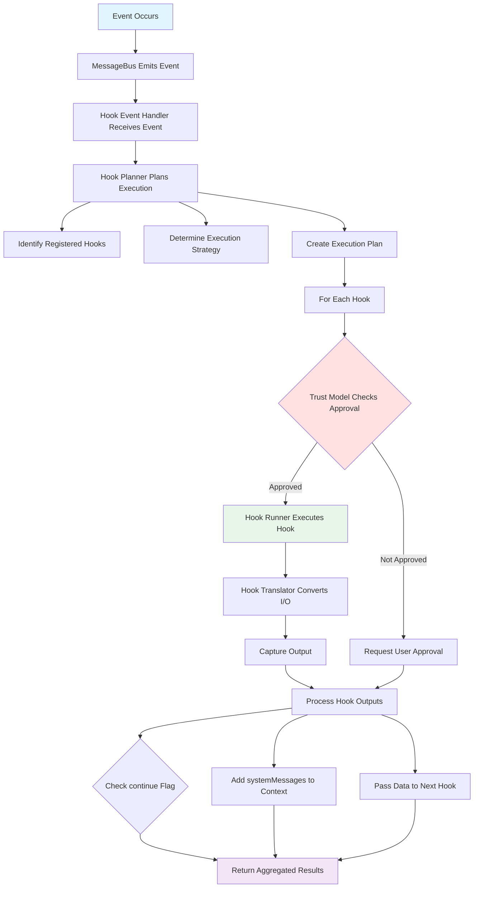
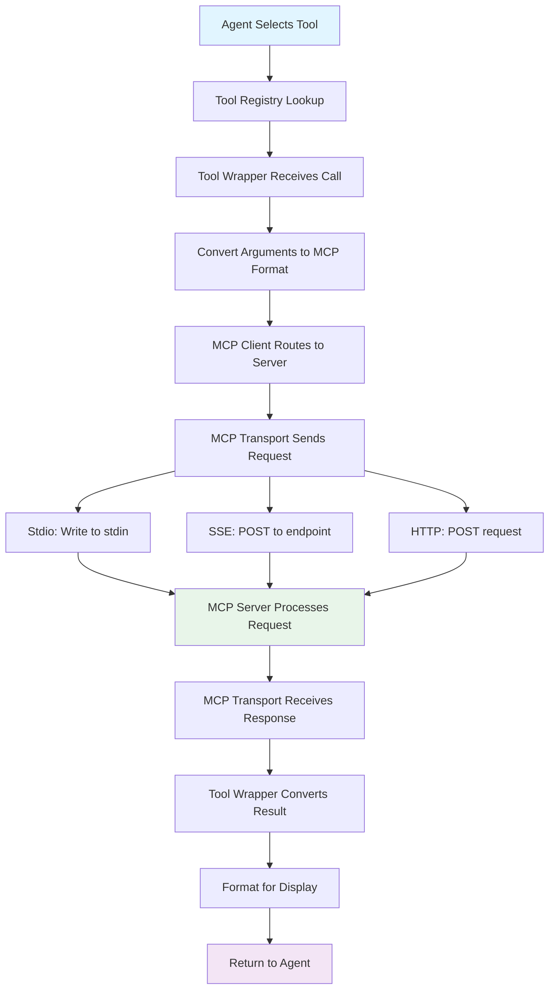
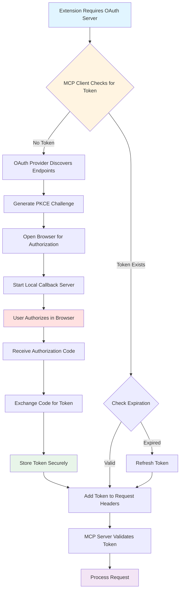

# MCP Architecture

**Model Context Protocol Integration for OLLM CLI**

---

## Table of Contents

1. [Overview](#overview)
2. [System Architecture](#system-architecture)
3. [Core Components](#core-components)
4. [Data Flow](#data-flow)
5. [Integration Points](#integration-points)
6. [Design Decisions](#design-decisions)
7. [Security Model](#security-model)

---

## Overview

The MCP (Model Context Protocol) integration in OLLM CLI provides a comprehensive extensibility framework that enables:

- **External Tool Integration**: Connect to MCP servers to access external tools
- **Event-Driven Hooks**: Execute custom scripts at specific lifecycle points
- **Extension System**: Package and distribute functionality via manifests
- **OAuth Authentication**: Secure access to protected MCP servers
- **Health Monitoring**: Automatic detection and recovery from server failures

### Key Features

- ✅ Multiple transport types (stdio, SSE, HTTP)
- ✅ OAuth 2.0 with PKCE flow
- ✅ Automatic health monitoring and restart
- ✅ Tools, resources, and prompts support
- ✅ Event-driven hook system
- ✅ Extension marketplace with hot-reload
- ✅ Permission-based sandboxing

---

## System Architecture

### High-Level Architecture



### Component Interaction Flow

**Extension Loading:**



**Hook Execution:**



**MCP Tool Call:**



---

## Core Components

### 1. MCP Client

**Location:** `packages/core/src/mcp/mcpClient.ts`

**Responsibilities:**
- Manage MCP server lifecycle (start, stop, status)
- Handle multiple servers simultaneously
- Discover tools, resources, and prompts
- Route tool calls to appropriate servers
- Handle connection timeouts and failures

**Key Methods:**
```typescript
interface MCPClient {
  startServer(name: string, config: MCPServerConfig): Promise<void>;
  stopServer(name: string): Promise<void>;
  getServerStatus(name: string): MCPServerStatus;
  listServers(): MCPServerInfo[];
  callTool(serverName: string, toolName: string, args: unknown): Promise<unknown>;
  getTools(serverName: string): Promise<MCPTool[]>;
  getResources(serverName: string): Promise<MCPResource[]>;
  getPrompts(serverName: string): Promise<MCPPrompt[]>;
}
```

**Features:**
- Connection timeout handling (default: 10 seconds)
- Automatic retry with exponential backoff
- Multi-server management
- Server status tracking (starting, connected, disconnected, error)

### 2. MCP Transport

**Location:** `packages/core/src/mcp/mcpTransport.ts`

**Responsibilities:**
- Handle communication with MCP servers
- Support multiple transport types
- Manage connection lifecycle
- Parse server responses

**Transport Types:**

#### Stdio Transport
- Communicates via stdin/stdout
- Primary transport for local MCP servers
- Process spawning and management

```typescript
{
  command: 'node',
  args: ['server.js'],
  transport: 'stdio'
}
```

#### SSE Transport
- Server-Sent Events over HTTP
- Suitable for remote servers
- Long-lived connections

```typescript
{
  command: 'http://localhost:3000/mcp',
  transport: 'sse'
}
```

#### HTTP Transport
- Standard HTTP requests
- Stateless communication
- Simple integration

```typescript
{
  command: 'http://localhost:3000/mcp',
  transport: 'http'
}
```

### 3. MCP Schema Converter

**Location:** `packages/core/src/mcp/mcpSchemaConverter.ts`

**Responsibilities:**
- Convert MCP tool schemas to internal format
- Map parameter types correctly
- Preserve descriptions and constraints
- Handle optional and required parameters

**Type Mapping:**
```typescript
MCP Type → Internal Type
string   → string
number   → number
boolean  → boolean
object   → object
array    → array
```

### 4. MCP Tool Wrapper

**Location:** `packages/core/src/mcp/mcpToolWrapper.ts`

**Responsibilities:**
- Wrap MCP tools as internal tools
- Convert arguments to MCP format
- Convert results from MCP format
- Handle errors and timeouts
- Format responses for display

**Workflow:**
1. Agent selects tool from registry
2. Wrapper converts arguments to MCP format
3. Wrapper sends request to MCP client
4. MCP client routes to appropriate server
5. Server executes tool and returns result
6. Wrapper converts result to internal format
7. Result displayed to user

### 5. MCP Health Monitor

**Location:** `packages/core/src/mcp/mcpHealthMonitor.ts`

**Responsibilities:**
- Periodic health checks (default: 30 seconds)
- Detect server failures
- Automatic restart with exponential backoff
- Track restart attempts (max: 3)
- Emit health events

**Health States:**
- `healthy` - Server responding normally
- `degraded` - Server slow or intermittent
- `failed` - Server not responding
- `restarting` - Attempting to restart

**Features:**
- Configurable check interval
- Configurable max restart attempts
- Event emission for monitoring
- Manual restart capability
- Status tracking per server

### 6. MCP OAuth Provider

**Location:** `packages/core/src/mcp/mcpOAuth.ts`

**Responsibilities:**
- OAuth 2.0 authentication with PKCE
- Secure token storage (keychain + encrypted file)
- Automatic token refresh
- Browser-based authorization flow
- Token revocation

**OAuth Flow:**
1. Discover OAuth endpoints from server
2. Generate PKCE code verifier and challenge
3. Open browser for user authorization
4. Start local callback server
5. Receive authorization code
6. Exchange code for access token
7. Store token securely
8. Refresh token before expiration

**Token Storage:**
- **Primary:** Platform keychain (via keytar)
- **Fallback:** Encrypted file storage
- **Encryption:** AES-256-GCM
- **Isolation:** Per-server tokens

### 7. Hook System

**Location:** `packages/core/src/hooks/`

**Components:**
- **HookRegistry**: Registration and storage
- **HookPlanner**: Execution strategy planning
- **HookRunner**: Execution with timeout
- **HookTranslator**: Input/output translation
- **TrustedHooks**: Trust verification
- **MessageBus**: Event-driven architecture

**Hook Events (12 types):**
1. `session_start` - Session initialization
2. `session_end` - Session cleanup
3. `before_agent` - Before agent processes request
4. `after_agent` - After agent response
5. `before_model` - Before model invocation
6. `after_model` - After model response
7. `before_tool_selection` - Before tool selection
8. `before_tool` - Before tool execution
9. `after_tool` - After tool execution
10. `pre_compress` - Before context compression
11. `post_compress` - After context compression
12. `notification` - System notifications

**Execution Strategies:**
- **Sequential**: Execute hooks one after another
- **Parallel**: Execute hooks concurrently
- **Optimized**: Smart parallel detection
- **Priority**: Execute by priority order

### 8. Extension Manager

**Location:** `packages/core/src/extensions/extensionManager.ts`

**Responsibilities:**
- Discover extensions from directories
- Parse and validate manifests
- Enable/disable extensions
- Register hooks and MCP servers
- Manage extension lifecycle
- Hot-reload during development

**Extension Discovery:**
- User directory: `~/.ollm/extensions/`
- Workspace directory: `.ollm/extensions/`
- Recursive scanning for `manifest.json`

**Extension Lifecycle:**
1. Discovery (scan directories)
2. Parsing (validate manifest)
3. Registration (hooks, servers, settings)
4. Enabling (start servers, register tools)
5. Disabling (stop servers, unregister tools)
6. Reloading (graceful restart)

### 9. Extension Registry

**Location:** `packages/core/src/extensions/extensionRegistry.ts`

**Responsibilities:**
- Extension marketplace integration
- Search and discovery
- Installation from remote URLs
- Checksum verification (SHA-256)
- Version management
- Update checking

**Features:**
- Full-text search with relevance scoring
- Registry caching (5-minute expiry)
- Integrity verification
- Automatic updates (optional)

### 10. Extension Sandbox

**Location:** `packages/core/src/extensions/extensionSandbox.ts`

**Responsibilities:**
- Permission-based access control
- Runtime enforcement
- User approval prompts
- Dynamic permission management

**Permission Types:**
1. **filesystem**: File system access (path-based)
2. **network**: Network access (domain-based)
3. **env**: Environment variable access
4. **shell**: Shell command execution
5. **mcp**: MCP server access

---

## Data Flow

### Extension Loading Flow



### Hook Execution Flow



### MCP Tool Call Flow



### OAuth Authentication Flow



---

## Integration Points

### 1. Tool Registry Integration

**Purpose:** Make MCP tools available to the agent

**Flow:**
```typescript
// Extension loads MCP server
extensionManager.loadExtension(extension);

// MCP client starts server
mcpClient.startServer('github', config);

// Discover tools
const tools = await mcpClient.getTools('github');

// Wrap and register each tool
tools.forEach(tool => {
  const wrappedTool = mcpToolWrapper.wrapTool('github', tool);
  toolRegistry.register(wrappedTool);
});

// Agent can now use tools
const result = await agent.useTool('github_create_issue', args);
```

### 2. Hook System Integration

**Purpose:** Allow extensions to customize behavior

**Flow:**
```typescript
// Extension declares hooks in manifest
{
  "hooks": {
    "before_model": [
      {
        "name": "validate-input",
        "command": "node",
        "args": ["hooks/validate.js"]
      }
    ]
  }
}

// Extension manager registers hooks
extensionManager.registerHooks(extension);

// MessageBus emits event
messageBus.emit('before_model', { messages, model });

// Hook executes and returns output
const output = await hookRunner.executeHook(hook, input);

// System processes output
if (!output.continue) {
  throw new Error('Hook aborted operation');
}
if (output.systemMessage) {
  messages.push({ role: 'system', content: output.systemMessage });
}
```

### 3. Settings Integration

**Purpose:** Allow extensions to declare configuration

**Flow:**
```typescript
// Extension declares settings in manifest
{
  "settings": [
    {
      "name": "githubToken",
      "envVar": "GITHUB_TOKEN",
      "sensitive": true,
      "description": "GitHub personal access token"
    }
  ]
}

// Extension manager merges settings
extensionManager.mergeSettings(extension);

// Settings available to hooks and MCP servers
const token = process.env.GITHUB_TOKEN;

// Sensitive settings redacted in logs
logger.info('Token: [REDACTED]');
```

### 4. Service Container Integration

**Purpose:** Centralized service management

**Flow:**
```typescript
// Service container manages all services
const serviceContainer = new ServiceContainer({
  provider,
  config,
  workspacePath,
  userHome
});

// Services available via getters
const mcpHealthMonitor = serviceContainer.getMCPHealthMonitor();
const mcpOAuthProvider = serviceContainer.getMCPOAuthProvider();
const extensionManager = serviceContainer.getExtensionManager();
const hookService = serviceContainer.getHookService();

// Automatic initialization and cleanup
await serviceContainer.initializeAll();
await serviceContainer.shutdown();
```

---

## Design Decisions

### 1. Custom MCP Client vs Official SDK

**Decision:** Custom implementation initially, SDK migration deferred

**Rationale:**
- Custom implementation provides full control
- Meets all current requirements
- SDK can be integrated later if needed
- No breaking changes to API

**Trade-offs:**
- ✅ Full control over implementation
- ✅ No external dependencies
- ❌ Must maintain compatibility manually
- ❌ Missing some SDK features

### 2. Event-Driven Architecture (MessageBus)

**Decision:** Implement MessageBus for hook system

**Rationale:**
- Decouples components
- Enables parallel execution
- Supports complex workflows
- Easy to extend

**Benefits:**
- ✅ Loose coupling
- ✅ Testability
- ✅ Extensibility
- ✅ Performance (parallel execution)

### 3. Trust Model with Approval

**Decision:** Require approval for untrusted hooks

**Rationale:**
- Security first approach
- Prevent malicious code execution
- User control over extensions
- Hash verification for changes

**Trust Levels:**
1. **Built-in**: Always trusted
2. **User**: Trusted by default
3. **Workspace**: Requires approval
4. **Downloaded**: Requires approval

### 4. OAuth with PKCE

**Decision:** Implement OAuth 2.0 with PKCE flow

**Rationale:**
- Industry standard for secure authentication
- PKCE prevents authorization code interception
- Supports refresh tokens
- Works with major providers (GitHub, Google, etc.)

**Security Features:**
- ✅ PKCE code challenge
- ✅ Secure token storage
- ✅ Automatic refresh
- ✅ Token revocation

### 5. Health Monitoring with Auto-Restart

**Decision:** Implement automatic health checks and restart

**Rationale:**
- Improve reliability
- Reduce manual intervention
- Better user experience
- Detect failures early

**Configuration:**
- Check interval: 30 seconds (configurable)
- Max restart attempts: 3 (configurable)
- Exponential backoff: 1s, 2s, 4s
- Manual restart available

### 6. Extension Sandboxing

**Decision:** Implement permission-based sandboxing

**Rationale:**
- Security and safety
- User control
- Prevent malicious extensions
- Granular permissions

**Permission Model:**
- Declared in manifest
- Runtime enforcement
- User approval prompts
- Dynamic granting/revoking

---

## Security Model

### 1. Hook Trust Model

**Threat:** Malicious hooks executing arbitrary code

**Mitigation:**
- Approval required for untrusted hooks
- Hash verification for changes
- Source tracking (user/workspace/downloaded)
- Persistent approval storage

**Implementation:**
```typescript
// Check if hook is trusted
const trusted = await trustedHooks.isTrusted(hook);

if (!trusted) {
  // Request user approval
  const approved = await trustedHooks.requestApproval(hook);
  
  if (approved) {
    // Compute and store hash
    const hash = await trustedHooks.computeHash(hook);
    await trustedHooks.storeApproval(hook, hash);
  } else {
    // Skip hook execution
    return;
  }
}

// Execute hook
await hookRunner.executeHook(hook, input);
```

### 2. OAuth Token Security

**Threat:** Token theft or exposure

**Mitigation:**
- Secure storage (keychain + encrypted file)
- AES-256-GCM encryption
- Per-server token isolation
- Automatic token refresh
- Token revocation support

**Storage Hierarchy:**
1. **Primary:** Platform keychain (keytar)
   - Windows: Credential Manager
   - macOS: Keychain
   - Linux: Secret Service API
2. **Fallback:** Encrypted file
   - AES-256-GCM encryption
   - Unique key per installation
   - Restricted file permissions

### 3. Extension Sandboxing

**Threat:** Malicious extensions accessing sensitive resources

**Mitigation:**
- Permission-based access control
- Runtime enforcement
- User approval prompts
- Granular permissions

**Permission Enforcement:**
```typescript
// Check permission before access
const allowed = await sandbox.checkPermission(
  extensionName,
  'filesystem',
  '/path/to/file'
);

if (!allowed) {
  // Request user approval
  const granted = await sandbox.requestPermission(
    extensionName,
    'filesystem',
    '/path/to/file'
  );
  
  if (!granted) {
    throw new Error('Permission denied');
  }
}

// Proceed with access
fs.readFileSync('/path/to/file');
```

### 4. MCP Server Isolation

**Threat:** MCP server compromise affecting CLI

**Mitigation:**
- Process isolation (separate processes)
- Error isolation (catch and log)
- Timeout enforcement
- Health monitoring
- Automatic restart

**Error Handling:**
```typescript
try {
  const result = await mcpClient.callTool(server, tool, args);
  return result;
} catch (error) {
  // Log error
  logger.error(`MCP tool call failed: ${error.message}`);
  
  // Mark server as unhealthy
  healthMonitor.markUnhealthy(server);
  
  // Return error to agent (don't crash CLI)
  return { error: error.message };
}
```

### 5. Environment Variable Sanitization

**Threat:** Sensitive data exposure in logs

**Mitigation:**
- Sensitive setting redaction
- Environment variable filtering
- Secure substitution
- Warning for missing variables

**Redaction:**
```typescript
// Mark setting as sensitive
{
  "name": "apiKey",
  "envVar": "API_KEY",
  "sensitive": true
}

// Redact in logs
logger.info(`API Key: ${redact(apiKey)}`); // "API Key: [REDACTED]"
```

---

## Performance Considerations

### 1. Parallel Hook Execution

**Optimization:** Execute independent hooks in parallel

**Implementation:**
```typescript
// Determine if hooks can run in parallel
const canParallel = hookPlanner.canExecuteInParallel(hooks, event);

if (canParallel) {
  // Execute in parallel
  const results = await Promise.all(
    hooks.map(hook => hookRunner.executeHook(hook, input))
  );
} else {
  // Execute sequentially
  const results = [];
  for (const hook of hooks) {
    const result = await hookRunner.executeHook(hook, input);
    results.push(result);
  }
}
```

### 2. MCP Connection Pooling

**Optimization:** Reuse connections to MCP servers

**Implementation:**
- Keep connections alive
- Reuse for multiple tool calls
- Close on idle timeout
- Reconnect on failure

### 3. Extension Hot-Reload

**Optimization:** Reload without full restart

**Implementation:**
```typescript
// Watch for file changes
watcher.on('change', async (path) => {
  // Debounce changes
  await debounce(1000);
  
  // Gracefully unload extension
  await extensionManager.disableExtension(name);
  
  // Reload extension
  await extensionManager.enableExtension(name);
});
```

### 4. Registry Caching

**Optimization:** Cache extension registry

**Implementation:**
- Cache duration: 5 minutes
- Automatic refresh on expiry
- Manual refresh available
- Offline fallback

---

## Future Enhancements

### Planned Features

1. **Official SDK Integration**
   - Migrate to `@modelcontextprotocol/sdk`
   - Leverage SDK features
   - Maintain API compatibility

2. **Advanced Health Monitoring**
   - Metrics collection
   - Performance tracking
   - Alerting system
   - Dashboard view

3. **Extension Marketplace**
   - Public registry
   - Community extensions
   - Ratings and reviews
   - Automatic updates

4. **Enhanced Sandboxing**
   - Container-based isolation
   - Resource limits (CPU, memory)
   - Network policies
   - Audit logging

5. **Telemetry and Observability**
   - Hook execution metrics
   - MCP call tracing
   - Performance profiling
   - Error tracking

---

## References

### Internal Documentation
- [MCP Integration Guide](MCP_integration.md)
- [MCP Commands Reference](MCP_commands.md)
- [Hook System Guide](3%20projects/OLLM%20CLI/Hooks/README.md)
- [Extension Development Guide](3%20projects/OLLM%20CLI/Extensions/README.md)

### Specifications
- Requirements (.kiro/specs/stage-05-hooks-extensions-mcp/requirements.md)
- Design (.kiro/specs/stage-05-hooks-extensions-mcp/design.md)
- Tasks (.kiro/specs/stage-05-hooks-extensions-mcp/tasks.md)

### External References
- MCP Specification (https://spec.modelcontextprotocol.io/)
- OAuth 2.0 RFC 6749 (https://tools.ietf.org/html/rfc6749)
- PKCE RFC 7636 (https://tools.ietf.org/html/rfc7636)

---

**Document Version:** 1.0  
**Last Updated:** 2026-01-16  
**Status:** ✅ Complete
