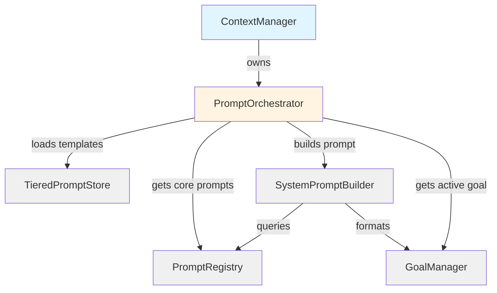
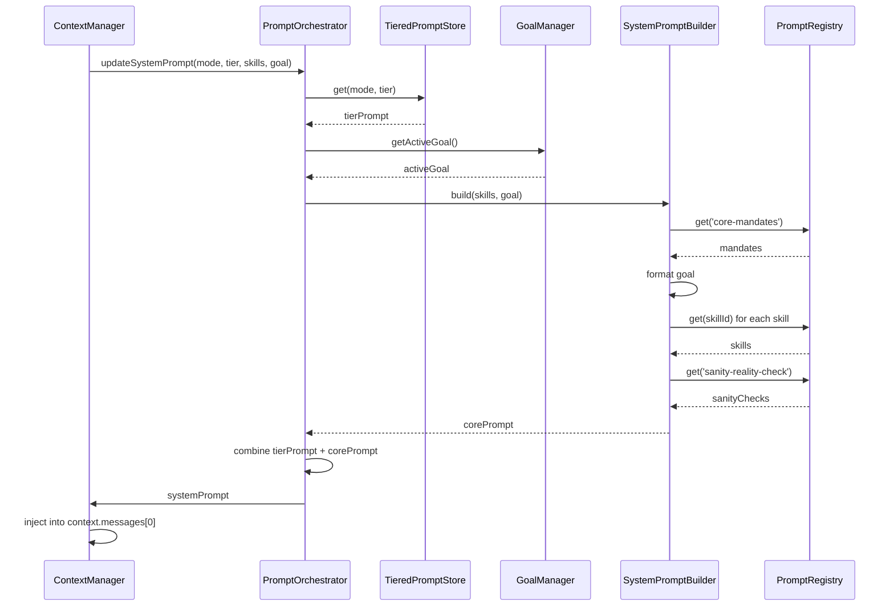
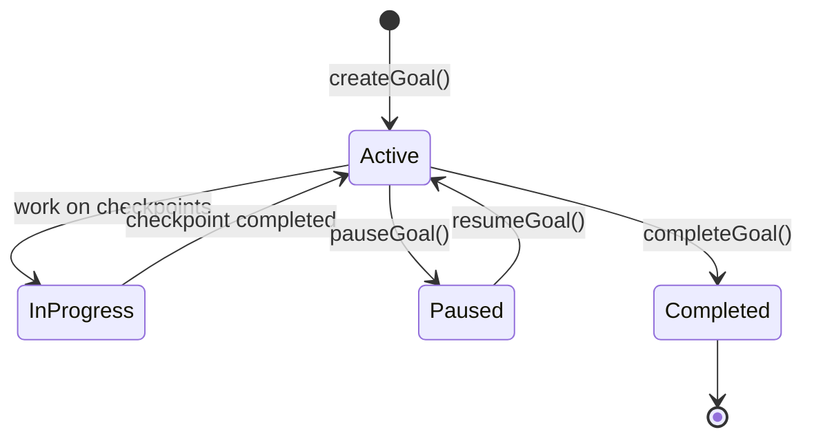
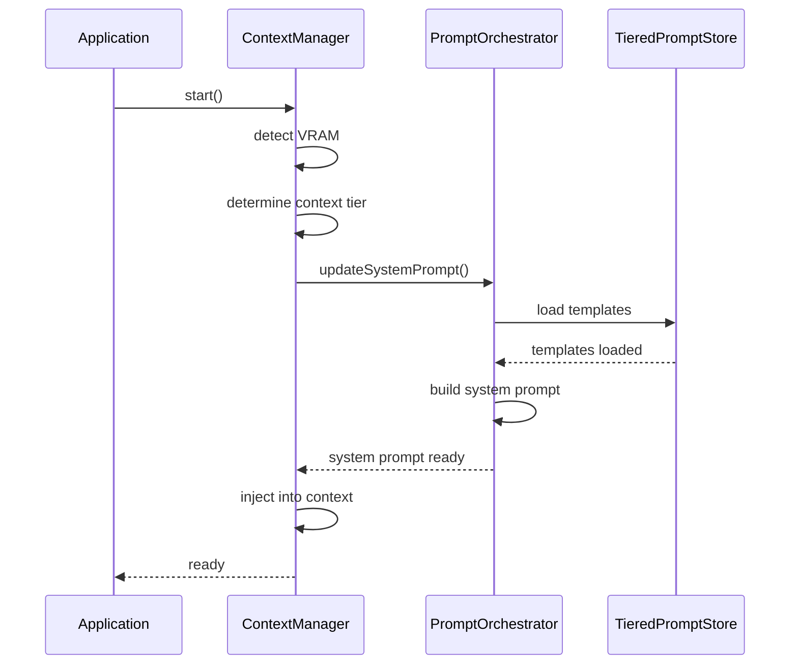
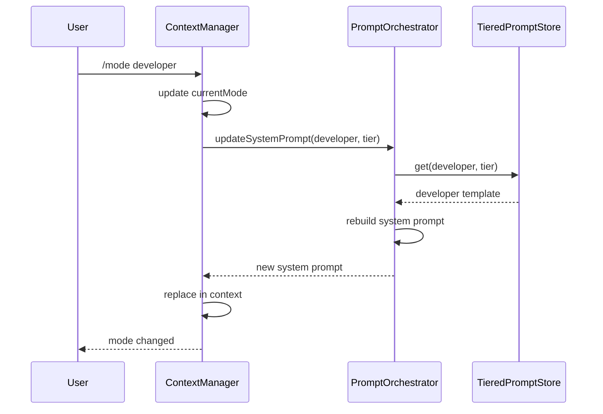

# Prompts System Architecture

**Last Updated:** January 26, 2026

This document provides complete technical documentation of the Prompts System architecture, including system prompt construction, template engine, routing logic, and goal management.

---

## Table of Contents

- [System Overview](#system-overview)
- [Component Architecture](#component-architecture)
- [System Prompt Construction](#system-prompt-construction)
- [Template System](#template-system)
- [Goal Management](#goal-management)
- [Operational Modes](#operational-modes)
- [Prompt Registry](#prompt-registry)
- [Data Flow](#data-flow)
- [Configuration](#configuration)
- [Events](#events)
- [Best Practices](#best-practices)

---

## System Overview

The Prompts System manages system prompts that guide LLM behavior. It provides tier-specific prompts for different context sizes and mode-specific prompts for different operational modes.

### Core Responsibility

Build and maintain the system prompt that defines LLM behavior.

### Key Principles

1. **ContextManager Ownership** - ContextManager is the ONLY owner of system prompts
2. **Tier-Based Scaling** - Prompts scale with context size
3. **Mode-Specific Behavior** - Different modes have different prompts
4. **Goal-Oriented** - Goals guide LLM focus and behavior
5. **Never Compress Goals** - Goals always remain in system prompt

---

## Component Architecture

### Component Hierarchy

```
ContextManager (Owner)
  ↓
PromptOrchestrator (Coordinator)
  ├─ TieredPromptStore (Mode+Tier Templates)
  ├─ PromptRegistry (Core Prompts)
  ├─ SystemPromptBuilder (Assembly)
  └─ GoalManager (Goal Tracking)
```

### Component Diagram



---

## Component Details

### 1. PromptOrchestrator

**Location:** `packages/core/src/context/promptOrchestrator.ts`

**Role:** Coordinates prompt loading and system prompt construction

**Responsibilities:**

- Loads tiered prompt templates from filesystem
- Resolves mode+tier combinations
- Calculates token budgets per tier
- Orchestrates SystemPromptBuilder
- Updates system prompt in conversation context

**Key Methods:**

```typescript
class PromptOrchestrator {
  // Get system prompt for mode and tier
  getSystemPromptForTierAndMode(mode: OperationalMode, tier: ContextTier): string;

  // Get token budget for tier
  getSystemPromptTokenBudget(tier: ContextTier): number;

  // Update system prompt in context
  updateSystemPrompt(options: {
    mode: OperationalMode;
    tier: ContextTier;
    activeSkills: string[];
    activeGoal: Goal | null;
    currentContext: ConversationContext;
    contextPool: ContextPool;
  }): void;
}
```

### 2. TieredPromptStore

**Location:** `packages/core/src/prompts/tieredPromptStore.ts`

**Role:** Loads and stores mode+tier prompt templates from filesystem

**Key Methods:**

```typescript
class TieredPromptStore {
  // Load all templates from filesystem
  load(): void;

  // Get template for mode and tier
  get(mode: OperationalMode, tier: ContextTier): string | undefined;
}
```

**Template Loading:**

```
1. Scan templates/ directory
2. Load all mode+tier combinations
3. Store in memory map
4. Fallback to Developer Tier 3 if not found
```

### 3. PromptRegistry

**Location:** `packages/core/src/prompts/PromptRegistry.ts`

**Role:** Registry for core prompts (mandates, sanity checks, skills)

**Key Methods:**

```typescript
class PromptRegistry {
  // Register a prompt
  register(definition: PromptDefinition): void;

  // Get prompt by ID
  get(id: string): RegisteredPrompt | undefined;

  // Get prompts by tag
  getByTag(tag: string): RegisteredPrompt[];

  // Get prompts by source
  getBySource(source: 'static' | 'mcp' | 'config'): RegisteredPrompt[];

  // Clear MCP prompts when server disconnects
  clearMcpPrompts(serverName: string): void;
}
```

**Registered Prompt Structure:**

```typescript
interface RegisteredPrompt {
  id: string;
  name: string;
  content: string;
  description?: string;
  requiredTools?: string[];
  tags?: string[];
  source: 'static' | 'mcp' | 'config';
  serverName?: string; // If from MCP
  registeredAt: number;
}
```

### 4. SystemPromptBuilder

**Location:** `packages/core/src/context/SystemPromptBuilder.ts`

**Role:** Assembles final system prompt from registry components

**Assembly Order:**

```
1. Core Mandates (from registry: 'core-mandates')
2. Active Goals (from goal manager - never compressed)
3. Active Skills (from registry by skill IDs)
4. Sanity Checks (optional, from registry: 'sanity-reality-check')
5. Additional Instructions (custom user instructions)
```

**Key Methods:**

```typescript
class SystemPromptBuilder {
  // Build complete system prompt
  build(options: {
    skills: string[];
    goal: Goal | null;
    useSanityChecks: boolean;
    additionalInstructions?: string;
  }): string;
}
```

### 5. GoalManager

**Location:** `packages/core/src/context/goalManager.ts`

**Role:** Manages goals, checkpoints, decisions, and artifacts

**Key Methods:**

```typescript
class GoalManager {
  // Goal lifecycle
  createGoal(description: string, priority: 'high' | 'medium' | 'low'): Goal;
  getActiveGoal(): Goal | null;
  pauseGoal(goalId: string): void;
  completeGoal(goalId: string, summary: string): void;

  // Checkpoints
  createCheckpoint(goalId: string, description: string): Checkpoint;
  updateCheckpoint(goalId: string, checkpointId: string, status: CheckpointStatus): void;

  // Decisions
  recordDecision(goalId: string, description: string, rationale: string): Decision;
  lockDecision(goalId: string, decisionId: string): void;

  // Artifacts
  recordArtifact(goalId: string, type: ArtifactType, path: string, action: ArtifactAction): void;

  // Query
  getGoalProgress(goalId: string): { completed: number; total: number; percentage: number };
  getGoalHistory(): Goal[];
}
```

---

## System Prompt Construction

### Prompt Tiers

Prompt tiers correspond to context tiers and determine the detail level of system prompts.

| Tier                  | Context Size | Prompt Budget | % of Context |
| --------------------- | ------------ | ------------- | ------------ |
| **Tier 1 (Minimal)**  | 2K, 4K       | 200 tokens    | 5-10%        |
| **Tier 2 (Basic)**    | 8K           | 500 tokens    | 6.3%         |
| **Tier 3 (Standard)** | 16K          | 1000 tokens   | 6.3%         |
| **Tier 4 (Premium)**  | 32K          | 1500 tokens   | 4.7%         |
| **Tier 5 (Ultra)**    | 64K, 128K    | 1500 tokens   | 1.2-2.3%     |

**Principle:** Larger contexts can afford more detailed prompts without sacrificing user content space.

### Why Scale Prompts by Tier?

**Tier 1 (2-4K):** Minimal context

- ~200 tokens (5% of 4K)
- Essential behavior only
- No verbose instructions
- Focus on core capabilities

**Tier 2 (8K):** Basic context

- ~500 tokens (6.3% of 8K)
- Detailed guidance
- Basic tool instructions
- Mode-specific behavior

**Tier 3 (16K):** Standard context ⭐

- ~1000 tokens (6.3% of 16K)
- Comprehensive instructions
- Full tool documentation
- Mode-specific strategies

**Tier 4 (32K):** Premium context

- ~1500 tokens (4.7% of 32K)
- Expert-level guidance
- Advanced patterns
- Optimization strategies

**Tier 5 (64-128K):** Ultra context

- ~1500 tokens (1.2% of 131K)
- Maximum sophistication
- Complex reasoning patterns
- Multi-step workflows

### Prompt Construction Flow



---

## Template System

### Filesystem Structure

```
packages/core/src/prompts/templates/
├── assistant/
│   ├── tier1.txt
│   ├── tier2.txt
│   ├── tier3.txt
│   ├── tier4.txt
│   └── tier5.txt
├── developer/
│   ├── tier1.txt
│   ├── tier2.txt
│   ├── tier3.txt
│   ├── tier4.txt
│   └── tier5.txt
├── planning/
│   ├── tier1.txt
│   ├── tier2.txt
│   ├── tier3.txt
│   ├── tier4.txt
│   └── tier5.txt
├── debugger/
│   ├── tier1.txt
│   ├── tier2.txt
│   ├── tier3.txt
│   ├── tier4.txt
│   └── tier5.txt
├── user/
│   ├── tier1.txt
│   ├── tier2.txt
│   ├── tier3.txt
│   ├── tier4.txt
│   └── tier5.txt
├── mandates.ts      (Core behavior)
├── sanity.ts        (Reality checks)
├── identity.ts      (Agent identity)
└── stateSnapshot.ts (State tracking)
```

### Fallback Strategy

```
1. Try: packages/core/dist/prompts/templates/
2. Fallback: packages/core/src/prompts/templates/
3. Use: Developer Tier 3 as last resort
```

### Template Loading

```typescript
// TieredPromptStore loads templates at startup
class TieredPromptStore {
  private templates: Map<string, string> = new Map();

  load(): void {
    const modes = ['assistant', 'developer', 'planning', 'debugger', 'user'];
    const tiers = [1, 2, 3, 4, 5];

    for (const mode of modes) {
      for (const tier of tiers) {
        const key = `${mode}-tier${tier}`;
        const content = this.loadTemplate(mode, tier);
        this.templates.set(key, content);
      }
    }
  }

  get(mode: string, tier: number): string | undefined {
    const key = `${mode}-tier${tier}`;
    return this.templates.get(key);
  }
}
```

---

## Goal Management

### Goal Structure

```typescript
interface Goal {
  id: string;
  description: string;
  priority: 'high' | 'medium' | 'low';
  status: 'active' | 'paused' | 'completed';
  createdAt: Date;
  completedAt?: Date;
  checkpoints: Checkpoint[];
  decisions: Decision[];
  artifacts: Artifact[];
}

interface Checkpoint {
  id: string;
  description: string;
  status: 'pending' | 'in-progress' | 'completed';
  completedAt?: Date;
}

interface Decision {
  id: string;
  description: string;
  rationale: string;
  locked: boolean; // Locked decisions cannot be changed
}

interface Artifact {
  type: 'file' | 'test' | 'documentation';
  path: string;
  action: 'created' | 'modified' | 'deleted';
}
```

### Goal Lifecycle



### Goal in System Prompt

Goals are injected into the system prompt between mandates and skills:

```
[Core Mandates]

[Active Goal]
CURRENT GOAL: Implement user authentication system
Priority: High
Status: Active

Checkpoints:
✅ 1. Design authentication flow
✅ 2. Implement login endpoint
🔄 3. Add JWT token generation (IN PROGRESS)
⏳ 4. Create user registration
⏳ 5. Add password hashing

Key Decisions:
🔒 Use JWT for authentication (locked)
🔒 Store tokens in httpOnly cookies (locked)
- Use bcrypt for password hashing

Artifacts:
- Created: src/auth/login.ts
- Created: src/auth/jwt.ts
- Modified: src/routes/api.ts

[Active Skills]
[Sanity Checks]
[Additional Instructions]
```

### Goal Markers

The LLM can use special markers to update goals:

```
[GOAL] Implement user authentication system
[CHECKPOINT] Design authentication flow - COMPLETED
[DECISION] Use JWT for authentication - LOCKED
[ARTIFACT] Created src/auth/login.ts
[NEXT] Implement JWT token generation
```

These markers are parsed and used to update the goal structure automatically.

---

## Operational Modes

### Mode Profiles

**Assistant Mode** (Default)

- General-purpose conversational AI
- Balanced between helpfulness and safety
- Moderate tool usage
- Template: `templates/assistant/tier{1-5}.txt`

**Developer Mode**

- Code-focused assistance
- Aggressive tool usage
- Technical language
- Template: `templates/developer/tier{1-5}.txt`

**Planning Mode**

- Project planning and architecture
- Goal-oriented thinking
- Strategic recommendations
- Template: `templates/planning/tier{1-5}.txt`

**Debugger Mode**

- Error analysis and troubleshooting
- Systematic debugging approach
- Root cause analysis
- Template: `templates/debugger/tier{1-5}.txt`

**User Mode** (Custom)

- User-defined behavior
- Customizable prompt templates
- Same structure as Assistant mode (default copy)
- Template: `templates/user/tier{1-5}.txt`

### Mode Switching

```typescript
// ContextManager handles mode switching
class ContextManager {
  setMode(newMode: OperationalMode): void {
    this.currentMode = newMode;

    // Update system prompt with new mode
    this.promptOrchestrator.updateSystemPrompt({
      mode: newMode,
      tier: this.effectivePromptTier,
      activeSkills: this.activeSkills,
      activeGoal: this.goalManager.getActiveGoal(),
      currentContext: this.currentContext,
      contextPool: this.contextPool,
    });

    this.emit('mode-changed', newMode);
  }
}
```

---

## Prompt Registry

### Prompt Sources

- **static:** Built-in prompts (mandates, sanity)
- **mcp:** Prompts from MCP servers
- **config:** User-defined prompts

### MCP Integration

MCP servers can register prompts dynamically:

```typescript
// MCP server registers prompt
promptRegistry.register({
  id: 'github-workflow',
  name: 'GitHub Workflow',
  content: 'Instructions for GitHub operations...',
  source: 'mcp',
  serverName: 'github-mcp',
  tags: ['skill', 'github'],
});

// When server disconnects, clear its prompts
promptRegistry.clearMcpPrompts('github-mcp');
```

---

## Data Flow

### Startup Flow



### Mode Change Flow



---

## Configuration

### System Prompt Config

```typescript
interface SystemPromptConfig {
  interactive: boolean;
  useSanityChecks?: boolean;
  agentName?: string;
  additionalInstructions?: string;
  skills?: string[]; // Skill IDs to include
  goal?: Goal; // Active goal to include
}
```

### Default Values

```typescript
const DEFAULT_CONFIG = {
  interactive: true,
  useSanityChecks: true,
  agentName: 'Assistant',
  additionalInstructions: '',
  skills: [],
};
```

---

## Events

### Prompt Events

- `system-prompt-updated` - System prompt changed
- `mode-changed` - Operational mode changed
- `active-skills-updated` - Active skills changed
- `active-tools-updated` - Active tools changed
- `active-hooks-updated` - Active hooks changed
- `active-mcp-updated` - Active MCP servers changed

---

## Best Practices

### 1. Prompt Design

- Keep Tier 1 prompts minimal (200 tokens max)
- Scale detail with tier size
- Use clear, concise language
- Focus on behavior, not implementation

### 2. Mode Selection

- Use Assistant mode for general tasks
- Use Developer mode for coding tasks
- Use Planning mode for architecture
- Use Debugger mode for troubleshooting

### 3. Skills

- Register skills in PromptRegistry
- Tag skills appropriately
- Keep skill prompts focused
- Test skills in isolation

### 4. MCP Prompts

- Clear prompts when server disconnects
- Version prompts for compatibility
- Document required tools
- Test prompt integration

### 5. User Mode Customization

- User mode templates are located in `templates/user/`
- By default, they are copies of Assistant mode
- Edit the tier files to customize behavior
- Changes take effect on next mode switch
- Keep tier token budgets in mind when editing

---

## File Locations

| File                                               | Purpose              |
| -------------------------------------------------- | -------------------- |
| `packages/core/src/context/promptOrchestrator.ts`  | Coordinator          |
| `packages/core/src/prompts/tieredPromptStore.ts`   | Template loader      |
| `packages/core/src/prompts/PromptRegistry.ts`      | Core prompt registry |
| `packages/core/src/context/SystemPromptBuilder.ts` | Prompt assembly      |
| `packages/core/src/context/goalManager.ts`         | Goal management      |
| `packages/core/src/prompts/templates/`             | All prompt templates |

---

**Last Updated:** January 26, 2026  
**Version:** 0.1.0  
**Status:** Active Development
