# System Prompt Routing & Selection

**Last Updated:** January 26, 2026  
**Status:** Source of Truth

**Related Documents:**
- `SystemPrompts.md` - System prompt architecture and design
- `PromptsTemplates.md` - Actual prompt templates
- `ContextManagement.md` - Context sizing, tiers, VRAM

---

## Overview

The adaptive system prompt system automatically selects and switches prompts based on:
1. **Context Tier** - Detected from context size (Minimal, Basic, Standard, Premium, Ultra)
2. **Operational Mode** - User-selected mode (Developer, Planning, Assistant, Debugger)
3. **Hardware Capability** - Maximum context size hardware can support (auto-sizing)

This document provides visual diagrams showing how prompts are selected and when they switch.

**Key Principle:** Prompts are selected automatically based on context tier and operational mode, with no manual configuration required.

---

## Context Tier System

### Tier Definitions

| Tier | Label | Context Sizes | Ollama Size (85%) | Prompt Budget | Use Case |
|------|-------|---------------|-------------------|---------------|----------|
| 1 | Minimal | 2K, 4K | 1700, 3400 | ~200 tokens | Quick tasks, minimal context |
| 2 | Basic | 8K | 6800 | ~500 tokens | Standard conversations |
| 3 | Standard ⭐ | 16K | 13600 | ~1000 tokens | Complex tasks, code review |
| 4 | Premium | 32K | 27200 | ~1500 tokens | Large codebases, long conversations |
| 5 | Ultra | 64K, 128K | 54400, 108800 | ~1500 tokens | Maximum context, research tasks |

**Key Points:**
- Tiers are **labels only** - they represent context size ranges
- Context size drives everything
- Each tier has specific context sizes (not arbitrary ranges)
- Prompt budget scales with tier
- The 85% values are **pre-calculated** in `LLM_profiles.json`

---

## Operational Modes

### Mode Definitions

**1. Developer Mode**
- **Focus:** Code quality, architecture, testing
- **Guidance:** SOLID principles, design patterns, error handling
- **Output:** Production-quality code with tests and documentation

**2. Planning Mode**
- **Focus:** Task breakdown, dependencies, estimation
- **Guidance:** Risk assessment, realistic planning, clear criteria
- **Output:** Actionable plans with dependencies and estimates

**3. Assistant Mode**
- **Focus:** Clear communication, helpful responses
- **Guidance:** Conversational style, examples, explanations
- **Output:** Informative, well-structured answers
- **Note:** Only available in Tier 4 and 5 (larger contexts)

**4. Debugger Mode**
- **Focus:** Systematic debugging, root cause analysis
- **Guidance:** Debugging process, hypothesis testing, verification
- **Output:** Clear diagnosis with reproduction steps and fixes

---

## Prompt Selection Matrix

### Selection Logic


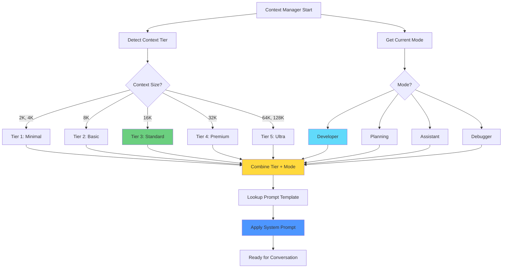

**Description:**
1. Context Manager starts and detects context tier from context size
2. Gets current operational mode (defaults to Developer)
3. Combines tier + mode to create lookup key (e.g., "tier3-developer")
4. Looks up prompt template from template files
5. Applies prompt to conversation
6. Ready for user interaction

**Note:** Assistant mode is only available for Tier 4 and 5 (32K+ contexts).

---

## Prompt Template Matrix

### Template Combinations (5 Tiers × 4 Modes)

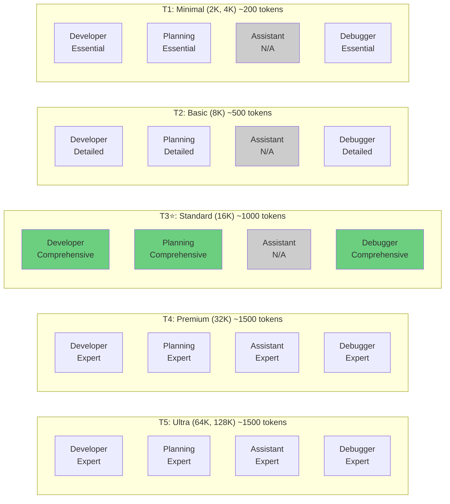

**Description:**
- Each cell represents a unique prompt template
- Tier determines prompt complexity and token budget
- Mode determines focus and guidance style
- Tier 3 (Standard) is the primary target (most users)
- Assistant mode only available in Tier 4 and 5
- Total: 18 prompt templates (5 tiers × 4 modes, minus 3 unavailable assistant templates)

---

## Auto-Sizing and Prompt Stability

### The Problem

When auto-context sizing is enabled, the context window can adjust based on available VRAM. However, **we do NOT want the system prompt to change mid-conversation** as this can confuse the LLM.

### The Solution

**Context size is FIXED for the session** when using auto-sizing or manual sizing. The system prompt is selected once at startup and remains stable throughout the conversation.

### Current Behavior (Fixed Context)

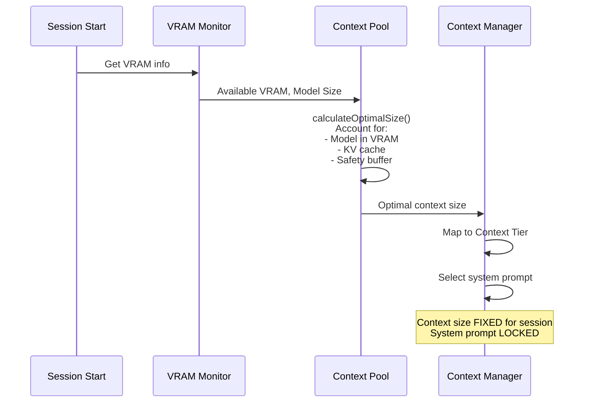

**What It Considers:**
- Model size already loaded in VRAM
- Available VRAM after model is loaded
- KV cache quantization type (f16, q8_0, q4_0)
- Safety buffer (1GB default)
- Returns: Optimal context size for hardware

**Key Point:** Context size is determined once at startup and stays FIXED for the entire session. No mid-conversation changes occur.

### Context Size Selection Flow

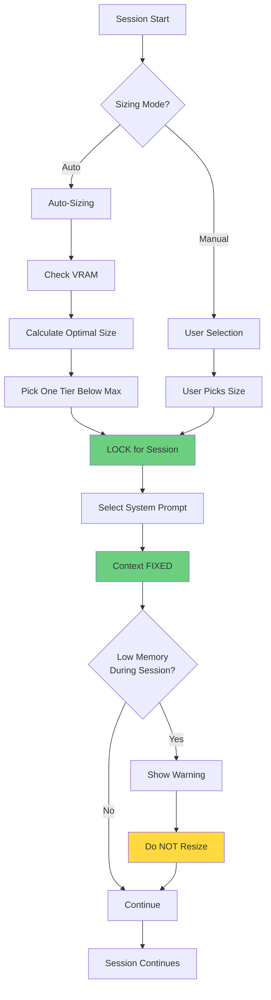

### Example Scenarios

#### Scenario 1: Auto-Sizing Enabled

```
Hardware: 24GB VRAM, 13B model
├─ Optimal Context: 16K (one tier below max for safety)
├─ Context Tier: Tier 3 (Standard)
└─ System Prompt: Tier 3 (~1000 tokens)

During Conversation:
├─ Context size: FIXED at 16K
├─ Context tier: FIXED at Tier 3
├─ System prompt: NEVER CHANGES ✅
└─ On low memory: Show warning (don't resize)

Result: Stable, consistent LLM behavior
```

#### Scenario 2: Manual Sizing

```
Hardware: 24GB VRAM, 13B model
├─ User Selection: 16K context
├─ Context Tier: Tier 3 (Standard)
└─ System Prompt: Tier 3 (~1000 tokens)

During Conversation:
├─ Context size: FIXED at 16K
├─ Context tier: FIXED at Tier 3
├─ System prompt: NEVER CHANGES ✅
└─ On low memory: Show warning (don't resize)

Result: User gets exactly what they selected
```

#### Scenario 3: Limited Hardware

```
Hardware: 8GB VRAM, 7B model
├─ Optimal Context: 8K (hardware limit)
├─ Context Tier: Tier 2 (Basic)
└─ System Prompt: Tier 2 (~500 tokens)

User Wants: 16K context
├─ System shows: "Hardware supports up to 8K"
├─ Context size: FIXED at 8K (hardware limit)
├─ Context tier: FIXED at Tier 2
└─ System prompt: Tier 2 (~500 tokens)

Result: Realistic sizing for hardware capability
```

### Benefits of Fixed Context

| Benefit | Description |
|---------|-------------|
| **Prompt Stability** | System prompt never changes mid-conversation |
| **No LLM Confusion** | Consistent behavior throughout session |
| **Predictable Performance** | User knows exactly what to expect |
| **Clear Warnings** | Low memory warnings instead of silent resizing |
| **User Control** | Explicit sizing decisions |

---

## Automatic Tier Switching

### Scenario: User Switches Model (8K → 16K)

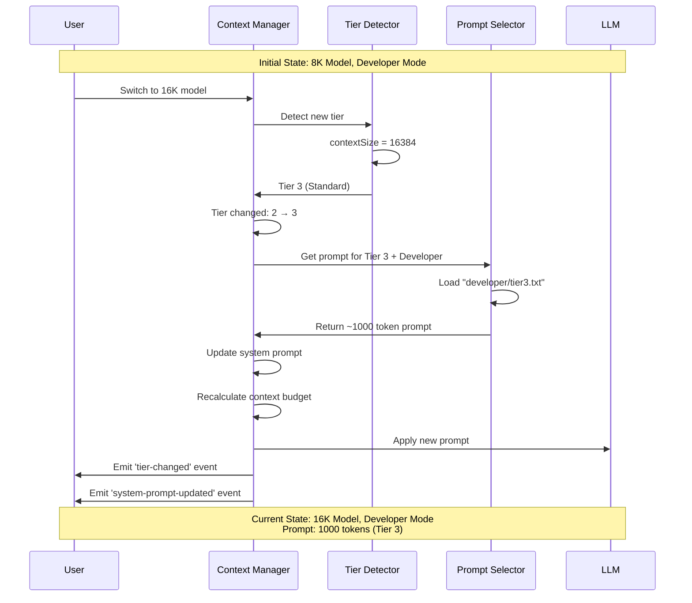

**Description:**
1. User switches from 8K to 16K model
2. Context Manager detects tier change (Tier 2 → Tier 3)
3. Prompt Selector retrieves appropriate prompt
4. System prompt scales from ~500 to ~1000 tokens
5. Context budget recalculated
6. Events emitted for UI updates
7. **Fully automatic** - no user action required

**Note:** This only happens when switching models/sessions, not mid-conversation.

---

## Automatic Mode Switching

### Scenario: User Switches Mode (Developer → Planning)

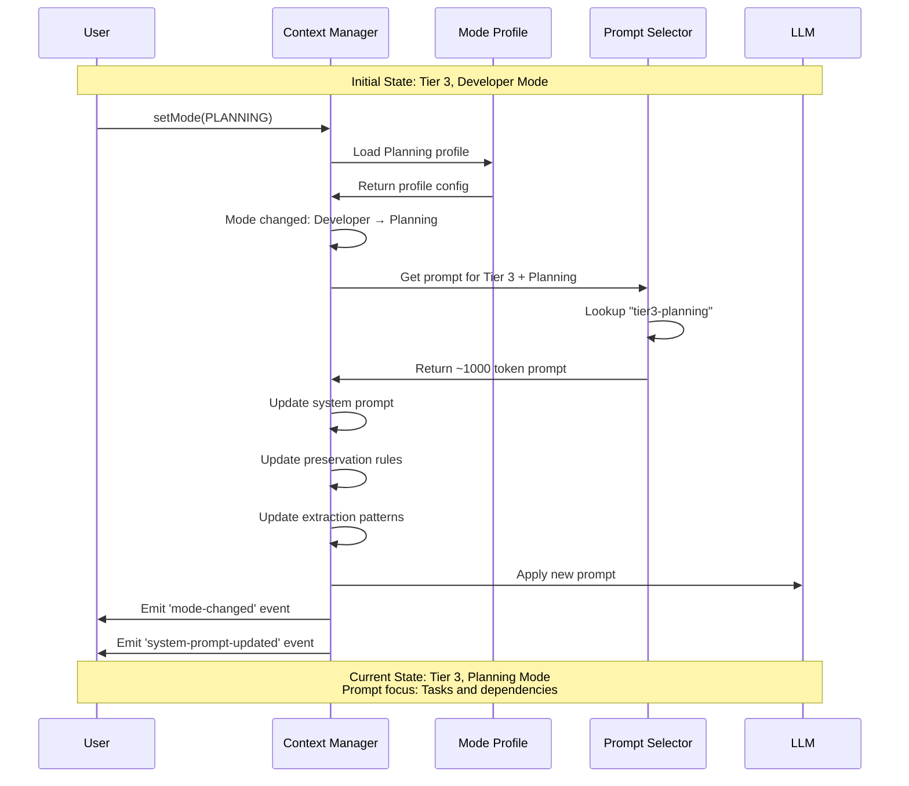

**Description:**
1. User explicitly switches mode to Planning
2. Context Manager loads Planning mode profile
3. Prompt Selector retrieves planning-focused prompt
4. System prompt changes focus from code to tasks
5. Preservation rules updated (goals, requirements, tasks)
6. Extraction patterns updated
7. Events emitted for UI updates

---

## Combined Switching

### Scenario: User Switches Both Model and Mode

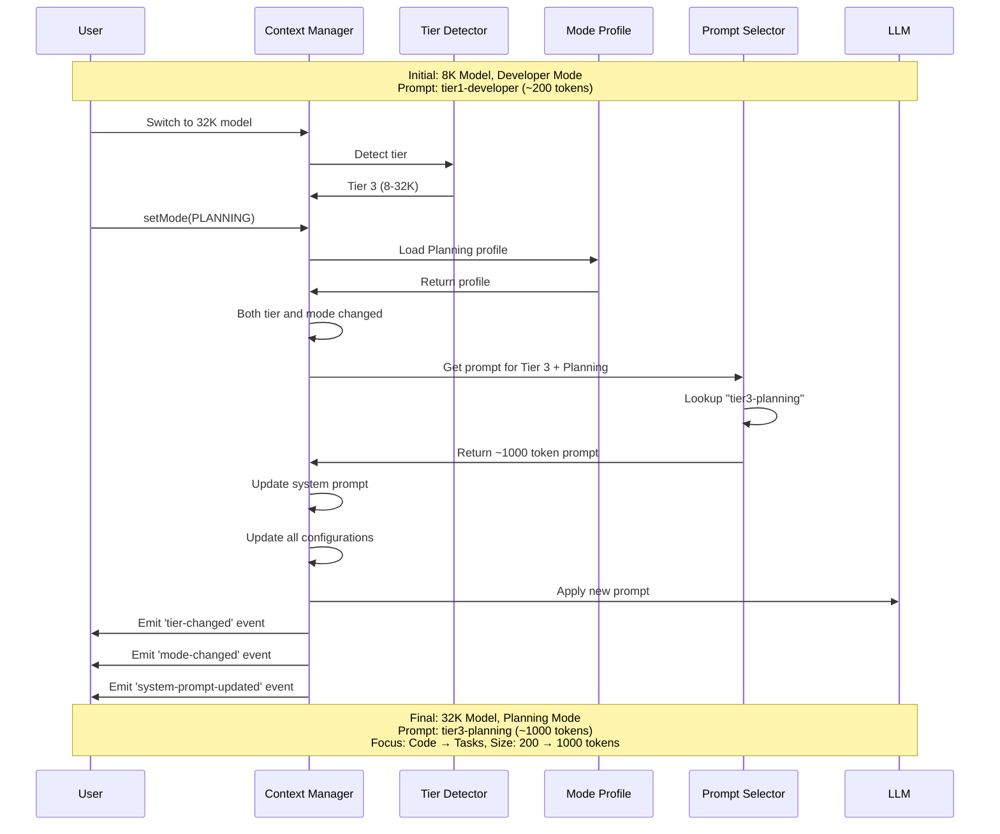

**Description:**
1. User switches both model (8K → 32K) and mode (Developer → Planning)
2. Tier detection runs (Tier 1 → Tier 3)
3. Mode profile loads (Developer → Planning)
4. Prompt Selector combines both changes
5. Single prompt update with both tier and mode changes
6. All configurations updated atomically
7. Multiple events emitted for UI

---

## Prompt Selection Decision Tree

### Complete Decision Flow

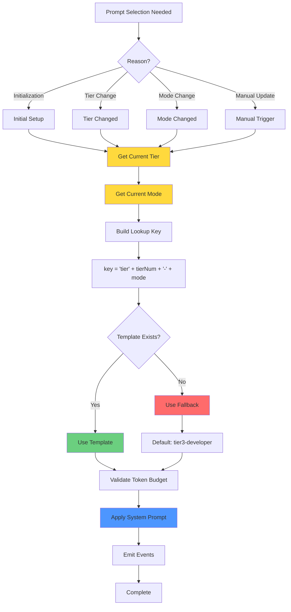

**Description:**
1. **Trigger:** Initialization, tier change, mode change, or manual update
2. **Detection:** Get current tier and mode
3. **Key Building:** Combine into lookup key (e.g., "tier3-developer")
4. **Lookup:** Find template in `SYSTEM_PROMPT_TEMPLATES`
5. **Fallback:** If not found, use default (tier3-developer)
6. **Validation:** Verify token budget is within limits
7. **Application:** Set as system prompt
8. **Events:** Emit for UI updates

---

## Token Budget Flow

### How Token Budgets Scale with Tier

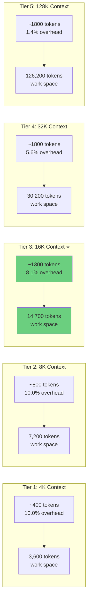

**Description:**
- **Tier 1:** Minimal prompt (400 tokens total) to maximize work space
- **Tier 2:** Detailed prompt (800 tokens total) with examples
- **Tier 3:** Comprehensive prompt (1300 tokens total) with frameworks ⭐
- **Tier 4:** Expert prompt (1800 tokens total) with sophistication
- **Tier 5:** Expert prompt (1800 tokens total) - minimal overhead
- **Overhead:** Stays under 11% for all tiers
- **Work Space:** Increases with context size

**Token Budget Breakdown:**
- Core Mandates: ~200 tokens (all tiers)
- Sanity Checks: ~100 tokens (tier 2+)
- Mode Template: 200-1500 tokens (tier-dependent)
- Total: 400-1800 tokens

---

## Mode Profile Impact

### How Mode Affects Prompt Content

```mermaid
graph TB
    subgraph "Developer Mode"
        D1[Core: Code Quality]
        D2[Focus: Architecture]
        D3[Examples: SOLID, Patterns]
        D4[Guardrails: Type Safety]
    end
    
    subgraph "Planning Mode"
        P1[Core: Task Breakdown]
        P2[Focus: Dependencies]
        P3[Examples: Estimation]
        P4[Guardrails: Clear Criteria]
    end
    
    subgraph "Assistant Mode"
        A1[Core: Communication]
        A2[Focus: User Needs]
        A3[Examples: Explanations]
        A4[Guardrails: Clarity]
    end
    
    subgraph "Debugger Mode"
        X1[Core: Root Cause]
        X2[Focus: Reproduction]
        X3[Examples: Debugging Steps]
        X4[Guardrails: Systematic]
    end
    
    Mode[Operational Mode] --> Developer
    Mode --> Planning
    Mode --> Assistant
    Mode --> Debugger
    
    Developer --> D1
    Developer --> D2
    Developer --> D3
    Developer --> D4
    
    Planning --> P1
    Planning --> P2
    Planning --> P3
    Planning --> P4
    
    Assistant --> A1
    Assistant --> A2
    Assistant --> A3
    Assistant --> A4
    
    Debugger --> X1
    Debugger --> X2
    Debugger --> X3
    Debugger --> X4
    
    style Developer fill:#61dafb
    style Planning fill:#ffd93d
    style Assistant fill:#6bcf7f
    style Debugger fill:#ff6b6b
```

**Description:**
- **Developer:** Focus on code quality, architecture, patterns
- **Planning:** Focus on task breakdown, dependencies, estimation
- **Assistant:** Focus on clear communication, user needs
- **Debugger:** Focus on root cause analysis, systematic debugging
- Each mode has different core responsibilities, focus areas, examples, and guardrails

---

## Prompt Update Lifecycle

### Complete Update Flow

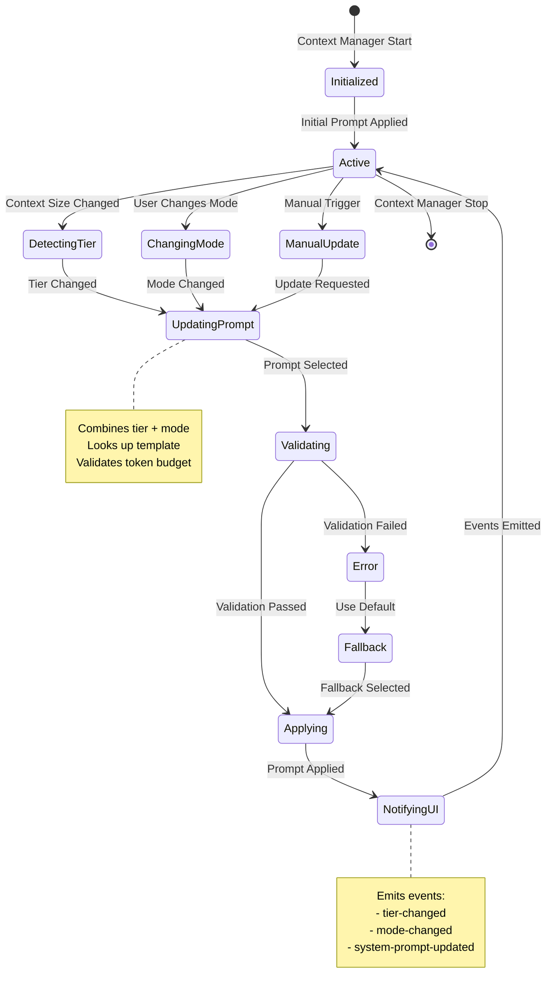

**Description:**
1. **Initialized:** Context Manager starts with default prompt
2. **Active:** Normal operation with current prompt
3. **Triggers:** Tier change, mode change, or manual update
4. **Updating:** Select new prompt based on tier + mode
5. **Validating:** Check token budget and template exists
6. **Applying:** Set as system prompt
7. **Notifying:** Emit events for UI updates
8. **Error Handling:** Fallback to default if validation fails

---

## UI Integration

### How UI Responds to Prompt Changes

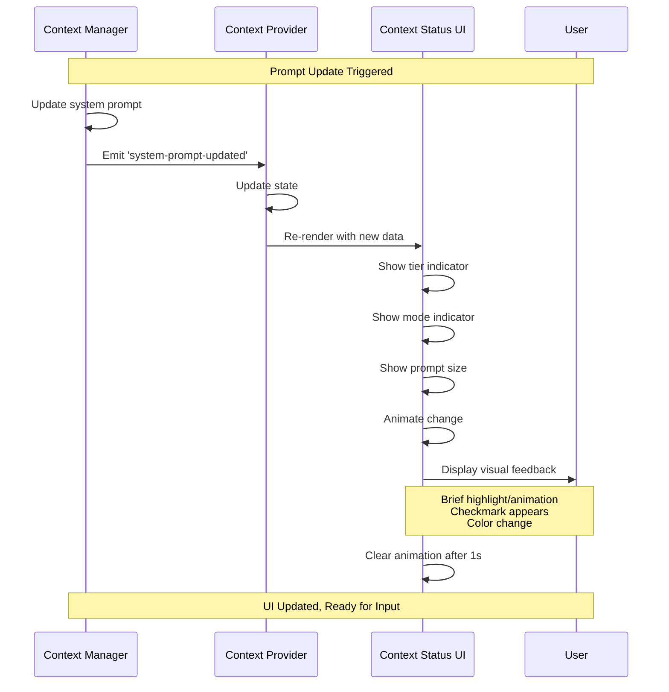

**Description:**
1. Context Manager updates system prompt
2. Emits 'system-prompt-updated' event
3. Context Provider updates React state
4. Context Status UI re-renders
5. Shows tier, mode, and prompt size
6. Animates change (highlight, checkmark)
7. Animation clears after 1 second
8. User sees visual confirmation

---

## Prompt Template Storage

### File Organization

```mermaid
graph TB
    Root[packages/core/src/prompts/templates/]
    
    Root --> Dev[developer/]
    Root --> Plan[planning/]
    Root --> Debug[debugger/]
    Root --> Assist[assistant/]
    Root --> Core[Core Components]
    
    Dev --> D1[tier1.txt ~200 tokens]
    Dev --> D2[tier2.txt ~500 tokens]
    Dev --> D3[tier3.txt ~1000 tokens]
    Dev --> D4[tier4.txt ~1500 tokens]
    Dev --> D5[tier5.txt ~1500 tokens]
    
    Plan --> P1[tier1.txt ~200 tokens]
    Plan --> P2[tier2.txt ~500 tokens]
    Plan --> P3[tier3.txt ~1000 tokens]
    Plan --> P4[tier4.txt ~1500 tokens]
    Plan --> P5[tier5.txt ~1500 tokens]
    
    Debug --> X1[tier1.txt ~200 tokens]
    Debug --> X2[tier2.txt ~500 tokens]
    Debug --> X3[tier3.txt ~1000 tokens]
    Debug --> X4[tier4.txt ~1500 tokens]
    Debug --> X5[tier5.txt ~1500 tokens]
    
    Assist --> A4[tier4.txt ~1500 tokens]
    Assist --> A5[tier5.txt ~1500 tokens]
    
    Core --> C1[identity.ts]
    Core --> C2[mandates.ts]
    Core --> C3[sanity.ts]
    
    style D3 fill:#6bcf7f
    style P3 fill:#6bcf7f
    style X3 fill:#6bcf7f
```

**Description:**
- Prompts stored in separate text files for maintainability
- Organized by mode (developer/, planning/, debugger/, assistant/)
- Each mode has tier-specific prompts (tier1.txt through tier5.txt)
- Assistant mode only has tier4.txt and tier5.txt
- Core components in TypeScript files (identity.ts, mandates.ts, sanity.ts)
- Token counts verified during build
- Easy to edit and version control

**File Locations:**
- `packages/core/src/prompts/templates/developer/tier{1-5}.txt`
- `packages/core/src/prompts/templates/planning/tier{1-5}.txt`
- `packages/core/src/prompts/templates/debugger/tier{1-5}.txt`
- `packages/core/src/prompts/templates/assistant/tier{4-5}.txt`
- `packages/core/src/prompts/templates/identity.ts`
- `packages/core/src/prompts/templates/mandates.ts`
- `packages/core/src/prompts/templates/sanity.ts`

---

## Performance Considerations

### Prompt Selection Performance

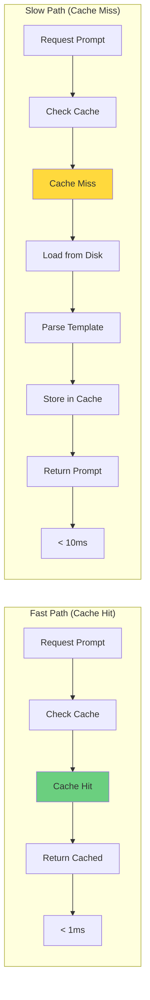

**Description:**
- **Fast Path:** Prompts cached in memory after first load (< 1ms)
- **Slow Path:** First load reads from disk (< 10ms)
- **Cache Key:** `tier{num}-{mode}` (e.g., "tier3-developer")
- **Cache Invalidation:** Only on application restart
- **Memory Usage:** ~50KB for all 16 prompts
- **Performance Impact:** Negligible

---

## Error Handling

### Fallback Strategy

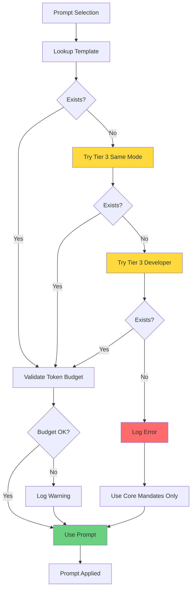

**Description:**
1. **Primary:** Try requested tier + mode
2. **Fallback 1:** Try Tier 3 (Standard) with same mode
3. **Fallback 2:** Try Tier 3 Developer (most common default)
4. **Emergency:** Use Core Mandates only (minimal prompt)
5. **Validation:** Check token budget (warn if over)
6. **Logging:** Log all fallbacks and errors
7. **Graceful:** Never fail, always provide a prompt

**Note:** Assistant mode fallback goes to Tier 4 Assistant if Tier 3 is requested (since Assistant only exists in Tier 4+).

---

## Testing Strategy

### Prompt Selection Tests

```mermaid
graph TB
    subgraph "Unit Tests"
        U1[Test tier detection]
        U2[Test mode selection]
        U3[Test key building]
        U4[Test template lookup]
        U5[Test fallback logic]
        U6[Test token validation]
    end
    
    subgraph "Integration Tests"
        I1[Test tier switching]
        I2[Test mode switching]
        I3[Test combined switching]
        I4[Test UI updates]
        I5[Test event emission]
    end
    
    subgraph "E2E Tests"
        E1[Test full conversation]
        E2[Test model switching]
        E3[Test mode switching]
        E4[Test prompt quality]
    end
    
    Tests[Test Suite] --> Unit
    Tests --> Integration
    Tests --> E2E
    
    Unit --> U1
    Unit --> U2
    Unit --> U3
    Unit --> U4
    Unit --> U5
    Unit --> U6
    
    Integration --> I1
    Integration --> I2
    Integration --> I3
    Integration --> I4
    Integration --> I5
    
    E2E --> E1
    E2E --> E2
    E2E --> E3
    E2E --> E4
    
    style Tests fill:#4d96ff
    style Unit fill:#6bcf7f
    style Integration fill:#ffd93d
    style E2E fill:#ff6b6b
```

**Description:**
- **Unit Tests:** Test individual functions (tier detection, lookup, etc.)
- **Integration Tests:** Test component interactions (switching, events)
- **E2E Tests:** Test full user workflows (conversations, model changes)
- **Coverage Target:** > 80% for prompt selection logic
- **Performance Tests:** Verify < 10ms prompt selection time

---

## Summary

### Key Points

1. **Automatic Selection** ✅
   - Prompts selected based on context tier + operational mode
   - No manual configuration needed
   - Fully automatic switching between sessions

2. **18 Prompt Templates** ✅
   - 5 tiers × 4 modes = 20 combinations
   - Minus 3 (Assistant not available in Tiers 1-3) = 18 templates
   - Each optimized for its context size and mode
   - Token budgets: ~400, ~800, ~1300, ~1800

3. **Fixed Context** ✅
   - Context size determined once at startup
   - Stays FIXED for entire session
   - No mid-conversation changes
   - Clear warnings on low memory

4. **Seamless Switching** ✅
   - Tier changes: Only when switching models/sessions
   - Mode changes: User-triggered
   - Combined changes: Handled atomically
   - UI updates: Visual feedback

5. **Performance** ✅
   - Templates loaded from disk
   - Fast selection (< 10ms)
   - Minimal overhead (1.4-10% depending on tier)
   - Graceful fallbacks

6. **Quality Scaling** ✅
   - Tier 1 (Minimal): Essential guidance (~400 tokens)
   - Tier 2 (Basic): Detailed guidance (~800 tokens)
   - Tier 3 (Standard): Comprehensive guidance (~1300 tokens) ⭐
   - Tier 4 (Premium): Expert guidance (~1800 tokens)
   - Tier 5 (Ultra): Expert guidance (~1800 tokens)

---

## Related Documents

- **[SystemPrompts.md](./SystemPrompts.md)** - System prompt architecture and design
- **[PromptsTemplates.md](./PromptsTemplates.md)** - Actual prompt templates
- **[ContextManagement.md](./ContextManagement.md)** - Context sizing, tiers, VRAM
- **[ContextCompression.md](./ContextCompression.md)** - Compression and snapshots

---

**Document Status:** ✅ Updated  
**Last Updated:** January 26, 2026  
**Visual Diagrams:** 12 mermaid diagrams  
**Purpose:** Visual guide to prompt routing and selection
