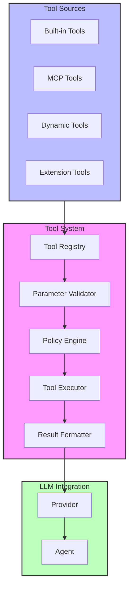
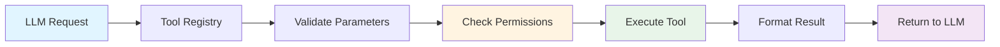
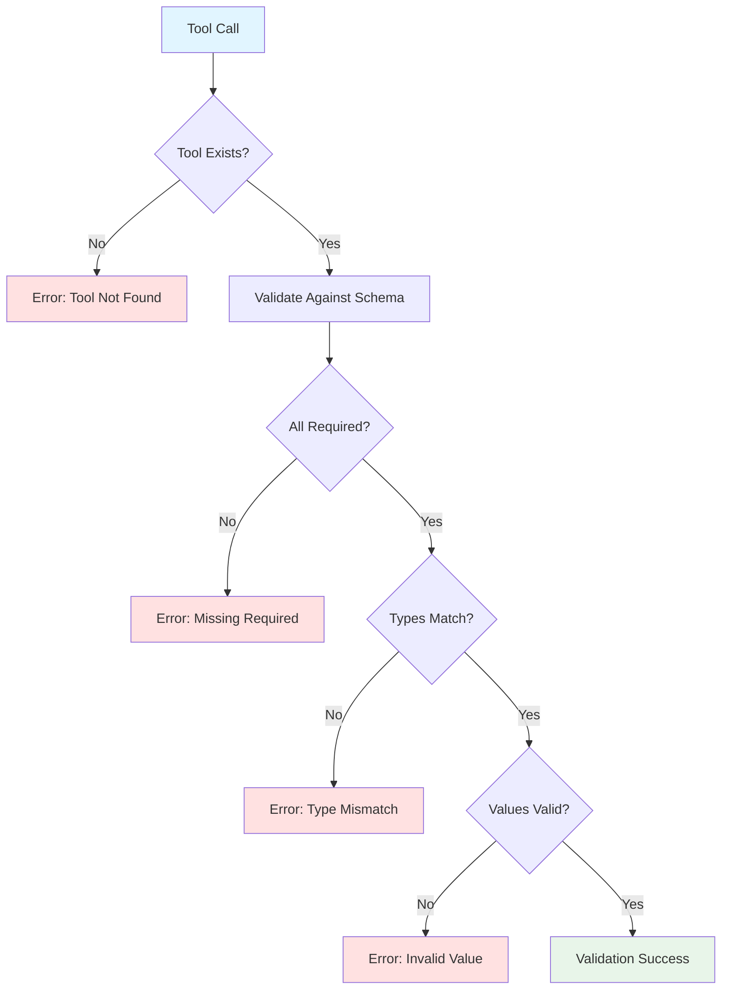
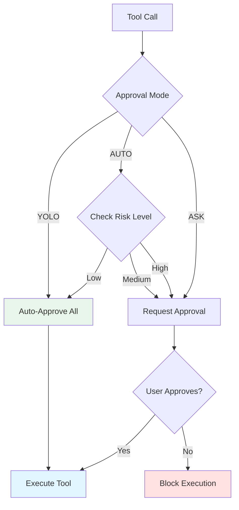
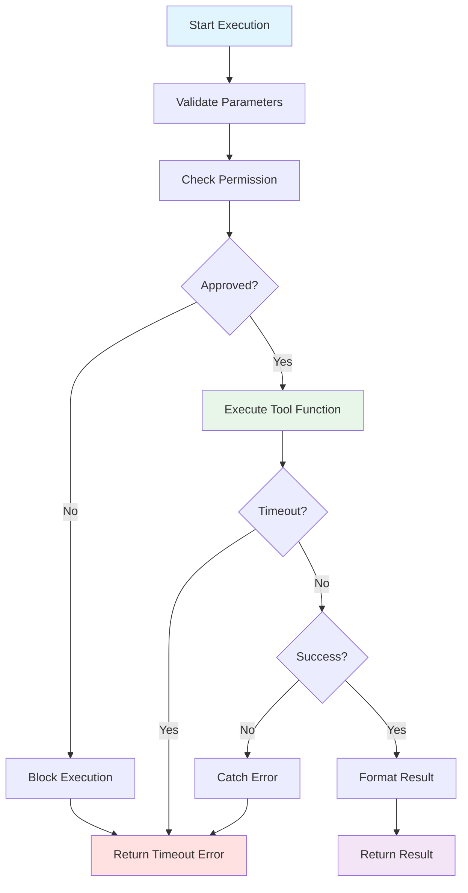
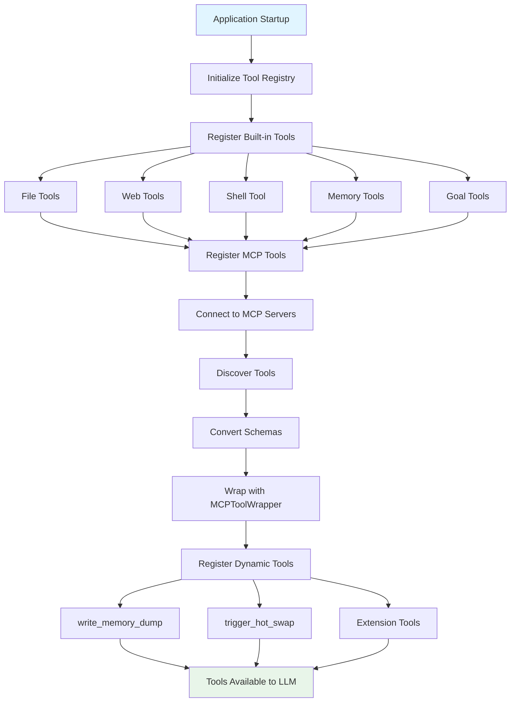
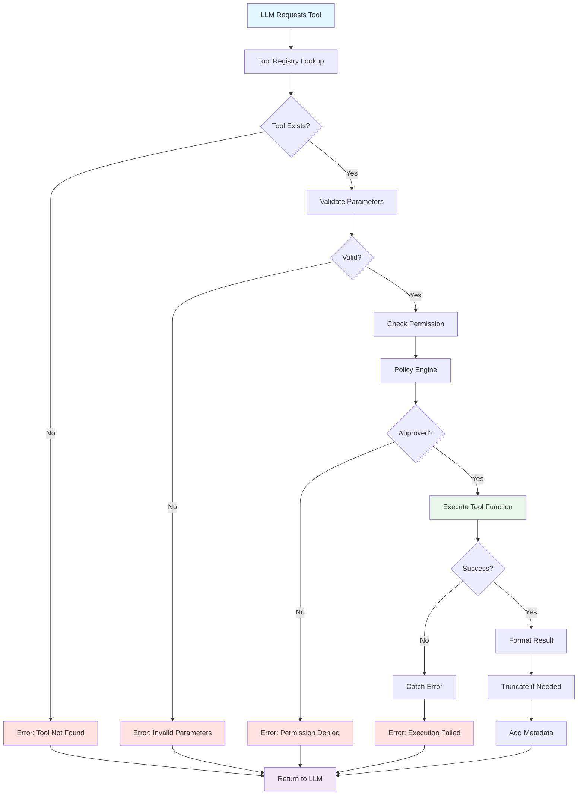
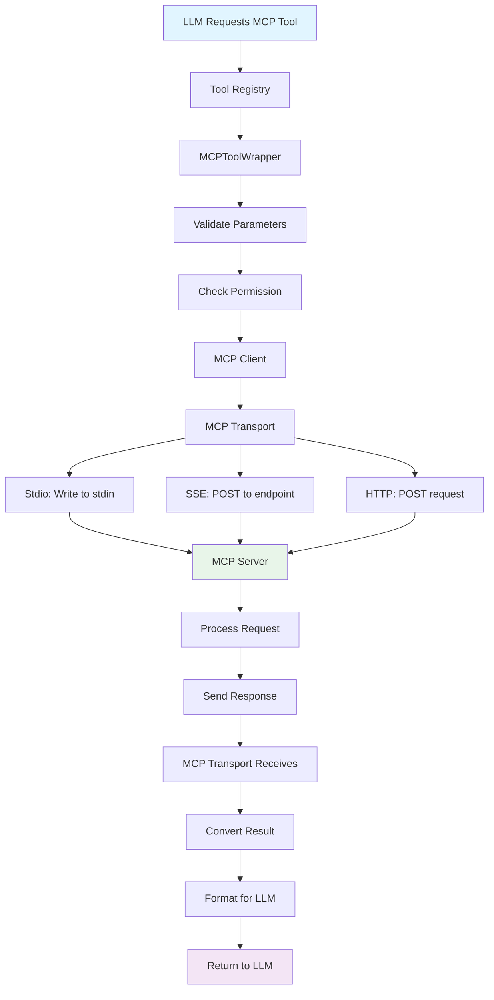
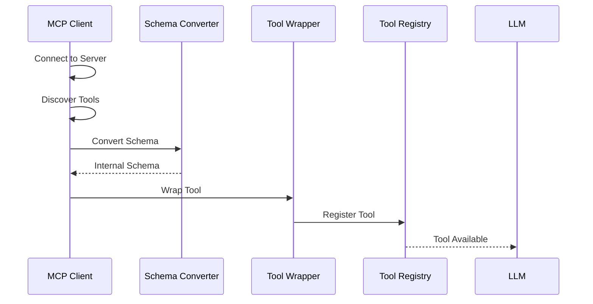

# Tool Execution System Architecture

**Technical Architecture and Design of the Tool System**

---

## Table of Contents

1. [Overview](#overview)
2. [System Architecture](#system-architecture)
3. [Core Components](#core-components)
4. [Tool Categories](#tool-categories)
5. [Data Flow](#data-flow)
6. [Integration Points](#integration-points)
7. [Design Decisions](#design-decisions)
8. [Security Model](#security-model)

**See Also:**

- [Tool User Guide](UserGuide.md) - Using tools
- [MCP Architecture](../MCP/MCP_Architecture.md) - MCP tool integration
- [Hook Architecture](../Hooks/Architecture.md) - Hook system integration

---

## Overview

The Tool Execution System manages tool registration, validation, permission checking, and execution. It provides a unified interface for built-in tools, MCP tools, and dynamically registered tools.

### Key Features

- ✅ Unified tool registry for all tool types
- ✅ Schema-based parameter validation
- ✅ Permission-based approval system
- ✅ Dynamic tool registration at runtime
- ✅ MCP tool integration
- ✅ Result formatting and truncation
- ✅ Error handling and recovery

---

## System Architecture

### High-Level Architecture



### Component Interaction Flow



---

## Core Components

### 1. Tool Registry

**Location:** `packages/core/src/tools/tool-registry.ts`

**Responsibilities:**

- Register and store tool definitions
- Provide tool list to LLM
- Route tool execution requests
- Manage tool lifecycle

**Key Methods:**

```typescript
interface ToolRegistry {
  registerTool(definition: ToolDefinition): void;
  unregisterTool(name: string): void;
  getTool(name: string): ToolDefinition | undefined;
  getAllTools(): ToolDefinition[];
  executeTool(name: string, args: any): Promise<any>;
}
```

**Tool Definition:**

```typescript
interface ToolDefinition {
  name: string;
  description: string;
  inputSchema: {
    type: 'object';
    properties: Record<string, ParameterSchema>;
    required: string[];
  };
  execute: (args: any) => Promise<any>;
}
```

### 2. Parameter Validator

**Location:** `packages/core/src/tools/validation.ts`

**Responsibilities:**

- Validate parameters against schema
- Type checking
- Required field verification
- Value range validation

**Validation Flow:**



### 3. Policy Engine

**Location:** `packages/core/src/policy/policyEngine.ts`

**Responsibilities:**

- Check tool permissions
- Request user approval
- Evaluate risk levels
- Manage approval modes

**Approval Modes:**



**Risk Levels:**

- **Low** - Read-only operations (glob, ls, grep, read_file)
- **Medium** - Write operations (write_file, edit_file)
- **High** - Dangerous operations (shell, delete)

### 4. Tool Executor

**Location:** `packages/core/src/tools/tool-registry.ts`

**Responsibilities:**

- Execute tool function
- Handle errors gracefully
- Capture results
- Manage timeouts

**Execution Flow:**



### 5. Result Formatter

**Location:** `packages/core/src/tools/output-helpers.ts`

**Responsibilities:**

- Format results for LLM
- Truncate large outputs
- Add metadata
- Handle errors

**Truncation Strategy:**

| Output Type        | Size Limit  | Strategy                           |
| ------------------ | ----------- | ---------------------------------- |
| File contents      | 10KB        | Show first 5KB + "... [truncated]" |
| Directory listings | 1000 items  | Show first 500 + count             |
| Search results     | 100 matches | Show first 50 + count              |
| Shell output       | 10KB        | Show last 5KB (most recent)        |

---

## Tool Categories

### File Discovery Tools

**Purpose:** Find and locate files

| Tool   | Description             | Risk Level |
| ------ | ----------------------- | ---------- |
| `glob` | Find files by pattern   | Low        |
| `ls`   | List directory contents | Low        |
| `grep` | Search file contents    | Low        |

**Auto-Approve:** ✅ Yes (in AUTO mode)

### File Operations Tools

**Purpose:** Read and write files

| Tool              | Description            | Risk Level |
| ----------------- | ---------------------- | ---------- |
| `read_file`       | Read single file       | Low        |
| `read_many_files` | Read multiple files    | Low        |
| `edit_file`       | Edit file sections     | Medium     |
| `write_file`      | Create/overwrite files | Medium     |

**Auto-Approve:**

- Read: ✅ Yes (in AUTO mode)
- Write: ❌ No (requires approval)

### Web Tools

**Purpose:** Access web resources

| Tool         | Description       | Risk Level |
| ------------ | ----------------- | ---------- |
| `web_search` | Search internet   | Low        |
| `web_fetch`  | Fetch URL content | Low        |

**Auto-Approve:** ✅ Yes (in AUTO mode)

### Shell Tool

**Purpose:** Execute shell commands

| Tool    | Description      | Risk Level |
| ------- | ---------------- | ---------- |
| `shell` | Execute commands | High       |

**Auto-Approve:** ❌ No (always requires approval unless YOLO)

**Note:** Shell tool UI enhancement planned (collapsible terminal with visual indicators).

### Memory & Context Tools

**Purpose:** Manage memory and context

| Tool                | Description           | Risk Level |
| ------------------- | --------------------- | ---------- |
| `memory`            | Persistent memory     | Low        |
| `remember`          | Simplified memory     | Low        |
| `write_memory_dump` | Context snapshot      | Low        |
| `read_reasoning`    | Review past reasoning | Low        |

**Auto-Approve:** ✅ Yes (in AUTO mode)

### Goal Management Tools

**Purpose:** Manage goals and decisions

| Tool                | Description        | Risk Level |
| ------------------- | ------------------ | ---------- |
| `create_goal`       | Create new goal    | Low        |
| `switch_goal`       | Switch active goal | Low        |
| `complete_goal`     | Mark goal complete | Low        |
| `create_checkpoint` | Create checkpoint  | Low        |
| `record_decision`   | Record decision    | Low        |

**Auto-Approve:** ✅ Yes (in AUTO mode)

**See:** `dev_PromptSystem.md` for goal system architecture

---

## Data Flow

### Tool Registration Flow



### Tool Execution Flow



### MCP Tool Execution Flow



---

## Integration Points

### 1. Provider Integration

Tools are passed to the provider alongside the system prompt:

```typescript
const turnOptions: ChatOptions = {
  systemPrompt: systemPromptWithContext,
  tools: tools, // All registered tools
  ...options,
};

const response = await provider.chat(messages, turnOptions);
```

**Current Issue:** Tools not being passed to provider (see Troubleshooting section).

### 2. MCP Integration

MCP tools are automatically registered in the Tool Registry:



### 3. Hook Integration

Hooks can trigger tool execution through `askAgent` action:

```json
{
  "action": {
    "type": "askAgent",
    "prompt": "Run linting on {{file.path}} using the shell tool"
  }
}
```

The agent will then use the appropriate tool.

### 4. Dynamic Tool Registration

Services can register tools at runtime:

```typescript
// ChatContext registers memory dump tool
toolRegistry.registerTool({
  name: 'write_memory_dump',
  description: 'Create context snapshot',
  inputSchema: {
    /* ... */
  },
  execute: async (args) => {
    return await chatContext.createMemoryDump(args);
  },
});
```

---

## Design Decisions

### 1. Unified Tool Registry

**Decision:** Single registry for all tool types

**Rationale:**

- Consistent interface for LLM
- Simplified tool management
- Easier to add new tool sources
- Unified permission checking

**Trade-offs:**

- ✅ Consistency
- ✅ Simplicity
- ❌ Less flexibility per tool type
- ❌ Shared namespace

### 2. Schema-Based Validation

**Decision:** Use JSON Schema for parameter validation

**Rationale:**

- Standard format
- Type safety
- Clear documentation
- Tool compatibility

**Trade-offs:**

- ✅ Type safety
- ✅ Clear contracts
- ❌ Verbose schemas
- ❌ Limited validation logic

### 3. Permission-Based Approval

**Decision:** Three approval modes (YOLO, AUTO, ASK)

**Rationale:**

- Balance safety and speed
- User control
- Risk-based decisions
- Flexible workflow

**Modes:**

- **YOLO** - Maximum speed, minimum safety
- **AUTO** - Balanced (recommended)
- **ASK** - Maximum safety, slower workflow

### 4. Result Truncation

**Decision:** Truncate large outputs automatically

**Rationale:**

- Prevent context overflow
- Keep relevant information
- LLM can request more if needed
- Better performance

**Strategy:**

- File contents: First 5KB
- Directory listings: First 500 items
- Search results: First 50 matches
- Shell output: Last 5KB (most recent)

### 5. Dynamic Registration

**Decision:** Allow runtime tool registration

**Rationale:**

- Flexibility
- Service integration
- Extension support
- Hot-reload capability

**Use Cases:**

- Memory dump tool (ChatContext)
- Hot swap tool (HotSwapService)
- Extension tools
- MCP tools

---

## Security Model

### 1. Permission Checking

**Threat:** Unauthorized tool execution

**Mitigation:**

- Policy engine evaluation
- User approval workflow
- Risk-based decisions
- Approval persistence

**Implementation:**

```typescript
async function checkPermission(tool: string, args: any): Promise<boolean> {
  const riskLevel = evaluateRisk(tool, args);

  if (approvalMode === 'YOLO') {
    return true;
  }

  if (approvalMode === 'AUTO' && riskLevel === 'low') {
    return true;
  }

  return await requestUserApproval(tool, args);
}
```

### 2. Parameter Validation

**Threat:** Malicious or malformed parameters

**Mitigation:**

- Schema validation
- Type checking
- Value range validation
- Required field verification

**Implementation:**

```typescript
function validateParameters(tool: ToolDefinition, args: any): void {
  const schema = tool.inputSchema;

  // Check required fields
  for (const field of schema.required) {
    if (!(field in args)) {
      throw new Error(`Missing required field: ${field}`);
    }
  }

  // Check types
  for (const [field, value] of Object.entries(args)) {
    const fieldSchema = schema.properties[field];
    if (!validateType(value, fieldSchema.type)) {
      throw new Error(`Invalid type for field: ${field}`);
    }
  }
}
```

### 3. Error Isolation

**Threat:** Tool errors affecting system

**Mitigation:**

- Try-catch blocks
- Error formatting
- Graceful degradation
- Error logging

**Implementation:**

```typescript
async function executeTool(name: string, args: any): Promise<any> {
  try {
    const tool = getTool(name);
    const result = await tool.execute(args);
    return formatResult(result);
  } catch (error) {
    logger.error(`Tool execution failed: ${error.message}`);
    return {
      error: error.message,
      tool: name,
      args: args,
    };
  }
}
```

### 4. Output Sanitization

**Threat:** Malicious output affecting LLM

**Mitigation:**

- Output truncation
- Special character escaping
- Size limits
- Format validation

---

## Performance Considerations

### 1. Tool Caching

**Optimization:** Cache tool definitions

**Implementation:**

- Store tool definitions in memory
- Lazy load tool implementations
- Cache validation results
- Reuse tool instances

### 2. Parallel Execution

**Optimization:** Execute independent tools in parallel

**Note:** Currently not implemented, but planned for future.

### 3. Result Streaming

**Optimization:** Stream large results

**Note:** Currently not implemented, but planned for shell tool enhancement.

---

## Troubleshooting

### Tools Not Available to LLM

**Symptom:** LLM doesn't use tools, only provides advice

**ROOT CAUSE:** Tools are not being passed to the provider in the chat request.

**Location:** `packages/core/src/core/chatClient.ts` line ~370

**Current Code (BROKEN):**

```typescript
const turnOptions: ChatOptions = {
  ...options,
  systemPrompt: systemPromptWithContext,
  // ❌ Missing: tools from ToolRegistry
};
```

**Fix:**

```typescript
// Get all registered tools
const tools = this.toolRegistry.getAllTools().map((tool) => ({
  name: tool.name,
  description: tool.description,
  parameters: tool.inputSchema,
}));

const turnOptions: ChatOptions = {
  ...options,
  systemPrompt: systemPromptWithContext,
  tools: tools, // ✅ Add tools here
};
```

**See:** `works_todo.md` Task #10 for complete fix details

---

## File Locations

| File                                        | Purpose                         |
| ------------------------------------------- | ------------------------------- |
| `packages/core/src/tools/tool-registry.ts`  | Tool registration and execution |
| `packages/core/src/tools/types.ts`          | Tool type definitions           |
| `packages/core/src/tools/validation.ts`     | Parameter validation            |
| `packages/core/src/tools/output-helpers.ts` | Result formatting               |
| `packages/core/src/policy/policyEngine.ts`  | Permission checking             |
| `packages/core/src/policy/policyRules.ts`   | Risk evaluation rules           |
| `packages/core/src/mcp/mcpToolWrapper.ts`   | MCP tool wrapper                |
| `packages/core/src/mcp/mcpClient.ts`        | MCP client                      |

**Built-in Tools:**

- `packages/core/src/tools/glob.ts` - File pattern search
- `packages/core/src/tools/ls.ts` - Directory listing
- `packages/core/src/tools/grep.ts` - Content search
- `packages/core/src/tools/read-file.ts` - Read single file
- `packages/core/src/tools/read-many-files.ts` - Read multiple files
- `packages/core/src/tools/edit-file.ts` - Edit file sections
- `packages/core/src/tools/write-file.ts` - Create/overwrite files
- `packages/core/src/tools/web-search.ts` - Web search
- `packages/core/src/tools/web-fetch.ts` - Fetch URL content
- `packages/core/src/tools/shell.ts` - Shell execution
- `packages/core/src/tools/memory.ts` - Persistent memory
- `packages/core/src/tools/remember.ts` - Simplified memory
- `packages/core/src/tools/goal-management.ts` - Goal tools
- `packages/core/src/tools/write-todos.ts` - Todo management
- `packages/core/src/tools/read-reasoning.ts` - Reasoning retrieval

**Dynamic Tools:**

- `packages/core/src/tools/MemoryDumpTool.ts` - Memory dump tool
- `packages/core/src/tools/HotSwapTool.ts` - Hot swap tool

---

## Further Reading

### Documentation

- [Tool User Guide](UserGuide.md) - Using tools
- [MCP Architecture](../MCP/MCP_Architecture.md) - MCP tool integration
- [Hook Architecture](../Hooks/Architecture.md) - Hook system integration

### Related Systems

- [Goal Management](dev_PromptSystem.md) - Goal system architecture
- [Context Compression](dev_ContextCompression.md) - Goal system integration
- [Provider System](dev_ProviderSystem.md) - Provider integration

### External References

- JSON Schema (https://json-schema.org/)
- Tool Use Patterns (https://docs.anthropic.com/claude/docs/tool-use)

---

**Document Version:** 1.0  
**Last Updated:** 2026-01-26  
**Status:** ✅ Complete
