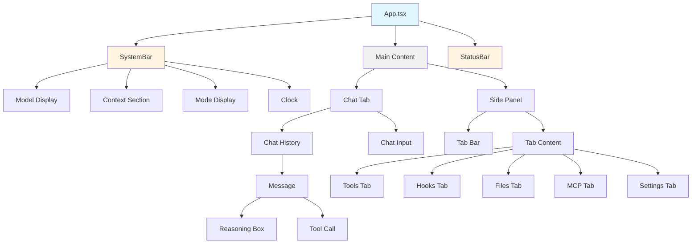
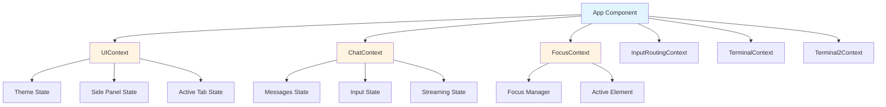
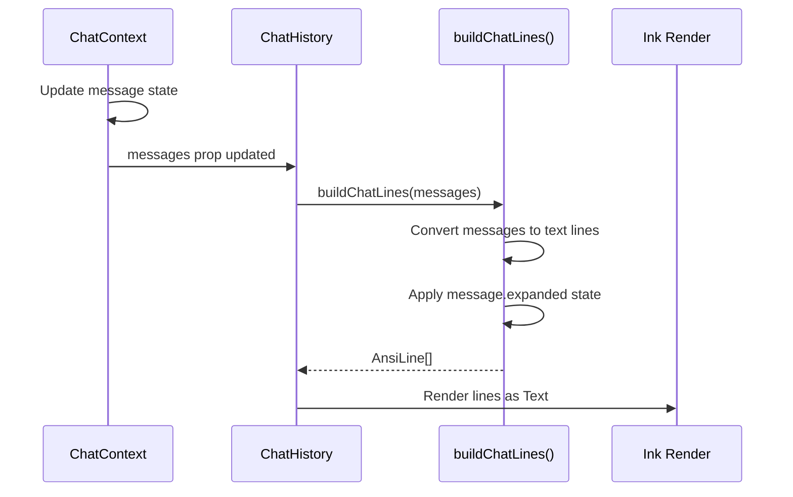
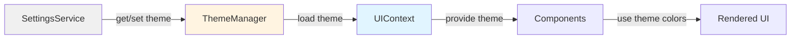
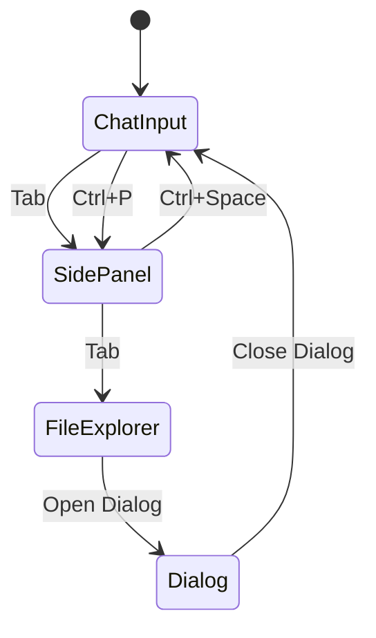

# User Interface Architecture

**Last Updated:** January 26, 2026

This document provides complete technical documentation of the User Interface architecture, including React + Ink integration, component hierarchy, state management, theme system, and terminal integration.

---

## Table of Contents

- [System Overview](#system-overview)
- [Technology Stack](#technology-stack)
- [Layout Architecture](#layout-architecture)
- [Component Hierarchy](#component-hierarchy)
- [State Management](#state-management)
- [Theme System](#theme-system)
- [Terminal Integration](#terminal-integration)
- [Focus Management](#focus-management)
- [Rendering Optimization](#rendering-optimization)
- [Best Practices](#best-practices)

---

## System Overview

The OLLM CLI UI is a terminal-based interface built with React + Ink. The layout consists of three main areas: Header Bar, Main Content Area (with optional Side Panel), and Status Bar.

### Core Principles

1. **Terminal-First** - Designed for terminal environments
2. **Keyboard-Driven** - All features accessible via keyboard
3. **Responsive** - Adapts to terminal size changes
4. **Performant** - Efficient rendering and state updates
5. **Accessible** - Screen reader compatible, high contrast support

---

## Technology Stack

### Core Technologies

**React + Ink:**

- React 19.2.3 for component model
- Ink 6.6.0 for terminal rendering
- Functional components with hooks
- Context API for state management

**Terminal Rendering:**

- ANSI escape codes for formatting
- Flexbox-like layout system
- Component-based architecture

**State Management:**

- React Context for global state
- Local state with useState/useReducer
- Event-driven updates

---

## Layout Architecture

### Layout Structure

```
┌─────────────────────────────────────────────────────────────────┐
│ HEADER BAR (SystemBar)                                          │
│ Model | Context | Mode | Clock                                  │
├─────────────────────────────────────────────────────────────────┤
│                                                                  │
│ ┌─────────────────────┬─────────────────────────────────────┐  │
│ │                     │                                      │  │
│ │   MAIN CONTENT      │   SIDE PANEL (Optional)             │  │
│ │   (Chat/Tabs)       │   (Tools/Hooks/Files/MCP/Settings)  │  │
│ │                     │                                      │  │
│ │   - Chat History    │   - Tab Navigation                  │  │
│ │   - Input Area      │   - Tab Content                     │  │
│ │                     │   - Actions                         │  │
│ │                     │                                      │  │
│ └─────────────────────┴─────────────────────────────────────┘  │
│                                                                  │
├─────────────────────────────────────────────────────────────────┤
│ STATUS BAR                                                       │
│ Status | Keybind Hints | Notifications                          │
└─────────────────────────────────────────────────────────────────┘
```

### Flexbox-Style Layout

```typescript
// Root Container
<Box flexDirection="column" height="100%" width="100%">
  {/* Header Bar - Fixed height */}
  <Box flexShrink={0} height={1} borderStyle="single" borderBottom>
    <SystemBar />
  </Box>

  {/* Main Content - Flexible */}
  <Box flexGrow={1} flexDirection="row">
    {/* Left Column - Chat */}
    <Box flexGrow={1} flexDirection="column" minWidth="60%">
      <ChatTab />
    </Box>

    {/* Right Column - Side Panel (toggleable) */}
    {sidePanelVisible && (
      <Box flexShrink={0} width="40%" borderLeft>
        <SidePanel />
      </Box>
    )}
  </Box>

  {/* Status Bar - Fixed height */}
  <Box flexShrink={0} height={1} borderStyle="single" borderTop>
    <StatusBar />
  </Box>
</Box>
```

---

## Component Hierarchy

### Component Tree



### Component Locations

| Component     | File Path                                                 |
| ------------- | --------------------------------------------------------- |
| App (Root)    | `packages/cli/src/ui/App.tsx`                             |
| SystemBar     | `packages/cli/src/ui/components/layout/SystemBar.tsx`     |
| StatusBar     | `packages/cli/src/ui/components/layout/StatusBar.tsx`     |
| SidePanel     | `packages/cli/src/ui/components/layout/SidePanel.tsx`     |
| TabBar        | `packages/cli/src/ui/components/layout/TabBar.tsx`        |
| ChatTab       | `packages/cli/src/ui/components/tabs/ChatTab.tsx`         |
| ChatHistory   | `packages/cli/src/ui/components/chat/ChatHistory.tsx`     |
| Message       | `packages/cli/src/ui/components/chat/Message.tsx`         |
| ChatInputArea | `packages/cli/src/ui/components/layout/ChatInputArea.tsx` |
| ToolsTab      | `packages/cli/src/ui/components/tabs/ToolsTab.tsx`        |
| HooksTab      | `packages/cli/src/ui/components/tabs/HooksTab.tsx`        |
| FilesTab      | `packages/cli/src/ui/components/tabs/FilesTab.tsx`        |
| MCPTab        | `packages/cli/src/ui/components/tabs/MCPTab.tsx`          |
| SettingsTab   | `packages/cli/src/ui/components/tabs/SettingsTab.tsx`     |

---

## State Management

### Context Architecture



### Context Providers

#### UIContext

**Location:** `packages/cli/src/ui/contexts/UIContext.tsx`

**State:**

```typescript
interface UIState {
  theme: Theme;
  sidePanelVisible: boolean;
  activeRightPanel: string;
  // ... other UI state
}
```

**Actions:**

```typescript
interface UIActions {
  setTheme: (theme: Theme) => void;
  toggleSidePanel: () => void;
  setActiveRightPanel: (panel: string) => void;
  // ... other actions
}
```

#### ChatContext

**Location:** `packages/cli/src/features/context/ChatContext.tsx`

**State:**

```typescript
interface ChatState {
  messages: Message[];
  input: string;
  isStreaming: boolean;
  currentMessageId: string | null;
  // ... other chat state
}
```

**Actions:**

```typescript
interface ChatActions {
  addMessage: (message: Message) => void;
  updateMessage: (id: string, updates: Partial<Message>) => void;
  setInput: (input: string) => void;
  sendMessage: () => void;
  // ... other actions
}
```

#### FocusContext

**Location:** `packages/cli/src/ui/contexts/FocusContext.tsx`

**State:**

```typescript
interface FocusState {
  activeElement: FocusableElement;
  focusHistory: FocusableElement[];
}

type FocusableElement = 'chat-input' | 'side-panel' | 'file-explorer' | 'dialog';
```

**Actions:**

```typescript
interface FocusActions {
  setFocus: (element: FocusableElement) => void;
  cycleFocus: (direction: 'forward' | 'backward') => void;
  restoreFocus: () => void;
}
```

---

## Message Rendering Architecture

### Line-Based Rendering System

**IMPORTANT:** OLLM CLI uses a **line-based rendering system** for chat history, not React component trees.

**Rendering Flow:**



**Key Insight:** Component-level state in `Message.tsx` or child components does NOT affect rendering. The actual rendering happens in the `buildChatLines()` utility function.

### Collapsible Content System

**State Control:** `message.expanded` field (boolean)

**Collapsible Elements:**

- Reasoning blocks (thinking process)
- Tool calls with large arguments
- Diffs with many lines
- Long outputs

**Behavior:**

```typescript
// ChatHistory.tsx
const isExpanded = message.expanded === true;

if (showReasoning && message.reasoning) {
  if (isExpanded) {
    // Show full reasoning content
    addLine([{ text: message.reasoning.content, ... }]);
  } else {
    addLine([{ text: 'Reasoning: (collapsed)', ... }]);
  }
}
```

### Reasoning Box Behavior

**States:**

1. **Streaming (expanded: true, complete: false)**
   - Reasoning shows EXPANDED with full content
   - Content streams in real-time
   - User can see the thinking process

2. **Complete (expanded: false, complete: true)**
   - Auto-collapses to summary view
   - Shows "Reasoning: (collapsed)"
   - Saves screen space

3. **Historical Messages**
   - Completed reasoning blocks start COLLAPSED
   - Shows summary line only

**Implementation:**

```typescript
// ChatContext.tsx - Message Creation
const assistantMsg = addMessage({
  role: 'assistant',
  content: '',
  expanded: true, // Start expanded to show reasoning
});

// ChatContext.tsx - On Completion
if (msg.reasoning) {
  updates.reasoning = {
    ...msg.reasoning,
    complete: true,
  };
  updates.expanded = false; // Auto-collapse when complete
}
```

---

## Theme System

### Theme Architecture



### Theme Structure

```typescript
interface Theme {
  name: string;
  bg: {
    primary: string; // Main background
    secondary: string; // Secondary background
    tertiary: string; // Tertiary background
  };
  text: {
    primary: string; // Main text color
    secondary: string; // Secondary text color
    accent: string; // Accent/highlight color
  };
  role: {
    user: string; // User message color
    assistant: string; // Assistant message color
    system: string; // System message color
    tool: string; // Tool call color
  };
  status: {
    success: string; // Success state color
    warning: string; // Warning state color
    error: string; // Error state color
    info: string; // Info state color
  };
  border: {
    primary: string; // Primary border color
    secondary: string; // Secondary border color
    active: string; // Active border color
    style: string; // Border style (round, single, double)
  };
  diff: {
    added: string; // Added lines in diff
    removed: string; // Removed lines in diff
  };
}
```

### Built-in Themes

1. **solarized-dark** (Default) - Precision theme for reduced eye strain
2. **neon-dark** - Balanced dark theme
3. **dracula-dark** - High-contrast theme
4. **nord-dark** - Arctic, north-bluish palette
5. **monokai-dark** - Vibrant, high-contrast theme
6. **solarized-dark-2** - Alternative Solarized variant

### Theme Application

```typescript
// Accessing theme in components
const { state: uiState } = useUI();
const { theme } = uiState;

// Using theme colors
<Text color={theme.text.primary}>Content</Text>
<Box borderColor={theme.border.active}>Focused</Box>
```

---

## Terminal Integration

### Terminal Architecture

```mermaid
graph TB
    TC[TerminalContext]
    PTY[PTY Process]
    Xterm[xterm.js Headless]
    Ser[terminalSerializer]
    Comp[Terminal2 Component]

    TC -->|spawn| PTY
    TC -->|create| Xterm
    PTY -->|data| Xterm
    Xterm -->|buffer| Ser
    Ser -->|AnsiLine[]| TC
    TC -->|output| Comp
    Comp -->|render| UI[Terminal UI]

    style TC fill:#fff4e1
    style PTY fill:#f0f0f0
    style Xterm fill:#f0f0f0
```

### PTY Integration

**Process Spawning:**

```typescript
const isWindows = os.platform() === 'win32';
const shell = isWindows ? 'powershell.exe' : 'bash';

pty.spawn(shell, shellArgs, {
  name: 'xterm-color',
  cols: 80,
  rows: 30,
  cwd: process.cwd(),
  env: process.env,
});
```

### ANSI Rendering

**Token Structure:**

```typescript
interface AnsiToken {
  text: string;
  bold: boolean;
  italic: boolean;
  underline: boolean;
  dim: boolean;
  inverse: boolean;
  fg: string; // Hex color
  bg: string; // Hex color
}

type AnsiLine = AnsiToken[];
```

**Serialization Process:**

1. Read xterm.js buffer cells
2. Extract cell attributes (bold, italic, colors)
3. Group consecutive cells with same attributes
4. Convert to structured tokens
5. Emit as array of lines

---

## Focus Management

### Focus System



### Focusable Elements

1. **Chat Input** - Main input area
2. **Side Panel** - Side panel tabs and content
3. **File Explorer** - File tree navigation
4. **Dialogs** - Modal dialogs (when open)

### Focus Indicators

- Border highlight (theme-dependent)
- Cursor visibility
- Keybind hints update

### Focus API

```typescript
interface FocusManager {
  setFocus: (element: FocusableElement) => void;
  cycleFocus: (direction: 'forward' | 'backward') => void;
  restoreFocus: () => void;
  hasFocus: (element: FocusableElement) => boolean;
}
```

---

## Rendering Optimization

### Performance Strategies

**1. Virtual Scrolling**

- Only render visible messages
- Lazy load older messages
- Pagination for long conversations

**2. Message Pagination**

- Keep last 100 messages in memory
- Older messages in session storage
- Load on demand when scrolling

**3. Efficient Updates**

- React reconciliation for minimal updates
- Memoization for expensive computations
- Debounced state updates

**4. Layout Optimization**

- Fixed-size components where possible
- Avoid unnecessary re-renders
- Use React.memo for pure components

### Memory Management

**Chat History:**

```typescript
// Keep recent messages in memory
const recentMessages = messages.slice(-100);

// Store older messages
const olderMessages = messages.slice(0, -100);
sessionStorage.setItem('older-messages', JSON.stringify(olderMessages));
```

**File Explorer:**

```typescript
// Lazy load directory contents
const loadDirectory = async (path: string) => {
  if (expandedDirs.has(path)) return;
  const contents = await fs.readdir(path);
  setExpandedDirs((prev) => new Set([...prev, path]));
};
```

---

## Responsive Behavior

### Terminal Size Adaptation

**Minimum Size:** 80x24 (columns x rows)  
**Recommended:** 120x40

**Behavior:**

- Side panel auto-hides on narrow terminals (< 100 columns)
- Chat history scrolls on short terminals (< 30 rows)
- Input area shrinks on very short terminals

### Overflow Handling

```typescript
// Chat History
<Box flexDirection="column" overflow="hidden">
  <Box flexGrow={1} overflowY="auto">
    {/* Scrollable content */}
  </Box>
</Box>

// Side Panel Content
<Box flexGrow={1} overflowY="auto" overflowX="hidden">
  {/* Scrollable, wrapped content */}
</Box>
```

---

## Best Practices

### Component Design

1. **Functional Components** - Use hooks, not classes
2. **Single Responsibility** - One component, one purpose
3. **Composition** - Build complex UIs from simple components
4. **Props Validation** - Use TypeScript interfaces
5. **Error Boundaries** - Handle errors gracefully

### State Management

1. **Context for Global State** - Use Context API for shared state
2. **Local State for UI** - Use useState for component-specific state
3. **Derived State** - Use useMemo for computed values
4. **Side Effects** - Use useEffect for side effects
5. **Event Handlers** - Keep handlers simple and focused

### Performance

1. **Memoization** - Use React.memo for pure components
2. **Lazy Loading** - Load content on demand
3. **Debouncing** - Debounce expensive operations
4. **Virtual Scrolling** - Render only visible items
5. **Profiling** - Use React DevTools to identify bottlenecks

### Accessibility

1. **Keyboard Navigation** - All features accessible via keyboard
2. **Focus Indicators** - Clear visual focus indicators
3. **Screen Reader Support** - Text-based UI, ANSI formatting
4. **Color Contrast** - High contrast themes available
5. **Status Messages** - Clear, descriptive status messages

---

## File Locations

| Category     | Files                                               |
| ------------ | --------------------------------------------------- |
| **Root**     | `packages/cli/src/ui/App.tsx`                       |
| **Layout**   | `packages/cli/src/ui/components/layout/`            |
| **Chat**     | `packages/cli/src/ui/components/chat/`              |
| **Tabs**     | `packages/cli/src/ui/components/tabs/`              |
| **Contexts** | `packages/cli/src/ui/contexts/`                     |
| **Hooks**    | `packages/cli/src/ui/hooks/`                        |
| **Utils**    | `packages/cli/src/ui/utils/`                        |
| **Themes**   | `packages/cli/src/config/themes.ts`                 |
| **Terminal** | `packages/cli/src/ui/contexts/Terminal*Context.tsx` |

---

**Last Updated:** January 26, 2026  
**Version:** 0.1.0  
**Status:** Active Development
