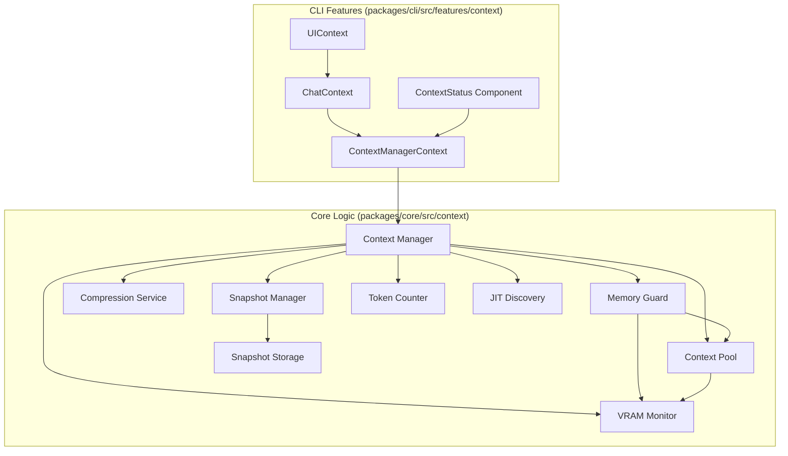

# Context Management System

This document provides a comprehensive "deep dive" into the Context Management System for OLLM CLI. It serves as the single source of truth for the architecture, file structure, and component responsibilities.

## Architecture Overview

The Context Management System is designed to provide memory-efficient conversation management for local LLMs. It operates on a **Headless Core** + **UI Integration** architecture.



---

## File Map & Responsibilities

### Core Logic (`packages/core/src/context/`)

This directory contains the pure business logic, independent of any UI framework.

| File | Responsibility |
| :--- | :--- |
| **`index.ts`** | Public API export for the module. |
| **`types.ts`** | Defines all TypeScript interfaces and types (`ContextConfig`, `ConversationContext`, `ContextSnapshot`, etc.). |
| **`contextManager.ts`** | **The Orchestrator**. Initializes and coordinates all sub-services. It is the main entry point for the system. |
| **`contextPool.ts`** | **Sizing Logic**. Calculates the optimal context window size based on available VRAM and model parameters (quantization, layers, etc.). |
| **`vramMonitor.ts`** | **Hardware Abstraction**. Queries GPU memory usage using system tools (`nvidia-smi`, `rocm-smi`, etc.) or estimates based on safe fallbacks. |
| **`tokenCounter.ts`** | **Usage Tracking**. Counts tokens in messages using provider APIs or fallback estimation algorithms. Maintains a cache for performance. |
| **`snapshotManager.ts`** | **State Management**. Handles creating and restoring context snapshots. Implements rolling history and auto-snapshot triggers. |
| **`snapshotStorage.ts`** | **Persistence**. Writes snapshots to disk (JSON) with atomic operations to prevent data corruption. Maintains an index of available snapshots. |
| **`compressionService.ts`** | **Optimization**. Implements strategies (truncate, summarize, hybrid) to reduce context usage while preserving semantic meaning. |
| **`memoryGuard.ts`** | **Safety System**. Monitors memory pressure. Triggers emergency actions (compress, reduce, clear) if VRAM usage hits critical thresholds (e.g., 95%). |
| **`gpuDetector.ts`** | **Hardware Detection**. Identifies the GPU type (NVIDIA, AMD, Apple Silicon, CPU) to select the correct VRAM monitoring strategy. |
| **`jitDiscovery.ts`** | **Dynamic Loading**. Implements Just-In-Time context discovery by traversing upwards from accessed paths to find relevant `.md` context files. |

### UI Integration (`packages/cli/src/features/context/`)
This directory contains React contexts and components that hook into the Core logic.

| File | Responsibility |
| :--- | :--- |
| **`ContextManagerContext.tsx`** | **React Bridge**. Wraps the core `ContextManager` instances and exposes state (`usage`, `vram`, `active`) to the UI via a React Context. |
| **`ContextStatus.tsx`** | **Status Component**. A visual component that displays current VRAM usage, token count, and active model metrics to the user. |
| **`ChatContext.tsx`** | **Application Logic**. Manages the high-level chat session state, handling message lists and integrating with the prompt engine. |
| **`ContextConfigService.ts`** | **Configuration**. Loads and validates user settings (`llm_context.json`) for context behavior (thresholds, auto-size, etc.). |
| **`UIContext.tsx`** | **Theming & Layout**. Provides global UI state (theme, active tab, dimensions) used by context components for rendering. |
| **`GPUContext.tsx`** | **Legacy/Compat**. (Deprecated/Transitioning) Previous GPU state management, now largely superseded by `ContextManager`, kept for backward compatibility during migration. |
| **`ModelContext.tsx`** | **Legacy/Compat**. (Deprecated/Transitioning) Previous model state management. |
| **`ReviewContext.tsx`** | **Review Logic**. Manages code reviews and diffs, often interacting with the current context for analysis. |
| **`ServiceContext.tsx`** | **Service Injection**. Provides access to other application services that context features might need. |


---

## Detailed Feature Breakdown

### 1. Dynamic Context Sizing (Auto-Context)
*   **Goal**: Maximize context window without crashing the GPU.
*   **Logic**: `ContextPool` calculates `(Available VRAM - Buffer) / BytesPerToken`.
*   **BytesPerToken**: Derived from model quantization (e.g., Q4_0 uses fewer bytes than F16).

### 2. Intelligent Compression & Preservation
*   **Goal**: Keep long conversations running indefinitely without losing flow.
*   **Inflation Guard**: Compression attempts are verified for actual token reduction. If a summary/truncation would result in *more* tokens (due to overhead), the operation is skipped.
*   **Fractional Preservation**: Ensures the latest ~30% of the conversation is always kept verbatim, regardless of manual token budgets, preserving immediate context.
*   **Strategy**: "Hybrid" is the default.
    1.  **Keep**: System prompt (always).
    2.  **Keep**: Latest messages (dynamic split point, min 30%).
    3.  **Summarize**: Middle of conversation reduced to a semantic summary.
    4.  **Truncate**: Very old messages dropped if limits are exceeded.

### 3. JIT Context Discovery (Tier 3 Memory)
*   **Goal**: Automatically load project-specific instructions as needed.
*   **Logic**: When a file/directory is accessed, the system traverses upwards to the workspace root, looking for `.md` files.
*   **Integration**: Discovered context is injected as a system-level instruction, ensuring the LLM is always aware of local project conventions.

### 4. Snapshot System (Rollover)
*   **Goal**: "Save Game" for conversations.
*   **Trigger**:
    *   **Auto**: When context usage > 80%.
    *   **Manual**: User types `/context snapshot`.
    *   **Emergency**: Before OOM crash.
*   **Storage**: Saved as JSON in `~/.ollm/session-data/{sessionId}/snapshots/`.

### 5. Memory Guard
*   **Goal**: Prevent "CUDA Out Of Memory".
*   **Thresholds**:
    *   **80% (Warning)**: Trigger background compression.
    *   **90% (Critical)**: Force context resize (shrink window).
    *   **95% (Emergency)**: Panic dump (snapshot + clear context).

---

## Configuration Reference

Settings in `llm_context.json`:

```json
{
  "targetSize": 8192,
  "autoSize": true,
  "vramBuffer": 536870912,
  "compression": {
    "enabled": true,
    "strategy": "hybrid",
    "threshold": 0.8
  },
  "snapshots": {
    "enabled": true,
    "maxCount": 5
  }
}
```
